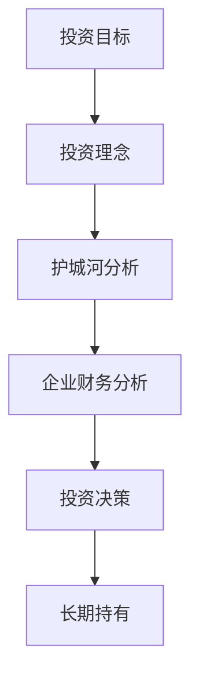

                 

# 深入解析价值投资理念：从格雷厄姆到巴菲特的演变

> 关键词：价值投资，本·格雷厄姆，沃伦·巴菲特，投资策略，安全边际，护城河

> 摘要：价值投资是一种以基本面分析为基础的投资策略，旨在通过识别市场价格与内在价值之间的差异，来实现长期稳定的收益。本文将深入解析价值投资的理念演变，从本·格雷厄姆的经典理论到沃伦·巴菲特的发展与创新，探讨其核心原则、投资策略和实际应用，帮助投资者更好地理解和应用价值投资的理念。

---

# 第一部分: 价值投资的起源与发展

## 1.1 价值投资的核心概念

### 1.1.1 价值投资的定义与核心要素

价值投资是一种以基本面分析为基础的投资策略，强调购买价格低于其内在价值的资产，以期在市场重新评估其价值时获得收益。其核心要素包括：

- **内在价值**：资产在市场之外的真实价值，需通过深入分析企业的财务状况、盈利能力、竞争优势等因素来确定。
- **安全边际**：购买价格与内在价值之间的差距，用以降低投资风险。
- **长期视角**：价值投资注重长期持有，而非短期交易。

### 1.1.2 价值投资与其它投资理念的对比

- **技术分析**：技术分析依赖价格走势和交易量等市场数据，而价值投资注重基本面分析。
- **成长投资**：成长投资关注企业未来的增长潜力，而价值投资关注当前的低估状态。
- **指数投资**：指数投资通过分散投资降低风险，而价值投资通过精选个股实现超额收益。

### 1.1.3 价值投资的哲学基础

价值投资的哲学基础可以概括为“逆市场思维”：市场价格波动反映了短期市场情绪，而内在价值则体现了企业的长期价值。投资者应以理性和耐心应对市场的短期波动，抓住低估的机会。

---

## 1.2 格雷厄姆的价值投资理论

### 1.2.1 格雷厄姆的生平简介

本·格雷厄姆（Ben Graham）是价值投资的鼻祖，被誉为“价值投资之父”。他在20世纪初提出了价值投资的基本理论，并通过《证券分析》和《 Intelligent Investor》等著作影响了无数投资者。

### 1.2.2 格雷厄姆的价值投资体系

格雷厄姆的核心思想是：

1. **安全边际**：购买价格低于内在价值，以确保投资的安全性。
2. **深入分析**：通过对企业财务状况的深入分析，识别具有低估潜力的股票。
3. **防御性投资**：避免高风险投资，选择那些财务稳健、易于估值的企业。

### 1.2.3 格雷厄姆的经典投资策略

格雷厄姆提出了“三步法”来确定股票的内在价值：

1. **计算企业内在价值**：通过分析企业的盈利能力、资产状况和行业地位来估算其真实价值。
2. **比较市场价格与内在价值**：寻找那些市场价格低于内在价值的股票。
3. **评估安全边际**：确保购买价格与内在价值之间有足够的安全空间。

格雷厄姆还提出了“市场先生”概念，强调市场情绪的波动性，并建议投资者利用市场的非理性波动来寻找投资机会。

---

## 1.3 巴菲特的价值投资理念

### 1.3.1 巴菲特的生平简介

沃伦·巴菲特（Warren Buffett）是价值投资的代表人物之一，他通过继承和发扬格雷厄姆的理论，将价值投资推向了新的高度。巴菲特的投资理念被称为“烟蒂投资法”，即寻找那些被市场忽视的、具有强大竞争优势的企业。

### 1.3.2 巴菲特对价值投资的继承与发展

巴菲特继承了格雷厄姆的安全边际和深入分析的理念，同时发展了以下核心思想：

1. **护城河**：选择具有强大竞争优势的企业，这些企业能够长期保持高利润率。
2. **长期视角**：巴菲特强调长期持有优质资产，而非频繁交易。
3. **集中投资**：将大部分资金投入到少数具有强大竞争优势的企业中。

### 1.3.3 巴菲特的投资哲学与实践

巴菲特的投资哲学可以概括为“买得好，然后长期持有”。他注重企业的财务健康状况、竞争优势和管理团队，并通过长期持有优质资产实现财富的稳步增长。

---

## 1.4 价值投资的核心思想与原则

### 1.4.1 格雷厄姆与巴菲特的核心思想对比

| 格雷厄姆 | 巴菲特 |
|----------|--------|
| 强调安全边际，避免风险 | 强调企业竞争优势，追求长期增长 |
| 重视企业估值的准确性 | 重视企业的护城河和管理团队 |
| 更注重短期价格波动 | 更注重长期投资价值 |

### 1.4.2 价值投资的三大原则

1. **安全边际**：确保购买价格低于内在价值。
2. **深入分析**：通过基本面分析选择优质资产。
3. **长期视角**：坚持长期投资，避免短期波动的干扰。

### 1.4.3 价值投资的长期视角

价值投资的核心在于长期视角。通过长期持有优质资产，投资者能够规避市场的短期波动风险，同时享受企业长期增长的收益。

---

## 1.5 本章小结

本章从价值投资的起源入手，详细介绍了格雷厄姆和巴菲特的价值投资理念及其核心思想。格雷厄姆提出了安全边际和深入分析的理论，而巴菲特则进一步发展了护城河和长期投资的理念。通过对比分析，我们可以看到价值投资在不同阶段的演变和发展。

---

# 第二部分: 巴菲特的投资策略与实践

## 2.1 巴菲特的投资体系

### 2.1.1 巴菲特的投资理念

巴菲特的投资理念可以总结为“买Cheap，然后Hold forever”。他通过寻找那些具有强大竞争优势的企业，并以合理的价格买入，长期持有，等待企业价值的实现。

### 2.1.2 巴菲特的“护城河”理论

护城河是指企业竞争优势的持续性。巴菲特认为，只有那些具有强大护城河的企业才能在长期竞争中保持优势。例如，可口可乐的全球品牌影响力和分销网络就是其强大的护城河。

### 2.1.3 巴菲特的“企业理解”原则

巴菲特强调对企业的深入理解，包括企业的财务状况、管理团队、行业地位等。只有真正理解企业，才能做出正确的投资决策。

---

### 2.1.4 巴菲特的投资体系图

---

## 2.2 巴菲特的选股标准

### 2.2.1 企业盈利能力分析

巴菲特认为，企业的盈利能力是衡量其价值的重要指标。他通过分析企业的净利润率、ROE（净资产收益率）等指标来评估企业的盈利能力。

### 2.2.2 企业的财务健康状况

巴菲特注重企业的财务健康状况，包括资产负债表、现金流等。他避免投资于财务状况不佳的企业，以确保投资的安全性。

### 2.2.3 企业的竞争优势与市场地位

巴菲特选择那些具有强大竞争优势和市场地位的企业，例如 Coca-Cola 和 Apple，这些企业具有强大的品牌影响力和市场支配力。

---

## 2.3 巴菲特的长期投资策略

### 2.3.1 长期持有优质企业的投资策略

巴菲特认为，长期持有优质资产能够为投资者带来稳定的收益。他通过集中投资于少数优质企业，避免了分散投资的风险。

### 2.3.2 巴菲特的分散投资与集中投资的平衡

尽管巴菲特强调集中投资，但他也会根据市场的变化适当分散投资。例如，在2008年金融危机期间，巴菲特通过投资于多个行业来分散风险。

### 2.3.3 巴菲特的投资组合管理

巴菲特的投资组合管理以长期持有优质资产为核心，定期审视投资组合，调整投资比例，以适应市场变化。

---

## 2.4 巴菲特的经典投资案例分析

### 2.4.1 可口可乐的投资案例

巴菲特于1988年投资可口可乐，至今仍在持有。他认为可口可乐具有强大的品牌影响力和全球分销网络，这些都是其强大的护城河。

### 2.4.2 伯克希尔 Hathaway 的投资案例

伯克希尔 Hathaway 是巴菲特的旗舰公司，他通过长期持有该公司股票，实现了巨大的投资收益。

### 2.4.3 其他经典投资案例分析

巴菲特还投资过苹果、卡夫食品等公司，这些公司都具有强大的竞争优势和长期增长潜力。

---

## 2.5 本章小结

本章详细分析了巴菲特的投资体系和选股标准，揭示了他如何通过长期持有优质资产实现投资收益。巴菲特的投资理念不仅继承了格雷厄姆的安全边际理论，还发展了护城河和长期投资的理念。

---

# 第三部分: 价值投资的现代发展与应用

## 3.1 价值投资的现代演变

### 3.1.1 价值投资的全球化趋势

随着全球化的深入，价值投资的理念逐渐从美国市场扩展到全球市场。投资者通过寻找全球范围内的低估资产，实现跨国投资。

### 3.1.2 价值投资与机构投资者的结合

机构投资者开始采用价值投资策略，通过大规模的资金投入优质资产，实现长期收益。机构投资者的优势在于其资金规模和专业团队。

### 3.1.3 数量化投资与价值投资的融合

现代技术的发展使得价值投资可以结合量化分析，通过算法和大数据技术，筛选出具有低估潜力的资产。量化价值投资的兴起为投资者提供了新的工具和方法。

---

## 3.2 其他重要投资者的价值投资实践

### 3.2.1 沃伦·巴菲特之后的重要投资者

乔尔·蒂施（Joel Tishman）和彼得·林奇（Peter Lynch）等投资者都深受巴菲特的影响，他们在实践中进一步发展了价值投资的理念。

### 3.2.2 价值投资在新兴市场的应用

新兴市场为价值投资者提供了更多的机会，例如中国的茅台和印度的Infosys等企业都具有强大的竞争优势和低估潜力。

### 3.2.3 价值投资在不同经济周期的表现

价值投资在不同经济周期中的表现有所不同，但在长期来看，其收益仍然优于市场平均水平。

---

## 3.3 价值投资的未来发展趋势

### 3.3.1 价值投资的数字化转型

随着人工智能和大数据技术的发展，价值投资将更加依赖数字化工具。投资者可以通过算法筛选出具有低估潜力的资产，提高投资效率。

### 3.3.2 人工智能在价值投资中的应用

人工智能技术可以帮助投资者更快地分析企业的财务数据，预测市场趋势，从而做出更明智的投资决策。

### 3.3.3 可持续投资与价值投资的结合

可持续投资越来越受到重视，价值投资者也开始关注企业的社会责任和环境影响，将这些因素纳入投资决策。

---

## 3.4 本章小结

本章探讨了价值投资的现代发展，包括全球化、机构化和数字化的趋势。随着技术的进步和市场的变化，价值投资将继续演变，为投资者提供更多的机会和工具。

---

# 第四部分: 投资心理学与价值投资的结合

## 4.1 投资者心理与价值投资

### 4.1.1 投资者心理偏差对投资决策的影响

投资者的心理偏差，如贪婪和恐惧，常常导致非理性的投资决策。价值投资者需要克服这些心理偏差，保持理性和耐心。

### 4.1.2 价值投资与心理因素的结合

价值投资强调长期视角和耐心，这与投资者的心理素质密切相关。投资者需要具备坚韧不拔的毅力，才能在市场波动中坚持自己的投资策略。

---

## 4.2 投资者心理偏差对价值投资的影响

### 4.2.1 贪婪与恐惧

贪婪和恐惧是投资者最常见的心理偏差。在市场上涨时，投资者容易贪婪，盲目追涨；在市场下跌时，投资者容易恐惧，盲目抛售。

### 4.2.2 过度自信

投资者往往过于自信，认为自己能够准确预测市场走势，从而做出错误的投资决策。

### 4.2.3 短期思维

投资者容易受到市场短期波动的影响，忽视长期投资目标。

---

## 4.3 价值投资者的心理素质培养

### 4.3.1 理性与耐心

价值投资者需要保持理性和耐心，避免被市场情绪左右。

### 4.3.2 风险管理

投资者需要具备风险管理能力，合理控制投资组合的风险。

### 4.3.3 持续学习

价值投资需要不断学习和更新知识，以适应市场的变化。

---

## 4.4 本章小结

本章探讨了投资者心理与价值投资的关系，强调了心理素质对投资成功的重要性。价值投资者需要克服心理偏差，保持理性和耐心，才能在市场中长期获利。

---

# 作者：AI天才研究院/AI Genius Institute & 禅与计算机程序设计艺术 /Zen And The Art of Computer Programming

---

通过以上内容，我们可以看到，价值投资从格雷厄姆到巴菲特的演变过程，不仅体现了理论的不断完善，也展现了实践中的多样化和创新。价值投资的核心理念是通过深入分析企业的内在价值，选择那些具有低估潜力的资产，长期持有，实现稳定的收益。在现代，价值投资还在不断发展，与技术、全球化和心理因素相结合，为投资者提供了更多的工具和方法。

