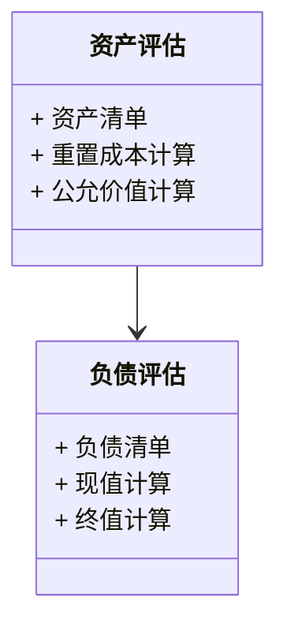
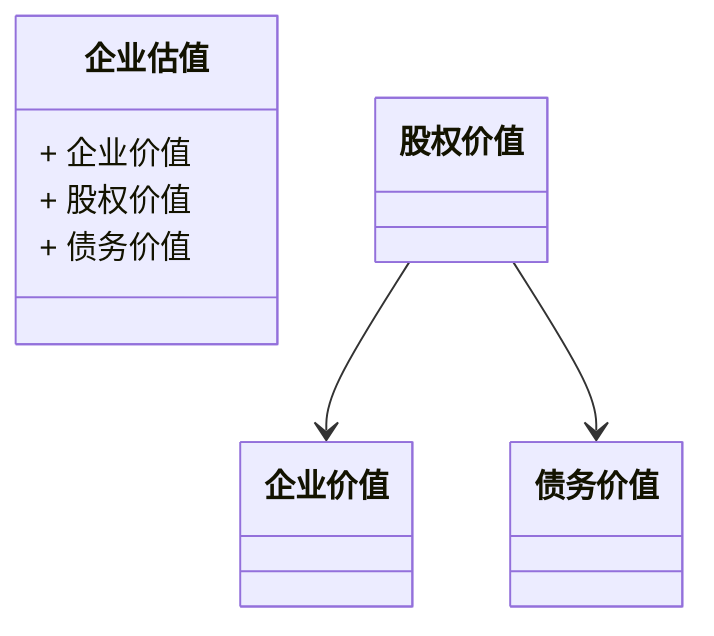
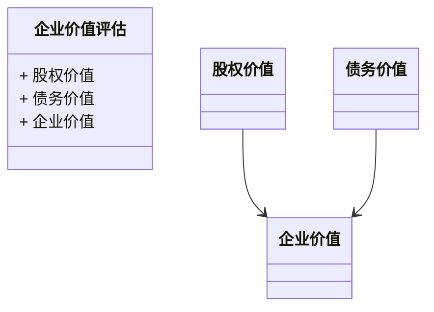
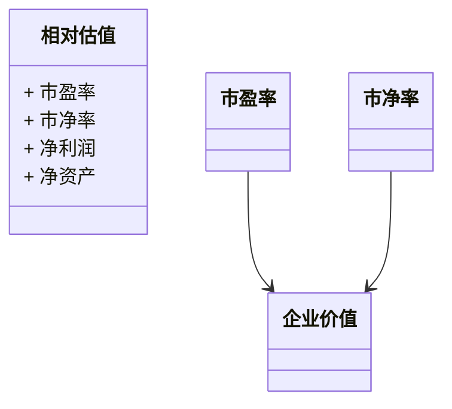

                 


# 深入解析企业估值的计算公式

> 关键词：企业估值、计算公式、DCF模型、相对估值、财务分析、投资决策

> 摘要：企业估值是投资决策中的核心问题，本文将深入解析企业估值的计算公式，从基础概念到复杂模型，结合实际案例和数学公式，系统地阐述企业估值的原理、方法和应用。通过详细讲解各种估值公式，帮助读者掌握企业估值的核心技巧，提升投资决策的准确性。

---

# 第3章: 企业估值的核心公式与模型

## 3.3 重置成本法
### 3.3.1 模型的基本公式
$$ V = \sum \text{资产价值} - \text{负债} $$
### 3.3.2 模型的步骤
1. 确定企业的所有资产，包括流动资产和非流动资产。
2. 确定企业的所有负债，包括流动负债和非流动负债。
3. 计算资产的重置成本，即重新购买或构建相同资产的成本。
4. 计算负债的现值。
5. 计算企业价值：资产重置成本 - 负债现值。

### 3.3.3 模型的优缺点

#### 优点
- 计算相对简单，易于理解。
- 适用于资产密集型企业，如制造业、房地产等。

#### 缺点
- 未考虑企业的未来盈利能力。
- 重置成本可能过高，尤其在经济繁荣时期。

---

## 3.4 收益法
### 3.4.1 模型的基本公式
$$ V = \frac{E}{k} $$
其中：
- \( E \) 是企业的净利润
- \( k \) 是资本回报率

### 3.4.2 模型的步骤
1. 确定企业的净利润。
2. 确定合理的资本回报率 \( k \)。
3. 计算企业价值：净利润除以资本回报率。

### 3.4.3 模型的优缺点

#### 优点
- 考虑了企业的盈利能力。
- 计算简单，易于理解。

#### 缺点
- 依赖于对净利润和资本回报率的准确估计。
- 未考虑企业的资产价值。

---

## 3.5 市场法
### 3.5.1 模型的基本公式
$$ V = P \times E $$
其中：
- \( P \) 是可比企业的市盈率
- \( E \) 是目标企业的净利润

### 3.5.2 模型的步骤
1. 确定可比企业。
2. 计算可比企业的平均市盈率。
3. 计算目标企业的净利润。
4. 计算企业价值：市盈率乘以净利润。

### 3.5.3 模型的优缺点

#### 优点
- 基于市场数据，结果更具参考性。
- 适用于市场数据丰富的行业。

#### 缺点
- 依赖于可比企业的选择。
- 未考虑企业的独特性。

---

## 3.6 股权自由现金流模型（DCF模型）
### 3.6.1 模型的基本公式
$$ FV = \sum_{t=1}^{n} \frac{CF_t}{(1+r)^t} + \frac{TV}{(1+r)^n} $$

其中：
- \( CF_t \) 是第 \( t \) 年的自由现金流
- \( r \) 是折现率
- \( TV \) 是终值
- \( n \) 是预测期

### 3.6.2 模型的步骤
1. 确定企业的自由现金流。
2. 确定合理的折现率。
3. 预测未来 \( n \) 年的现金流。
4. 计算终值 \( TV \)。
5. 计算未来现金流的现值。
6. 计算企业价值：现值总和加上终值的现值。

### 3.6.3 模型的优缺点

#### 优点
- 考虑了企业的未来现金流。
- 结果更具动态性和准确性。

#### 缺点
- 依赖于对未来现金流和折现率的准确估计。
- 计算复杂，需要较多的数据支持。

---

## 3.7 股权自由现金流模型的实现代码
```python
def dcfvaluation(cash_flows, discount_rate, terminal_value):
    # 计算未来现金流的现值
    present_value = 0
    for t in range(len(cash_flows)):
        present_value += cash_flows[t] / (1 + discount_rate) ** t
    # 计算终值的现值
    present_value_terminal = terminal_value / (1 + discount_rate) ** len(cash_flows)
    # 总价值
    total_value = present_value + present_value_terminal
    return total_value

# 示例数据
cash_flows = [100, 150, 200, 250]  # 每年的自由现金流
discount_rate = 0.1  # 折现率
terminal_value = 500  # 终值

# 计算企业价值
enterprise_value = dcfvaluation(cash_flows, discount_rate, terminal_value)
print("企业价值:", enterprise_value)
```

---

## 3.8 本章小结
本章详细介绍了几种常用的企业估值公式，包括股权自由现金流模型（DCF模型）、重置成本法、收益法和市场法。每种方法都有其独特的适用场景和优缺点。DCF模型适用于长期盈利预测，而重置成本法和收益法则适用于资产密集型和盈利型企业。市场法则基于市场数据，适用于数据丰富的行业。通过这些方法的对比和分析，读者可以更好地选择适合的估值方法。

---

# 第4章: 资产与负债的评估与计算

## 4.1 资产评估的核心公式
### 4.1.1 资产的重置成本
$$ \text{重置成本} = \sum \text{资产价值} $$
### 4.1.2 资产的公允价值
$$ \text{公允价值} = \text{市场价} \times \text{数量} $$

---

## 4.2 负债评估的核心公式
### 4.2.1 负债的现值
$$ \text{现值} = \sum \frac{\text{未来现金流}}{(1 + r)^t} $$
### 4.2.2 负债的终值
$$ \text{终值} = \text{当前负债} \times (1 + r)^n $$

---

## 4.3 资产与负债评估的系统分析
### 4.3.1 系统功能设计


---

## 4.4 本章小结
本章重点介绍了资产与负债的评估方法，包括重置成本法、公允价值法和现值法。通过系统分析，读者可以更好地理解资产与负债在企业估值中的作用。

---

# 第5章: 权益评估的核心公式与应用

## 5.1 权益评估的基本公式
### 5.1.1 股权价值的计算
$$ \text{股权价值} = \text{企业价值} - \text{债务价值} $$

---

## 5.2 权益评估的系统分析
### 5.2.1 系统架构设计


---

## 5.3 本章小结
本章详细讲解了权益评估的核心公式及其在企业估值中的应用。通过系统的架构设计，读者可以更好地理解权益评估的重要性。

---

# 第6章: 企业整体价值评估的系统分析

## 6.1 企业整体价值评估的核心公式
### 6.1.1 企业价值的计算
$$ \text{企业价值} = \text{股权价值} + \text{债务价值} $$

---

## 6.2 企业整体价值评估的系统分析
### 6.2.1 系统功能设计


---

## 6.3 本章小结
本章重点介绍了企业整体价值评估的核心公式及其系统分析，帮助读者更好地理解企业价值的构成。

---

# 第7章: 相对估值方法的深入解析

## 7.1 相对估值法的核心公式
### 7.1.1 市盈率法
$$ \text{企业价值} = \text{市盈率} \times \text{净利润} $$

### 7.1.2 市净率法
$$ \text{企业价值} = \text{市净率} \times \text{净资产} $$

---

## 7.2 相对估值法的系统分析
### 7.2.1 系统功能设计


---

## 7.3 本章小结
本章详细讲解了相对估值方法的核心公式及其在企业估值中的应用，帮助读者更好地理解相对估值法的优缺点。

---

# 第8章: 企业估值的综合应用与实战

## 8.1 项目实战：互联网企业估值案例
### 8.1.1 项目背景
- 公司名称：XYZ互联网公司
- 主要业务：在线教育平台
- 财务数据：2023年收入10亿元，净利润2亿元，市盈率30倍

### 8.1.2 估值方法选择
1. DCF模型
2. 市盈率法

### 8.1.3 估值计算
1. DCF模型计算：
   - 自由现金流：2亿元
   - 折现率：10%
   - 终值：50亿元
   - 企业价值：20亿元

2. 市盈率法计算：
   - 净利润：2亿元
   - 市盈率：30倍
   - 企业价值：60亿元

### 8.1.4 结果对比
- DCF模型结果更保守，市盈率法结果更高。

---

## 8.2 本章小结
本章通过一个实际案例，展示了企业估值的综合应用，帮助读者更好地理解各种估值方法的实际操作。

---

# 附录: 企业估值公式汇总表

| 估值方法 | 公式 | 适用场景 |
|----------|------|-----------|
| DCF模型 | \( FV = \sum_{t=1}^{n} \frac{CF_t}{(1+r)^t} + \frac{TV}{(1+r)^n} \) | 长期盈利预测 |
| 重置成本法 | \( V = \sum \text{资产价值} - \text{负债} \) | 资产密集型企业 |
| 收益法 | \( V = \frac{E}{k} \) | 盈利型企业 |
| 市场法 | \( V = P \times E \) | 市场数据丰富的行业 |

---

# 参考文献
1. [1] 《企业估值实战指南》
2. [2] 《投资学基础》
3. [3] 《财务报表分析》

---

# 作者：AI天才研究院/AI Genius Institute & 禅与计算机程序设计艺术/Zen And The Art of Computer Programming

---

通过以上目录和内容，读者可以系统地掌握企业估值的核心公式与方法，并能够在实际投资和企业管理中灵活应用。

