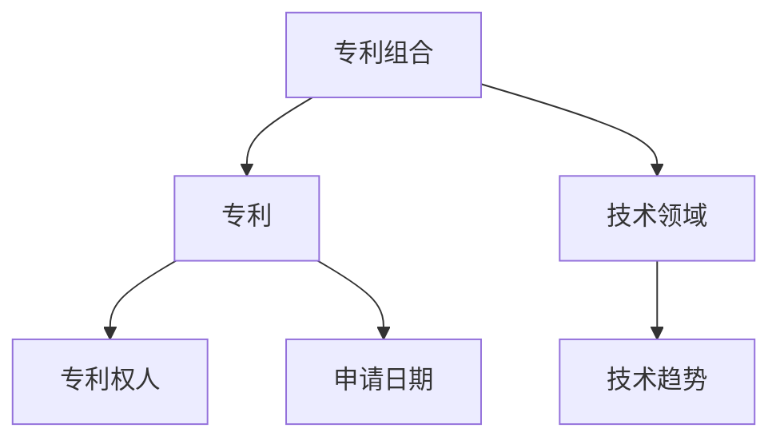
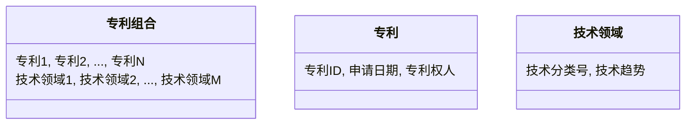
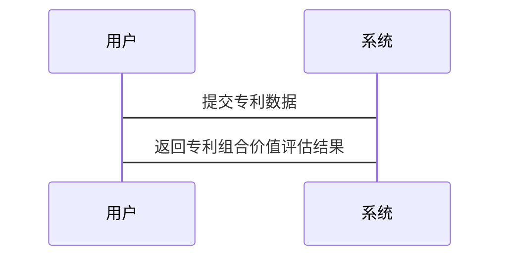

                 


# 深度学习分析公司专利组合价值

## 关键词：
深度学习、专利组合、价值分析、文本挖掘、神经网络、企业战略

## 摘要：
本文详细探讨了如何利用深度学习技术分析公司专利组合的价值。通过介绍专利组合的基本概念、深度学习在专利分析中的应用、专利组合价值评估的核心算法以及系统架构设计，本文为读者提供了一套完整的解决方案。文章还通过实际案例展示了如何使用深度学习模型进行专利组合价值分析，并给出了项目实战的详细步骤。最后，本文总结了当前的研究成果，并展望了未来的发展方向。

---

# 第一部分：背景介绍

## 第1章：专利组合价值分析的背景与意义

### 1.1 专利的基本概念
专利是企业技术创新的重要成果，是企业核心竞争力的体现。专利组合是指一组相互关联的专利，共同保护企业的核心技术或产品。专利组合的价值不仅体现在单个专利的保护范围上，还体现在其整体布局的协同效应上。

### 1.2 深度学习在专利分析中的应用
深度学习是一种基于人工神经网络的机器学习方法，具有强大的特征提取能力和模式识别能力。通过深度学习技术，可以对专利文本进行自动化分析，提取关键信息并评估其价值。

### 1.3 专利组合价值分析的重要性
专利组合价值分析是企业制定知识产权战略的重要依据。通过分析专利组合的价值，企业可以更好地优化专利布局，提升核心竞争力。

---

# 第二部分：核心概念与联系

## 第2章：专利组合价值分析的核心概念

### 2.1 专利组合价值分析的原理
专利组合价值分析的核心在于对专利文本的深度挖掘。通过分析专利的技术领域、法律状态、申请时间等信息，可以评估专利组合的整体价值。

### 2.2 专利组合价值分析的特征对比
专利组合与单一专利在分析维度上有明显区别。下表对比了专利组合与单一专利的特征：

| 特征维度      | 单一专利                 | 专利组合                |
|----------------|--------------------------|-------------------------|
| 保护范围      | 独一技术或设计           | 多项技术或设计          |
| 管理复杂度     | 较低                     | 较高                    |
| 战略价值      | 局部价值                 | 整体协同价值            |

### 2.3 专利组合价值分析的ER实体关系图



---

# 第三部分：算法原理讲解

## 第3章：深度学习模型在专利组合价值分析中的应用

### 3.1 深度学习模型的基本原理
深度学习模型通过多层神经网络对输入数据进行特征提取和模式识别。常用的深度学习模型包括卷积神经网络（CNN）、循环神经网络（RNN）和变换器（Transformer）。

### 3.2 专利文本分析的深度学习模型
专利文本分析需要对专利文件中的技术描述进行理解和分类。常用的模型包括：

1. **基于词嵌入的专利文本表示**  
   使用词嵌入模型（如Word2Vec）将专利文本转换为向量表示。

2. **基于序列模型的专利文本分析**  
   使用RNN或LSTM对专利文本的序列信息进行建模。

3. **基于注意力机制的专利文本理解**  
   注意力机制可以聚焦于专利文本中的关键部分，提升模型的准确性。

### 3.3 专利组合价值评估的深度学习模型
专利组合价值评估模型需要综合考虑多个专利的价值和协同效应。常用的模型包括：

1. **基于神经网络的专利组合价值预测**  
   使用多层感知机（MLP）对专利组合的价值进行预测。

2. **基于图神经网络的专利组合关系分析**  
   图神经网络可以建模专利之间的关系，分析其协同效应。

3. **深度学习模型的训练与优化**  
   使用大数据和标注数据对模型进行训练，并通过交叉验证进行优化。

---

# 第四部分：系统分析与架构设计方案

## 第4章：专利组合价值分析系统的架构设计

### 4.1 系统功能设计
专利组合价值分析系统的主要功能包括：

1. **专利文本预处理**  
   对专利文本进行清洗和分词。

2. **专利特征提取**  
   提取专利的技术领域、申请时间等特征。

3. **专利价值评估**  
   使用深度学习模型对专利组合的价值进行评估。

### 4.2 项目介绍
本项目旨在构建一个基于深度学习的专利组合价值分析系统，为企业提供智能化的专利管理工具。

### 4.3 系统功能设计（领域模型）



### 4.4 系统架构设计
系统架构采用分层设计，包括数据层、计算层和应用层。


### 4.5 系统接口设计
系统接口包括数据输入接口、模型调用接口和结果展示接口。

### 4.6 系统交互设计



---

# 第五部分：项目实战

## 第5章：环境安装与系统实现

### 5.1 环境安装
安装必要的Python库：

```bash
pip install numpy pandas tensorflow keras
```

### 5.2 核心代码实现
以下是一个简单的专利组合价值评估模型的实现代码：

```python
import numpy as np
import tensorflow as tf
from tensorflow import keras

model = keras.Sequential([
    keras.layers.Dense(64, activation='relu'),
    keras.layers.Dense(1, activation='sigmoid')
])

model.compile(optimizer='adam', loss='binary_crossentropy', metrics=['accuracy'])

# 假设X为输入特征，y为标签
model.fit(X, y, epochs=10, batch_size=32)
```

### 5.3 代码解读
上述代码定义了一个简单的神经网络模型，并使用专利数据进行训练。模型的输出是专利组合的价值评估结果。

### 5.4 案例分析
以某公司的一项专利组合为例，通过模型预测其价值，并与实际价值进行对比。

### 5.5 项目小结
本项目展示了如何使用深度学习技术进行专利组合价值分析，并提供了实际的代码实现。

---

# 第六部分：总结与展望

## 第6章：总结与展望

### 6.1 总结
本文详细介绍了深度学习在专利组合价值分析中的应用，包括核心概念、算法原理和系统设计。通过实际案例展示了如何使用深度学习技术进行专利分析。

### 6.2 未来展望
未来的研究方向包括开发更复杂的深度学习模型，引入多模态数据（如专利图像）进行分析，以及探索专利组合的动态价值评估。

---

# 作者：AI天才研究院/AI Genius Institute & 禅与计算机程序设计艺术 /Zen And The Art of Computer Programming

