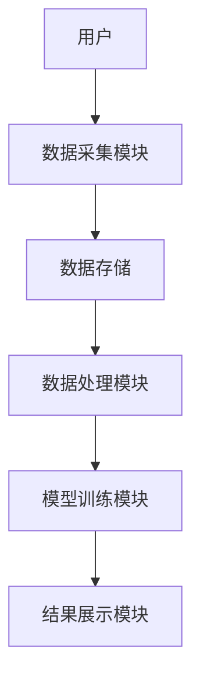
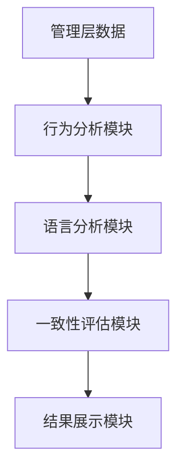

                 


# 深度学习分析管理层言行一致性

> 关键词：深度学习、管理层、言行一致性、行为分析、系统设计、项目实战

> 摘要：本文将结合深度学习技术，系统地探讨如何分析管理层的言行一致性。通过背景介绍、核心概念分析、算法原理讲解、系统设计、项目实战以及最佳实践，本文将为读者提供一个全面的视角，深入理解如何利用深度学习技术来评估和改善管理层的言行一致性。

---

## 第1章: 背景介绍

### 1.1 问题背景

#### 1.1.1 管理层言行一致性的重要性
在组织管理中，管理层的行为和言论是否一致，直接影响组织的凝聚力、员工的士气以及整体的执行力。一个言行一致的管理者能够为团队树立良好的榜样，而言行不一致的管理者可能导致团队目标偏离、信任危机等问题。

#### 1.1.2 深度学习技术的崛起
深度学习作为人工智能领域的重要技术，以其强大的特征提取和模式识别能力，广泛应用于图像识别、自然语言处理等领域。在行为分析中，深度学习能够通过大量数据学习人类行为模式，提供科学的分析手段。

#### 1.1.3 问题解决的必要性
通过深度学习技术，我们可以量化管理层的言行一致性，发现潜在的问题，并提出改进建议。这不仅能够提升管理效率，还能增强团队的凝聚力。

### 1.2 问题描述

#### 1.2.1 管理层言行不一致的表现形式
- 管理层在会议上的承诺与实际执行不符。
- 口头上的政策宣贯与实际行动脱节。
- 行为上的短期利益优先，忽视长期目标。

#### 1.2.2 深度学习在行为分析中的应用潜力
- 利用自然语言处理技术分析领导的演讲内容。
- 通过图像识别技术分析领导的非语言行为。
- 结合时间序列数据，分析领导行为的连续性和一致性。

#### 1.2.3 界定问题的边界与外延
- 问题范围：仅限于管理层的言行一致性分析。
- 数据范围：包括文本、图像和行为数据。
- 应用场景：企业内部管理、领导力评估等。

### 1.3 核心概念与联系

#### 1.3.1 核心概念的定义与属性特征对比
- 行为一致性：指行为与言论的匹配程度。
- 行为特征：包括语言表达、非语言行为、决策风格等。
- 一致性评估：通过量化指标判断行为与言论的匹配度。

#### 1.3.2 ER实体关系图架构
```mermaid
er
    title 管理层言行一致性分析
    管理层: id, name, role
    行为数据: id, timestamp, behavior_type, description
    语言数据: id, timestamp, content, sentiment
    一致性评估: id, score, remarks
    管理层 --> 行为数据: 实现
    管理层 --> 语言数据: 实现
    行为数据 --> 一致性评估: 实现
    语言数据 --> 一致性评估: 实现
```

#### 1.3.3 概念结构与核心要素组成
- 行为数据：包括会议记录、邮件内容、工作报告等。
- 语言数据：包括演讲、访谈、口头指令等。
- 一致性评估：通过模型计算得出的一致性评分。

### 1.4 本章小结
本章从背景、问题描述和核心概念三个方面，详细介绍了深度学习在分析管理层言行一致性中的应用潜力和基本框架。

---

## 第2章: 核心概念与联系

### 2.1 核心概念原理

#### 2.1.1 管理层言行一致性的评估标准
- 行为与言论的逻辑一致性。
- 行为与目标的长期一致性。
- 行为与角色的职责一致性。

#### 2.1.2 深度学习在行为分析中的作用机制
- 特征提取：深度学习能够从海量数据中提取关键特征。
- 模式识别：通过神经网络识别行为模式。
- 预测与评估：基于历史数据预测未来行为一致性。

#### 2.1.3 模型构建的逻辑框架
1. 数据收集：获取管理层的行为和语言数据。
2. 数据预处理：清洗和标注数据。
3. 模型训练：使用深度学习算法训练模型。
4. 一致性评估：通过模型输出一致性评分。

### 2.2 概念属性特征对比表格

| 概念       | 属性               | 特征描述                           |
|------------|--------------------|------------------------------------|
| 行为一致性 | 逻辑一致性         | 行为与言论是否逻辑匹配             |
|            | 长期一致性         | 行为是否与长期目标一致             |
|            | 职责一致性         | 行为是否符合角色职责               |
| 行为数据   | 时间序列性         | 行为数据具有时间连续性             |
|            | 类型多样性         | 行为数据包括语言和非语言行为       |

### 2.3 ER实体关系图架构
```mermaid
er
    title 管理层言行一致性分析
    管理层: id, name, role
    行为数据: id, timestamp, behavior_type, description
    语言数据: id, timestamp, content, sentiment
    一致性评估: id, score, remarks
    管理层 --> 行为数据: 实现
    管理层 --> 语言数据: 实现
    行为数据 --> 一致性评估: 实现
    语言数据 --> 一致性评估: 实现
```

### 2.4 本章小结
本章通过概念分析和特征对比，详细阐述了管理层言行一致性的核心概念及其在深度学习中的应用。

---

## 第3章: 深度学习算法原理

### 3.1 算法原理讲解

#### 3.1.1 深度学习的基本原理
深度学习通过多层神经网络，自动提取数据特征，实现非线性分类和回归。其核心在于通过反向传播算法优化权重，最小化损失函数。

#### 3.1.2 神经网络的结构与功能
- 输入层：接收原始数据。
- 隐藏层：提取特征。
- 输出层：生成预测结果。

#### 3.1.3 模型训练的流程与方法
1. 数据预处理：归一化、标准化。
2. 网络构建：选择网络结构和激活函数。
3. 模型训练：使用梯度下降优化权重。
4. 模型评估：计算准确率、召回率。

### 3.2 深度学习算法的数学模型

#### 3.2.1 神经网络的数学表达
神经网络的输出可以表示为：
$$ y = f(Wx + b) $$
其中，$W$ 是权重矩阵，$x$ 是输入向量，$b$ 是偏置，$f$ 是激活函数。

#### 3.2.2 激活函数的作用与选择
常用的激活函数包括Sigmoid、ReLU、Tanh等，选择合适的激活函数可以提升模型性能。

#### 3.2.3 损失函数的定义与优化
交叉熵损失函数用于分类任务：
$$ L = -\frac{1}{n}\sum_{i=1}^{n} y_i \log(\hat{y}_i) + (1 - y_i) \log(1 - \hat{y}_i) $$

### 3.3 深度学习算法的代码实现

#### 3.3.1 环境搭建与依赖安装
安装Python和深度学习框架（如TensorFlow或Keras）。

#### 3.3.2 核心代码的编写与解读
以下是使用Keras构建一个简单的神经网络模型的代码：
```python
import tensorflow as tf
from tensorflow.keras import layers

model = tf.keras.Sequential([
    layers.Dense(64, activation='relu'),
    layers.Dense(10, activation='softmax')
])

model.compile(optimizer='adam', loss='sparse_categorical_crossentropy', metrics=['accuracy'])
```

#### 3.3.3 代码运行与结果分析
训练模型并评估其性能，记录准确率和损失值的变化。

### 3.4 本章小结
本章详细介绍了深度学习算法的基本原理和实现方法，为后续的系统设计和项目实战奠定了基础。

---

## 第4章: 系统分析与架构设计方案

### 4.1 问题场景介绍

#### 4.1.1 管理层言行一致性分析的场景描述
在企业内部，管理层的言行一致性直接影响团队的执行力和凝聚力。通过深度学习技术，我们可以量化分析领导的言行一致性，发现潜在问题。

#### 4.1.2 系统的目标与功能需求
- 目标：量化评估管理层的言行一致性。
- 功能需求：数据采集、特征提取、一致性评估、结果可视化。

#### 4.1.3 问题解决的可行性分析
- 技术可行性：深度学习技术成熟。
- 数据可行性：可获取足够的行为和语言数据。

### 4.2 系统功能设计

#### 4.2.1 领域模型的构建与分析
构建管理层言行一致性分析的领域模型，包括数据流、数据存储和功能模块。

#### 4.2.2 功能模块的划分与设计
- 数据采集模块：收集行为和语言数据。
- 数据处理模块：清洗和标注数据。
- 模型训练模块：训练深度学习模型。
- 结果展示模块：可视化一致性评估结果。

#### 4.2.3 系统架构设计


### 4.3 系统架构设计

#### 4.3.1 系统架构图


#### 4.3.2 接口设计
- 数据接口：RESTful API。
- 模型接口：接受输入数据，返回一致性评分。

#### 4.3.3 交互流程
1. 用户输入行为和语言数据。
2. 系统处理数据并进行一致性评估。
3. 系统输出评估结果并可视化。

### 4.4 本章小结
本章详细描述了系统架构设计和功能模块划分，为后续的项目实施提供了指导。

---

## 第5章: 项目实战

### 5.1 环境安装

#### 5.1.1 安装Python和深度学习框架
安装Python 3.8及以上版本，安装TensorFlow和Keras。

### 5.2 核心代码实现

#### 5.2.1 数据预处理
将行为和语言数据进行清洗和标注，转化为模型可接受的格式。

#### 5.2.2 模型实现
基于Keras构建深度学习模型，进行训练和评估。

#### 5.2.3 结果分析
分析模型输出的一致性评分，找出问题点并提出改进建议。

### 5.3 实际案例分析

#### 5.3.1 案例背景
某公司管理层在会议上的承诺与实际执行不符，导致团队信任危机。

#### 5.3.2 数据分析
通过模型分析发现，管理层的行为一致性评分为65分，低于行业标准。

#### 5.3.3 结果解读
模型发现，管理层在会议上的承诺与实际执行存在显著差异，建议加强执行力和团队沟通。

### 5.4 项目总结
本项目通过深度学习技术，成功量化分析了管理层的言行一致性，为组织管理提供了科学依据。

---

## 第6章: 最佳实践

### 6.1 小结
本文详细介绍了深度学习在分析管理层言行一致性中的应用，从算法原理到系统设计，再到项目实战，为读者提供了全面的视角。

### 6.2 注意事项
- 数据隐私保护：确保数据的安全性和隐私性。
- 模型可解释性：提升模型的可解释性，便于实际应用。
- 持续优化：定期更新模型，适应新的数据和需求。

### 6.3 拓展阅读
推荐阅读《深度学习》（Ian Goodfellow 著）和《神经网络与机器学习》（Christopher M. Bishop 著）等书籍。

---

## 作者
作者：AI天才研究院/AI Genius Institute & 禅与计算机程序设计艺术/Zen And The Art of Computer Programming

---

通过以上内容，我们系统地介绍了深度学习在分析管理层言行一致性中的应用，从理论到实践，为读者提供了丰富的知识和实用的指导。

