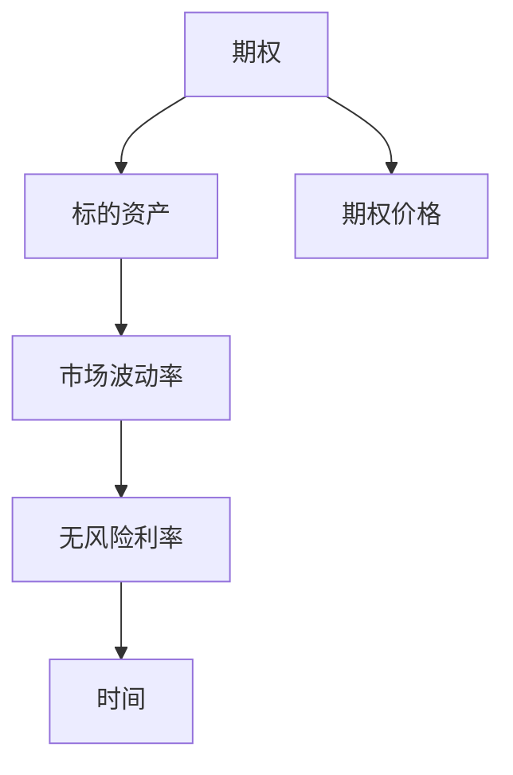
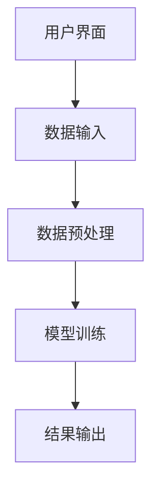
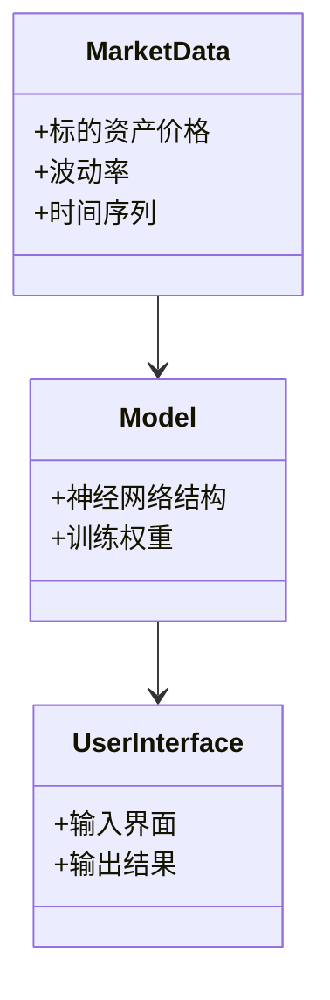
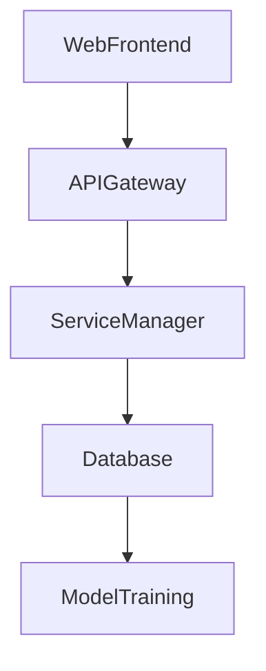

                 


# 深度学习在期权定价模型中的创新

> 关键词：深度学习，期权定价，神经网络，Black-Scholes模型，金融建模，数学模型

> 摘要：本文探讨深度学习在期权定价模型中的应用，分析其创新点，包括模型结构、数据处理和性能优化。通过理论分析和实战案例，展示深度学习如何克服传统模型的局限性，提升定价的准确性和效率。

---

## 第1章: 深度学习与期权定价概述

### 1.1 深度学习的基本概念

#### 1.1.1 深度学习的定义与特点
深度学习是一种机器学习技术，通过多层神经网络模拟人脑的计算方式。其特点包括非线性特征提取、端到端学习和高维度数据处理能力。深度学习模型能够自动学习数据中的复杂模式，无需手动特征提取。

#### 1.1.2 深度学习的核心算法
主要算法包括卷积神经网络（CNN）、循环神经网络（RNN）和生成对抗网络（GAN）。这些算法在处理不同类型数据时各有优势，例如CNN适合图像处理，RNN适合序列数据，GAN适合数据生成。

#### 1.1.3 深度学习在金融领域的应用潜力
金融领域的复杂性和不确定性使深度学习成为重要工具。深度学习在风险评估、市场预测和期权定价等方面展现出巨大潜力，能够处理传统模型难以应对的高维和非线性问题。

### 1.2 期权定价的基本原理

#### 1.2.1 期权的基本概念
期权是金融衍生品，赋予买方在特定时间内以预定价格买入或卖出标的资产的权利。期权定价需考虑标的资产价格、波动率、执行价格、时间和无风险利率等因素。

#### 1.2.2 Black-Scholes模型的原理
Black-Scholes模型是期权定价的经典公式，假设标的资产价格服从几何布朗运动，无交易成本和税收，波动率和无风险利率恒定。公式为：
$$ C = S_0 N(d_1) - Ke^{-rT} N(d_2) $$
其中，$d_1 = \frac{\ln(S_0/K) + (r+\sigma^2/2)T}{\sigma\sqrt{T}}$，$d_2 = d_1 - \sigma\sqrt{T}$。

#### 1.2.3 传统期权定价模型的局限性
Black-Scholes模型假设过于严格，无法处理实际市场中的波动率变化、跳跃过程和交易成本等问题。这限制了其在复杂市场条件下的适用性。

### 1.3 深度学习在期权定价中的创新

#### 1.3.1 深度学习在金融建模中的优势
深度学习能够处理高维数据，捕捉非线性关系，适用于复杂市场条件下的期权定价。其优势包括自适应学习和鲁棒性，能够在数据不足的情况下进行有效预测。

#### 1.3.2 利用深度学习改进期权定价的思路
通过深度学习模型，利用历史市场数据和标的资产价格，训练模型预测期权价格。模型结构设计考虑时间序列和多维特征，提高定价的准确性和效率。

#### 1.3.3 深度学习在期权定价中的应用现状
当前研究主要集中在使用RNN处理时间序列数据和CNN提取空间特征。同时，生成对抗网络也被用于数据增强和模型优化，提升了定价模型的泛化能力。

---

## 第2章: 期权定价的核心概念与联系

### 2.1 核心概念的原理

#### 2.1.1 随机过程与期权定价
期权定价涉及随机过程建模，如布朗运动和跳跃过程。随机过程模拟标的资产价格波动，用于计算期权的期望值和风险中性定价。

#### 2.1.2 风险中性定价原理
风险中性定价假设市场参与者对风险持中立态度，通过调整风险中性测度下的期望值计算期权价格。这简化了定价过程，但忽略了实际市场中的风险溢价。

#### 2.1.3 期权定价的数学模型
数学模型如Black-Scholes公式和蒙特卡洛模拟，用于计算期权的理论价格。蒙特卡洛方法通过大量模拟路径计算期望值，适用于高维问题和复杂模型。

### 2.2 核心概念的对比分析

#### 2.2.1 传统模型与深度学习模型的对比
| 特性                | 传统模型（如Black-Scholes） | 深度学习模型 |
|---------------------|-----------------------------|--------------|
| 处理复杂性           | 适合简单假设               | 适合复杂场景 |
| 特征工程需求         | 需要手动提取               | 自动提取     |
| 数据维度支持         | 低维                       | 高维         |
| 模型解释性           | 高                         | 低           |

#### 2.2.2 不同期权类型的核心特征对比
| 期权类型             | European Option | American Option |
|----------------------|------------------|------------------|
| 行使时间             | 只能在到期日行使 | 可在到期日前行使  |
| 定价复杂性           | 较低             | 较高             |

#### 2.2.3 深度学习模型的优缺点分析
优点：高度灵活，能处理高维和非线性问题；缺点：解释性差，需要大量数据训练。

### 2.3 实体关系图


---

## 第3章: 深度学习模型在期权定价中的应用

### 3.1 神经网络结构与功能

#### 3.1.1 神经网络的基本结构
神经网络由输入层、隐藏层和输出层组成。输入层接收标的资产价格、波动率等特征，隐藏层通过非线性变换提取特征，输出层预测期权价格。

#### 3.1.2 深度学习模型的选择
根据数据类型和问题特点选择模型。RNN适合处理时间序列数据，CNN适合处理空间特征，GAN适合生成模拟数据。

#### 3.1.3 神经网络的训练过程
通过反向传播和梯度下降优化权重，损失函数通常采用均方误差或交叉熵损失。

### 3.2 深度学习模型的优势

#### 3.2.1 非线性特征提取
深度学习能够自动提取复杂特征，无需手动特征工程，适用于非线性定价模型。

#### 3.2.2 高维数据处理
深度学习擅长处理高维数据，能够同时考虑多个影响因素，提升定价模型的准确性和鲁棒性。

#### 3.2.3 实时定价能力
通过在线学习，深度学习模型能够实时更新，适应市场变化，提供动态定价支持。

### 3.3 算法流程与数学模型

#### 3.3.1 神经网络的数学表达
神经网络的输入为特征向量$\mathbf{x}$，经过多层变换后得到输出$\hat{y}$：
$$ \hat{y} = \sigma(W_2 \sigma(W_1 \mathbf{x} + b_1) + b_2) $$

#### 3.3.2 损失函数与优化器
损失函数采用均方误差：
$$ L = \frac{1}{n}\sum_{i=1}^{n}(y_i - \hat{y_i})^2 $$
优化器使用Adam：
$$ \theta_{t+1} = \theta_t - \eta \frac{\rho_1 s_1 + \rho_2 s_2}{\epsilon + g_t^2} $$

#### 3.3.3 优化策略
包括学习率调整、早停和批量归一化，防止过拟合，加速收敛。

### 3.4 系统设计与实现

#### 3.4.1 系统功能模块
- 数据输入模块：接收市场数据和参数。
- 模型训练模块：训练神经网络模型。
- 结果输出模块：输出预测的期权价格。

#### 3.4.2 系统架构图


#### 3.4.3 接口设计
API接口定义：
```http
POST /api/train
POST /api/predict
```

### 3.5 项目实战

#### 3.5.1 环境搭建
安装必要的库：
```
pip install numpy pandas tensorflow keras
```

#### 3.5.2 核心实现代码
```python
import numpy as np
import tensorflow as tf
from tensorflow.keras.models import Sequential
from tensorflow.keras.layers import Dense, LSTM, Dropout

# 数据预处理
def preprocess(data):
    # 标准化处理
    return (data - data.mean()) / data.std()

# 深度学习模型构建
def build_model(input_shape):
    model = Sequential()
    model.add(LSTM(64, input_shape=input_shape))
    model.add(Dropout(0.5))
    model.add(Dense(1))
    model.compile(loss='mean_squared_error', optimizer='adam')
    return model

# 训练函数
def train_model(model, X_train, y_train, epochs=100):
    model.fit(X_train, y_train, epochs=epochs, batch_size=32, validation_split=0.2)

# 预测函数
def predict_price(model, X_test):
    return model.predict(X_test)
```

#### 3.5.3 实际案例分析
案例：使用LSTM预测欧式期权价格。
数据：历史标的资产价格和波动率。
训练：使用训练数据训练模型，调整超参数。
预测：模型预测期权价格，对比实际价格，评估模型性能。

### 3.6 总结与经验分享

#### 3.6.1 模型表现
通过回测和统计指标评估模型性能，如均方误差和准确率。

#### 3.6.2 模型优化
尝试不同的模型结构、调整超参数、引入ensembling方法提升性能。

#### 3.6.3 实际应用中的注意事项
确保数据质量，处理缺失值和异常值；选择合适的数据频率和窗口大小；考虑模型的实时更新和维护成本。

#### 3.6.4 最佳实践Tips
- 数据预处理是关键，需标准化或归一化。
- 选择合适的模型结构，如LSTM处理时间序列。
- 使用交叉验证和早停防止过拟合。

---

## 第4章: 系统分析与架构设计方案

### 4.1 问题场景介绍
构建一个实时期权定价系统，支持多标的资产和多种期权类型，提供动态定价和风险评估。

### 4.2 项目介绍
项目目标是开发一个基于深度学习的期权定价系统，实现自动化定价、风险评估和实时监控。

### 4.3 系统功能设计

#### 4.3.1 领域模型


#### 4.3.2 系统架构设计


#### 4.3.3 系统接口设计
- API接口定义：
  - POST /api/train
  - POST /api/predict
  - GET /api/status

#### 4.3.4 系统交互流程
```mermaid
sequenceDiagram
    用户提交定价请求
    ->> API Gateway: POST /api/predict
    API Gateway ->> Service Manager: 调用预测服务
    Service Manager ->> Database: 获取市场数据
    Database ->> Model Training: 获取训练好的模型
    Model Training ->> Service Manager: 返回预测价格
    Service Manager ->> API Gateway: 返回预测结果
    API Gateway ->> 用户: 返回期权价格
```

---

## 第5章: 项目实战与案例分析

### 5.1 环境安装与配置
安装Python和必要的库：
```
pip install numpy pandas tensorflow keras
```

### 5.2 核心系统实现

#### 5.2.1 数据预处理代码
```python
import pandas as pd
import numpy as np

def preprocess_data(data_path):
    df = pd.read_csv(data_path)
    features = df[['S', 'K', 'T', 'r', 'sigma']]
    labels = df['Price']
    # 标准化处理
    features_norm = (features - features.mean()) / features.std()
    return features_norm, labels
```

#### 5.2.2 模型实现代码
```python
from tensorflow.keras.models import Sequential
from tensorflow.keras.layers import LSTM, Dense, Dropout

def build_lstm_model(input_shape):
    model = Sequential()
    model.add(LSTM(64, input_shape=input_shape))
    model.add(Dropout(0.5))
    model.add(Dense(1))
    model.compile(loss='mean_squared_error', optimizer='adam')
    return model
```

### 5.3 代码实现与解读

#### 5.3.1 数据加载与预处理
加载CSV数据，进行标准化处理，确保模型输入的格式正确。

#### 5.3.2 模型训练
使用训练数据训练LSTM模型，监控验证集的损失变化，防止过拟合。

#### 5.3.3 模型预测与结果分析
用测试数据预测期权价格，计算预测值与实际值的误差，评估模型性能。

### 5.4 实际案例分析

#### 5.4.1 数据来源
使用真实市场数据或模拟数据，确保数据涵盖不同市场条件。

#### 5.4.2 模型表现评估
通过回测统计指标，如MAE、MSE和R²，评估模型的定价能力和稳定性。

#### 5.4.3 结果解读
分析模型预测结果，发现潜在的价格偏差或异常情况，优化模型结构或参数。

### 5.5 总结与经验分享

#### 5.5.1 模型调优
调整神经网络的层数、节点数和激活函数，寻找最佳模型结构。

#### 5.5.2 数据增强
引入更多的市场数据，如不同资产和时间段的数据，提升模型的泛化能力。

#### 5.5.3 实际应用中的注意事项
确保模型的实时更新和维护，应对市场变化和数据漂移。

---

## 第6章: 总结与展望

### 6.1 本文总结
本文详细探讨了深度学习在期权定价中的应用，分析了传统模型的局限性，提出了基于深度学习的解决方案。通过理论分析和项目实战，展示了深度学习在复杂市场条件下的优势。

### 6.2 研究前沿
当前研究集中在多因子模型和实时定价系统。未来可能的研究方向包括更复杂的神经网络结构、多模态数据融合和自适应学习策略。

### 6.3 未来展望
深度学习在期权定价中的应用将更加广泛，涉及更复杂的模型和更高的效率。随着技术进步，深度学习将推动金融建模进入新时代。

---

## 作者信息

作者：AI天才研究院/AI Genius Institute  
联系邮箱：contact@aimaster.com  
GitHub：https://github.com/AI-Genius-Institute  

---

# 结束语

深度学习为期权定价带来了新的可能性，克服了传统模型的局限性，提高了定价的准确性和效率。通过本文的分析和实战，读者可以深入了解深度学习在期权定价中的创新和应用，为金融建模提供了新的思路和工具。

