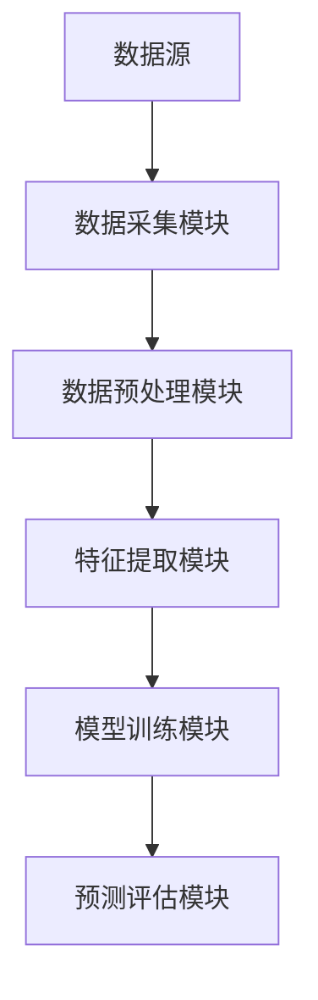
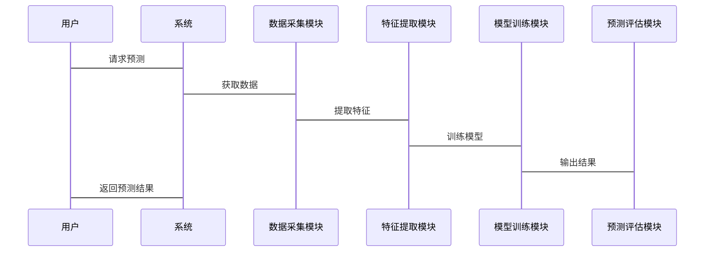

                 


# 深度学习在金融事件预测中的应用

## 关键词：
- 深度学习、金融事件预测、神经网络、算法原理、系统架构

## 摘要：
深度学习作为人工智能领域的重要分支，近年来在金融事件预测中展现了巨大潜力。本文系统阐述了深度学习的基本概念、核心算法及其在金融事件预测中的应用。通过分析深度学习模型的优势，对比传统方法的不足，探讨了深度学习在金融事件预测中的数学模型、系统架构设计及实际项目案例。最后，本文总结了深度学习在该领域的最佳实践经验和未来发展方向。

---

## 第1章: 深度学习与金融事件预测的背景

### 1.1 金融事件预测的背景与重要性
#### 1.1.1 金融事件预测的核心问题
金融事件预测涉及股票价格波动、经济指标预测、市场情绪分析等关键领域。这些预测对于投资者、企业和政府决策至关重要，能够帮助减少风险并抓住市场机会。

#### 1.1.2 深度学习在金融领域的应用现状
深度学习在金融领域的应用已从早期的学术研究逐渐走向实际应用。例如，股票价格预测、欺诈检测、信用评估等领域都取得了显著成果。

#### 1.1.3 金融事件预测的挑战与机遇
金融数据具有高度波动性、噪声多、相关性弱等特点，给预测带来了巨大挑战。然而，深度学习的强大特征提取能力和非线性建模能力为解决这些问题提供了新思路。

### 1.2 深度学习的基本概念与特点
#### 1.2.1 深度学习的定义与核心原理
深度学习是一种通过多层神经网络模拟人类学习过程的技术，其核心在于通过多层非线性变换提取数据特征。

#### 1.2.2 深度学习与传统机器学习的区别
- 数据需求：深度学习需要大量数据，传统方法数据需求较少。
- 特征提取：深度学习自动提取特征，传统方法依赖人工特征工程。

#### 1.2.3 深度学习在金融领域的优势
- 高维数据处理：深度学习擅长处理高维金融数据。
- 非线性关系捕捉：能够发现传统方法难以捕捉的复杂关系。

---

## 第2章: 深度学习在金融事件预测中的核心概念与联系

### 2.1 深度学习模型的基本原理
#### 2.1.1 神经网络的结构与训练方法
神经网络由输入层、隐藏层和输出层组成，通过反向传播和梯度下降优化模型参数。

#### 2.1.2 深度学习模型的训练流程
包括数据预处理、模型构建、训练优化和评估等步骤。

#### 2.1.3 深度学习模型的特征提取能力
模型能够自动提取数据的高层次特征，如时间序列中的趋势和周期性。

### 2.2 金融事件预测的核心要素
#### 2.2.1 金融数据的特征与类型
包括时间序列数据、文本数据、市场指标等。

#### 2.2.2 事件预测的数学模型
涉及回归、分类、时间序列预测等多种模型。

#### 2.2.3 深度学习模型与金融数据的结合
通过将金融数据输入深度学习模型，提取隐含特征并进行预测。

### 2.3 深度学习模型与金融事件预测的关系
#### 2.3.1 深度学习模型在金融事件预测中的作用
模型能够捕捉复杂非线性关系，提高预测精度。

#### 2.3.2 不同深度学习模型的对比与选择
通过对比RNN、LSTM、CNN等模型，选择最适合特定任务的模型。

#### 2.3.3 深度学习模型在金融事件预测中的优势
- 高效特征提取
- 强大学习能力

---

## 第3章: 深度学习算法原理与数学模型

### 3.1 深度学习算法的数学基础
#### 3.1.1 神经网络的数学表示
使用矩阵和向量表示神经网络的输入、权重和输出。

#### 3.1.2 激活函数与损失函数
- 激活函数：ReLU、Sigmoid等
- 损失函数：均方误差、交叉熵损失

#### 3.1.3 优化算法与反向传播
常用优化算法包括随机梯度下降（SGD）、Adam等。

### 3.2 常见深度学习模型的算法流程
#### 3.2.1 RNN的训练流程
- 输入序列数据
- 计算隐藏状态
- 输出预测结果

#### 3.2.2 LSTM的结构与训练
- 长短期记忆单元
- 解决RNN梯度消失问题

#### 3.2.3 CNN的卷积流程
- 卷积层提取局部特征
- 池化层降低维度

### 3.3 深度学习模型的数学公式
#### 3.3.1 神经网络的前向传播
$$ y = \sigma(w x + b) $$
其中，$\sigma$为激活函数，$w$为权重，$b$为偏置。

#### 3.3.2 损失函数的计算
$$ L = \frac{1}{n}\sum_{i=1}^{n}(y_i - \hat{y}_i)^2 $$

---

## 第4章: 系统分析与架构设计

### 4.1 问题场景介绍
金融事件预测系统需要处理大量实时数据，具备高可用性和扩展性。

### 4.2 系统功能设计
- 数据采集模块：收集股票价格、新闻数据等。
- 特征提取模块：提取文本、数值特征。
- 模型训练模块：训练深度学习模型。
- 预测评估模块：输出预测结果并评估准确性。

### 4.3 系统架构设计


### 4.4 系统接口设计
- 数据接口：REST API提供数据查询和预测结果。
- 模型接口：API支持模型训练和部署。

### 4.5 系统交互流程图


---

## 第5章: 项目实战

### 5.1 环境安装
安装Python、TensorFlow、Keras等库。

### 5.2 核心实现
#### 5.2.1 数据预处理
```python
import pandas as pd
data = pd.read_csv('stock_data.csv')
```

#### 5.2.2 特征工程
```python
from sklearn.preprocessing import MinMaxScaler
scaler = MinMaxScaler()
scaled_data = scaler.fit_transform(data)
```

#### 5.2.3 模型训练
```python
from tensorflow.keras.models import Sequential
from tensorflow.keras.layers import LSTM, Dense
model = Sequential()
model.add(LSTM(64, input_shape=(timesteps, features)))
model.add(Dense(1))
model.compile(loss='mean_squared_error', optimizer='adam')
model.fit(x_train, y_train, epochs=100, batch_size=32)
```

### 5.3 实际案例分析
使用LSTM模型预测股票价格，评估模型性能。

### 5.4 项目小结
总结项目经验，分析存在的问题和改进建议。

---

## 第6章: 深度学习在金融事件预测中的最佳实践

### 6.1 总结
深度学习在金融事件预测中展现出巨大潜力，但需注意数据质量和模型调优。

### 6.2 小结
本文详细介绍了深度学习在金融事件预测中的应用，从理论到实践进行了全面探讨。

### 6.3 注意事项
- 数据隐私保护
- 模型解释性
- 实时预测的延迟问题

### 6.4 拓展阅读
推荐相关书籍和论文，供读者进一步学习。

---

## 作者信息

作者：AI天才研究院/AI Genius Institute & 禅与计算机程序设计艺术/Zen And The Art of Computer Programming

---

**附录**

- 参考文献
- 数据集来源
- API接口文档

