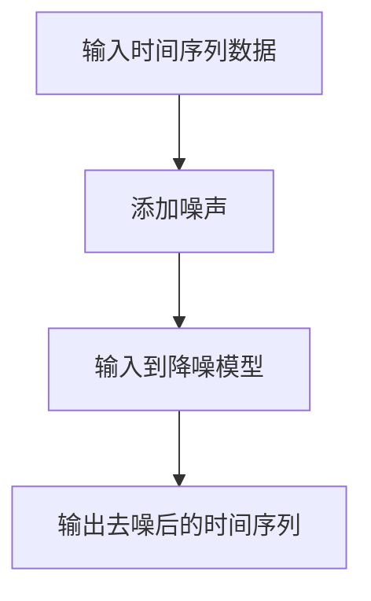
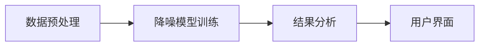
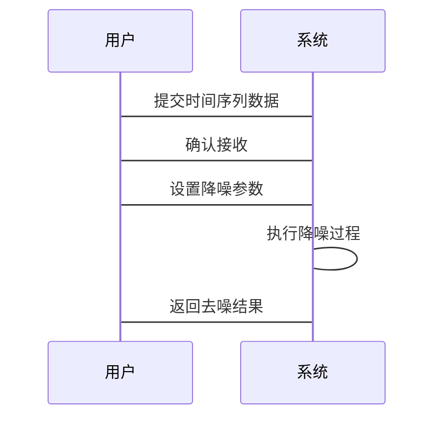

                 


# 深度学习在金融时间序列去噪中的应用

---

## 关键词：
深度学习，时间序列，去噪，金融数据，降噪算法，LSTM，Transformer，GAN

---

## 摘要：
本文深入探讨了深度学习在金融时间序列去噪中的应用。首先，我们分析了金融时间序列数据的特点及其面临的噪声问题，阐述了深度学习相较于传统方法的优势。接着，我们详细介绍了几种经典的深度学习模型，如LSTM、Transformer和GAN，并分析了它们在降噪任务中的表现。随后，我们从系统架构的角度，设计了一个完整的金融时间序列去噪系统，包括数据预处理、模型训练和结果分析等模块。最后，我们通过实际案例展示了如何将这些模型应用于金融数据去噪，并总结了最佳实践和未来研究方向。

---

## 目录大纲：

### 第1章：背景介绍
#### 1.1 问题背景
- 1.1.1 金融时间序列数据的特点
- 1.1.2 噪声对金融分析的影响
- 1.1.3 深度学习在去噪中的优势

#### 1.2 问题描述
- 1.2.1 时间序列去噪的定义
- 1.2.2 常见的金融噪声类型
- 1.2.3 去噪的目标与意义

#### 1.3 问题解决
- 1.3.1 传统去噪方法的局限性
- 1.3.2 深度学习的优势
- 1.3.3 去噪的评价指标

#### 1.4 边界与外延
- 1.4.1 金融时间序列去噪的边界条件
- 1.4.2 相关领域的外延
- 1.4.3 去噪与其他金融任务的关系

#### 1.5 核心概念与要素
- 1.5.1 时间序列的基本要素
- 1.5.2 噪声的数学模型
- 1.5.3 深度学习模型的核心要素

---

### 第2章：核心概念与联系
#### 2.1 时间序列与噪声分析
- 2.1.1 时间序列的基本概念
- 2.1.2 噪声的定义与分类
- 2.1.3 时间序列降噪方法对比

#### 2.2 核心概念的ER实体关系图
```mermaid
er
    entity(时间序列数据) {
        id: int
        时间戳: datetime
        值: float

    entity(噪声) {
        id: int
        类型: string
        强度: float

    relationship(时间序列数据 -- 噪声) {
        id: int
        影响程度: float
```

---

### 第3章：算法原理讲解
#### 3.1 传统降噪方法
- 3.1.1 均值滤波器
- 3.1.2 中位数滤波器
- 3.1.3 小波变换

#### 3.2 基于深度学习的降噪算法
- 3.2.1 基于RNN的降噪方法
  - LSTM的原理与结构
  - LSTM在时间序列去噪中的应用
- 3.2.2 基于Transformer的降噪方法
  - Transformer的注意力机制
  - Transformer在时间序列去噪中的优势
- 3.2.3 GAN-based降噪方法
  - GAN的原理与结构
  - GAN在时间序列去噪中的应用

#### 3.3 算法流程图


#### 3.4 降噪算法的数学模型
- 3.4.1 LSTM的数学公式
  $$f_t = \tanh(W_f \cdot [h_{t-1}, x_t] + b_f)$$
- 3.4.2 Transformer的注意力机制
  $$\text{Attention}(Q, K, V) = \text{softmax}\left(\frac{QK^T}{\sqrt{d_k}}\right)V$$
- 3.4.3 GAN的损失函数
  $$\mathcal{L} = \mathcal{L}_\text{D} + \mathcal{L}_\text{G}$$

---

### 第4章：系统分析与架构设计
#### 4.1 项目背景
- 4.1.1 项目目标
- 4.1.2 项目范围
- 4.1.3 项目约束

#### 4.2 系统功能设计
- 4.2.1 数据预处理模块
  - 数据清洗
  - 数据标准化
- 4.2.2 降噪模型训练模块
  - 模型选择
  - 参数调优
- 4.2.3 结果分析模块
  - 结果可视化
  - 性能评估

#### 4.3 系统架构设计


#### 4.4 系统接口设计
- 4.4.1 输入接口
  - 数据输入格式
  - 参数设置
- 4.4.2 输出接口
  - 去噪后的数据输出
  - 模型性能报告

#### 4.5 系统交互流程


---

### 第5章：项目实战
#### 5.1 环境安装
- 5.1.1 安装Python
- 5.1.2 安装深度学习库（如TensorFlow、Keras）
- 5.1.3 安装数据处理库（如Pandas、NumPy）

#### 5.2 核心代码实现
- 5.2.1 数据预处理代码
```python
import pandas as pd
import numpy as np

# 读取数据
data = pd.read_csv('financial_data.csv')

# 数据清洗
data = data.dropna()

# 标准化处理
from sklearn.preprocessing import StandardScaler
scaler = StandardScaler()
data_scaled = scaler.fit_transform(data)
```

- 5.2.2 LSTM模型实现
```python
from keras.models import Sequential
from keras.layers import LSTM, Dense

model = Sequential()
model.add(LSTM(64, input_shape=(timesteps, features)))
model.add(Dense(1))
model.compile(optimizer='adam', loss='mean_squared_error')
```

- 5.2.3 模型训练与评估
```python
model.fit(X_train, y_train, epochs=100, batch_size=32)
score = model.evaluate(X_test, y_test)
```

#### 5.3 案例分析
- 5.3.1 数据来源与处理
- 5.3.2 模型训练过程
- 5.3.3 结果分析与解读

---

### 第6章：总结与展望
#### 6.1 最佳实践
- 6.1.1 数据预处理的重要性
- 6.1.2 模型选择与调优的注意事项
- 6.1.3 降噪效果的评估方法

#### 6.2 小结
- 深度学习在金融时间序列去噪中的优势
- 各种模型的适用场景与限制

#### 6.3 注意事项
- 数据质量的重要性
- 模型过拟合的风险
- 降噪后的数据解释性

#### 6.4 拓展阅读
- 相关论文推荐
- 在线资源与工具
- 进一步的研究方向

---

## 作者：AI天才研究院 & 禅与计算机程序设计艺术

