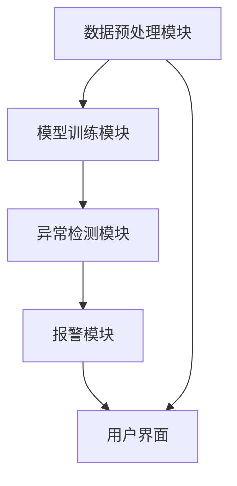

                 


---

# 深度学习在金融时间序列异常检测中的应用

> 关键词：深度学习，金融时间序列，异常检测，RNN，LSTM，Transformer，金融风控

> 摘要：本文深入探讨了深度学习技术在金融时间序列异常检测中的应用，从基本概念到算法原理，再到系统设计与项目实现，全面分析了如何利用深度学习模型提升金融异常检测的准确性和效率。文章结合理论与实践，通过具体案例展示了深度学习在金融领域的实际应用价值。

---

# 第1章: 金融时间序列异常检测的背景与挑战

## 1.1 问题背景

### 1.1.1 金融时间序列数据的特点
- 连续性：金融数据通常以时间顺序排列，具有很强的时序性。
- 非线性：金融市场的波动往往呈现出复杂的非线性特征。
- 异常性：金融市场中经常出现突变事件，如暴跌、暴涨等，这些异常事件往往具有重要的预警意义。

### 1.1.2 异常检测在金融领域的应用价值
- 风险控制：及时发现异常交易或市场波动，可以有效降低金融风险。
- 投资决策：通过异常检测识别市场拐点，为投资决策提供支持。
- 监管合规：帮助金融机构发现潜在的违规行为，确保合规性。

### 1.1.3 当前技术的局限性
- 统计方法的局限：传统的基于统计的方法（如均值-标准差法、马科夫链模型）在处理复杂非线性数据时表现不佳。
- 规则基线的不足：基于规则的异常检测方法依赖于人工设定的规则，难以覆盖所有可能的异常情况。

## 1.2 问题描述

### 1.2.1 异常检测的定义与分类
- 异常检测的定义：通过分析数据，识别出与正常数据显著不同的数据点或模式。
- 分类：基于统计的方法、基于机器学习的方法、基于深度学习的方法。

### 1.2.2 金融时间序列异常检测的难点
- 数据稀疏性：某些异常事件发生频率低，难以通过少量样本进行有效建模。
- 数据噪声：金融市场数据往往受到高频交易、市场操纵等多种因素的影响，噪声干扰大。
- 计算复杂性：时间序列数据通常具有高维度和长序列的特点，计算复杂度高。

### 1.2.3 异常检测的评价指标
- 准确率：模型正确识别异常的比例。
- 召回率：模型正确识别异常的比例。
- F1分数：综合考虑准确率和召回率的调和平均。
- AUC值：衡量模型区分异常与正常的能力。

## 1.3 问题解决与边界

### 1.3.1 深度学习在时间序列分析中的优势
- 非线性特征提取能力强：深度学习模型可以自动提取复杂的时间序列特征。
- 自适应能力强：深度学习模型能够适应不同市场环境的变化。
- 并行计算能力：深度学习模型可以利用GPU进行并行计算，提高计算效率。

### 1.3.2 深度学习异常检测的适用场景
- 复杂非线性时间序列数据
- 高维时间序列数据
- 需要实时检测的场景

### 1.3.3 深度学习方法的边界与限制
- 计算资源需求高：深度学习模型需要大量的计算资源进行训练。
- 模型解释性差：深度学习模型通常被视为“黑箱”，难以解释异常检测的结果。
- 数据依赖性强：模型的表现高度依赖于训练数据的质量和多样性。

## 1.4 核心概念与组成

### 1.4.1 时间序列数据的结构分析
- 时间序列的组成部分：
  - 趋势（Trend）：数据的长期走向。
  - 季节性（Seasonality）：数据在固定周期内的规律性波动。
  - 噪声（Noise）：随机的波动。

### 1.4.2 异常检测的核心要素
- 异常点的定义：偏离正常数据分布的点。
- 异常检测的目标：识别这些偏离正常模式的点。
- 异常检测的方法：基于统计、机器学习或深度学习的方法。

### 1.4.3 深度学习模型的关键组成部分
- 输入层：接收时间序列数据。
- 隐藏层：包括RNN、LSTM、GRU等网络结构，用于处理时间依赖性。
- 输出层：用于分类、回归或异常检测任务。

## 1.5 本章小结
本章介绍了金融时间序列异常检测的背景、挑战以及深度学习技术在其中的应用优势。通过分析传统方法的局限性，引出了深度学习技术的重要性，并为后续章节奠定了基础。

---

# 第2章: 深度学习模型的核心原理与特点

## 2.1 深度学习模型的分类

### 2.1.1 基于RNN的模型
- RNN的基本原理：
  - 循环神经网络通过引入循环结构，可以处理序列数据。
  - RNN的隐藏层状态可以捕获序列的时序信息。
- RNN的变体：
  - 双向RNN：同时考虑序列的前后信息。
  - 堆叠RNN：通过多层结构提高模型的表达能力。

### 2.1.2 基于CNN的模型
- CNN的基本原理：
  - 使用卷积核提取局部特征。
  - Pooling层用于降维和提取不变性特征。
- CNN在时间序列中的应用：
  - 将时间序列数据转换为图像形式，利用CNN进行特征提取。

### 2.1.3 基于Transformer的模型
- Transformer的基本原理：
  - 使用自注意力机制（Self-Attention）捕捉序列中任意位置的依赖关系。
  - 通过多层感知机（MLP）进行非线性变换。
- Transformer在时间序列中的应用：
  - 处理长序列数据时具有优势，可以捕捉远距离依赖。

## 2.2 深度学习模型的特点

### 2.2.1 模型的非线性特征提取能力
- 深度学习模型通过多层非线性变换，可以提取复杂的特征。
- 例如，LSTM可以通过门控机制（遗忘门、输入门、输出门）动态调整记忆和遗忘。

### 2.2.2 模型的自适应学习能力
- 深度学习模型可以自动适应数据的变化，无需手动调整特征。
- 例如，Transformer的自注意力机制可以根据不同的输入数据自动调整权重。

### 2.2.3 模型的可解释性问题
- 深度学习模型通常被视为“黑箱”，难以解释每个决策的依据。
- 提高可解释性的方法：
  - 使用可解释性模型（如SHAP值、LIME）对结果进行解释。
  - 设计更加透明的模型结构（如使用规则化方法限制模型复杂度）。

## 2.3 深度学习模型的优缺点

### 2.3.1 优点：强大的特征学习能力
- 能够自动提取复杂的时间序列特征。
- 适用于高维和非线性数据。

### 2.3.2 缺点：计算复杂度高、模型调参难度大
- 训练深度学习模型需要大量的计算资源和时间。
- 需要进行大量的参数调整，例如学习率、批量大小、网络结构等。

### 2.3.3 改善方法与优化策略
- 使用预训练模型：减少训练时间，提高模型性能。
- 优化算法：如Adam、Adagrad等，可以自动调整学习率。
- 网络结构优化：如使用更深的网络结构或引入残差连接。

## 2.4 本章小结
本章详细介绍了深度学习模型的分类及其特点，重点分析了RNN、CNN和Transformer在时间序列中的应用，并讨论了模型的优缺点及优化策略。

---

# 第3章: 基于深度学习的时间序列异常检测算法原理

## 3.1 基于RNN的异常检测算法

### 3.1.1 RNN的基本原理
- RNN的结构：输入层、隐藏层、输出层。
- RNN的时序处理能力：通过隐藏层状态捕获序列信息。

### 3.1.2 LSTM网络在时间序列中的应用
- LSTM的结构：遗忘门、输入门、输出门。
- LSTM的优势：可以捕捉长期依赖关系，避免梯度消失问题。

### 3.1.3 GRU网络的优势与特点
- GRU的结构：更新门、重置门。
- GRU的优势：结构简单，计算效率高。

### 3.1.4 基于RNN的异常检测流程
1. 数据预处理：归一化、滑动窗口分割。
2. 模型训练：使用RNN或LSTM进行异常检测任务。
3. 异常判断：根据模型输出的概率或分数判断是否为异常。

## 3.2 基于CNN的时间序列异常检测

### 3.2.1 CNN的基本原理
- CNN的结构：卷积层、池化层、全连接层。
- CNN在时间序列中的应用：将时间序列数据转换为图像形式，利用CNN进行特征提取。

### 3.2.2 时间序列数据的图像化处理
- 将时间序列数据转换为热图或一维图像。
- 使用CNN提取图像特征，用于异常检测。

### 3.2.3 使用CNN提取时间序列特征的方法
1. 数据转换：将时间序列数据转换为二维矩阵。
2. 卷积操作：使用不同大小的卷积核提取局部特征。
3. 池化操作：降低维度，提取不变性特征。
4. 全连接层：进行分类或回归任务。

## 3.3 基于Transformer的异常检测算法

### 3.3.1 Transformer的基本原理
- Transformer的结构：输入层、自注意力层、前馈网络层。
- 自注意力机制：计算序列中每个位置与其他位置的相关性。

### 3.3.2 自注意力机制在时间序列中的应用
- 通过自注意力机制捕捉序列中的全局依赖关系。
- 适用于长序列数据，可以捕捉远距离的依赖关系。

### 3.3.3 Transformer模型的优化与改进
- 使用更深的网络结构：如使用多层自注意力机制。
- 引入位置编码：将位置信息融入模型。
- 使用残差连接：提高模型的稳定性。

## 3.4 深度学习模型的损失函数与优化策略

### 3.4.1 异常检测中的损失函数选择
- 使用交叉熵损失函数：适用于分类任务。
- 使用均方误差损失函数：适用于回归任务。
- 使用自定义损失函数：根据具体任务需求设计损失函数。

### 3.4.2 优化算法的选择与调优
- 常见优化算法：随机梯度下降（SGD）、Adam、Adagrad。
- 调优策略：调整学习率、批量大小、动量参数。

### 3.4.3 模型的正则化方法
- L1正则化：通过L1范数限制权重大小。
- L2正则化：通过L2范数限制权重大小。
- Dropout：随机丢弃部分神经元，防止过拟合。

## 3.5 本章小结
本章详细介绍了基于RNN、CNN和Transformer的异常检测算法，分析了各自的优缺点，并讨论了损失函数和优化策略的选择。

---

# 第4章: 系统架构与设计方案

## 4.1 系统架构概述

### 4.1.1 系统整体架构图


### 4.1.2 各模块的功能描述
- 数据预处理模块：负责数据清洗、归一化、特征提取。
- 模型训练模块：负责模型的训练、调参和保存。
- 异常检测模块：负责实时或批量异常检测。
- 报警模块：负责根据检测结果触发报警。
- 用户界面：负责与用户的交互，展示检测结果。

### 4.1.3 系统的可扩展性与灵活性
- 支持多种模型的集成：如RNN、LSTM、Transformer。
- 支持多种数据源：如股票价格、交易量、市场指数等。
- 支持实时和批量检测：根据需求灵活配置。

## 4.2 数据预处理模块设计

### 4.2.1 数据清洗与标准化
- 数据清洗：去除缺失值、异常值。
- 数据标准化：归一化处理，使数据具有相似的分布。

### 4.2.2 时间序列数据的特征提取
- 时间窗口特征：如均值、标准差、最大值、最小值等。
- 频率域特征：如傅里叶变换后的频域特征。
- 统计特征：如偏度、峰度、自相关系数等。

### 4.2.3 异常数据的标记与标注
- 数据标注：根据历史数据或专家知识，对异常数据进行标记。
- 标记方法：如基于阈值的标记、基于聚类的标记、基于监督学习的标记。

## 4.3 模型训练与部署模块设计

### 4.3.1 模型训练流程
1. 数据加载：从数据源加载预处理后的数据。
2. 模型构建：选择合适的深度学习模型（如LSTM、Transformer）。
3. 模型训练：使用训练数据进行模型训练。
4. 模型保存：保存训练好的模型参数。

### 4.3.2 模型的保存与加载
- 模型保存：使用Keras的model.save()或PyTorch的torch.save()保存模型。
- 模型加载：使用Keras的model.load()或PyTorch的torch.load()加载模型。

### 4.3.3 模型的在线更新与优化
- 在线更新：定期重新训练模型，更新参数。
- 模型优化：使用优化算法（如Adam）进行在线优化。

## 4.4 异常检测与报警模块设计

### 4.4.1 异常检测的实时性要求
- 实时检测：对实时数据流进行异常检测。
- 批量检测：对历史数据进行批量异常检测。

### 4.4.2 报警机制的设计
- 报警阈值：根据模型输出的概率或分数，设置报警阈值。
- 多级报警：根据异常的严重程度，设置不同级别的报警。
- 报警输出：通过邮件、短信、声音等方式通知相关人员。

### 4.4.3 用户界面的交互设计
- 用户界面设计：简洁直观，便于用户操作。
- 报警展示：实时显示异常事件，提供详细信息。
- 历史记录：记录历史异常事件，便于回溯分析。

## 4.5 本章小结
本章详细设计了系统的架构与各模块的功能，重点讨论了数据预处理、模型训练和异常检测模块的设计，并通过Mermaid图展示了系统的整体架构。

---

# 第5章: 项目实战与代码实现

## 5.1 环境搭建与数据准备

### 5.1.1 环境搭建
- 安装Python：推荐使用Anaconda或Miniconda。
- 安装深度学习框架：如TensorFlow、Keras、PyTorch。
- 安装数据处理库：如Pandas、NumPy、Matplotlib。
- 安装自然语言处理库：如NLTK、spaCy。

### 5.1.2 数据准备
- 数据来源：如股票价格数据、交易量数据、市场指数数据等。
- 数据格式：CSV、Excel、数据库。
- 数据获取：使用Pandas库中的read_csv()、read_excel()等函数读取数据。

## 5.2 系统核心实现源代码

### 5.2.1 数据预处理代码
```python
import pandas as pd
import numpy as np

# 加载数据
data = pd.read_csv('financial_time_series.csv')

# 数据清洗
data.dropna()  # 删除缺失值
data = data[~data.isin([np.nan, np.inf, -np.inf])]  # 删除异常值

# 数据标准化
from sklearn.preprocessing import StandardScaler

scaler = StandardScaler()
scaled_data = scaler.fit_transform(data)
```

### 5.2.2 模型训练代码
```python
from tensorflow.keras.models import Sequential
from tensorflow.keras.layers import LSTM, Dense, Dropout

# 构建LSTM模型
model = Sequential()
model.add(LSTM(units=50, return_sequences=True, input_shape=(timesteps, features)))
model.add(Dropout(0.2))
model.add(LSTM(units=50, return_sequences=False))
model.add(Dense(1, activation='sigmoid'))

# 编译模型
model.compile(loss='binary_crossentropy', optimizer='adam', metrics=['accuracy'])
```

### 5.2.3 异常检测代码
```python
# 预测异常概率
predicted_prices = model.predict(x_test)
# 计算异常概率
threshold = 0.5
predicted_anomalies = predicted_prices > threshold
```

## 5.3 代码应用解读与分析

### 5.3.1 数据预处理解读
- 数据清洗：去除缺失值和异常值，确保数据质量。
- 数据标准化：归一化处理，使模型训练更高效。

### 5.3.2 模型训练解读
- 模型结构：使用LSTM层提取时间序列特征，Dense层进行分类。
- 损失函数：使用二元交叉熵损失函数，适用于二分类任务。
- 优化器：使用Adam优化器，自动调整学习率。

### 5.3.3 异常检测解读
- 预测概率：LSTM模型输出的预测概率。
- 异常判断：根据设定的阈值判断是否为异常。

## 5.4 实际案例分析

### 5.4.1 案例背景
- 数据来源：某金融市场的股票价格数据。
- 数据特征：时间序列数据，包含开盘价、收盘价、最高价、最低价、交易量等。

### 5.4.2 模型训练与评估
- 训练数据：使用70%的数据进行训练。
- 测试数据：使用30%的数据进行测试。
- 模型评估：准确率、召回率、F1分数。

### 5.4.3 异常检测结果分析
- 正常交易日：模型预测概率低于阈值。
- 异常交易日：模型预测概率高于阈值。
- 报警触发：根据预测概率触发报警。

## 5.5 本章小结
本章通过具体案例展示了深度学习在金融时间序列异常检测中的应用，从数据预处理到模型训练，再到异常检测，详细解读了每一步的操作和实现。

---

# 第6章: 最佳实践、小结与注意事项

## 6.1 最佳实践

### 6.1.1 数据处理
- 数据清洗：确保数据质量，去除噪声。
- 数据归一化：提高模型训练效率。
- 特征工程：提取有意义的特征，降低模型复杂度。

### 6.1.2 模型选择
- 根据数据特点选择模型：时间序列数据适合RNN、LSTM、Transformer。
- 考虑计算资源：复杂模型需要较高的计算资源。
- 考虑模型解释性：如果需要解释结果，选择可解释性较强的模型。

### 6.1.3 超参数调优
- 学习率：使用Adam等自适应优化算法。
- 批量大小：根据数据量调整批量大小。
- 网络结构：尝试不同的网络结构，找到最优配置。

## 6.2 小结

### 6.2.1 本文总结
- 深度学习技术在金融时间序列异常检测中具有重要应用价值。
- 不同的深度学习模型（如RNN、LSTM、Transformer）适用于不同的场景。
- 模型的选择和优化需要根据具体任务需求进行调整。

### 6.2.2 展望
- 结合强化学习：探索强化学习在金融异常检测中的应用。
- 跨模态学习：结合文本、图像等多模态数据进行异常检测。
- 解释性模型：提高模型的可解释性，满足监管需求。

## 6.3 注意事项

### 6.3.1 数据质量
- 确保数据的完整性和准确性。
- 处理噪声数据，避免干扰模型训练。

### 6.3.2 模型选择
- 根据任务需求选择合适的模型。
- 避免过度依赖复杂模型，注意计算资源的限制。

### 6.3.3 模型调优
- 合理设置超参数，避免过拟合。
- 使用交叉验证评估模型性能。

### 6.3.4 报警机制
- 设置合理的报警阈值，避免误报和漏报。
- 多级报警，根据异常严重程度进行分级处理。

## 6.4 拓展阅读

### 6.4.1 推荐书籍
- 《Deep Learning》（Ian Goodfellow）
- 《Financial Risk Forecasting》（Doug Martin）

### 6.4.2 推荐论文
- "Long Short-Term Memory Networks for Sequence Modeling"（Hochreiter & Schmidhuber）
- "Attention Is All You Need"（Vaswani et al.）

## 6.5 本章小结
本章总结了深度学习在金融时间序列异常检测中的应用，提出了最佳实践建议，并展望了未来的研究方向。

---

# 作者：AI天才研究院/AI Genius Institute & 禅与计算机程序设计艺术 /Zen And The Art of Computer Programming

---

以上为文章的详细大纲，您可以根据实际需求进行调整和补充。

