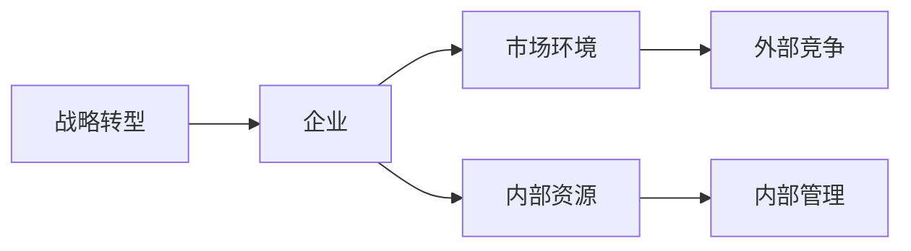
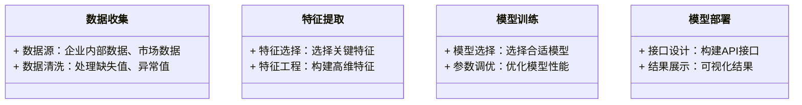
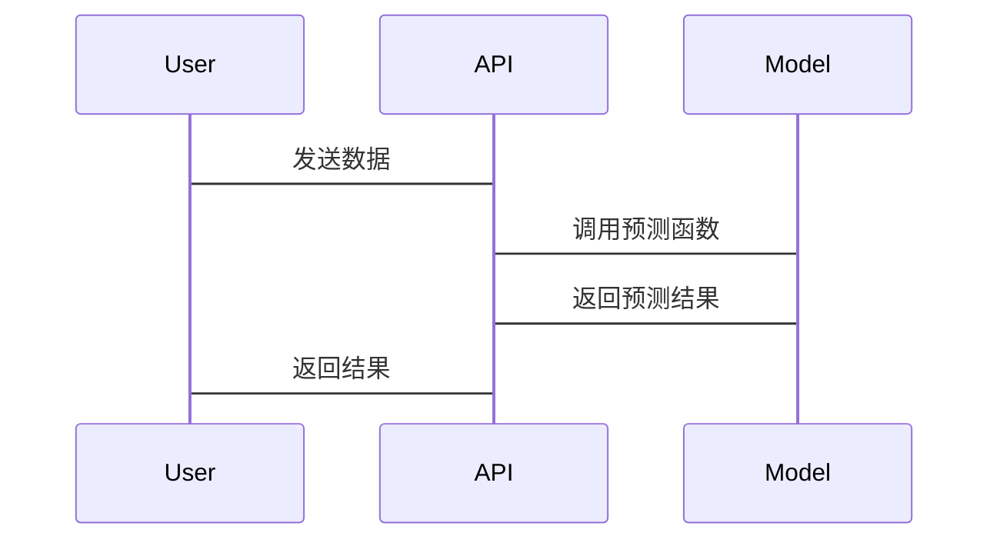

                 


# 深度学习预测公司战略转型成功率

> 关键词：深度学习，战略转型，预测模型，企业成功，数据驱动决策

> 摘要：本文探讨如何利用深度学习技术预测公司战略转型的成功率。通过分析影响战略转型的关键因素，构建深度学习模型，并通过实际案例展示其应用，旨在为企业提供数据驱动的决策支持。

---

# 第1章: 深度学习预测战略转型成功率的背景与基础

## 1.1 战略转型的定义与核心要素

### 1.1.1 战略转型的定义
战略转型是指企业在经营环境变化时，通过调整战略目标、业务模式、组织结构和资源分配等，以适应新的市场和技术挑战，实现可持续发展的过程。

### 1.1.2 战略转型的核心要素
- **市场环境**：包括行业趋势、竞争格局和政策变化。
- **企业资源**：包括资金、技术、人才和组织能力。
- **管理决策**：包括战略规划、组织变革和风险管理。

### 1.1.3 战略转型的常见挑战
- **不确定性**：市场和技术的快速变化增加了预测的难度。
- **复杂性**：涉及多个部门和利益相关者，协调难度大。
- **执行风险**：战略转型的成功依赖于执行过程的顺利进行。

## 1.2 深度学习的基本概念

### 1.2.1 深度学习的定义
深度学习是一种基于人工神经网络的机器学习方法，通过多层非线性变换来学习数据的高层次特征。

### 1.2.2 深度学习的核心特点
- **多层非线性变换**：能够捕捉数据的复杂特征。
- **端到端学习**：从原始数据直接映射到目标输出。
- **自动特征提取**：无需手动特征工程，模型可以自动学习特征。

### 1.2.3 深度学习与传统机器学习的区别
| 特性          | 传统机器学习          | 深度学习              |
|---------------|-----------------------|-----------------------|
| 特征工程      | 需要手动提取特征       | 可以自动提取特征       |
| 模型复杂度    | 模型相对简单           | 模型复杂，层次多       |
| 数据需求      | 数据量较小             | 数据量大，尤其是图像、文本等高维数据|

## 1.3 深度学习在企业战略转型中的应用前景

### 1.3.1 深度学习在企业战略转型中的潜在应用
- **市场趋势预测**：通过分析市场数据，预测行业趋势。
- **风险评估**：识别战略转型中的潜在风险。
- **决策优化**：基于数据驱动的决策，提高战略转型的成功率。

### 1.3.2 企业采用深度学习的优势
- **数据驱动**：利用企业内部数据，提高决策的准确性。
- **自动化特征提取**：减少人工特征工程的工作量。
- **高维数据处理**：深度学习擅长处理高维数据，如文本和图像。

### 1.3.3 深度学习应用的挑战与机遇
- **挑战**：数据质量、模型解释性和计算资源需求。
- **机遇**：提升企业竞争力，推动智能化转型。

## 1.4 本章小结
本章介绍了战略转型的定义、核心要素以及深度学习的基本概念和应用前景。通过对比深度学习与传统机器学习，突出了深度学习在企业战略转型中的优势和挑战。

---

# 第2章: 深度学习预测战略转型成功率的背景与问题描述

## 2.1 战略转型成功率的影响因素

### 2.1.1 市场环境因素
- **行业竞争**：行业内的竞争程度影响战略转型的难度。
- **政策变化**：政策法规的变化可能对战略转型产生重大影响。

### 2.1.2 企业内部因素
- **组织结构**：组织结构的灵活性影响转型的速度和效果。
- **资源分配**：资金、技术和人才的充足性直接影响转型的成功率。

### 2.1.3 管理决策因素
- **战略规划**：明确的战略规划是成功转型的关键。
- **领导力**：领导层的决策能力和执行力至关重要。

## 2.2 深度学习在战略转型预测中的优势

### 2.2.1 数据驱动的决策优势
深度学习通过分析大量数据，提供基于事实的决策支持。

### 2.2.2 高维特征的自动提取能力
深度学习能够自动提取高维特征，减少人工特征工程的工作量。

### 2.2.3 模型的可解释性与鲁棒性
深度学习模型在一定程度上具有可解释性，且能够处理噪声数据，具有较强的鲁棒性。

## 2.3 问题背景与目标

### 2.3.1 问题背景
企业战略转型的成功率受到多种内外部因素的影响，传统的定量分析方法难以准确预测。

### 2.3.2 问题目标
构建一个基于深度学习的模型，预测公司战略转型的成功率，为企业提供数据支持。

### 2.3.3 边界与外延
- **边界**：仅考虑企业内部数据，不涉及外部市场数据。
- **外延**：模型可用于不同行业的战略转型预测。

## 2.4 本章小结
本章分析了影响战略转型成功率的因素，并探讨了深度学习在预测中的优势，明确了问题背景和目标。

---

# 第3章: 深度学习预测战略转型成功率的核心概念与联系

## 3.1 核心概念的原理

### 3.1.1 深度学习模型的基本原理
深度学习通过多层神经网络，从输入数据中提取高层次特征，最终映射到目标输出。

### 3.1.2 战略转型预测的核心要素
- **市场环境**：行业趋势、竞争格局。
- **企业资源**：资金、技术、人才。
- **管理决策**：战略规划、执行能力。

### 3.1.3 深度学习与战略转型的联系
深度学习通过数据驱动的方式，帮助企业识别影响战略转型的关键因素，优化决策过程。

## 3.2 核心概念的属性特征对比

| 特性          | 深度学习模型          | 战略转型预测          |
|---------------|-----------------------|-----------------------|
| 输入数据      | 高维数据（如文本、图像） | 结构化数据（如财务指标、市场数据） |
| 输出目标      | 预测值（如成功概率）   | 成功率预测            |
| 模型复杂度    | 高度复杂               | 中等复杂度            |

## 3.3 实体关系图



---

# 第4章: 深度学习预测战略转型成功率的算法原理

## 4.1 神经网络模型的结构与训练过程

### 4.1.1 神经网络的基本结构
神经网络由输入层、隐藏层和输出层组成，通过多层非线性变换，提取数据特征。

### 4.1.2 模型训练流程
1. **数据预处理**：归一化、特征选择。
2. **模型初始化**：随机初始化权重。
3. **前向传播**：计算输出值。
4. **损失计算**：计算预测值与真实值之间的误差。
5. **反向传播**：计算梯度，更新权重。
6. **迭代优化**：重复训练过程，直到收敛。

## 4.2 深度学习模型的数学公式

### 4.2.1 损失函数
$$ L = \frac{1}{N}\sum_{i=1}^{N}(y_i - \hat{y_i})^2 $$

### 4.2.2 优化器
$$ \theta_{new} = \theta_{old} - \eta \frac{\partial L}{\partial \theta} $$

其中，$\eta$ 是学习率，$\frac{\partial L}{\partial \theta}$ 是损失函数对参数 $\theta$ 的梯度。

## 4.3 模型训练的流程图


## 4.4 模型实现的代码示例

```python
import tensorflow as tf
from tensorflow import keras

# 数据预处理
X_train, X_test, y_train, y_test = ... 

# 模型构建
model = keras.Sequential([
    keras.layers.Dense(64, activation='relu'),
    keras.layers.Dense(1, activation='sigmoid')
])

# 模型编译
model.compile(optimizer='adam', loss='binary_crossentropy', metrics=['accuracy'])

# 模型训练
model.fit(X_train, y_train, epochs=10, batch_size=32)

# 模型评估
loss, accuracy = model.evaluate(X_test, y_test)
```

## 4.5 本章小结
本章详细讲解了深度学习模型的结构、训练过程和数学公式，并通过代码示例展示了模型实现的步骤。

---

# 第5章: 深度学习预测战略转型成功率的系统分析与架构设计

## 5.1 系统功能设计

### 5.1.1 领域模型


### 5.1.2 系统架构设计


## 5.2 系统接口设计

### 5.2.1 API接口
- **输入**：企业战略转型相关的数据。
- **输出**：战略转型成功率的预测值。

### 5.2.2 接口实现
```python
@app.route('/predict', methods=['POST'])
def predict():
    data = request.json
    prediction = model.predict(data)
    return jsonify({'success': True, 'prediction': prediction.tolist()})
```

## 5.3 系统交互设计



## 5.4 本章小结
本章从系统角度分析了深度学习预测战略转型成功率的实现过程，包括功能设计、架构设计和接口设计。

---

# 第6章: 深度学习预测战略转型成功率的项目实战

## 6.1 项目背景与目标

### 6.1.1 项目背景
某公司计划进行业务模式转型，希望通过深度学习模型预测转型的成功率。

### 6.1.2 项目目标
构建一个基于深度学习的模型，预测公司战略转型的成功率。

## 6.2 数据收集与预处理

### 6.2.1 数据收集
收集企业的财务数据、市场数据和管理数据。

### 6.2.2 数据清洗
处理缺失值和异常值，归一化数据。

## 6.3 模型实现与优化

### 6.3.1 模型实现
```python
import pandas as pd
import numpy as np
from sklearn.model_selection import train_test_split
from tensorflow.keras import layers, models

# 数据加载
data = pd.read_csv('data.csv')
X = data.drop('success_rate', axis=1)
y = data['success_rate']

# 数据分割
X_train, X_test, y_train, y_test = train_test_split(X, y, test_size=0.2)

# 模型构建
model = models.Sequential()
model.add(layers.Dense(64, activation='relu', input_shape=(X_train.shape[1],)))
model.add(layers.Dense(1, activation='sigmoid'))

# 模型编译
model.compile(optimizer='adam', loss='binary_crossentropy', metrics=['accuracy'])

# 模型训练
model.fit(X_train, y_train, epochs=50, batch_size=32, validation_data=(X_test, y_test))
```

### 6.3.2 模型优化
调整学习率、批量大小和模型结构，提高预测准确率。

## 6.4 模型评估与分析

### 6.4.1 模型评估
计算准确率、召回率和F1分数。

### 6.4.2 案例分析
分析模型在实际案例中的表现，总结经验教训。

## 6.5 本章小结
本章通过实际案例展示了深度学习预测战略转型成功率的实现过程，包括数据收集、模型实现和优化。

---

# 第7章: 深度学习预测战略转型成功率的最佳实践与总结

## 7.1 模型优化策略

### 7.1.1 参数调优
通过网格搜索或随机搜索优化模型参数。

### 7.1.2 模型集成
使用集成学习（如投票法、堆叠法）提高预测准确率。

## 7.2 模型的可解释性与鲁棒性

### 7.2.1 可解释性
通过可视化工具（如SHAP值）解释模型的预测结果。

### 7.2.2 鲁棒性
通过交叉验证和数据增强提高模型的鲁棒性。

## 7.3 实际应用中的注意事项

### 7.3.1 数据质量
确保数据的准确性和完整性。

### 7.3.2 模型部署
确保模型在生产环境中的稳定运行。

## 7.4 本章小结
本章总结了深度学习预测战略转型成功率的最佳实践，包括模型优化、可解释性和鲁棒性。

---

# 作者：AI天才研究院/AI Genius Institute & 禅与计算机程序设计艺术/Zen And The Art of Computer Programming

---

以上是《深度学习预测公司战略转型成功率》的完整目录大纲和内容框架。如果需要进一步扩展某一部分的内容，请随时告诉我！

