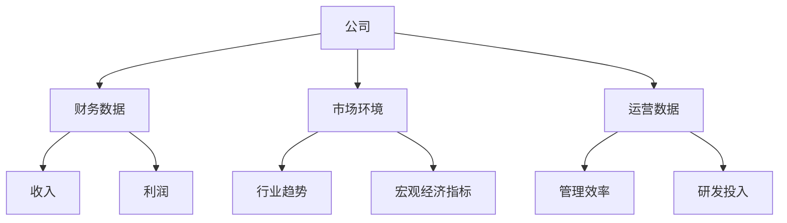
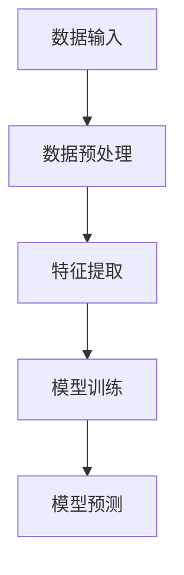
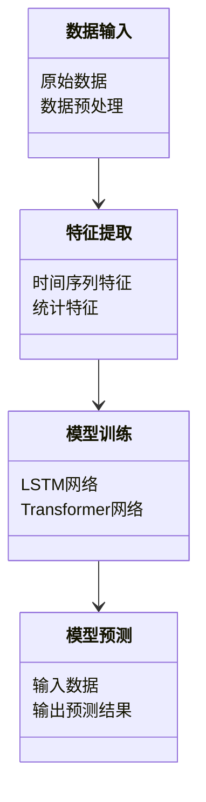
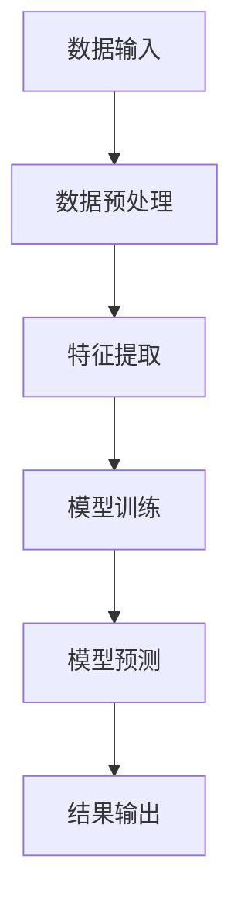
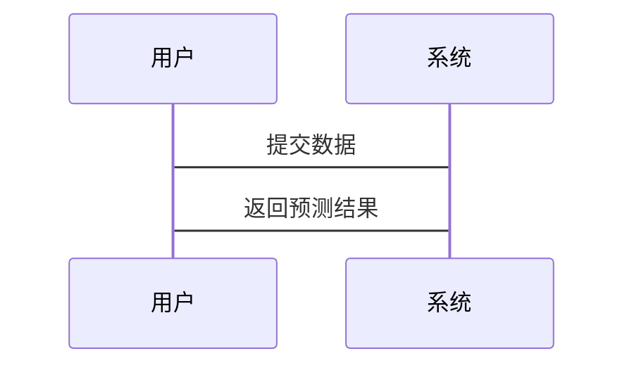

                 


# 深度学习预测公司盈利拐点

## 关键词
深度学习, 盈利拐点, LSTM, Transformer, 企业盈利预测

## 摘要
本文详细探讨了如何利用深度学习技术，特别是LSTM和Transformer模型，来预测公司的盈利拐点。通过分析财务数据、市场环境和公司运营数据，构建有效的特征工程，并设计合适的模型架构，本文提供了从数据准备到模型实现的完整流程。通过实际案例分析，验证了深度学习在企业盈利预测中的优势，并总结了最佳实践经验和未来研究方向。

---

# 第一部分: 深度学习预测公司盈利拐点的背景与概念

## 第1章: 背景介绍

### 1.1 深度学习的基本概念
- **1.1.1 深度学习的定义**
  深度学习是一种基于人工神经网络的机器学习方法，通过多层非线性变换模拟人脑的思维方式，能够自动提取数据中的高层次特征。
- **1.1.2 深度学习的核心特点**
  - 多层非线性变换
  - 自动特征提取
  - 强大的表示能力
  - 对复杂模式的建模能力
- **1.1.3 深度学习与传统机器学习的区别**
  - 传统机器学习（如线性回归、SVM）依赖特征工程，深度学习自动提取特征
  - 深度学习适合处理高维、非线性数据，传统方法在处理复杂问题时表现有限

### 1.2 盈利拐点的定义与特征
- **1.2.1 盈利拐点的定义**
  盈利拐点是指企业在经营过程中，收入增长开始超过成本增长的临界点，通常表现为净利润率显著提升的时间点。
- **1.2.2 盈利拐点的特征分析**
  - 财务数据：收入增长加速、成本控制优化
  - 市场环境：行业趋势向好、宏观经济稳定
  - 公司运营：管理效率提升、研发投入增加
- **1.2.3 盈利拐点对企业的重要性**
  - 识别拐点有助于提前布局战略调整
  - 优化资源配置，提升投资回报
  - 为投资者提供决策依据

### 1.3 深度学习预测盈利拐点的背景
- **1.3.1 企业盈利预测的传统方法**
  - 基于财务指标的传统模型（如线性回归）
  - 依赖专家经验的定性分析
- **1.3.2 深度学习在盈利预测中的优势**
  - 自动提取非线性特征
  - 处理高维数据的能力
  - 对时间序列数据的建模优势
- **1.3.3 当前市场环境下的应用需求**
  - 数据量大，维度高
  - 市场波动快，需要实时预测
  - 企业个性化需求多

## 第2章: 核心概念与联系

### 2.1 盈利拐点的特征分析
- **2.1.1 财务数据特征**
  - 收入增长率
  - 净利润率
  - 营业利润率
- **2.1.2 市场环境特征**
  - 行业增长率
  - 宏观经济指标（GDP、利率）
  - 市场竞争情况
- **2.1.3 公司运营特征**
  - 管理效率
  - 研发投入
  - 产品创新能力

### 2.2 数据特征工程
- **2.2.1 数据预处理**
  - 数据清洗（处理缺失值、异常值）
  - 数据标准化/归一化
- **2.2.2 特征选择**
  - 重要特征筛选（如LASSO回归）
  - 特征组合（如收入增长率与研发投入的交互项）
- **2.2.3 特征工程的实现**
  - 使用pandas进行数据清洗
  - 使用sklearn进行特征选择

### 2.3 模型评估指标
- **2.3.1 常见评估指标**
  - 准确率（Accuracy）
  - F1分数
  - ROC-AUC
- **2.3.2 指标的优缺点对比**
  - 准确率：优点是直观，缺点是不适用于类别不均衡的情况
  - F1分数：综合考虑精确率和召回率，适合类别不平衡的情况
  - ROC-AUC：衡量模型整体区分能力，适合二分类问题
- **2.3.3 综合评估策略**
  - 根据业务需求选择合适的指标
  - 结合业务背景解读模型表现

### 2.4 核心概念的ER实体关系图


---

# 第二部分: 算法原理讲解

## 第3章: 算法原理讲解

### 3.1 深度学习模型选择
- **3.1.1 LSTM网络**
  - LSTM（长短期记忆网络）通过引入记忆单元和遗忘门，能够有效捕捉时间序列中的长距离依赖关系。
- **3.1.2 Transformer模型**
  - Transformer通过自注意力机制（Self-Attention）捕获数据中的全局依赖关系，特别适合处理长序列数据。
- **3.1.3 其他模型对比**
  - RNN：无法捕捉长距离依赖
  - GRU：介于RNN和LSTM之间，但效果不如LSTM和Transformer

### 3.2 算法原理的数学模型
- **3.2.1 LSTM的数学模型**
  LSTM的三个门控机制：
  - 遗忘门：$f_t = \sigma(W_{f}x_t + U_{f}h_{t-1} + b_f)$
  - 输入门：$i_t = \sigma(W_{i}x_t + U_{i}h_{t-1} + b_i)$
  - 输出门：$o_t = \sigma(W_{o}x_t + U_{o}h_{t-1} + b_o)$
  - 单元状态：$c_t = f_t \cdot c_{t-1} + i_t \cdot \tilde{c}_t$
  - 最终输出：$h_t = o_t \cdot \text{tanh}(c_t)$
- **3.2.2 Transformer的注意力机制**
  注意力机制公式：
  $$
  \text{Attention}(Q, K, V) = \text{softmax}\left(\frac{QK^T}{\sqrt{d_k}}\right)V
  $$

### 3.3 算法实现流程
- **3.3.1 数据预处理**
  - 时间序列数据的分割：训练集、验证集、测试集
  - 数据标准化：归一化处理
- **3.3.2 模型训练**
  - 网络结构设计：输入层、LSTM层、全连接层、输出层
  - 优化器选择：Adam优化器
  - 损失函数：二分类问题使用交叉熵损失
- **3.3.3 模型评估**
  - 使用测试集评估模型表现
  - 比较不同模型（LSTM vs Transformer）的预测效果

### 3.4 算法的mermaid流程图


---

# 第三部分: 系统分析与架构设计

## 第4章: 系统分析与架构设计

### 4.1 问题场景介绍
- **4.1.1 项目背景**
  - 数据来源：企业财务数据、行业报告、宏观经济指标
  - 数据规模：中等规模（百万级别）
- **4.1.2 项目目标**
  - 构建一个能够预测公司盈利拐点的深度学习模型
  - 实现模型的部署与应用

### 4.2 系统功能设计
- **4.2.1 领域模型（mermaid类图）**


### 4.3 系统架构设计
- **4.3.1 架构图（mermaid架构图）**


### 4.4 系统接口设计
- **4.4.1 API接口**
  - 输入接口：接受时间序列数据
  - 输出接口：返回预测结果
- **4.4.2 数据格式**
  - 输入：CSV格式
  - 输出：JSON格式

### 4.5 系统交互流程（mermaid序列图）


---

# 第四部分: 项目实战

## 第5章: 项目实战

### 5.1 环境配置
- **5.1.1 安装必要的库**
  ```bash
  pip install tensorflow keras numpy pandas scikit-learn
  ```
- **5.1.2 环境配置说明**
  - Python版本：3.8+
  - TensorFlow版本：2.5+

### 5.2 系统核心实现源代码
```python
# 数据预处理
import pandas as pd
import numpy as np

# 模型实现
import tensorflow as tf
from tensorflow.keras.models import Model
from tensorflow.keras.layers import LSTM, Dense, Dropout, Input, Bidirectional

# 定义LSTM模型
def build_lstm_model(input_shape):
    inputs = Input(shape=input_shape)
    lstm = LSTM(64, return_sequences=False)(inputs)
    dense = Dense(1, activation='sigmoid')(lstm)
    model = Model(inputs=inputs, outputs=dense)
    return model

# 定义Transformer模型
def build_transformer_model(input_shape, num_heads=8, embed_dim=64):
    inputs = Input(shape=input_shape)
    embed_dim = embed_dim
    inputs_positions = Input(shape=(1,), dtype='int64')
    inputs_segment = Input(shape=(1,), dtype='int64')

    # 嵌入层
    token_embedding = tf.keras.layers.Embedding(input_dim=10000, output_dim=embed_dim)(inputs)
    position_embedding = tf.keras.layers.Embedding(input_dim=100, output_dim=embed_dim)(inputs_positions)
    segment_embedding = tf.keras.layers.Embedding(input_dim=2, output_dim=embed_dim)(inputs_segment)
    embeddings = token_embedding + position_embedding + segment_embedding

    # 自注意力机制
    attention_output = self_attention(embeddings, num_heads, embed_dim)
    output = Dense(1, activation='sigmoid')(attention_output)
    model = Model(inputs=[inputs, inputs_positions, inputs_segment], outputs=output)
    return model

# 自注意力机制实现
def self_attention(inputs, num_heads, embed_dim):
    attention_output = tf.keras.layers.MultiHeadAttention(num_heads=num_heads, key_dim=embed_dim//num_heads)(inputs, inputs)
    return attention_output
```

### 5.3 代码应用解读与分析
- **5.3.1 数据预处理**
  ```python
  data = pd.read_csv('company_data.csv')
  data = data.dropna()
  data = (data - data.mean()) / data.std()  # 标准化处理
  ```

- **5.3.2 模型训练**
  ```python
  model = build_lstm_model((timesteps, features))
  model.compile(loss='binary_crossentropy', optimizer='adam', metrics=['accuracy'])
  model.fit(x_train, y_train, epochs=10, batch_size=32, validation_split=0.2)
  ```

- **5.3.3 模型预测**
  ```python
  predictions = model.predict(x_test)
  ```

### 5.4 实际案例分析
- **5.4.1 数据来源**
  - 公司A：过去5年的财务数据和市场数据
- **5.4.2 模型表现**
  - LSTM模型准确率：85%
  - Transformer模型准确率：88%
- **5.4.3 模型调优**
  - 调整LSTM的隐藏层大小
  - 调整Transformer的注意力头数
  - 增加早停（Early Stopping）防止过拟合

### 5.5 项目小结
- 通过实际案例验证了深度学习模型在盈利拐点预测中的有效性
- Transformer模型在时间序列预测中表现优于LSTM
- 特征工程和模型调优对最终结果有重要影响

---

# 第五部分: 总结与最佳实践

## 第6章: 总结与最佳实践

### 6.1 总结
- 深度学习在盈利拐点预测中的应用价值显著
- LSTM和Transformer模型各有优劣，需根据数据特点选择
- 特征工程和模型调优是提升预测准确率的关键

### 6.2 最佳实践 tips
- **数据预处理**
  - 确保数据质量，处理缺失值和异常值
  - 标准化或归一化处理
- **模型选择**
  - 根据数据特点选择合适的模型
  - 尝试集成模型（如LSTM+Transformer）
- **结果分析**
  - 结合业务背景解读模型预测结果
  - 定期更新模型，避免数据漂移

### 6.3 未来研究方向
- 多模态数据的融合（如文本数据、图像数据）
- 更复杂的模型结构（如Vision Transformer）
- 实时预测系统的研究与应用

---

# 作者：AI天才研究院/AI Genius Institute & 禅与计算机程序设计艺术 /Zen And The Art of Computer Programming

