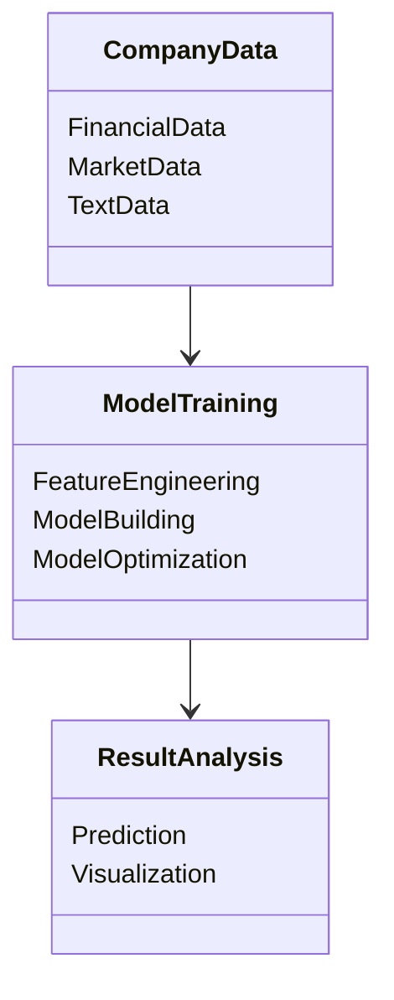

                 


# 深度学习预测公司长期竞争优势

**关键词：** 深度学习，公司分析，竞争优势，财务预测，市场地位，公司治理

**摘要：**  
本文探讨如何利用深度学习技术预测公司的长期竞争优势。通过分析公司财务表现、市场地位和管理团队等因素，结合深度学习模型，预测公司未来的竞争优势。文章涵盖深度学习的基本概念、公司分析的核心要素、深度学习在公司分析中的应用、系统架构设计、项目实战以及最佳实践，为商业决策提供科学依据。

---

## 第一部分：深度学习与公司竞争优势概述

### 第1章：深度学习与公司分析概述

#### 1.1 深度学习的背景与演变

##### 1.1.1 深度学习的定义与特点

- **定义：** 深度学习是一种机器学习技术，通过多层神经网络模拟人脑的处理方式，自动提取数据特征。
- **特点：**  
  - **非线性表达：** 能够处理复杂的非线性关系。
  - **自动特征提取：** 神经网络自动提取特征，减少人工特征工程。
  - **高维度数据处理：** 适用于图像、文本、时间序列等多种数据类型。
  - **可解释性有限：** 相对于传统模型，深度学习模型的可解释性较弱。

##### 1.1.2 公司分析的背景与重要性

- **公司分析定义：** 通过对公司的财务、市场、管理等方面进行分析，评估其经营状况和未来潜力。
- **重要性：** 公司分析是投资决策、战略规划的重要依据，帮助预测公司长期竞争优势。

##### 1.1.3 深度学习与公司分析的结合

- **结合背景：** 随着数据量的增加和计算能力的提升，深度学习在公司分析中的应用日益广泛。
- **优势：** 深度学习能够处理大量非结构化数据，发现传统方法难以察觉的模式。
- **局限性：** 需要大量数据支持，且模型解释性较弱。

### 第2章：公司长期竞争优势的核心要素

#### 2.1 财务表现分析

##### 2.1.1 财务报表分析基础

- **利润表：** 包括收入、成本、利润等信息，反映公司盈利能力。
- **资产负债表：** 包括资产、负债、所有者权益，反映公司财务状况。
- **现金流量表：** 包括经营活动、投资活动和筹资活动的现金流量，反映公司现金流健康状况。

##### 2.1.2 财务数据的深度学习建模

- **数据预处理：** 数据清洗、缺失值处理、标准化。
- **特征提取：** 从财务数据中提取关键特征，如收入增长率、利润率等。
- **模型构建：** 使用LSTM或CNN进行时间序列预测，预测公司未来财务表现。

#### 2.2 市场地位与竞争优势

##### 2.2.1 市场地位的定义与评估

- **市场份额：** 公司在市场中的占有率。
- **行业竞争结构：** 使用波特五力模型分析行业竞争情况。
- **市场地位与公司价值：** 市场地位是公司竞争优势的重要组成部分。

##### 2.2.2 市场数据的深度学习应用

- **数据特征工程：** 提取市场数据中的趋势、周期性等特征。
- **市场趋势预测模型：** 使用深度学习模型预测市场趋势，评估公司竞争优势。

#### 2.3 管理团队与公司治理

##### 2.3.1 管理团队的影响力

- **管理团队背景：** 包括团队经验、能力等。
- **公司治理结构：** 包括董事会结构、治理效率等。
- **管理团队决策：** 管理团队的决策对公司战略和竞争优势有重要影响。

##### 2.3.2 公司治理的深度学习评估

- **治理数据特征提取：** 提取公司治理相关的特征数据。
- **治理结构对财务表现的影响：** 分析公司治理结构对财务表现的影响。

---

## 第二部分：深度学习在公司分析中的应用

### 第3章：深度学习与文本数据挖掘

#### 3.1 公司公告与新闻的文本分析

##### 3.1.1 文本数据的预处理与特征提取

- **文本预处理：** 去停用词、分词、文本标准化。
- **特征提取：** 使用词袋模型或TF-IDF提取文本特征。
- **情感分析：** 分析公司公告和新闻的情感倾向，预测市场反应。

##### 3.1.2 基于深度学习的文本分类与情感分析

- **文本分类模型：** 使用LSTM或BERT进行文本分类。
- **情感分析：** 通过深度学习模型分析文本情感，预测市场反应。

---

### 第4章：深度学习与财务数据预测

#### 4.1 财务数据的深度学习建模

##### 4.1.1 数据预处理

- **数据清洗：** 处理缺失值、异常值。
- **数据标准化：** 标准化处理财务数据，使其适合模型输入。

##### 4.1.2 特征选择与提取

- **特征选择：** 选择对公司长期竞争优势影响较大的特征，如收入增长率、利润率等。
- **特征提取：** 使用PCA或t-SNE进行降维，提取关键特征。

##### 4.1.3 模型构建与优化

- **模型选择：** 使用LSTM进行时间序列预测，预测公司未来财务表现。
- **模型优化：** 调参、交叉验证，提升模型性能。

---

## 第三部分：系统架构与实现

### 第5章：系统架构设计

#### 5.1 问题场景介绍

- **目标：** 构建一个基于深度学习的公司竞争优势预测系统。
- **输入：** 公司的财务数据、市场数据、文本数据等。
- **输出：** 预测公司未来竞争优势的评分或分类结果。

#### 5.2 系统功能设计

##### 5.2.1 领域模型设计（Mermaid类图）



##### 5.2.2 系统架构设计（Mermaid架构图）


### 第6章：项目实战

#### 6.1 环境安装与配置

- **环境搭建：** 安装Python、TensorFlow、Keras等库。
- **数据准备：** 下载公司财务数据、市场数据和新闻数据。

#### 6.2 核心实现

##### 6.2.1 数据预处理

```python
import pandas as pd
import numpy as np

# 读取数据
data = pd.read_csv('company_data.csv')

# 处理缺失值
data = data.dropna()

# 标准化处理
from sklearn.preprocessing import StandardScaler
scaler = StandardScaler()
data_scaled = scaler.fit_transform(data)
```

##### 6.2.2 模型训练与优化

```python
from tensorflow.keras.models import Sequential
from tensorflow.keras.layers import LSTM, Dense, Dropout

model = Sequential()
model.add(LSTM(64, input_shape=(timesteps, features)))
model.add(Dense(1, activation='sigmoid'))
model.compile(optimizer='adam', loss='binary_crossentropy', metrics=['accuracy'])
model.fit(X_train, y_train, epochs=10, batch_size=32)
```

##### 6.2.3 结果分析

```python
import matplotlib.pyplot as plt

# 预测结果
y_pred = model.predict(X_test)

# 可视化
plt.plot(y_test, label='True')
plt.plot(y_pred, label='Predicted')
plt.legend()
plt.show()
```

---

## 第七章：总结与展望

### 7.1 总结

本文详细探讨了深度学习在预测公司长期竞争优势中的应用，结合财务数据、市场数据和文本数据，构建了预测模型，并设计了系统架构。通过项目实战，验证了深度学习在公司分析中的有效性。

### 7.2 展望

未来研究方向包括多模态数据融合、实时预测模型开发以及模型的可解释性提升。深度学习在公司分析中的应用将更加广泛，为商业决策提供更有力的支持。

---

**作者：AI天才研究院/AI Genius Institute & 禅与计算机程序设计艺术 /Zen And The Art of Computer Programming**

---

希望这篇博客文章能为您提供有价值的信息和启发！

