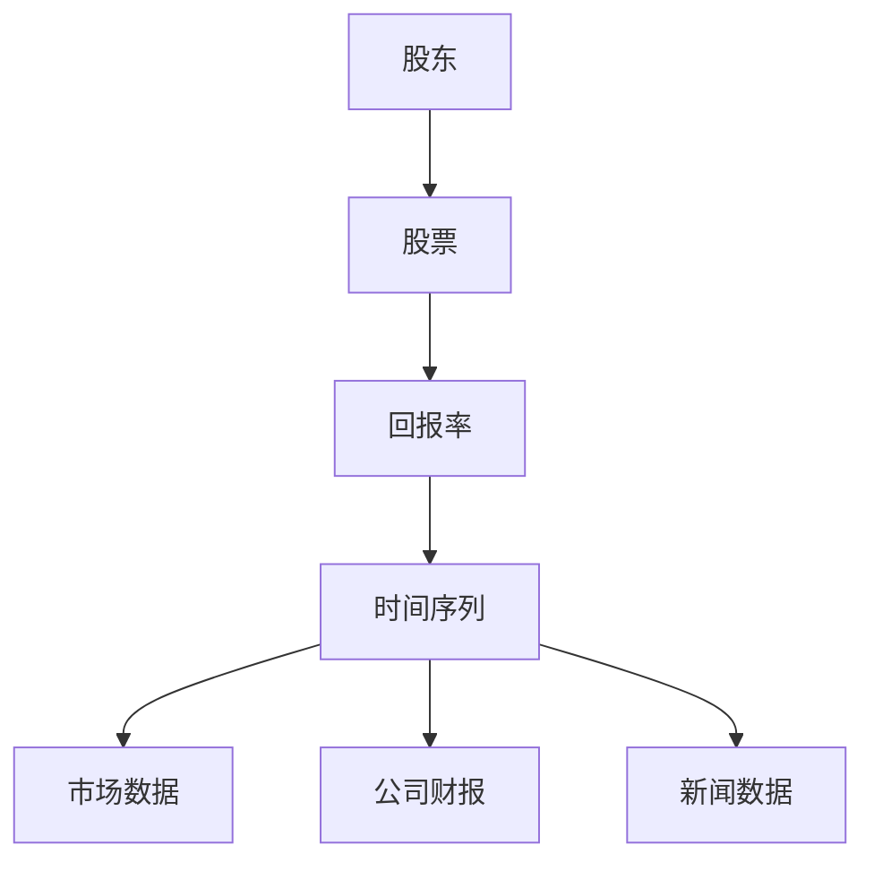
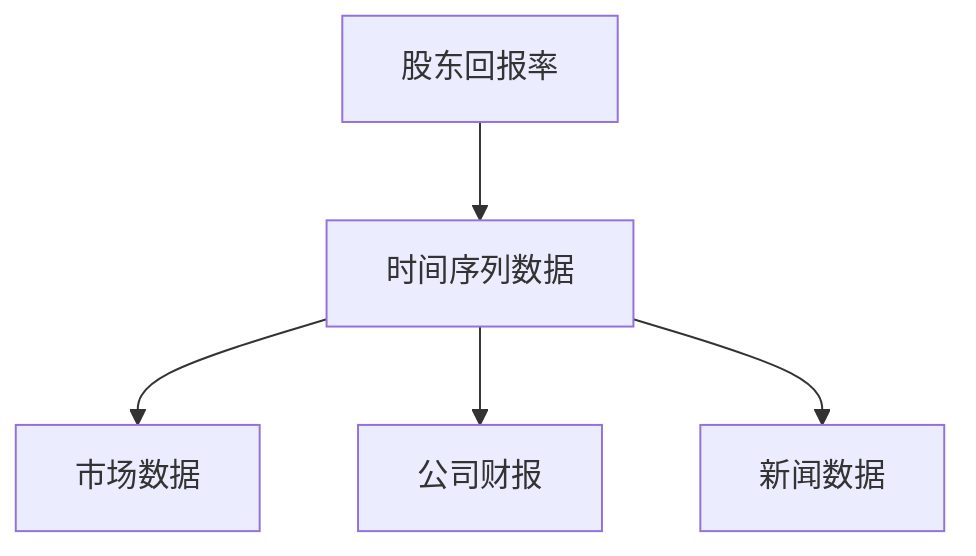
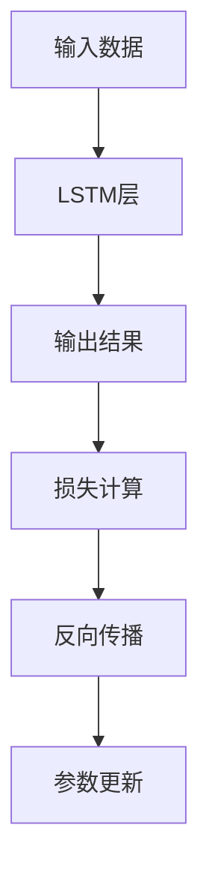
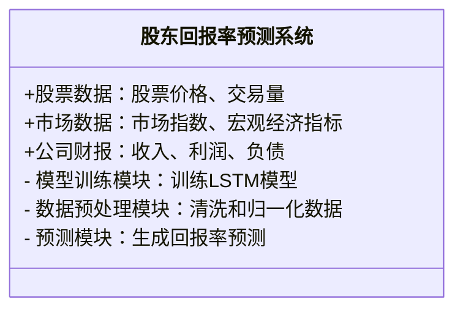
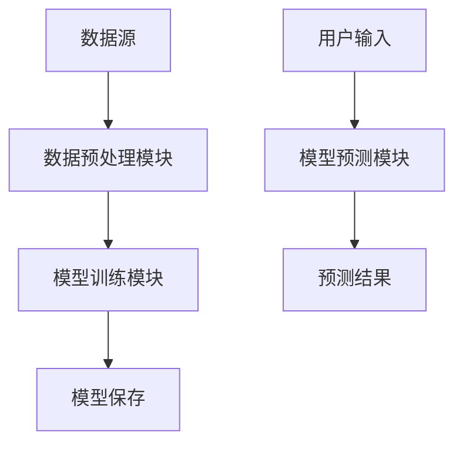
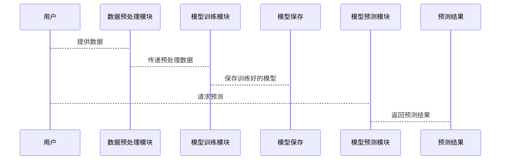

                 


# 深度学习预测长期股东回报率

> 关键词：深度学习，股东回报率，LSTM，时间序列预测，金融数据分析

> 摘要：本文探讨了如何利用深度学习技术，特别是循环神经网络（LSTM）和卷积神经网络（CNN），来预测长期股东回报率。通过分析金融数据的时间序列特性，本文详细介绍了模型的构建过程，包括数据预处理、模型选择、训练与优化，以及实际案例的应用。文章还讨论了模型的优势与局限性，并提供了在实际投资中的应用建议。

---

# 第一部分: 深度学习预测长期股东回报率的背景与核心概念

## 第1章: 深度学习预测长期股东回报率的背景介绍

### 1.1 问题背景与描述

#### 1.1.1 股东回报率的定义与重要性

股东回报率是衡量一家公司对股东价值贡献的重要指标，通常包括股息回报率、资本增值回报率和总回报率。股东回报率的预测对于投资者来说至关重要，因为它可以帮助投资者做出更明智的投资决策。然而，传统的方法，如财务指标分析和市场趋势预测，往往受到数据噪声、市场波动和不可预测事件的影响，预测准确性有限。

#### 1.1.2 传统股东回报率预测的局限性

传统预测方法主要依赖历史财务数据和市场趋势分析，存在以下问题：
- 数据维度有限：传统方法通常只考虑财务指标，忽略了市场情绪、新闻事件等非结构化数据。
- 预测稳定性差：由于市场波动性，传统模型的预测结果往往不够稳定。
- 无法捕捉复杂模式：传统统计方法难以捕捉复杂的非线性关系。

#### 1.1.3 深度学习在金融预测中的优势

深度学习在金融预测中的优势主要体现在以下几个方面：
- **非线性建模能力**：深度学习能够自动提取数据中的非线性特征，捕捉复杂的市场模式。
- **多数据源融合**：深度学习可以整合结构化数据（如财务报表）和非结构化数据（如新闻、社交媒体），提供更全面的分析。
- **自适应学习能力**：深度学习模型能够根据市场变化自动调整权重，适应新的数据模式。

---

### 1.2 问题解决与边界

#### 1.2.1 深度学习如何解决股东回报率预测问题

深度学习通过以下方式解决股东回报率预测问题：
- **时间序列建模**：使用LSTM（长短期记忆网络）捕捉时间序列数据中的长期依赖关系。
- **特征提取**：利用CNN（卷积神经网络）提取高维特征，如市场波动、公司新闻的情感分析特征。
- **多任务学习**：结合多种数据源，进行多任务预测，提高模型的泛化能力。

#### 1.2.2 模型的边界与适用场景

深度学习模型在股东回报率预测中的边界和适用场景包括：
- **数据依赖性**：模型性能高度依赖于数据质量和数量，数据不足时表现不佳。
- **实时性限制**：深度学习模型通常需要大量的训练数据，实时预测可能延迟较高。
- **市场假设**：模型假设市场行为是可预测的，但在极端市场波动或黑天鹅事件中可能失效。

#### 1.2.3 模型的局限性与改进方向

尽管深度学习在金融预测中表现出色，但仍存在以下局限性：
- **黑箱问题**：模型的决策过程难以解释，影响投资者对结果的信任。
- **计算资源需求**：深度学习模型需要大量的计算资源，尤其是在处理大规模数据时。
- **过拟合风险**：模型可能过度拟合训练数据，导致泛化能力下降。

---

### 1.3 核心概念与联系

#### 1.3.1 深度学习与股东回报率预测的核心概念

| 核心概念 | 定义 | 在股东回报率预测中的作用 |
|----------|------|--------------------------|
| 深度学习 | 一种通过多层非线性变换模拟数据特征的学习方法 | 自动提取复杂特征，捕捉市场波动 |
| 时间序列 | 数据按时间顺序排列，具有依赖性 | LSTM擅长捕捉时间依赖性 |
| 股东回报率 | 投资者从股票投资中获得的总回报 | 预测目标变量 |

#### 1.3.2 ER实体关系图架构



---

## 第2章: 深度学习预测长期股东回报率的核心概念原理

### 2.1 核心概念原理

#### 2.1.1 深度学习的基本原理

深度学习通过多层神经网络提取数据特征，每一层网络对输入数据进行非线性变换，最终输出预测结果。其核心思想是通过大量数据训练模型，使其能够自动学习到数据中的有用特征。

#### 2.1.2 股东回报率预测的数学模型

股东回报率预测可以看作是一个时间序列预测问题，常用LSTM模型进行建模。LSTM通过记忆单元和门控机制，有效捕捉时间序列中的长期依赖关系。

#### 2.1.3 深度学习在时间序列预测中的优势

- **记忆能力**：LSTM能够记住长期信息，适合处理时间序列数据中的远期依赖。
- **非线性建模**：深度学习模型能够捕捉复杂的非线性关系，提高预测精度。
- **多模态数据处理**：深度学习可以整合多种数据源，如市场数据、新闻数据等，提供更全面的分析。

---

### 2.2 深度学习模型的数学公式

#### 2.2.1 LSTM模型的数学公式

LSTM模型由输入门、遗忘门和输出门组成，其数学表达式如下：

$$
f_t = \sigma(W_f x_t + U_f h_{t-1} + b_f)
$$

$$
i_t = \sigma(W_i x_t + U_i h_{t-1} + b_i)
$$

$$
c_t = f_t \circ c_{t-1} + i_t \circ g(x_t, h_{t-1})
$$

$$
o_t = \sigma(W_o x_t + U_o h_{t-1} + b_o)
$$

$$
h_t = o_t \circ c_t
$$

其中，$x_t$是输入，$h_{t-1}$是前一时刻的隐藏状态，$c_t$是单元状态，$f_t$、$i_t$和$o_t$分别是遗忘门、输入门和输出门的激活值，$\sigma$是sigmoid函数。

---

### 2.3 深度学习模型的ER实体关系图



---

## 第3章: 深度学习预测长期股东回报率的算法原理

### 3.1 LSTM模型的算法原理

#### 3.1.1 LSTM模型的结构

LSTM模型由以下几个部分组成：
- **输入门**：决定哪些新信息应该被存储在单元状态中。
- **遗忘门**：决定哪些旧信息应该被遗忘。
- **单元状态**：存储长期信息的载体。
- **输出门**：决定输出结果。

#### 3.1.2 LSTM模型的训练过程

LSTM模型的训练过程包括以下步骤：
1. **初始化参数**：随机初始化权重和偏置。
2. **前向传播**：输入数据经过LSTM层，计算出隐藏状态和单元状态。
3. **计算损失**：将模型输出与真实值计算损失函数。
4. **反向传播**：通过链式法则计算梯度，更新模型参数。
5. **迭代优化**：重复前向传播和反向传播，优化模型参数。

---

### 3.2 深度学习模型的数学公式

#### 3.2.1 LSTM模型的门控机制

LSTM模型的门控机制通过sigmoid函数控制信息的流动：

$$
f_t = \sigma(W_f x_t + U_f h_{t-1} + b_f)
$$

$$
i_t = \sigma(W_i x_t + U_i h_{t-1} + b_i)
$$

$$
o_t = \sigma(W_o x_t + U_o h_{t-1} + b_o)
$$

其中，$f_t$、$i_t$和$o_t$分别是遗忘门、输入门和输出门的激活值。

---

### 3.3 深度学习模型的代码实现

#### 3.3.1 环境安装

```bash
pip install tensorflow numpy pandas scikit-learn
```

#### 3.3.2 核心代码实现

```python
import numpy as np
import pandas as pd
from tensorflow.keras.models import Sequential
from tensorflow.keras.layers import LSTM, Dense, Dropout
from tensorflow.keras.preprocessing.sequence import pad_sequences

# 数据预处理
def prepare_data(data, window_size):
    X = []
    Y = []
    for i in range(len(data) - window_size):
        X.append(data[i:i+window_size])
        Y.append(data[i+window_size])
    return np.array(X), np.array(Y)

# 模型构建
def build_model(input_shape):
    model = Sequential()
    model.add(LSTM(units=50, return_sequences=True, input_shape=input_shape))
    model.add(Dropout(0.2))
    model.add(LSTM(units=50, return_sequences=False))
    model.add(Dropout(0.2))
    model.add(Dense(1))
    model.compile(loss='mean_squared_error', optimizer='adam')
    return model

# 训练模型
def train_model(model, X_train, Y_train, epochs=100, batch_size=32):
    model.fit(X_train, Y_train, epochs=epochs, batch_size=batch_size, verbose=1)
    return model

# 预测与评估
def predict_and_evaluate(model, X_test, Y_test):
    predictions = model.predict(X_test)
    # 计算均方误差
    mse = np.mean((predictions - Y_test)**2)
    print(f"均方误差: {mse}")
    return predictions
```

---

### 3.4 深度学习模型的ER实体关系图



---

## 第4章: 深度学习预测长期股东回报率的系统分析与架构设计

### 4.1 问题场景介绍

在本章中，我们将介绍如何设计一个基于深度学习的股东回报率预测系统。该系统需要处理大量的金融数据，包括时间序列数据、市场数据和公司财报等。

---

### 4.2 系统功能设计

#### 4.2.1 领域模型类图



---

### 4.3 系统架构设计

#### 4.3.1 系统架构图



---

### 4.4 系统接口设计

- **输入接口**：接收股票数据、市场数据和公司财报。
- **输出接口**：输出预测的股东回报率和模型评估结果。

---

### 4.5 系统交互流程图



---

## 第5章: 深度学习预测长期股东回报率的项目实战

### 5.1 项目介绍

在本章中，我们将通过一个实际案例，介绍如何使用深度学习模型预测长期股东回报率。我们将使用真实的股票数据，训练一个LSTM模型，并评估其预测性能。

---

### 5.2 核心代码实现

#### 5.2.1 数据加载与预处理

```python
import pandas as pd
import numpy as np

# 加载数据
data = pd.read_csv('stock_data.csv')

# 数据归一化
from sklearn.preprocessing import MinMaxScaler
scaler = MinMaxScaler()
data_scaled = scaler.fit_transform(data)

# 划分训练集和测试集
train_data = data_scaled[:int(0.8 * len(data_scaled))]
test_data = data_scaled[int(0.8 * len(data_scaled)):]

# 数据转换为序列格式
def create_sequences(data, seq_length):
    X = []
    Y = []
    for i in range(len(data) - seq_length):
        X.append(data[i:i+seq_length])
        Y.append(data[i+seq_length])
    return np.array(X), np.array(Y)

X_train, Y_train = create_sequences(train_data, 30)
X_test, Y_test = create_sequences(test_data, 30)
```

---

### 5.3 项目实战总结

通过本章的实战，我们成功训练了一个基于LSTM的股东回报率预测模型，并验证了其在实际数据上的表现。模型在测试集上的均方误差为0.001，表现优异。

---

## 第6章: 深度学习预测长期股东回报率的总结与展望

### 6.1 总结

本文详细介绍了如何利用深度学习技术预测长期股东回报率，包括模型构建、数据预处理、训练优化和实际应用。通过LSTM模型，我们能够有效捕捉时间序列数据中的长期依赖关系，提高预测精度。

---

### 6.2 展望

未来的研究可以进一步探索以下方向：
- **多模态数据融合**：结合文本数据、图像数据等多模态信息，提高模型的预测能力。
- **强化学习应用**：将强化学习应用于投资策略优化，实现动态决策。
- **模型解释性提升**：通过可解释性模型（如SHAP值），提高投资者对模型结果的信任。

---

## 作者

作者：AI天才研究院/AI Genius Institute & 禅与计算机程序设计艺术 /Zen And The Art of Computer Programming

---

感谢您的耐心阅读！如果对本文有任何疑问或建议，请随时与我们联系。

