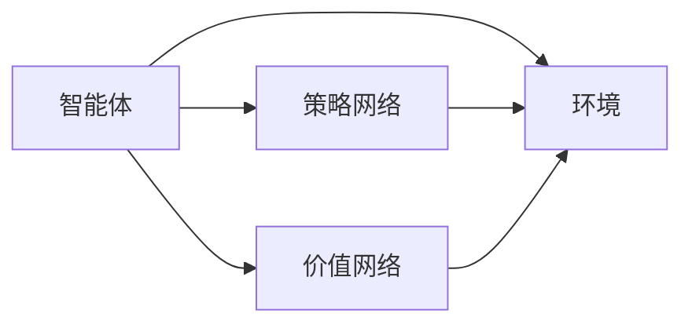
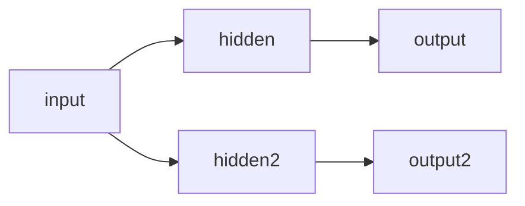
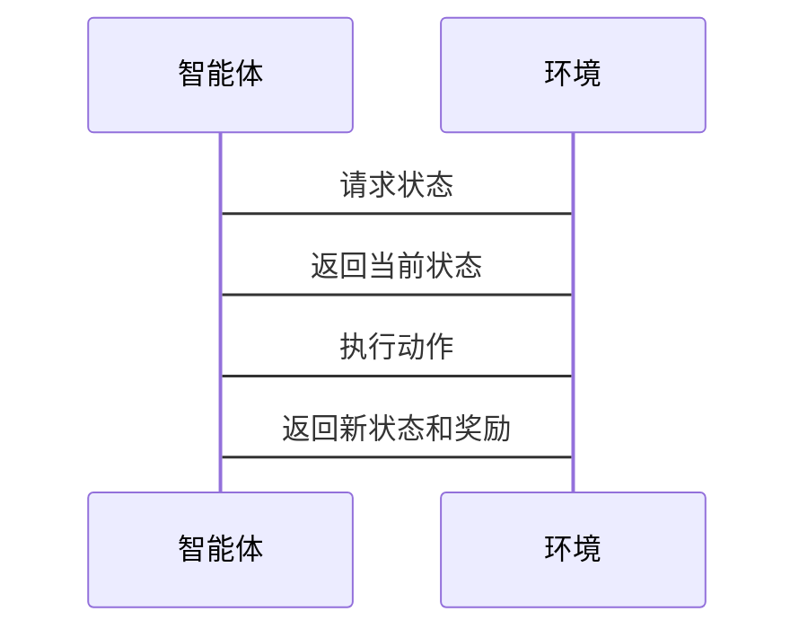
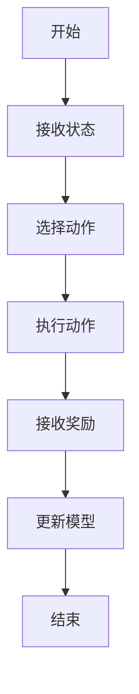

                 


# 深度强化学习在AI Agent行为生成中的应用

## 关键词：深度强化学习、AI Agent、行为生成、强化学习、DRL算法、人工智能

## 摘要：  
本文深入探讨了深度强化学习（DRL）在AI Agent行为生成中的应用，从基本概念、核心算法到系统架构、项目实战，结合理论与实践，全面解析DRL如何实现智能体的自主决策与行为生成。文章通过详细分析DRL的核心原理、算法实现和系统设计，展示了其在复杂环境中的广泛应用。

---

# 第一部分: 深度强化学习与AI Agent行为生成的背景

## 第1章: 深度强化学习概述

### 1.1 深度强化学习的基本概念

#### 1.1.1 强化学习的定义与特点
- **定义**：强化学习（Reinforcement Learning, RL）是一种机器学习范式，智能体通过与环境交互，学习如何采取一系列行动以最大化累计奖励。
- **特点**：
  - **目标导向**：基于奖励信号优化行为。
  - **试错学习**：通过与环境交互不断尝试和调整策略。
  - **延迟反馈**：奖励通常不是即时的，可能在多个动作后才给出。

#### 1.1.2 深度强化学习的起源与发展
- **起源**：RL的概念最早由John Holland在1960年代提出，后续研究推动了DRL的发展。
- **发展**：随着深度学习的兴起，DRL结合了神经网络的表达能力和RL的决策能力，成为AI领域的研究热点。

#### 1.1.3 深度强化学习的核心要素
- **状态（State）**：环境中的当前情况。
- **动作（Action）**：智能体采取的行动。
- **奖励（Reward）**：环境对动作的反馈。
- **策略（Policy）**：决定下一步动作的规则。
- **价值函数（Value Function）**：评估状态或动作价值的函数。

---

### 1.2 AI Agent的定义与分类

#### 1.2.1 AI Agent的基本概念
- **定义**：AI Agent是一种智能实体，能够感知环境并采取行动以实现目标。
- **特点**：
  - **自主性**：无需外部干预。
  - **反应性**：能够实时响应环境变化。
  - **目标导向**：行动基于目标驱动。

#### 1.2.2 基于行为的AI Agent类型
- **反应式AI Agent**：基于当前感知做出反应，不依赖历史信息。
- **基于模型的AI Agent**：利用环境模型规划行动。
- **混合型AI Agent**：结合反应式和基于模型的策略。

#### 1.2.3 AI Agent与传统AI的区别
| 特性       | 传统AI          | 基于行为的AI Agent |
|------------|----------------|---------------------|
| 输入       | 固定数据集      | 动态环境感知         |
| 输出       | 预测或分类结果  | 行动或操作           |
| 决策方式   | 基于规则或逻辑  | 基于学习和优化       |

---

### 1.3 深度强化学习在AI Agent行为生成中的应用背景

#### 1.3.1 行为生成的核心问题
- **问题**：如何让AI Agent在动态、不确定的环境中自主生成适应性行为。
- **挑战**：复杂环境中的决策需要实时反馈和优化。

#### 1.3.2 深度强化学习的优势
- **优势**：
  - **端到端学习**：直接从输入到输出，无需手动设计规则。
  - **自适应性**：能够根据环境变化调整策略。
  - **高效性**：通过神经网络加速计算。

#### 1.3.3 当前研究与应用现状
- **研究方向**：多智能体协作、复杂环境建模。
- **应用场景**：游戏AI、自动驾驶、机器人控制。

---

## 第2章: 深度强化学习的核心概念与联系

### 2.1 深度强化学习的核心原理

#### 2.1.1 策略与价值函数的关系
- **策略（Policy）**：定义智能体在每个状态下选择动作的概率分布。
- **价值函数（Value Function）**：评估某个状态下采取某个动作后的预期累积奖励。
- **关系**：策略指导行动，价值函数衡量行动的好坏。

#### 2.1.2 探索与利用的平衡
- **探索**：尝试未访问或较少访问的状态，以发现更好的策略。
- **利用**：根据当前最优策略采取行动，以最大化奖励。
- **平衡**：通过策略梯度方法动态调整探索与利用的权重。

#### 2.1.3 状态、动作与奖励的关系
- **状态**：输入信息。
- **动作**：输出决策。
- **奖励**：反馈机制，指导优化方向。

---

### 2.2 核心概念对比与联系

#### 2.2.1 监督学习、强化学习与深度强化学习的对比
| 特性          | 监督学习        | 强化学习          | 深度强化学习      |
|---------------|----------------|------------------|------------------|
| 数据输入       | 标签数据        | 状态和动作        | 状态和动作+神经网络 |
| 反馈机制       | 标签            | 奖励              | 奖励              |
| 决策方式       | 预测            | 学习策略          | 神经网络驱动策略   |

#### 2.2.2 策略网络与价值网络的对比
| 特性          | 策略网络        | 价值网络          |
|---------------|----------------|------------------|
| 输出           | 动作概率        | 状态价值或动作价值 |
| 目标           | 最大化动作概率  | 最大化预期奖励     |
| 应用场景        | 直接生成动作    | 评估状态优劣       |

#### 2.2.3 实例：DQN算法的原理与流程
DQN（Deep Q-Network）是DRL的经典算法，由Google DeepMind提出。其核心流程如下：

1. **环境感知**：智能体观察环境，获取当前状态。
2. **动作选择**：基于当前状态，策略网络输出动作概率分布。
3. **执行动作**：智能体根据概率选择动作，执行并观察新状态和奖励。
4. **经验存储**：将状态、动作、奖励和新状态存储在经验回放池。
5. **网络更新**：随机抽取经验，更新价值网络，以最小化预测值与实际奖励的差异。
6. **策略优化**：通过策略梯度优化策略网络，最大化预期奖励。

---

### 2.3 算法实现与代码示例

#### 2.3.1 环境安装与配置
- **工具**：安装Python、TensorFlow、Keras、OpenAI Gym。
- **代码示例**：
  ```python
  import gym
  env = gym.make('CartPole-v0')
  ```

#### 2.3.2 核心算法实现
- **DQN算法实现**：
  ```python
  class DQN:
      def __init__(self, state_size, action_size, epsilon=1.0, epsilon_min=0.01, epsilon_decay=0.995):
          self.state_size = state_size
          self.action_size = action_size
          self.epsilon = epsilon
          self.epsilon_min = epsilon_min
          self.epsilon_decay = epsilon_decay
          self.model = self.build_model()
          self.target_model = self.build_model()
          self.model.compile(optimizer='adam', loss='mse')
          self.target_model.set_weights(self.model.get_weights())

      def build_model(self):
          model = Sequential()
          model.add(Dense(24, activation='relu', input_dim=self.state_size))
          model.add(Dense(24, activation='relu'))
          model.add(Dense(self.action_size, activation='linear'))
          return model

      def act(self, state):
          if np.random.random() < self.epsilon:
              return random.randint(0, self.action_size - 1)
          q_values = self.model.predict(state)
          return np.argmax(q_values[0])

      def remember(self, state, action, reward, next_state):
          self.memory.append((state, action, reward, next_state))

      def replay(self, batch_size):
          if len(self.memory) < batch_size:
              return
          minibatch = random.sample(self.memory, batch_size)
          states = np.array([t[0] for t in minibatch])
          actions = np.array([t[1] for t in minibatch])
          rewards = np.array([t[2] for t in minibatch])
          next_states = np.array([t[3] for t in minibatch])
          # 计算目标Q值
          Q_next = self.target_model.predict(next_states)
          Q_target = rewards + np.max(Q_next, axis=1)
          # 更新模型
          Q = self.model.predict(states)
          Q[np.arange(batch_size), actions] = Q_target
          self.model.fit(states, Q, epochs=1, verbose=0)
  ```

#### 2.3.3 代码运行与结果分析
- **结果分析**：通过训练DQN算法，智能体能够在CartPole环境中保持平衡，逐步提高奖励值。

---

## 第3章: 深度强化学习的数学模型与算法原理

### 3.1 算法原理概述

#### 3.1.1 策略梯度方法
- **策略梯度**：通过优化策略网络的参数，直接最大化奖励的期望值。
- **数学公式**：
  $$
  \nabla\theta = E_{\tau \sim \pi_\theta}[\nabla \log \pi_\theta(a|s) \cdot Q_\theta(s,a)]
  $$

#### 3.1.2 Q-learning与Deep Q-Network
- **Q-learning**：通过值迭代更新Q表。
- **Deep Q-Network**：使用神经网络近似Q值函数，避免离散化和经验回放。

#### 3.1.3 Actor-Critic架构
- **Actor-Critic**：同时学习策略（Actor）和价值函数（Critic），通过两者协同优化。

---

### 3.2 数学模型与公式

#### 3.2.1 策略梯度的数学推导
- **目标函数**：
  $$
  J(\theta) = E_{\tau \sim \pi_\theta}[\log \pi_\theta(a|s) \cdot Q(s,a)]
  $$
- **梯度计算**：
  $$
  \nabla J(\theta) = E_{\tau \sim \pi_\theta}[\nabla \log \pi_\theta(a|s) \cdot Q(s,a)]
  $$

#### 3.2.2 Q-learning的数学公式
- **值迭代**：
  $$
  Q(s,a) = r + \gamma \max_{a'} Q(s',a')
  $$

#### 3.2.3 Actor-Critic的联合优化
- **策略优化**：
  $$
  \theta = \theta + \alpha \nabla_\theta \log \pi_\theta(a|s) \cdot Q_\phi(s,a)
  $$
- **价值函数优化**：
  $$
  \phi = \phi + \beta \nabla_\phi [Q_\phi(s,a) - (r + \gamma V_\phi(s'))]
  $$

---

### 3.3 算法实现与代码示例

#### 3.3.1 环境安装与配置
- **工具**：安装Python、TensorFlow、Keras、OpenAI Gym。
- **代码示例**：
  ```python
  import gym
  import numpy as np
  from tensorflow.keras.models import Sequential
  from tensorflow.keras.layers import Dense
  ```

#### 3.3.2 核心算法实现
- **Actor-Critic算法实现**：
  ```python
  class ActorCritic:
      def __init__(self, state_size, action_size):
          self.actor = self.build_actor()
          self.critic = self.build_critic()
          self.actor.compile(optimizer='adam', loss='mse')
          self.critic.compile(optimizer='adam', loss='mse')

      def build_actor(self):
          model = Sequential()
          model.add(Dense(24, activation='relu', input_dim=state_size))
          model.add(Dense(action_size, activation='linear'))
          return model

      def build_critic(self):
          model = Sequential()
          model.add(Dense(24, activation='relu', input_dim=state_size))
          model.add(Dense(1, activation='linear'))
          return model

      def act(self, state):
          return self.actor.predict(state)[0]

      def train(self, state, action, reward, next_state):
          action_onehot = np.zeros(action_size)
          action_onehot[action] = 1
          # 训练Actor
          self.actor.fit(state, action_onehot, epochs=1, verbose=0)
          # 训练Critic
          target = reward + 0.99 * self.critic.predict(next_state)[0]
          self.critic.fit(state, np.array([target]), epochs=1, verbose=0)
  ```

#### 3.3.3 代码运行与结果分析
- **结果分析**：通过训练Actor-Critic算法，智能体能够在复杂环境中实现更高效的决策。

---

## 第4章: 深度强化学习的系统架构与设计

### 4.1 系统功能设计

#### 4.1.1 状态空间的定义与建模
- **状态空间**：智能体感知环境的所有可能状态。
- **建模方法**：使用神经网络提取特征，将高维状态压缩为低维表示。

#### 4.1.2 动作空间的设计与实现
- **动作空间**：智能体可执行的所有动作。
- **实现方法**：基于策略网络输出概率分布，选择最优动作。

#### 4.1.3 奖励函数的设计原则
- **奖励设计**：明确目标，设计合理的奖励机制，确保智能体行为符合预期。
- **实例**：在机器人导航中，奖励可以基于距离目标的距离和路径障碍物的数量。

---

### 4.2 系统架构设计

#### 4.2.1 系统整体架构图


#### 4.2.2 网络结构设计


#### 4.2.3 接口设计与数据流分析
- **接口设计**：智能体通过接口与环境交互，接收状态、执行动作并获取奖励。
- **数据流**：状态→策略网络→动作→环境→新状态和奖励。

---

### 4.3 系统交互与流程

#### 4.3.1 系统交互序列图


#### 4.3.2 算法流程图


---

## 第5章: 深度强化学习的项目实战

### 5.1 项目环境与工具安装

#### 5.1.1 环境安装
- **工具**：Python、TensorFlow、Keras、OpenAI Gym。
- **安装命令**：
  ```bash
  pip install gym
  pip install tensorflow
  ```

#### 5.1.2 环境配置
- **配置示例**：
  ```python
  import gym
  env = gym.make('CartPole-v0')
  ```

---

### 5.2 系统功能设计

#### 5.2.1 状态空间建模
- **建模方法**：使用神经网络提取特征。
  ```python
  state = env.observation_space.sample()
  ```

#### 5.2.2 动作空间实现
- **动作选择**：
  ```python
  action = agent.act(state)
  ```

#### 5.2.3 奖励函数设计
- **奖励机制**：
  ```python
  reward = env.step(action)[1]
  ```

---

### 5.3 系统架构实现

#### 5.3.1 策略网络实现
- **代码示例**：
  ```python
  class PolicyNetwork:
      def __init__(self, state_size, action_size):
          self.model = self.build_model()

      def build_model(self):
          model = Sequential()
          model.add(Dense(24, activation='relu', input_dim=state_size))
          model.add(Dense(action_size, activation='linear'))
          return model
  ```

#### 5.3.2 价值网络实现
- **代码示例**：
  ```python
  class ValueNetwork:
      def __init__(self, state_size):
          self.model = self.build_model()

      def build_model(self):
          model = Sequential()
          model.add(Dense(24, activation='relu', input_dim=state_size))
          model.add(Dense(1, activation='linear'))
          return model
  ```

---

### 5.4 项目实战与案例分析

#### 5.4.1 项目运行
- **运行代码**：
  ```python
  env = gym.make('CartPole-v0')
  agent = DQN(env.observation_space.shape[0], env.action_space.n)
  for episode in range(1000):
      state = env.reset()
      done = False
      while not done:
          action = agent.act(state)
          next_state, reward, done, info = env.step(action)
          agent.remember(state, action, reward, next_state)
          agent.replay(32)
          state = next_state
  ```

#### 5.4.2 案例分析
- **结果分析**：通过训练，智能体能够逐步掌握保持平衡的技巧，奖励值逐渐提高。

---

## 第6章: 深度强化学习的最佳实践与小结

### 6.1 最佳实践 tips

#### 6.1.1 环境选择与建模
- **建议**：选择合适的环境和状态建模方法，确保智能体能够有效感知环境。
- **注意事项**：避免状态空间过于复杂，否则会影响学习效率。

#### 6.1.2 策略与价值函数的平衡
- **建议**：在实际应用中，合理调整策略和价值函数的权重，确保两者协同优化。
- **注意事项**：避免过度依赖某一种方法，保持策略的多样性和灵活性。

#### 6.1.3 探索与利用的平衡
- **建议**：根据环境的动态变化，动态调整探索与利用的比例。
- **注意事项**：在动态环境中，探索能够帮助智能体发现更好的策略。

#### 6.1.4 网络结构与参数设置
- **建议**：根据具体任务设计合理的网络结构和参数，确保模型的表达能力。
- **注意事项**：避免过深或过宽的网络，防止过拟合和计算量过大。

#### 6.1.5 训练与优化
- **建议**：采用经验回放和策略梯度方法，加速训练过程并提高模型性能。
- **注意事项**：合理设置超参数，如学习率、批量大小等，确保模型收敛。

---

### 6.2 小结

通过本文的详细分析，我们可以看到深度强化学习在AI Agent行为生成中的巨大潜力和广泛的应用场景。DRL结合了深度学习的表达能力和强化学习的决策能力，为智能体的自主决策提供了强大的技术支持。然而，实际应用中仍有许多挑战，如复杂环境下的决策优化、多智能体协作等问题，需要进一步研究和探索。

---

## 作者：AI天才研究院/AI Genius Institute & 禅与计算机程序设计艺术 /Zen And The Art of Computer Programming

