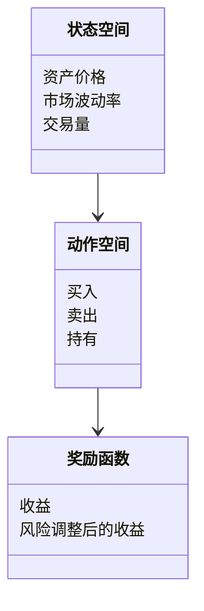
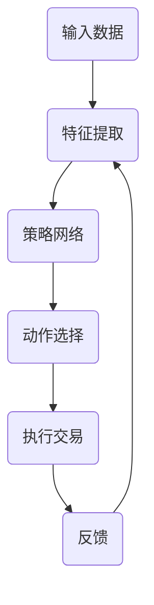
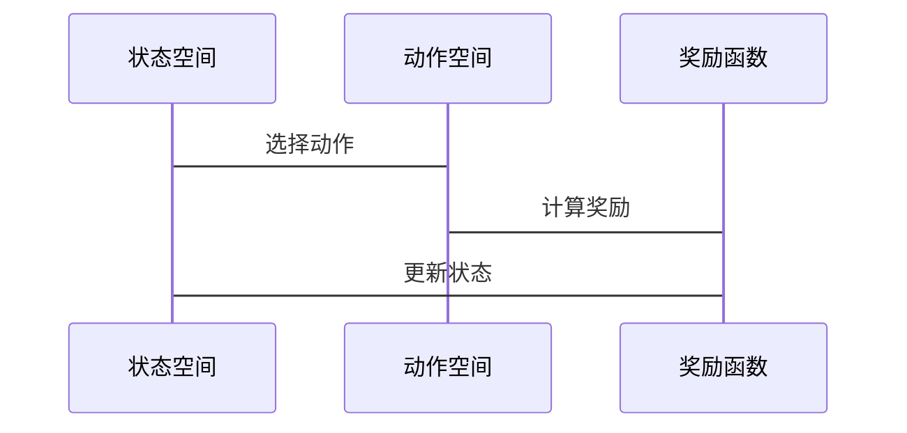

                 


# 深度强化学习在动态对冲策略中的应用

> 关键词：深度强化学习，动态对冲策略，金融市场，算法交易，风险管理

> 摘要：本文探讨了深度强化学习在动态对冲策略中的应用，详细分析了深度强化学习的核心概念、算法原理以及在金融市场的实际应用。通过案例分析和系统设计，展示了如何利用深度强化学习优化对冲策略，降低风险，提高收益。

---

## 第1章: 深度强化学习概述

### 1.1 深度强化学习的基本概念

#### 1.1.1 强化学习的定义与特点
强化学习是一种机器学习范式，通过智能体与环境的交互，学习最优策略以最大化累积奖励。其特点包括：
- **延迟反馈**：奖励信号通常延迟，智能体需基于长期目标做出决策。
- **策略优化**：通过试错不断优化动作选择，以获得最大累积奖励。
- **环境动态性**：环境可能动态变化，智能体需具备适应性。

#### 1.1.2 深度学习与强化学习的结合
深度学习擅长处理高维复杂数据，强化学习则擅长策略优化。两者的结合使得智能体能够处理复杂金融市场环境，学习更优的交易策略。

#### 1.1.3 深度强化学习的核心要素
- **状态空间**：环境中的市场情况，如价格、波动率等。
- **动作空间**：智能体可执行的交易动作，如买入、卖出、持有。
- **奖励函数**：衡量策略优劣的指标，如收益、风险调整后的收益。

### 1.2 动态对冲策略的定义与特点

#### 1.2.1 对冲策略的基本概念
对冲策略旨在通过同时做多和做空相关资产，降低市场风险。动态对冲策略根据市场变化实时调整头寸。

#### 1.2.2 动态对冲的定义与应用场景
动态对冲策略根据市场波动实时调整，适用于高频交易和风险管理。其应用场景包括：
- **高频交易**：快速捕捉市场机会。
- **风险对冲**：降低投资组合的市场风险。
- **动态资产配置**：根据市场变化调整资产权重。

#### 1.2.3 动态对冲策略的核心要素
- **实时数据处理**：快速分析市场数据，做出决策。
- **动态调整**：根据市场变化调整头寸。
- **风险管理**：控制风险，避免重大损失。

---

## 第2章: 深度强化学习在金融中的应用背景

### 2.1 金融市场的复杂性与不确定性

#### 2.1.1 金融市场的动态特性
金融市场高度动态，价格波动频繁，受多种因素影响。传统模型难以捕捉这些复杂关系。

#### 2.1.2 传统对冲策略的局限性
传统对冲策略依赖历史数据和统计套利，难以应对市场结构的变化，特别是在极端市场条件下表现不佳。

#### 2.1.3 深度强化学习的优势
深度强化学习能够处理高维复杂数据，适应动态市场环境，发现传统方法难以察觉的模式。

### 2.2 动态对冲策略的挑战与机遇

#### 2.2.1 动态对冲策略的挑战
- **数据噪声**：金融市场数据往往含有噪声，影响模型的准确性。
- **计算复杂性**：高频交易需要快速决策，计算资源有限。
- **模型过拟合**：训练数据不足可能导致模型过拟合，影响泛化能力。

#### 2.2.2 深度强化学习的应用潜力
- **高频交易**：利用深度强化学习快速决策，捕捉短期市场机会。
- **智能对冲**：动态调整头寸，降低投资组合风险。
- **个性化策略**：根据不同投资者的风险偏好定制策略。

#### 2.2.3 金融市场的未来趋势
随着人工智能技术的发展，金融市场将更加依赖智能算法，深度强化学习将在对冲策略中扮演重要角色。

---

## 第3章: 深度强化学习的核心概念

### 3.1 强化学习的基本原理

#### 3.1.1 状态、动作、奖励的定义
- **状态**：环境中的当前情况，如资产价格、市场情绪。
- **动作**：智能体可执行的操作，如买入、卖出。
- **奖励**：对策略优劣的反馈，如收益、风险调整后的收益。

#### 3.1.2 策略与价值函数的定义
- **策略**：智能体在状态下的动作选择规则。
- **价值函数**：衡量状态-动作对的长期收益。

#### 3.1.3 探索与利用的平衡
智能体在探索新策略和利用已知好策略之间寻求平衡，以避免陷入局部最优。

### 3.2 深度强化学习的核心算法

#### 3.2.1 Q-learning算法
Q-learning通过学习Q值函数，找到最优策略。适用于离散动作空间。

#### 3.2.2 Deep Q-Networks（DQN）算法
DQN结合深度神经网络和Q-learning，适用于高维复杂环境。

#### 3.2.3 Actor-Critic算法
Actor-Critic同时优化策略和价值函数，适用于连续动作空间。

---

## 第4章: 动态对冲策略的数学模型与公式

### 4.1 动态对冲策略的数学模型

#### 4.1.1 资产价格的动态模型
- 使用马尔可夫过程描述资产价格变化。
- 状态转移概率矩阵表示不同状态间的转移。

#### 4.1.2 对冲组合的构建与调整
- 根据当前市场状态，动态调整对冲组合。
- 使用动态规划方法优化组合权重。

#### 4.1.3 风险收益的优化目标
- 最大化预期收益，同时最小化风险。
- 使用夏普比率衡量风险调整后的收益。

### 4.2 深度强化学习的数学公式

#### 4.2.1 Q-learning的数学公式
$$ Q(s, a) = Q(s, a) + \alpha (r + \gamma \max Q(s', a') - Q(s, a)) $$
其中：
- \( Q(s, a) \)：状态-动作对的Q值。
- \( \alpha \)：学习率。
- \( \gamma \)：折扣因子。
- \( r \)：奖励。

#### 4.2.2 DQN的数学公式
$$ Q_{\theta}(s, a) = \text{神经网络}(s, a; \theta) $$
其中：
- \( Q_{\theta} \)：深度神经网络。
- \( \theta \)：神经网络参数。

#### 4.2.3 Actor-Critic的数学公式
$$ \text{Actor}: \mu(s; \theta) $$
$$ \text{Critic}: Q(s, a; \phi) $$
其中：
- \( \mu(s; \theta) \)：策略网络。
- \( Q(s, a; \phi) \)：价值网络。

---

## 第5章: 深度强化学习算法的实现与优化

### 5.1 深度强化学习算法的实现

#### 5.1.1 神经网络的构建与训练
- 使用深度神经网络近似Q值函数或策略。
- 采用经验回放和目标网络减少偏差。

#### 5.1.2 动作空间与状态空间的处理
- 离散动作空间：使用Q-learning或DQN。
- 连续动作空间：使用Actor-Critic或策略梯度方法。

#### 5.1.3 奖励机制的设计与优化
- 设计合理的奖励函数，引导智能体学习正确的策略。
- 使用奖励 shaping 提高学习效率。

### 5.2 深度强化学习的优化方法

#### 5.2.1 策略梯度方法的优化
- 使用REINFORCE算法，优化策略网络。
- 采用基线估计减少方差。

#### 5.2.2 经验回放与目标网络
- 经验回放：随机采样经验，减少样本偏差。
- 目标网络：稳定训练，减少Q值估计的波动。

#### 5.2.3 多智能体协作与竞争
- 使用多智能体协作，提高策略的多样性和鲁棒性。

---

## 第6章: 动态对冲策略的系统架构设计

### 6.1 问题场景介绍

#### 6.1.1 市场环境
- 多资产价格数据，包括股票、期货、期权等。
- 市场波动率、交易量等市场指标。

#### 6.1.2 系统目标
- 实时监控市场数据，动态调整对冲组合。
- 最大化收益，同时控制风险。

### 6.2 系统功能设计

#### 6.2.1 领域模型


#### 6.2.2 系统架构


#### 6.2.3 系统交互


---

## 第7章: 项目实战

### 7.1 环境安装

#### 7.1.1 安装依赖
```bash
pip install numpy
pip install gym
pip install tensorflow
```

#### 7.1.2 环境配置
```python
import gym
env = gym.make('Stock Trading-v0')
```

### 7.2 核心代码实现

#### 7.2.1 DQN实现
```python
class DQNAgent:
    def __init__(self, state_size, action_size):
        self.state_size = state_size
        self.action_size = action_size
        self.model = self._build_model()
        
    def _build_model(self):
        model = Sequential()
        model.add(Dense(64, activation='relu', input_dim=self.state_size))
        model.add(Dense(64, activation='relu'))
        model.add(Dense(self.action_size, activation='linear'))
        model.compile(optimizer='adam', loss='mse')
        return model
```

#### 7.2.2 训练过程
```python
agent = DQNAgent(state_size, action_size)
for episode in range(episodes):
    state = env.reset()
    while not done:
        action = agent.act(state)
        next_state, reward, done, _ = env.step(action)
        agent.remember(state, action, reward, next_state, done)
        agent.replay(batch_size)
```

### 7.3 代码解读与分析

#### 7.3.1 状态空间与动作空间
- 状态空间：资产价格、市场波动率等。
- 动作空间：买入、卖出、持有。

#### 7.3.2 奖励函数设计
- 基于收益和风险的综合评估。
- 使用夏普比率衡量风险调整后的收益。

### 7.4 实际案例分析

#### 7.4.1 数据准备
使用历史资产价格数据，训练深度强化学习模型。

#### 7.4.2 模型训练
在模拟环境中训练模型，优化对冲策略。

#### 7.4.3 结果分析
- 对比传统对冲策略，评估深度强化学习策略的优劣。
- 分析模型在不同市场条件下的表现。

---

## 第8章: 最佳实践与小结

### 8.1 小结
深度强化学习在动态对冲策略中展现了巨大潜力，能够处理复杂金融市场环境，优化交易策略。

### 8.2 注意事项
- 数据质量：确保数据准确性和完整性。
- 模型过拟合：避免过拟合，保持泛化能力。
- 风险管理：实时监控风险，及时调整策略。

### 8.3 拓展阅读
- 继续研究多智能体协作在对冲策略中的应用。
- 探索结合博弈论的强化学习方法。

---

作者：AI天才研究院/AI Genius Institute & 禅与计算机程序设计艺术 /Zen And The Art of Computer Programming

