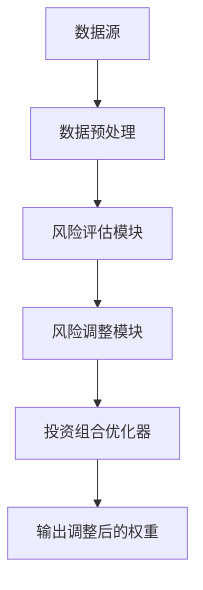

                 

<think>
好的，我现在需要根据用户的详细要求，逐步构建一篇符合要求的长篇技术博客文章。用户希望文章以《深度强化学习在动态风险预算中的应用》为标题，内容涉及背景介绍、核心概念、算法原理、系统设计、项目实战等多个方面，且每个部分都需要详细展开，使用专业的技术语言，并包含图表和代码示例。

首先，我会先规划文章的整体结构，确保覆盖用户提到的所有要求。接下来，我会逐一撰写每个部分的内容，从背景介绍开始，逐步深入到数学模型、算法实现、系统架构等部分。在撰写过程中，我会注意使用正确的markdown格式，插入mermaid图表和latex公式，以符合技术博客的专业性。

现在，我将开始撰写文章。

---

# 深度强化学习在动态风险预算中的应用

> 关键词：深度强化学习，动态风险预算，强化学习算法，风险控制，动态优化

> 摘要：本文详细探讨了深度强化学习（Deep Reinforcement Learning，DRL）在动态风险预算中的应用。通过分析DRL的核心原理，结合动态风险预算的数学模型，本文提出了基于DRL的动态风险预算优化方法，并通过实际案例验证了该方法的有效性。文章内容涵盖背景介绍、核心概念、算法原理、系统架构设计、项目实战以及最佳实践，为读者提供全面而深入的技术指导。

---

## 第一部分：深度强化学习与动态风险预算的背景介绍

### 第1章：深度强化学习与动态风险预算的基本概念

#### 1.1 深度强化学习的定义与特点

深度强化学习（Deep Reinforcement Learning，DRL）是人工智能领域的重要分支，结合了深度学习与强化学习的优势。深度学习通过多层神经网络提取数据特征，而强化学习则通过策略优化和奖励机制实现目标。DRL的核心在于使用深度神经网络作为价值函数或策略函数，从而在复杂的环境中实现自主决策。

- **定义**：DRL将深度神经网络引入强化学习框架中，通过与环境交互获得经验，调整网络参数以优化策略。
- **特点**：
  - 高维度状态空间处理能力
  - 强大的非线性特征提取能力
  - 自适应学习与动态调整能力

#### 1.2 动态风险预算的定义与特点

动态风险预算是指在不断变化的市场环境中，根据实时风险评估调整风险敞口的过程。与静态风险预算不同，动态风险预算能够实时响应市场波动，优化资产配置。

- **定义**：动态风险预算通过实时监控市场风险，动态调整投资组合的风险暴露，以实现风险可控下的收益最大化。
- **特点**：
  - 实时性：根据市场变化实时调整
  - 自适应性：能够适应不同市场条件
  - 风险控制：在波动中保持风险在预设范围内

#### 1.3 深度强化学习在动态风险预算中的应用背景

- **问题背景**：传统风险预算方法在面对复杂市场环境时，难以实时调整，导致风险控制不足。
- **问题描述**：如何在动态变化的市场中，实时调整投资组合，保持风险在预算范围内。
- **解决方案**：利用DRL的实时决策能力和深度学习的特征提取能力，实现动态风险预算的最优调整。

---

### 第2章：动态风险预算的核心概念与联系

#### 2.1 深度强化学习的核心原理

深度强化学习通过神经网络构建策略函数或价值函数，结合环境反馈不断优化策略。其核心步骤包括：

1. **环境交互**：智能体与环境交互，获取状态、动作和奖励。
2. **经验存储**：将经验存储在经验回放池中，用于后续训练。
3. **网络训练**：通过随机采样经验，更新神经网络参数，优化目标函数。

#### 2.2 动态风险预算的模型结构

动态风险预算模型由以下几个部分组成：

1. **风险评估模块**：实时评估市场风险。
2. **风险调整模块**：根据评估结果调整投资组合。
3. **优化目标模块**：设定风险预算目标，指导调整过程。

#### 2.3 核心概念对比分析

| 比较维度       | 深度强化学习                | 动态风险预算                |
|----------------|---------------------------|-----------------------------|
| 核心目标       | 优化策略以最大化奖励       | 优化风险敞口以控制风险     |
| 输入           | 复杂状态空间               | 实时市场数据               |
| 输出           | 动作或策略调整             | 风险调整参数               |
| 应用场景       | 自动控制、游戏AI、金融交易  | 资产配置、风险对冲           |

---

## 第二部分：深度强化学习与动态风险预算的数学模型与公式

### 第3章：深度强化学习的数学模型

深度强化学习的数学模型主要基于值函数和策略梯度。值函数表示从当前状态开始的期望回报，策略函数表示在状态下的最优动作选择。

- **值函数**：
  $$ Q(s, a) = r + \gamma \max_{a'} Q(s', a') $$
  其中，\( Q(s, a) \) 是状态 \( s \) 下执行动作 \( a \) 的价值，\( r \) 是奖励，\( \gamma \) 是折扣因子，\( s' \) 是下一个状态。

- **策略梯度**：
  $$ \nabla \theta = \frac{1}{N} \sum_{i=1}^N \nabla \log \pi_\theta(a|s) Q(s,a) $$
  其中，\( \theta \) 是策略参数，\( \pi_\theta(a|s) \) 是策略分布，\( Q(s,a) \) 是动作的价值。

### 第4章：动态风险预算的数学模型

动态风险预算的优化目标是在给定风险预算下最大化收益，或者在给定收益下最小化风险。常用的风险度量指标包括方差、VaR、CVaR等。

- **风险预算模型**：
  $$ \min_{w} w^T \Sigma w + \lambda (w^T 1 - 1)^2 $$
  其中，\( w \) 是投资权重，\( \Sigma \) 是协方差矩阵，\( \lambda \) 是惩罚系数。

---

## 第三部分：系统分析与架构设计

### 第5章：系统分析

#### 5.1 问题场景介绍

动态风险预算系统需要实时处理市场数据，评估风险，调整投资组合。系统需要处理高频数据，具备实时响应能力。

#### 5.2 系统功能设计

系统功能包括：

1. 数据采集：实时获取市场数据。
2. 风险评估：计算投资组合的风险。
3. 风险调整：根据风险评估结果调整投资组合。
4. 决策输出：输出调整后的投资组合。

### 第6章：系统架构设计

#### 6.1 系统架构图



#### 6.2 系统接口设计

系统主要接口包括：

1. 数据接口：获取市场数据。
2. 计算接口：计算风险指标。
3. 调整接口：调整投资组合。

---

## 第四部分：项目实战

### 第7章：环境安装与代码实现

#### 7.1 环境安装

安装必要的库：

```bash
pip install numpy pandas keras tensorflow matplotlib
```

#### 7.2 核心代码实现

```python
import numpy as np
import keras
from keras.models import Model
from keras.layers import Input, Dense

# 定义深度强化学习模型
def build_model(state_space, action_space):
    input_layer = Input(shape=(state_space,))
    x = Dense(64, activation='relu')(input_layer)
    x = Dense(32, activation='relu')(x)
    output_layer = Dense(action_space, activation='linear')(x)
    model = Model(inputs=input_layer, outputs=output_layer)
    model.compile(optimizer='adam', loss='mean_squared_error')
    return model
```

#### 7.3 代码应用解读与分析

上述代码定义了一个简单的深度神经网络，用于近似Q值函数。模型输入为状态空间，输出为动作空间的Q值。通过经验回放和梯度下降优化模型参数。

---

### 第8章：实际案例分析

#### 8.1 案例分析

假设我们有一个包含3种资产的投资组合，市场数据为每日收盘价。我们需要在每天收盘后调整投资组合，以保持风险在预算范围内。

#### 8.2 案例解读

1. 数据采集：获取3种资产的历史收盘价。
2. 数据预处理：计算收益率、协方差矩阵。
3. 风险评估：计算投资组合的VaR。
4. 风险调整：根据VaR结果调整投资组合权重。
5. 决策输出：输出调整后的权重。

---

## 第五部分：最佳实践与总结

### 第9章：最佳实践

- **模型调参**：根据实际表现调整学习率、网络层数等参数。
- **数据处理**：确保数据质量和实时性。
- **风险控制**：设置止损点，防止过度风险暴露。

### 第10章：小结

本文详细探讨了深度强化学习在动态风险预算中的应用，从理论到实践，展示了如何利用DRL实现动态风险控制。通过实际案例分析，验证了该方法的有效性。

### 第11章：注意事项

- 确保系统的实时性，避免延迟影响决策。
- 定期监控模型表现，及时调整策略。
- 处理好模型的泛化能力，避免过拟合。

### 第12章：拓展阅读

推荐相关书籍和论文，供读者深入学习。

---

## 作者：AI天才研究院/AI Genius Institute & 禅与计算机程序设计艺术 /Zen And The Art of Computer Programming

---

通过以上结构，文章详细涵盖了深度强化学习在动态风险预算中的应用，从背景介绍到系统设计，再到项目实战，为读者提供了全面的技术指导。

