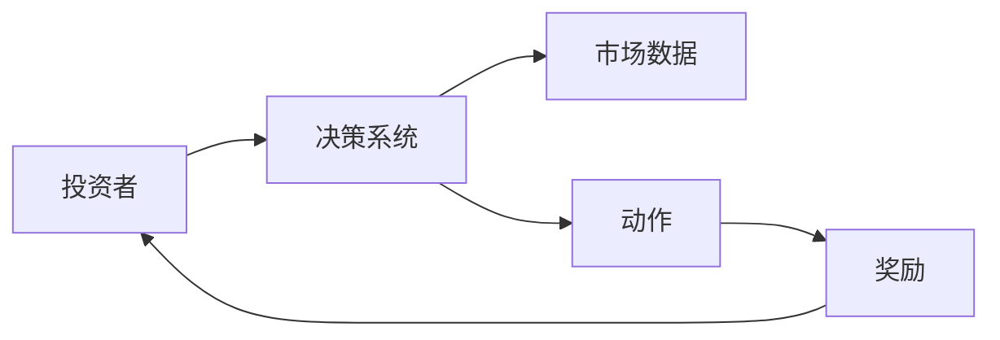
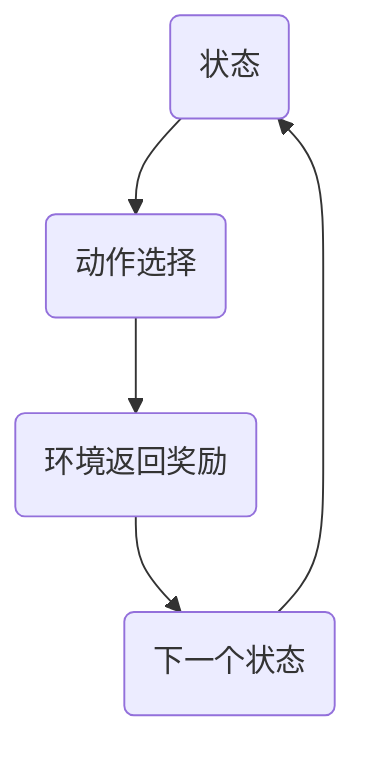
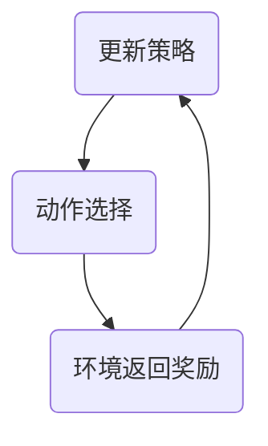

                 


# 深度强化学习在多周期投资决策中的应用

> 关键词：深度强化学习、投资决策、多周期、Q-learning、策略梯度

> 摘要：深度强化学习（Deep Reinforcement Learning，DRL）作为一种新兴的人工智能技术，在金融投资领域展现出巨大的潜力。本文详细探讨了DRL在多周期投资决策中的应用，从基础概念、算法原理、系统架构到实际应用，层层剖析，结合数学公式和代码实现，为读者提供全面的指导。文章最后总结了当前研究的成果与未来的发展方向。

---

## 目录

1. 深度强化学习与投资决策的背景与基础
2. 深度强化学习的核心概念与联系
3. 深度强化学习算法原理
4. 投资决策系统架构与实现
5. 项目实战：基于DRL的投资决策系统
6. 深度强化学习在多周期投资中的高级应用
7. 总结与展望

---

## 第1章: 深度强化学习与投资决策的背景与基础

### 1.1 深度强化学习的基本概念

#### 1.1.1 什么是深度强化学习
深度强化学习（Deep Reinforcement Learning，DRL）是人工智能领域的一个重要分支，结合了深度学习（Deep Learning）和强化学习（Reinforcement Learning，RL）的优势。DRL通过深度神经网络（Deep Neural Networks，DNN）来逼近最优策略，使智能体在与环境的交互中学习最优行为策略。

#### 1.1.2 深度强化学习的核心要素
- **状态（State）**：智能体所处环境的描述，例如当前市场数据。
- **动作（Action）**：智能体根据当前状态做出的决策，例如买入或卖出股票。
- **奖励（Reward）**：智能体在做出动作后，环境返回的反馈，用于衡量动作的好坏。
- **策略（Policy）**：智能体选择动作的概率分布，目标是最大化累计奖励。

#### 1.1.3 深度强化学习与传统机器学习的对比
| 特性 | 强化学习 | 传统机器学习 |
|------|----------|---------------|
| 数据 | 环境反馈 | 标签数据       |
| 目标 | 最大化奖励 | 分类/回归      |
| 交互 | 有        | 无            |

### 1.2 投资决策中的问题与挑战

#### 1.2.1 投资决策的基本问题
投资决策的核心问题是如何在不确定的市场环境中，通过合理的资产配置和交易策略，实现收益最大化或风险最小化。

#### 1.2.2 多周期投资决策的特点
- **时间依赖性**：投资决策需要考虑不同时间点的市场变化。
- **非线性关系**：资产价格与市场环境之间的关系复杂，难以用线性模型描述。
- **高维状态空间**：多周期投资涉及多个资产、多种市场指标，状态空间维度高。

#### 1.2.3 传统投资决策方法的局限性
- **假设的局限性**：传统方法依赖于均值-方差模型等假设，可能与实际市场不符。
- **计算复杂性**：面对高维状态空间时，传统方法的计算效率低下。
- **动态适应性不足**：传统方法难以快速适应市场的动态变化。

### 1.3 深度强化学习在投资决策中的应用前景

#### 1.3.1 深度强化学习的优势
- **非线性建模能力**：深度神经网络能够捕捉复杂市场中的非线性关系。
- **自适应学习能力**：智能体能够通过与环境的交互不断优化策略。
- **多目标优化**：DRL可以同时考虑收益、风险等多个目标。

#### 1.3.2 深度强化学习在投资中的潜在应用场景
- **股票交易**：基于市场数据，智能体可以学习买卖时机。
- **资产配置**：通过DRL优化不同资产的配置比例。
- **风险管理**：智能体可以识别并规避高风险的投资行为。

#### 1.3.3 当前研究与实践中的挑战
- **市场环境的复杂性**：金融市场具有高度不确定性。
- **策略的稳定性**：智能体可能在某些市场条件下表现不稳定。
- **监管与伦理问题**：DRL在金融市场的应用需要符合相关法律法规。

---

## 第2章: 深度强化学习的核心概念与联系

### 2.1 核心概念原理

#### 2.1.1 Q-learning与策略梯度方法
- **Q-learning**：通过学习状态-动作值函数（Q值）来优化策略。
- **策略梯度方法**：通过直接优化策略参数来最大化累计奖励。

#### 2.1.2 深度神经网络在强化学习中的作用
深度神经网络作为函数近似器，能够高效地逼近复杂的策略或值函数。

#### 2.1.3 状态、动作与奖励的定义与关系
- **状态**：市场数据、资产价格等。
- **动作**：买入、卖出、持有等。
- **奖励**：收益、风险指标等。

### 2.2 核心概念属性特征对比表格
| 概念 | 属性 | 特征 |
|------|------|------|
| 状态 | 表示方式 | 矢量、图像等 |
| 动作 | 类型 | 离散/连续 |
| 奖励 | 计算方式 | 即时奖励/累积奖励 |

### 2.3 ER实体关系图架构


---

## 第3章: 深度强化学习算法原理

### 3.1 DQN算法原理

#### 3.1.1 DQN算法流程


#### 3.1.2 DQN算法数学模型
$$ Q(s, a) = Q(s, a) + \alpha (r + \gamma \max Q(s', a') - Q(s, a)) $$

### 3.2 策略梯度方法

#### 3.2.1 策略梯度算法流程


#### 3.2.2 策略梯度数学模型
$$ \nabla \theta = \frac{1}{N}\sum_{i=1}^N \nabla \log \pi_\theta(a|s) Q(\cdot) $$

---

## 第4章: 投资决策系统架构与实现

### 4.1 系统功能设计
- **市场数据采集**：获取历史和实时市场数据。
- **状态表示**：将市场数据转换为智能体可理解的状态。
- **动作选择**：基于当前状态选择最优动作。
- **奖励计算**：根据投资结果计算奖励信号。

### 4.2 系统架构设计


---

## 第5章: 项目实战：基于DRL的投资决策系统

### 5.1 环境安装
- **安装Python环境**：使用Anaconda或虚拟环境。
- **安装依赖库**：TensorFlow、Keras、OpenAI Gym等。

### 5.2 系统核心实现源代码
```python
import numpy as np
import gym
from tensorflow.keras.models import Sequential
from tensorflow.keras.layers import Dense, LSTM

class DRLAgent:
    def __init__(self, state_space, action_space):
        self.model = self.build_model(state_space)
        self.action_space = action_space
        self.gamma = 0.99
        self.epsilon = 1.0

    def build_model(self, input_dim):
        model = Sequential()
        model.add(Dense(64, activation='relu', input_dim=input_dim))
        model.add(Dense(32, activation='relu'))
        model.add(Dense(self.action_space, activation='linear'))
        model.compile(optimizer='adam', loss='mse')
        return model

    def act(self, state):
        if np.random.random() < self.epsilon:
            return np.random.randint(self.action_space)
        q_values = self.model.predict(state)
        return np.argmax(q_values[0])

    def remember(self, state, action, reward, next_state):
        # 实现记忆功能，用于经验回放
        pass

    def replay(self, batch_size):
        # 从记忆中随机抽取一批样本进行训练
        pass

    def decay_epsilon(self):
        self.epsilon = max(0.01, self.epsilon * 0.99)
```

### 5.3 代码应用解读与分析
- **DRLAgent类**：封装了深度强化学习智能体的核心功能。
- **build_model方法**：构建深度神经网络模型。
- **act方法**：根据当前状态选择动作。
- **replay方法**：通过经验回放优化训练。

---

## 第6章: 深度强化学习在多周期投资中的高级应用

### 6.1 多周期投资策略优化
- **长周期策略**：基于DRL的资产配置模型。
- **短周期策略**：高频交易中的应用。

### 6.2 鲁棒性与稳定性分析
- **市场波动的适应性**：DRL模型在不同市场条件下的表现。
- **策略的稳定性**：通过训练过程中的奖励曲线分析模型稳定性。

---

## 第7章: 总结与展望

### 7.1 全文总结
本文详细探讨了深度强化学习在多周期投资决策中的应用，从理论基础到算法实现，再到系统设计，为读者提供了全面的指导。

### 7.2 未来研究方向
- **多智能体强化学习**：在多资产配置中的应用。
- **结合自然语言处理**：利用新闻数据辅助投资决策。
- **实时交易系统优化**：提升交易速度和策略执行效率。

### 7.3 注意事项与建议
- **模型解释性**：DRL模型需要更高的透明度。
- **风险管理**：在实际应用中需结合传统风险管理方法。
- **合规性**：确保符合金融监管要求。

### 7.4 拓展阅读
推荐读者阅读以下书籍和论文：
- 《Deep Learning》——Ian Goodfellow
- 《Reinforcement Learning: Theory and Algorithms》——Richard S. Sutton

---

## 作者

作者：AI天才研究院/AI Genius Institute & 禅与计算机程序设计艺术 /Zen And The Art of Computer Programming

---

以上是《深度强化学习在多周期投资决策中的应用》的技术博客文章的完整目录和内容框架，涵盖了从基础到应用的各个方面，结合了理论分析、代码实现和实际案例，为读者提供了一条系统学习和实践深度强化学习在投资决策中的应用之路。

