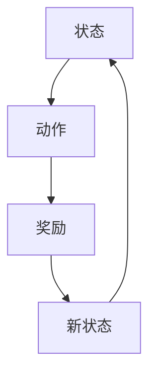
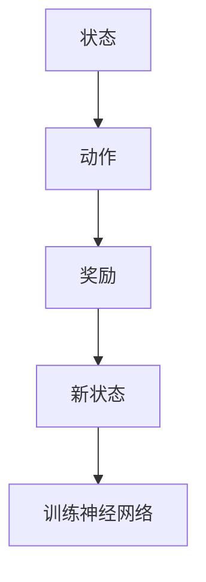
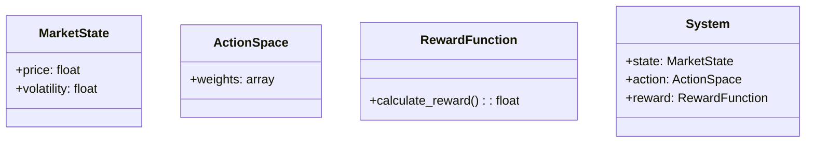
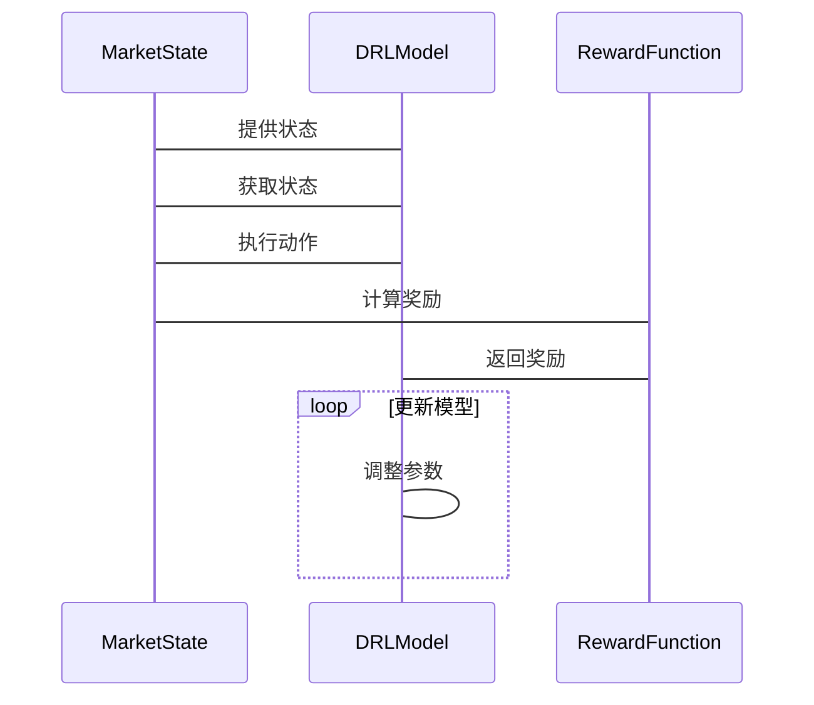

                 


# 深度强化学习在多周期资产配置中的应用

> 关键词：深度强化学习，多周期资产配置，强化学习，资产配置，动态规划，强化学习算法

> 摘要：本文探讨了深度强化学习（Deep Reinforcement Learning, DRL）在多周期资产配置中的应用，分析了其核心概念、算法原理、系统设计及实际案例，展示了DRL如何优化投资组合，实现长期收益最大化。

---

## 第1章: 深度强化学习与多周期资产配置概述

### 1.1 深度强化学习的基本概念

深度强化学习（Deep Reinforcement Learning, DRL）是人工智能领域的交叉技术，结合了深度学习的特征提取能力和强化学习的决策优化能力。DRL通过神经网络处理高维状态空间，利用强化学习的奖励机制优化决策策略。与传统强化学习相比，DRL在处理复杂、高维问题时表现更优。

### 1.2 多周期资产配置的背景与目标

多周期资产配置是指在多个时间段内动态调整投资组合，以最大化收益或最小化风险。传统方法常使用均值-方差模型，但其静态特性难以应对市场波动。多周期配置需考虑时间序列数据，优化短期和长期目标的平衡。

### 1.3 DRL在资产配置中的应用前景

DRL在金融领域的优势在于其自适应性和灵活性。通过深度神经网络处理市场数据，强化学习优化投资策略，DRL能有效应对市场变化，实现动态资产配置。其应用场景包括股票交易、投资组合优化和风险管理等。

---

## 第2章: 核心概念与联系

### 2.1 深度强化学习的核心原理

DRL由状态、动作、奖励、策略和价值函数组成。状态是环境中的观察，动作是决策，奖励是对决策的反馈，策略是动作选择的概率分布，价值函数评估状态-动作对的收益。

### 2.2 资产配置的核心要素

资产配置涉及风险、收益、时间和资产类别等要素。多周期配置需动态调整权重，平衡短期收益和长期目标。风险调整后的收益是关键优化目标。

### 2.3 核心概念对比与ER图

| 对比维度 | 深度强化学习 | 资产配置 |
|----------|--------------|----------|
| 输入      | 高维状态     | 市场数据  |
| 输出      | 动作策略     | 资产权重  |
| 目标      | 最大化奖励    | 最优化收益|

ER图展示资产配置的核心要素关系，包括市场数据、投资组合、风险收益等实体及关联。

---

## 第3章: 深度强化学习算法原理

### 3.1 基本算法介绍

#### 3.1.1 Q-learning算法

Q-learning通过经验值更新Q表，记录状态-动作对的期望奖励。适用于低维状态空间，但高维问题需结合深度学习。

Mermaid流程图：


Python代码示例：
```python
import numpy as np

class QLearning:
    def __init__(self, state_space, action_space, learning_rate=0.1, gamma=0.9):
        self.Q = np.zeros((state_space, action_space))
        self.lr = learning_rate
        self.gamma = gamma

    def update(self, state, action, reward, next_state):
        self.Q[state, action] = self.Q[state, action] + self.lr * (reward + self.gamma * np.max(self.Q[next_state, :]) - self.Q[state, action])
```

#### 3.1.2 Deep Q-Network

Deep Q-Network结合神经网络和Q-learning，用于处理高维状态空间。神经网络近似Q函数，通过经验回放和目标网络优化。

Mermaid流程图：


Python代码示例：
```python
import torch
import torch.nn as nn

class DQN(nn.Module):
    def __init__(self, input_dim, output_dim):
        super(DQN, self).__init__()
        self.fc1 = nn.Linear(input_dim, 64)
        self.fc2 = nn.Linear(64, output_dim)

    def forward(self, x):
        x = torch.relu(self.fc1(x))
        x = self.fc2(x)
        return x
```

### 3.2 多周期资产配置的优化算法

#### 3.2.1 动态规划与强化学习结合

动态规划通过状态转移方程优化决策，强化学习通过奖励机制优化策略。结合两者，设计多周期配置的强化学习模型。

数学模型：
$$ V(s_t) = \max_{a_t} [ r_t + \gamma V(s_{t+1}) ] $$

#### 3.2.2 基于DRL的优化算法

设计多周期配置的强化学习框架，状态为市场数据，动作是资产权重调整，奖励是收益风险比。

数学公式：
$$ J(\theta) = \sum_{t=1}^T r_t(\theta) $$

---

## 第4章: 系统分析与架构设计

### 4.1 系统分析

#### 4.1.1 问题场景介绍

系统需处理多周期资产配置问题，优化投资组合。输入市场数据，输出资产权重，目标为长期收益最大化。

#### 4.1.2 系统功能设计

- 状态空间：市场指标、资产价格
- 动作空间：资产权重调整
- 奖励机制：收益风险比
- 环境交互：买卖操作

Mermaid类图：


### 4.2 系统架构设计

#### 4.2.1 系统架构图

展示系统各模块关系，包括数据输入、DRL模型、环境交互和结果输出。

Mermaid架构图：


#### 4.2.2 系统交互设计

展示系统运行流程，包括状态输入、动作选择、奖励计算和模型更新。

Mermaid序列图：


---

## 第5章: 项目实战

### 5.1 环境安装与配置

安装必要的库，如TensorFlow、Keras、OpenAI Gym等，设置环境变量。

#### 5.1.1 系统环境

- Python 3.8+
- TensorFlow 2.5+
- OpenAI Gym

#### 5.1.2 代码实现

实现DRL模型，训练并测试。

### 5.2 核心代码实现

设计DRL模型，定义状态、动作和奖励函数，训练模型并测试。

#### 5.2.1 状态空间与动作空间

状态：市场指标，如收益率、波动率。
动作：资产权重，如[0,1]区间。

#### 5.2.2 训练过程

定义奖励函数，训练模型，保存权重。

### 5.3 案例分析与解读

通过实际案例分析，展示DRL在多周期配置中的应用效果。

#### 5.3.1 案例介绍

使用历史数据训练模型，测试其在模拟环境中的表现。

#### 5.3.2 实验结果

分析模型的收益-风险比，与传统方法对比，验证其有效性。

### 5.4 项目总结

总结项目成果，讨论优势与不足，展望未来改进方向。

---

## 第6章: 最佳实践与小结

### 6.1 最佳实践 tips

- 数据预处理与特征选择
- 模型调参与优化
- 风险管理与回撤机制

### 6.2 总结与注意事项

- DRL的优势：自适应性、灵活性
- 挑战：数据依赖性、过拟合风险
- 注意事项：选择合适的状态和动作空间，设计合理的奖励函数

### 6.3 未来研究方向

- 更复杂的市场模型
- 多目标优化
- 跨模态数据的应用

---

## 作者

作者：AI天才研究院 & 禅与计算机程序设计艺术

---

通过系统化的方法和详细分析，本文深入探讨了深度强化学习在多周期资产配置中的应用，为读者提供了全面的技术视角和实践指南。

