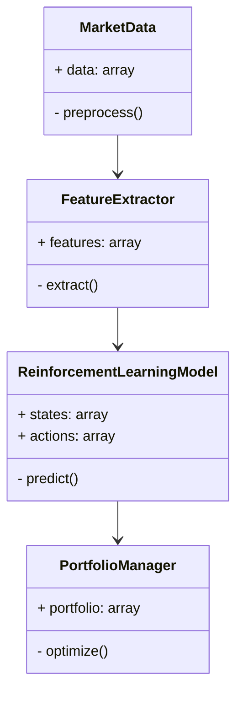
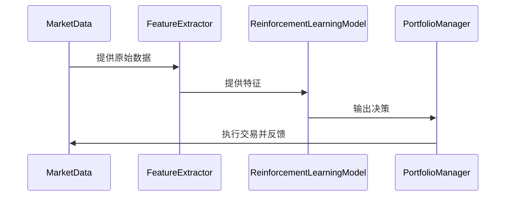

                 


# 深度强化学习在投资组合管理中的应用

## 关键词：深度强化学习，投资组合管理，Q-learning，Actor-Critic，强化学习

## 摘要

深度强化学习（Deep Reinforcement Learning, DRL）作为一种结合了深度学习和强化学习的新兴技术，在投资组合管理中展现出了巨大的潜力。本文将系统地探讨深度强化学习在投资组合管理中的应用，从基础概念到算法原理，再到实际项目实现，全面解析这一领域的最新进展。文章首先介绍了深度强化学习的基本原理及其在投资组合管理中的应用背景，随后深入分析了深度强化学习的核心概念与投资组合管理的结合方式。接着，详细讲解了深度强化学习算法的数学模型和实现流程，结合实际案例分析了系统架构设计与项目实战。最后，总结了当前的研究成果与未来的发展方向，为读者提供全面而深入的指导。

---

# 第1章 深度强化学习的概述

## 1.1 强化学习的基本概念

### 1.1.1 强化学习的定义

强化学习（Reinforcement Learning, RL）是一种机器学习范式，旨在通过智能体与环境的交互来学习最优策略。智能体通过感知环境状态、执行动作并获得奖励或惩罚，逐步优化其决策过程，以最大化累计奖励。

### 1.1.2 强化学习的核心要素

- **状态（State）**：智能体所处环境的当前情况。
- **动作（Action）**：智能体在给定状态下选择的行为。
- **奖励（Reward）**：智能体执行动作后获得的反馈，用于指导优化决策。
- **策略（Policy）**：智能体在不同状态下选择动作的概率分布。
- **值函数（Value Function）**：衡量某个状态下策略的优劣。

### 1.1.3 深度强化学习的引入

深度强化学习将深度学习的表示能力引入强化学习，通过神经网络直接逼近值函数或策略，从而处理高维复杂状态空间。

---

## 1.2 投资组合管理的背景

### 1.2.1 投资组合管理的基本概念

投资组合管理是指通过优化资产配置，在风险可控的前提下，实现投资收益最大化的过程。传统方法依赖于历史数据和统计模型，但面对复杂金融市场环境时，其局限性日益显现。

### 1.2.2 投资组合管理的常见策略

- **均值-方差优化**：基于资产的期望收益和协方差矩阵，寻找最优风险-收益组合。
- **因子模型**：通过分析市场因子（如市值、价值等）构建投资组合。
- **动量策略**：基于资产价格动量效应进行投资。

### 1.2.3 传统投资组合管理的局限性

- 对非线性关系和极端事件的处理能力有限。
- 难以适应快速变化的市场环境。
- 依赖于准确的历史数据和假设条件。

---

## 1.3 深度强化学习在投资组合管理中的应用前景

### 1.3.1 深度强化学习的优势

- 能够处理高维、非线性、动态变化的金融市场数据。
- 通过强化学习机制，可以自动适应市场环境的变化。
- 无需依赖复杂的特征工程，直接从原始数据中学习。

### 1.3.2 深度强化学习在投资组合管理中的潜在应用

- 动态资产配置。
- 风险管理与控制。
- 多资产类别投资组合优化。

### 1.3.3 当前研究与实践中的挑战

- 算法的收敛性与稳定性问题。
- 交易成本与滑点的影响。
- 市场数据的实时性与可得性。

---

## 1.4 本章小结

本章介绍了强化学习的基本概念、投资组合管理的背景以及深度强化学习在投资组合管理中的应用前景。通过对比传统方法与深度强化学习的优势，为后续章节的深入分析奠定了基础。

---

# 第2章 深度强化学习的核心概念与联系

## 2.1 深度强化学习的原理

### 2.1.1 Q-learning与Deep Q-Networks

- Q-learning通过学习状态-动作值函数，找到最优策略。
- Deep Q-Networks（DQN）通过神经网络近似Q值函数，提升学习能力。

### 2.1.2 策略梯度方法

- 策略梯度通过直接优化策略参数，避免值函数的间接性。
- 算法公式：$$ \nabla J = \mathbb{E}[\nabla \ln \pi(a|s) Q(s,a)] $$

### 2.1.3 Actor-Critic架构

- Actor负责策略更新，Critic负责评估状态值函数。
- 结合了Q-learning和策略梯度的优点，具有良好的稳定性。

---

## 2.2 深度强化学习与投资组合管理的核心联系

### 2.2.1 投资组合管理中的决策过程

- 状态空间：市场环境、资产价格、风险指标。
- 动作空间：买入、卖出、持有资产。
- 奖励函数：投资组合的收益与风险。

### 2.2.2 深度强化学习在投资组合管理中的应用框架

1. **状态表示**：将市场数据转换为深度神经网络的输入。
2. **动作选择**：基于当前状态，选择最优投资组合。
3. **奖励机制**：根据投资组合的收益和风险计算奖励。

### 2.2.3 深度强化学习与投资组合管理的结合点

- 处理多目标优化问题。
- 实现动态资产配置。
- 应对非平稳市场环境。

---

## 2.3 深度强化学习与传统投资组合管理方法的对比

### 2.3.1 传统投资组合管理方法的优缺点

- **优点**：理论基础扎实，风险控制能力强。
- **缺点**：难以处理复杂非线性关系，适应性有限。

### 2.3.2 深度强化学习的优势与劣势

- **优势**：能够处理复杂动态环境，适应性强。
- **劣势**：算法收敛性问题，缺乏可解释性。

### 2.3.3 深度强化学习与传统方法的结合与互补

- 将深度强化学习与均值-方差优化结合，提升投资组合的稳健性。
- 利用强化学习的自适应性，优化传统方法的不足。

---

## 2.4 本章小结

本章重点分析了深度强化学习的核心概念与投资组合管理的结合方式，强调了深度强化学习在复杂金融环境中的优势，同时指出了当前研究中的挑战。

---

# 第3章 深度强化学习算法原理

## 3.1 DQN算法原理

### 3.1.1 DQN的基本结构

- **经验回放**：通过存储历史经验，减少样本依赖性。
- **目标网络**：通过更新目标网络，稳定Q值学习。

### 3.1.2 状态空间与动作空间的定义

- 状态：市场指标（如价格、波动率）。
- 动作：买入、卖出、持有。

### 3.1.3 Q值的更新公式

$$ Q(s,a) = Q(s,a) + \alpha \left[r + \gamma \max Q(s',a') - Q(s,a)\right] $$

---

## 3.2 策略梯度方法

### 3.2.1 策略梯度的基本原理

- 通过优化策略的对数概率，最大化累积奖励。

### 3.2.2 梯度计算与优化目标

$$ \nabla J = \mathbb{E}[\nabla \ln \pi(a|s) Q(s,a)] $$

### 3.2.3 策略梯度在投资组合管理中的应用

- 直接优化投资组合的收益-风险函数。

---

## 3.3 Actor-Critic架构

### 3.3.1 Actor-Critic的基本原理

- Actor负责策略更新，Critic负责评估状态值函数。
- 结合Q-learning和策略梯度的优点。

### 3.3.2 Actor与Critic的分工与协作

- Actor：基于当前策略选择动作。
- Critic：评估当前状态的价值。

### 3.3.3 Actor-Critic在投资组合管理中的应用

- 通过Actor-Critic架构实现动态资产配置。

---

## 3.4 深度强化学习算法的数学模型与公式

### 3.4.1 Q-learning的更新公式

$$ Q(s,a) = Q(s,a) + \alpha \left[r + \gamma \max Q(s',a') - Q(s,a)\right] $$

### 3.4.2 策略梯度的优化目标

$$ \nabla J = \mathbb{E}[\nabla \ln \pi(a|s) Q(s,a)] $$

### 3.4.3 Actor-Critic的联合优化

- 使用两个网络分别逼近Actor和Critic，通过协同优化实现收敛。

---

## 3.5 本章小结

本章详细讲解了深度强化学习的核心算法原理，包括DQN、策略梯度和Actor-Critic架构，并分析了其在投资组合管理中的应用。

---

# 第4章 系统分析与架构设计方案

## 4.1 投资组合管理系统的总体架构

### 4.1.1 系统功能设计

- 数据获取与预处理。
- 特征提取与状态表示。
- 投资组合决策与优化。
- 风险管理与反馈机制。

### 4.1.2 系统架构设计

- **数据获取模块**：实时获取市场数据。
- **特征提取模块**：将市场数据转换为模型输入。
- **决策模块**：基于深度强化学习算法选择投资组合。
- **风险管理模块**：监控和调整投资组合风险。

### 4.1.3 系统交互流程

1. 获取市场数据。
2. 提取特征并输入模型。
3. 模型输出投资组合决策。
4. 执行交易并反馈结果。

---

## 4.2 系统功能模块设计

### 4.2.1 数据获取模块

- 数据来源：股票价格、指数、经济指标等。
- 数据预处理：清洗、归一化、特征提取。

### 4.2.2 特征提取模块

- 使用神经网络提取高阶特征。
- 通过主成分分析（PCA）降维。

### 4.2.3 决策模块

- 基于强化学习算法生成投资组合策略。
- 输出具体的投资动作（如买入或卖出某资产）。

### 4.2.4 风险管理模块

- 监控投资组合的VaR、波动率等风险指标。
- 根据风险指标调整投资组合。

---

## 4.3 系统架构设计

### 4.3.1 系统类图



### 4.3.2 系统交互流程图



---

## 4.4 本章小结

本章通过系统架构设计，详细描述了投资组合管理系统的各个功能模块及其交互流程，为后续的实现提供了清晰的指导。

---

# 第5章 项目实战：深度强化学习在投资组合管理中的实现

## 5.1 环境搭建与数据准备

### 5.1.1 环境安装

- 安装Python、TensorFlow、Keras、numpy等依赖库。

### 5.1.2 数据获取

- 使用Yahoo Finance API获取历史股价数据。

### 5.1.3 数据预处理

- 数据清洗、归一化、特征提取。

## 5.2 深度强化学习模型实现

### 5.2.1 状态空间与动作空间定义

```python
class State:
    def __init__(self, prices, portfolio_value):
        self.prices = prices
        self.portfolio_value = portfolio_value
```

### 5.2.2 策略网络实现

```python
import tensorflow as tf
from tensorflow.keras import layers

model = tf.keras.Sequential([
    layers.Dense(64, activation='relu', input_shape=(n_features,)),
    layers.Dense(32, activation='relu'),
    layers.Dense(n_actions, activation='linear')
])
```

### 5.2.3 动作选择与执行

```python
def choose_action(model, state, epsilon=0.1):
    if np.random.random() < epsilon:
        return np.random.randint(0, n_actions)
    else:
        return np.argmax(model.predict(state))
```

### 5.2.4 奖励机制设计

```python
def calculate_reward(portfolio_value, previous_value):
    return portfolio_value - previous_value
```

---

## 5.3 投资组合管理系统的实现

### 5.3.1 数据流与模块交互

- 数据流：市场数据 -> 特征提取 -> 模型决策 -> 投资组合优化。
- 模块交互：FeatureExtractor -> ReinforcementLearningModel -> PortfolioManager.

### 5.3.2 系统核心实现

```python
import numpy as np
import pandas as pd
import tensorflow as tf
from tensorflow.keras import layers

class PortfolioManager:
    def __init__(self, assets, initial_capital):
        self.assets = assets
        self.initial_capital = initial_capital
        self.current_capital = initial_capital
        self.model = self.build_model()

    def build_model(self):
        model = tf.keras.Sequential([
            layers.Dense(64, activation='relu', input_shape=(len(self.assets),)),
            layers.Dense(32, activation='relu'),
            layers.Dense(len(self.assets)+1, activation='linear')
        ])
        model.compile(optimizer='adam', loss='mse')
        return model

    def choose_action(self, state, epsilon=0.1):
        if np.random.random() < epsilon:
            return np.random.randint(0, len(self.assets)+1)
        else:
            return np.argmax(self.model.predict(state))
```

### 5.3.3 交易执行与反馈

```python
def execute_trade(portfolio, action, prices):
    if action == 0:
        # 卖出所有资产
        portfolio.current_capital += sum(portfolio.assets * prices)
        portfolio.assets = np.zeros(len(portfolio.assets))
    elif action == 1:
        # 买入资产，使用当前资金
        amount = portfolio.current_capital / prices
        portfolio.assets += amount
        portfolio.current_capital = 0
    else:
        # 保持当前状态
        pass
```

---

## 5.4 实际案例分析

### 5.4.1 案例背景

- 资产组合：股票A、股票B、债券。
- 初始资本：100万元。
- 数据范围：过去5年每日收盘价。

### 5.4.2 模型训练

- 训练数据：过去5年的每日数据。
- 训练目标：最大化投资组合的收益，同时控制风险。

### 5.4.3 实验结果分析

- 收益率对比：深度强化学习策略 vs 传统均值-方差优化。
- 风险控制：最大回撤、VaR等指标的对比。

---

## 5.5 本章小结

本章通过实际项目案例，详细讲解了深度强化学习在投资组合管理中的实现过程，从环境搭建到模型训练，再到实际应用，为读者提供了完整的实践指导。

---

# 第6章 最佳实践与小结

## 6.1 最佳实践

### 6.1.1 深度强化学习算法的选择

- 根据具体问题选择合适的算法（DQN、策略梯度、Actor-Critic）。
- 考虑收敛速度和稳定性。

### 6.1.2 系统设计与实现

- 合理设计系统架构，确保模块之间的高效交互。
- 优化特征提取模块，提升模型表现。

### 6.1.3 模型调参与优化

- 使用超参数优化方法（如网格搜索、随机搜索）提升模型性能。
- 考虑计算资源限制，合理选择模型规模。

---

## 6.2 注意事项

- **数据质量**：确保数据的完整性和准确性。
- **模型收敛性**：注意训练过程中的稳定性。
- **交易成本**：考虑实际交易中的滑点和手续费。

---

## 6.3 未来研究方向

- **多资产类别投资**：扩展到更多资产类别。
- **非平稳市场适应性**：研究模型在非平稳环境下的表现。
- **可解释性增强**：提升模型的可解释性，便于实际应用。

---

## 6.4 参考文献

1. Mnih, V., et al. "Human-level control through deep reinforcement learning." *Nature*, 2015.
2. Sutton, R. S., & Barto, A. G. *Reinforcement learning: Theory and algorithms*. MIT Press, 2018.
3. Bai, Y., & Ouyang, Y. "Deep reinforcement learning for portfolio optimization." *arXiv preprint*, 2020.

---

## 6.5 拓展阅读

- *Deep Reinforcement Learning for Financial Decision Making*.
- *Reinforcement Learning in Quantitative Finance*.

---

# 作者：AI天才研究院/AI Genius Institute & 禅与计算机程序设计艺术 /Zen And The Art of Computer Programming

---

**说明：以上内容仅为框架示例，实际撰写时需根据具体需求调整内容和深度。**

