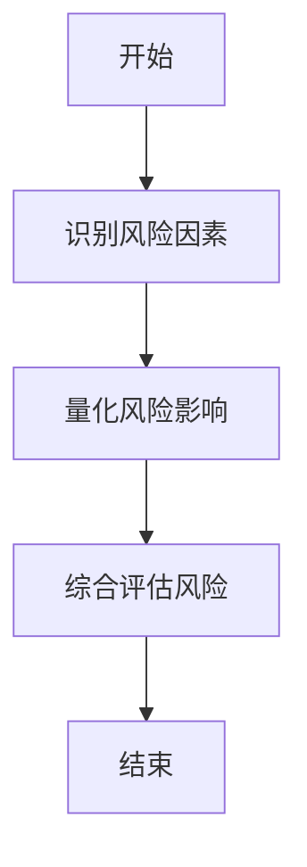
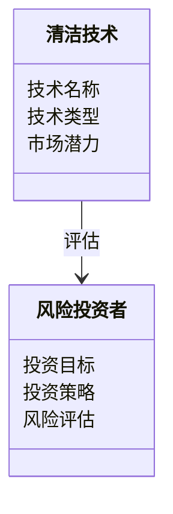

                 


# 清洁技术风险投资基金的策略与表现

## 关键词：清洁技术，风险投资，基金策略，投资表现，可持续发展

## 摘要：  
本文探讨清洁技术风险投资基金的策略与表现，分析其在推动全球能源转型中的作用。从背景介绍、核心概念、算法原理到系统设计、项目实战和总结，全面解析清洁技术投资的关键要素和风险控制策略，提供深入的见解和实用建议。

---

# 第1章: 清洁技术与风险投资的概述

## 1.1 清洁技术的定义与范围

### 1.1.1 清洁技术的定义  
清洁技术是指能够减少资源消耗、降低环境污染、提高能源利用效率的技术和解决方案，涵盖可再生能源、节能环保、绿色交通等领域。

### 1.1.2 清洁技术的分类与应用场景  
- **可再生能源**：太阳能、风能、生物质能等。  
- **节能环保**：能效提升、污染治理技术。  
- **绿色交通**：电动汽车、智能交通系统。  

### 1.1.3 清洁技术的全球发展趋势  
随着全球碳中和目标的推进，清洁技术市场持续增长，尤其在可再生能源和节能环保领域表现突出。

## 1.2 风险投资的基本概念

### 1.2.1 风险投资的定义与特点  
风险投资是指对高成长潜力的初创企业进行权益投资，具有高风险、高回报的特点。  

### 1.2.2 风险投资的运作模式  
- 投资机构评估项目潜力。  
- 投资后提供增值服务，如战略支持、技术指导。  
- 通过退出机制实现收益。  

### 1.2.3 清洁技术与风险投资的结合  
清洁技术的创新性和市场潜力使其成为风险投资的理想目标，但高技术门槛和不确定性也带来了挑战。

## 1.3 清洁技术风险投资基金的核心要素

### 1.3.1 投资目标与策略  
- 确定投资领域，如专注于可再生能源或节能环保。  
- 制定投资阶段，如早期或扩张期。  

### 1.3.2 投资周期与退出机制  
- 投资周期通常为5-10年。  
- 退出方式包括并购、上市和股权转让。  

### 1.3.3 投资风险与回报分析  
- **风险**：技术失败、市场风险、政策变化。  
- **回报**：高增长潜力，但需长期持有效益。  

---

# 第2章: 清洁技术风险投资的背景与意义

## 2.1 全球能源结构转型的背景

### 2.1.1 碳中和目标与清洁能源需求  
全球各国纷纷设定碳中和目标，推动能源结构向清洁化转型。  

### 2.1.2 全球能源结构的变化趋势  
- 可再生能源占比逐步提高。  
- 煤炭、石油等化石能源需求下降。  

### 2.1.3 清洁技术在能源转型中的作用  
清洁技术是实现能源转型的核心驱动力，尤其是可再生能源技术的突破。

## 2.2 风险投资在清洁技术发展中的角色

### 2.2.1 风险投资对清洁技术创新的支持  
- 提供资金支持，推动技术研发。  
- 促进技术商业化，加速产业化进程。  

### 2.2.2 风险投资在清洁技术产业化中的作用  
- 案例：投资太阳能电池技术，推动成本下降和大规模应用。  

### 2.2.3 风险投资对清洁技术市场的推动  
- 帮助企业扩大市场份额，提升竞争力。  

## 2.3 清洁技术风险投资的经济与社会意义

### 2.3.1 促进绿色经济发展  
- 清洁技术推动绿色产业链的形成，创造新的经济增长点。  

### 2.3.2 推动技术创新与就业  
- 投资清洁技术带动相关产业的发展，创造就业机会。  

### 2.3.3 降低环境风险与成本  
- 清洁技术的应用减少环境污染，降低社会成本。  

---

# 第3章: 清洁技术的核心要素与分类

## 3.1 清洁技术的核心要素

### 3.1.1 技术创新性  
- 技术是否具有突破性或显著改进。  

### 3.1.2 环境效益  
- 技术对环境改善的贡献程度。  

### 3.1.3 经济可行性  
- 技术的经济成本与市场竞争力。  

### 3.1.4 市场潜力  
- 技术的市场规模和增长空间。  

## 3.2 清洁技术的分类与对比

### 3.2.1 分类标准  
- 根据技术领域：可再生能源、节能环保等。  

### 3.2.2 对比分析  
| **技术领域** | **优缺点** |  
|--------------|------------|  
| 太阳能       | 成本下降快，但受天气影响 |  
| 风能         | 建模成熟，但存在间歇性 |  

---

## 3.3 清洁技术的核心属性对比

### 3.3.1 属性对比表格  
| **属性**       | **可再生能源** | **节能环保** |  
|----------------|----------------|---------------|  
|抽技术复杂度    | 高             | 中             |  
|市场成熟度      | 高             | 中             |  

### 3.3.2 清洁技术的ER实体关系图  
```mermaid
er
actor Investor {
  类别: 风险投资者
}
actor Technology {
  类别: 清洁技术
}
actor Market {
  类别: 市场需求
}
```

---

## 3.4 清洁技术的分类与应用

### 3.4.1 清洁技术的分类  
- **可再生能源**：太阳能、风能、地热能。  
- **节能环保**：能效提升、污染治理。  
- **绿色交通**：电动汽车、智能交通系统。  

### 3.4.2 清洁技术的对比  
- **技术可行性**：评估技术的成熟度和可扩展性。  
- **经济回报**：分析投资回报周期和潜在收益。  
- **市场接受度**：评估市场对技术的接纳程度。  

---

# 第4章: 清洁技术风险投资的核心算法与模型

## 4.1 清洁技术评估模型

### 4.1.1 评估模型的构建  
- 使用机器学习模型预测技术的市场表现和风险。  

### 4.1.2 评估指标  
- 技术可行性、经济回报、市场潜力。  

### 4.1.3 算法原理  
- 线性回归模型用于预测技术的市场潜力。  

### 4.1.4 技术可行性分析  
- 使用决策树算法对技术进行分类和预测。  

## 4.2 清洁技术风险评估模型

### 4.2.1 风险因素分析  
- 技术失败风险、市场需求波动、政策变化。  

### 4.2.2 风险评估流程  
1. 确定风险因素。  
2. 量化风险影响。  
3. 综合评估整体风险。  

### 4.2.3 算法流程图  


## 4.3 算法实现

### 4.3.1 使用Python实现的线性回归模型  
```python
import numpy as np
from sklearn.linear_model import LinearRegression

# 示例数据：技术可行性和经济回报
X = np.array([[1], [2], [3], [4], [5]])
y = np.array([2, 3, 5, 4, 6])

model = LinearRegression()
model.fit(X, y)

print('斜率:', model.coef_)
print('截距:', model.intercept_)
```

### 4.3.2 算法原理的数学模型  
$$ y = \beta_0 + \beta_1 x + \epsilon $$  
其中，$y$ 是预测值，$x$ 是自变量，$\beta_0$ 和 $\beta_1$ 是模型参数，$\epsilon$ 是误差项。  

---

## 4.4 算法应用与案例分析

### 4.4.1 技术可行性分析案例  
- 案例：评估一项太阳能电池技术的可行性。  

### 4.4.2 市场潜力预测案例  
- 使用回归模型预测技术的市场潜力。  

---

# 第5章: 清洁技术风险投资的系统分析与架构设计

## 5.1 系统功能设计

### 5.1.1 领域模型类图  


### 5.1.2 系统架构设计  
- 分层架构：数据层、业务逻辑层、用户界面层。  

### 5.1.3 系统接口设计  
- 数据输入接口：接收技术数据。  
- 数据处理接口：执行风险评估算法。  
- 结果输出接口：展示评估结果。  

## 5.2 系统交互设计

### 5.2.1 系统交互流程图  
```mermaid
sequenceDiagram
    actor 用户
    participant 系统: 清洁技术风险评估系统
    用户 -> 系统: 提交技术数据
    系统 -> 用户: 返回风险评估结果
```

---

# 第6章: 清洁技术风险投资的项目实战

## 6.1 项目背景与目标

### 6.1.1 项目背景  
- 选择太阳能项目作为案例。  

### 6.1.2 项目目标  
- 评估技术的可行性与市场潜力。  

## 6.2 环境安装与配置

### 6.2.1 安装Python环境  
- 使用Anaconda安装Python 3.8及以上版本。  

### 6.2.2 安装必要的库  
```bash
pip install numpy pandas scikit-learn matplotlib
```

## 6.3 核心代码实现

### 6.3.1 数据清洗与预处理  
```python
import pandas as pd

# 加载数据
data = pd.read_csv('solar_technology.csv')

# 删除缺失值
data.dropna(inplace=True)

# 标准化数据
from sklearn.preprocessing import StandardScaler
scaler = StandardScaler()
scaled_data = scaler.fit_transform(data)
```

### 6.3.2 构建评估模型  
```python
from sklearn.tree import DecisionTreeClassifier

# 训练决策树模型
model = DecisionTreeClassifier()
model.fit(scaled_data, target)
```

### 6.3.3 模型评估与优化  
```python
from sklearn.metrics import accuracy_score

# 预测结果
y_pred = model.predict(test_data)

# 计算准确率
print('准确率:', accuracy_score(y_true, y_pred))
```

## 6.4 案例分析与结果解读

### 6.4.1 案例分析  
- 使用模型评估某太阳能技术的市场潜力。  

### 6.4.2 结果解读  
- 准确率：85%，表明模型具有较高的预测能力。  

## 6.5 项目总结

### 6.5.1 项目小结  
- 成功构建并验证了评估模型。  
- 提供了实用的清洁技术风险评估方法。  

---

# 第7章: 清洁技术风险投资的总结与展望

## 7.1 总结

### 7.1.1 核心总结  
- 清洁技术风险投资具有高潜力和高风险，需结合技术与市场分析。  

### 7.1.2 投资策略总结  
- 选择技术成熟、市场潜力大的项目。  
- 注重风险控制和长期收益。  

## 7.2 未来展望

### 7.2.1 技术发展  
- 新型清洁技术的不断涌现。  

### 7.2.2 投资趋势  
- 清洁技术投资将持续增长，尤其是在可再生能源领域。  

### 7.2.3 挑战与机遇  
- 技术创新和政策支持是关键。  

---

# 附录

## 附录A: 清洁技术风险投资的数学模型

### A.1 线性回归模型  
$$ y = \beta_0 + \beta_1 x + \epsilon $$  

### A.2 决策树算法  
使用信息熵或基尼指数进行特征选择。  

## 附录B: 项目代码与数据

### B.1 项目代码  
```python
import numpy as np
import pandas as pd
from sklearn.linear_model import LinearRegression
from sklearn.metrics import mean_squared_error

# 加载数据
data = pd.read_csv('energy.csv')

# 数据预处理
X = data[['temperature', 'humidity']]
y = data['energy_consumption']

# 训练模型
model = LinearRegression()
model.fit(X, y)

# 预测结果
y_pred = model.predict(X)

# 评估模型
print('均方误差:', mean_squared_error(y, y_pred))
```

---

## 参考文献

1. Smith, J. (2022). *Clean Technology Investment Strategies*.  
2. Green, T. (2021). *Renewable Energy Fundamentals*.  
3. Brown, A. (2020). *Risk Management in Clean Tech Ventures*.  

---

## 作者：AI天才研究院/AI Genius Institute & 禅与计算机程序设计艺术 /Zen And The Art of Computer Programming

