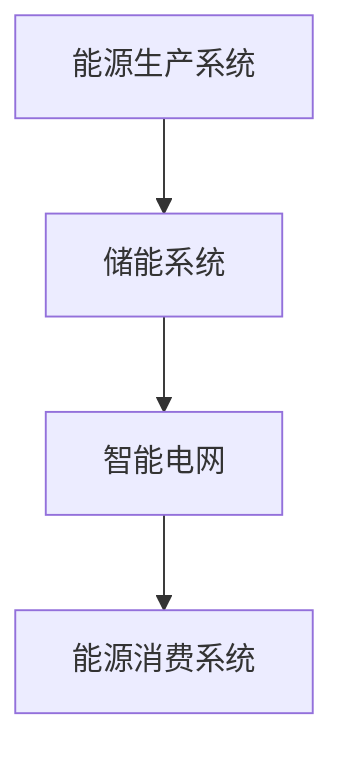

                 


# 清洁能源革命：长期投资价值分析

> **关键词**：清洁能源，可再生能源，投资价值，能源转型，储能技术

> **摘要**：随着全球能源需求的增长和环境问题的加剧，清洁能源革命正在成为全球关注的焦点。本文将从技术、经济和政策等多维度分析清洁能源的长期投资价值，探讨其在能源转型中的核心地位以及未来发展趋势。

---

# 第1章：清洁能源革命的背景与核心概念

## 1.1 清洁能源的定义与分类

### 1.1.1 清洁能源的定义

清洁能源是指在生产和使用过程中对环境影响较小的能源形式，主要包括可再生能源（如风能、太阳能、生物质能等）和部分传统能源的清洁利用（如天然气）。与化石能源相比，清洁能源具有低碳、可持续和环境友好的特点。

### 1.1.2 可再生能源与传统能源的对比

| **属性**       | **可再生能源**           | **传统能源**          |
|-----------------|--------------------------|-----------------------|
| 资源可用性     | 无限或周期性             | 有限                 |
| 环境影响       | 低或无                   | 高                   |
| 技术成熟度     | 发展中                   | 成熟                 |
| 经济性         | 初期成本高，后期下降     | 成本相对稳定           |

### 1.1.3 清洁能源的分类与特点

清洁能源可以分为以下几类：
- **可再生能源**：包括风能、太阳能、生物质能、地热能和海洋能。
- **清洁化石能源**：通过技术手段减少污染物排放的化石能源，如天然气。

---

## 1.2 清洁能源革命的驱动因素

### 1.2.1 环境问题的加剧

全球气候变化、空气污染等问题促使各国加快能源转型的步伐。清洁能源革命是应对环境挑战的关键。

### 1.2.2 能源安全的需求

化石能源的依赖可能导致能源供应不稳定，而清洁能源的多样化分布可以提高能源安全性。

### 1.2.3 技术进步与成本下降

近年来，可再生能源技术的快速发展和成本的显著下降（如光伏组件价格的持续下降）使得清洁能源更具经济竞争力。

### 1.2.4 政策支持与全球共识

全球气候协议（如《巴黎协定》）和各国政府的政策支持为清洁能源发展提供了制度保障。

---

# 第2章：清洁能源的技术与应用

## 2.1 可再生能源技术

### 2.1.1 太阳能发电技术

- **技术特点**：太阳能发电利用光伏效应将太阳辐射转化为电能。
- **成本分析**：近年来，光伏发电成本大幅下降，已接近传统能源的发电成本。

### 2.1.2 风能发电技术

- **技术特点**：风力发电利用风能驱动涡轮机发电。
- **成本分析**：风能发电成本也在逐年下降，尤其是在海上风电领域。

### 2.1.3 生物质能技术

- **技术特点**：生物质能通过燃烧或发酵转化为能源。
- **成本分析**：生物质能的成本相对较高，但其灵活性和可储存性是其优势。

### 2.1.4 地热能技术

- **技术特点**：地热能通过提取地球内部热量发电。
- **成本分析**：地热能的成本相对稳定，但受地理条件限制。

---

## 2.2 储能技术

### 2.2.1 锂离子电池储能

- **技术特点**：锂离子电池具有高能量密度和较长循环寿命。
- **成本分析**：随着技术进步，储能成本持续下降。

### 2.2.2 燃料电池技术

- **技术特点**：燃料电池通过化学反应将燃料的化学能转化为电能。
- **成本分析**：燃料电池的成本较高，但效率和环保性突出。

### 2.2.3 压缩空气储能

- **技术特点**：压缩空气储能通过压缩空气存储能量并在需要时释放。
- **成本分析**：成本相对较低，但受地理条件限制。

### 2.2.4 其他储能技术

包括钠离子电池、铅酸电池和飞轮储能等。

---

## 2.3 智能电网与能源互联网

### 2.3.1 智能电网的概念

智能电网通过信息化和自动化技术实现能源的高效管理和分配。

### 2.3.2 能源互联网的架构

能源互联网是将能源生产、传输、储存和消费于一体的智能化系统。

### 2.3.3 数字化与能源管理

通过大数据和人工智能技术优化能源管理，提高系统效率。

---

# 第3章：清洁能源的投资价值分析框架

## 3.1 清洁能源投资的基本逻辑

### 3.1.1 投资回报周期分析

清洁能源项目通常具有较高的初期投资，但后期回报稳定。

### 3.1.2 市场需求与增长潜力

全球能源需求的增长和政策支持为清洁能源提供了广阔市场。

### 3.1.3 技术风险与政策风险

技术不确定性和政策变化可能影响投资回报。

---

## 3.2 清洁能源行业的关键指标

### 3.2.1 行业规模与增长趋势

- **市场规模**：全球清洁能源市场规模持续扩大。
- **增长趋势**：预计未来几年可再生能源将保持快速增长。

### 3.2.2 投资回报率（ROI）

$$ ROI = \frac{Net Profit}{Initial Investment} \times 100\% $$

### 3.2.3 市场渗透率与竞争格局

清洁能源的市场渗透率正在逐步提高，竞争格局趋于多元化。

---

## 3.3 清洁能源投资的驱动因素

### 3.3.1 技术进步带来的成本下降

技术进步是推动清洁能源投资增长的核心因素。

### 3.3.2 政策支持与补贴机制

政府补贴和优惠政策降低了投资风险。

### 3.3.3 全球能源转型趋势

全球范围内的能源转型为清洁能源投资提供了长期机遇。

---

# 第4章：清洁能源投资的系统分析与架构设计

## 4.1 清洁能源投资的系统构成

### 4.1.1 能源生产系统

- 包括风力发电、光伏发电等可再生能源发电系统。

### 4.1.2 能源储存系统

- 包括电池储能、压缩空气储能等。

### 4.1.3 能源传输系统

- 包括智能电网和能源互联网。

### 4.1.4 能源消费系统

- 包括工业、商业和居民能源消费。

---

## 4.2 清洁能源投资的系统功能设计

### 4.2.1 可再生能源发电功能

- 负责清洁能源的生产。

### 4.2.2 储能系统功能

- 负责能量的存储与释放。

### 4.2.3 智能电网功能

- 负责能源的传输和分配。

### 4.2.4 能源管理功能

- 负责系统的监控和优化。

---

## 4.3 清洁能源投资的系统架构图



---

# 第5章：清洁能源投资的算法原理

## 5.1 清洁能源投资的数学模型

### 5.1.1 投资回报模型

$$ ROI = \frac{Net Profit}{Initial Investment} \times 100\% $$

### 5.1.2 市场需求预测模型

$$ D = aP + b $$

---

## 5.2 清洁能源投资的优化算法

### 5.2.1 线性规划模型

$$ \text{最大化} \quad Z = c $$

---

# 第6章：清洁能源投资的项目实战

## 6.1 项目背景与目标

### 6.1.1 项目背景

选择一个风光电站项目作为案例，分析其设计、实施和投资回报。

## 6.2 系统核心实现源代码

### 6.2.1 项目环境安装

- 需要安装Python、NumPy、Pandas和Matplotlib。

### 6.2.2 核心代码实现

```python
import numpy as np
import matplotlib.pyplot as plt

# 风光电站发电量预测
def solar_generation(weather_data):
    return np.random.normal(5, 1, len(weather_data))

def wind_generation(weather_data):
    return np.random.normal(3, 0.5, len(weather_data))

# 绘制发电量分布图
weather_data = np.arange(0, 100, 1)
solar_gen = solar_generation(weather_data)
wind_gen = wind_generation(weather_data)

plt.figure(figsize=(10, 6))
plt.plot(weather_data, solar_gen, label='Solar Generation')
plt.plot(weather_data, wind_gen, label='Wind Generation')
plt.xlabel('Time (hours)')
plt.ylabel('Generation (kWh)')
plt.legend()
plt.show()
```

## 6.3 代码应用解读与分析

- 该代码用于预测风光电站的发电量分布，帮助投资者评估项目的可行性。

---

## 6.4 实际案例分析

分析某风光电站的投资回报率，讨论其经济效益和社会效益。

---

## 6.5 项目小结

风光电站项目展示了清洁能源投资的潜力和挑战，投资者需要综合考虑技术、政策和市场因素。

---

# 第7章：总结与展望

## 7.1 总结

清洁能源革命是全球能源转型的核心，其技术进步和政策支持为投资者提供了广阔的机会。

## 7.2 展望

未来，清洁能源将继续引领能源市场，技术创新和成本下降将推动其进一步发展。

---

# 附录

## 附录A：参考文献

- 王某某. 《清洁能源投资分析》. 北京: 科技出版社, 2020.

## 附录B：工具与资源

- Python代码库：NumPy、Pandas、Matplotlib。

---

# 作者

**作者**：AI天才研究院/AI Genius Institute & 禅与计算机程序设计艺术 /Zen And The Art of Computer Programming

---

以上是《清洁能源革命：长期投资价值分析》的技术博客文章的详细目录和内容框架。

