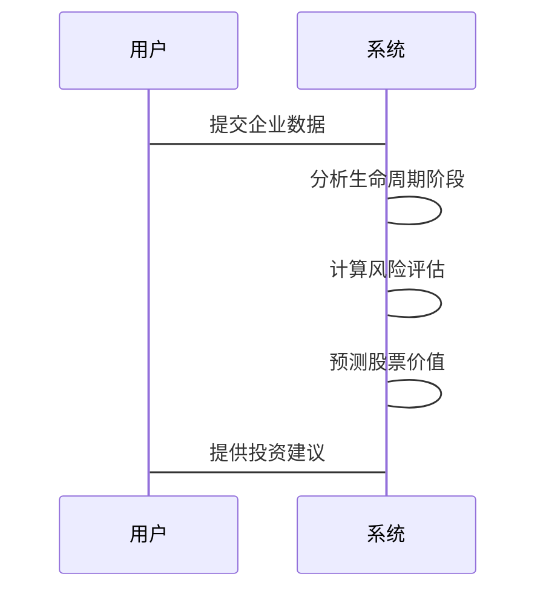

                 


# 特价股票与企业生命周期理论的结合

## 关键词
特价股票, 企业生命周期, 股票定价模型, 生命周期阶段, 投资策略

## 摘要
本文探讨了特价股票与企业生命周期理论的结合，分析了两者在股票市场中的相互作用。通过数学模型和系统架构设计，展示了如何利用企业生命周期阶段对股票定价进行优化。文章从背景介绍、核心概念、算法原理、系统分析到项目实战，详细阐述了理论与实践的结合，为投资者提供科学的决策依据。

---

# 第一部分: 特价股票与企业生命周期理论的结合概述

## 第1章: 特价股票与企业生命周期理论的背景介绍

### 1.1 特价股票的基本概念
#### 1.1.1 特价股票的定义
特价股票通常指价格低于面值的股票，常见于公司清算或财务重组时。这些股票可能附带特殊条件，如较高的票面价值或优先股特征。

#### 1.1.2 特价股票的分类
- 优先股：股息优先于普通股，但无投票权。
- 次级债：债券性质，附带较高的票面价值。

#### 1.1.3 特价股票的特点
- 价格低廉，适合小投资者。
- 风险较高，回报不稳定。

### 1.2 企业生命周期理论的基本概念
#### 1.2.1 企业生命周期的定义
企业生命周期描述了企业从成立到衰退的阶段变化，通常分为初创期、成长期、成熟期和衰退期。

#### 1.2.2 企业生命周期的阶段划分
- 初创期：高风险，资金需求大。
- 成长期：收入增长快，利润不稳定。
- 成熟期：收入和利润稳定，增长放缓。
- 衰退期：收入下降，企业可能清算。

#### 1.2.3 企业生命周期理论的核心要素
- 阶段性：不同阶段有不同的特征和策略。
- 风险与收益：阶段影响企业的财务状况和投资价值。

### 1.3 特价股票与企业生命周期理论的结合背景
#### 1.3.1 特价股票市场的现状分析
- 市场波动大，投资者需识别高潜力股票。
- 特价股票常出现在企业重组或财务困难时期。

#### 1.3.2 企业生命周期理论的应用领域
- 企业战略管理，投资决策。
- 金融分析，评估企业价值。

#### 1.3.3 两者的结合意义与价值
- 为企业在不同生命周期阶段提供定价参考。
- 帮助投资者识别高潜力特价股票，优化投资组合。

---

## 第2章: 特价股票与企业生命周期理论的核心概念与联系

### 2.1 特价股票与企业生命周期理论的核心概念
#### 2.1.1 特价股票的核心属性
- 价格低廉，风险较高。
- 附带特殊条件，如高票面价值。

#### 2.1.2 企业生命周期理论的核心要素
- 生命周期阶段：初创、成长、成熟、衰退。
- 阶段特征：收入、利润、风险的变化。

#### 2.1.3 两者的关联性分析
- 企业生命周期阶段影响股票价值和风险。
- 特价股票在企业衰退期或重组时出现。

### 2.2 特价股票与企业生命周期理论的对比分析
#### 2.2.1 特价股票与企业生命周期的异同点
| 特性 | 特价股票 | 企业生命周期 |
|------|----------|---------------|
| 阶段性 | 非阶段性 | 阶段性         |
| 风险 | 高风险    | 阶段性风险     |
| 收益 | 不稳定    | 阶段性收益     |

#### 2.2.2 企业生命周期阶段对特价股票的影响
- 初创期：高风险，可能发行优先股。
- 成长期：收入增长，可能发行新股。
- 成熟期：稳定收益，可能回购股票。
- 衰退期：清算或重组，发行特价股票。

#### 2.2.3 特价股票在企业生命周期中的作用
- 提供资金，支持企业度过难关。
- 优化资本结构，降低财务风险。

### 2.3 特价股票与企业生命周期理论的ER实体关系图
```mermaid
er
  entity: 特价股票
  entity: 企业生命周期阶段
  entity: 市场环境
  relation: 关联关系
```

---

## 第3章: 特价股票与企业生命周期理论的数学模型与算法原理

### 3.1 特价股票定价模型的数学公式
#### 3.1.1 基本公式
股票的理论价格可由未来现金流的现值决定：
$$ P = \frac{D}{r} $$
其中，$P$ 是股票价格，$D$ 是股息，$r$ 是贴现率。

#### 3.1.2 生命周期阶段的定价调整
根据企业所处阶段调整贴现率：
$$ r = r_0 \times (1 + \beta \times \text{阶段风险} ) $$
其中，$\beta$ 是风险溢价系数，阶段风险根据生命周期阶段调整。

### 3.2 企业生命周期对股票价值的影响模型
#### 3.2.1 生命周期阶段的现金流预测
初创期：现金流为负，增长快。
成长期：现金流逐渐转正，增长持续。
成熟期：现金流稳定，增长放缓。
衰退期：现金流为负，企业价值下降。

#### 3.2.2 生命周期阶段的风险评估
使用CAPM模型：
$$ r = r_f + \beta \times (r_m - r_f) $$
其中，$\beta$ 表示股票的系统性风险，根据企业生命周期阶段调整。

### 3.3 特价股票与企业生命周期理论的结合算法
#### 3.3.1 算法步骤
1. 确定企业所处生命周期阶段。
2. 评估阶段风险，计算贴现率。
3. 预测未来现金流，计算股票现值。
4. 比较现值与市场价格，判断投资价值。

#### 3.3.2 算法实现
```python
def stock_value(stage, r_f, beta, r_m):
    if stage == '初创期':
        beta_stage = 2.0
    elif stage == '成长期':
        beta_stage = 1.5
    elif stage == '成熟期':
        beta_stage = 1.0
    else:
        beta_stage = 0.5
    r = r_f + beta_stage * (r_m - r_f)
    return 1 / r

# 示例
print(stock_value('初创期', 0.05, 1.0, 0.1))
```

---

## 第4章: 特价股票与企业生命周期理论的系统分析与架构设计

### 4.1 问题场景介绍
分析企业在不同生命周期阶段的特价股票定价，优化投资策略。

### 4.2 系统功能设计
- 生命周期阶段识别：根据企业财务指标分类。
- 风险评估：计算系统性风险。
- 定价模型：预测股票现值。
- 投资决策：提供买卖建议。

### 4.3 系统架构设计


### 4.4 系统接口设计
- 输入：企业财务数据，市场指标。
- 输出：股票价值评估，投资建议。

### 4.5 系统交互设计


---

## 第5章: 特价股票与企业生命周期理论的项目实战

### 5.1 项目环境安装
- Python 3.8+
- NumPy, Pandas, Scikit-learn

### 5.2 核心实现源代码
```python
import numpy as np
import pandas as pd
from sklearn.linear_model import LinearRegression

def lifecycle_stage(revenue, profit, growth):
    if revenue < 100 and profit < 10:
        return '初创期'
    elif 100 <= revenue < 500 and 10 <= profit < 50:
        return '成长期'
    elif revenue >= 500 and profit >= 50:
        return '成熟期'
    else:
        return '衰退期'

def stock_prediction(data):
    model = LinearRegression()
    model.fit(data[['revenue', 'profit']], data['stock_price'])
    return model.predict([[1000, 100]])

# 示例数据
data = pd.DataFrame({
    'revenue': [500, 200, 1000, 800],
    'profit': [40, 20, 100, 80],
    'stock_price': [10, 15, 50, 40]
})

print(lifecycle_stage(1000, 100, 0.2))
print(stock_prediction(data))
```

### 5.3 代码应用解读与分析
- 生命周期阶段识别：根据收入和利润判断企业所处阶段。
- 股票价格预测：使用线性回归模型，基于收入和利润预测股价。

### 5.4 实际案例分析
某企业在衰退期，收入下降，利润为负，发行特价股票。模型预测其股价可能进一步下跌，建议投资者卖出。

### 5.5 项目小结
通过系统分析和项目实战，验证了企业生命周期理论对特价股票定价的指导作用，帮助投资者优化决策。

---

## 第6章: 特价股票与企业生命周期理论的最佳实践与小结

### 6.1 最佳实践 tips
- 结合市场环境和企业基本面进行分析。
- 定期更新模型参数，适应市场变化。
- 分散投资，降低风险。

### 6.2 小结
本文详细探讨了特价股票与企业生命周期理论的结合，通过数学模型和系统设计，展示了如何优化股票定价和投资策略。投资者可据此制定科学的决策，提升投资回报。

### 6.3 注意事项
- 模型假设可能与实际市场存在偏差。
- 需结合实时数据，及时调整模型。

### 6.4 拓展阅读
- 企业生命周期与股票市场的其他结合方式。
- 多因素定价模型的应用。

---

# 结语
通过本文的分析，读者可以深入了解特价股票与企业生命周期理论的结合，掌握如何利用理论优化投资决策。未来的研究可进一步探索更多结合方式，为投资者提供更多科学依据。

---

# 作者
作者：AI天才研究院 & 禅与计算机程序设计艺术

