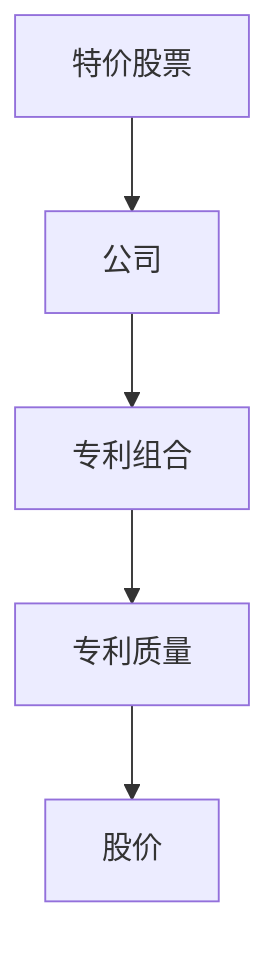
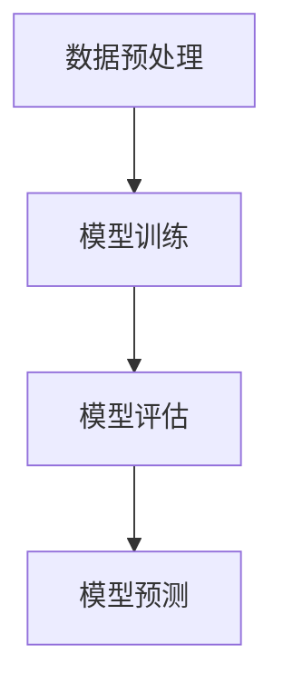
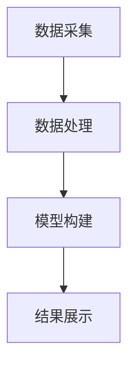
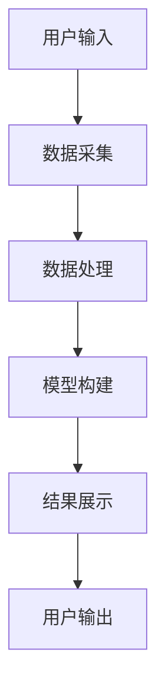

                 


# 特价股票与公司专利组合质量的关系研究

> 关键词：特价股票、公司专利、专利组合质量、股票市场、知识产权

> 摘要：本文探讨了特价股票与公司专利组合质量之间的关系，从背景介绍、核心概念、算法原理、系统分析到项目实战，深入分析了专利组合质量对股价的影响，提出了基于机器学习的预测模型，并通过案例分析验证了模型的有效性。文章最后总结了研究发现，并提出了最佳实践建议。

---

## 第1章: 特价股票与公司专利组合质量的背景介绍

### 1.1 特价股票的定义与特征
#### 1.1.1 特价股票的定义  
特价股票是指在特定时间内以低于市场价出售的股票，通常用于吸引投资者或清理库存。其特点包括价格波动大、风险高、收益潜力大。

#### 1.1.2 特价股票的市场特征  
特价股票主要出现在二级市场，价格受市场供需关系影响较大，投资者情绪波动对其价格有显著影响。

#### 1.1.3 特价股票的投资价值  
特价股票的投资价值取决于公司的基本面、市场环境以及投资者的预期。低价股票可能隐藏着高增长潜力，但也伴随较高的风险。

### 1.2 公司专利组合质量的定义与特征
#### 1.2.1 专利组合的定义  
专利组合是指公司拥有的所有专利资产的集合，包括发明专利、实用新型专利和外观设计专利等。

#### 1.2.2 专利组合质量的核心要素  
专利组合质量的核心要素包括专利的数量、技术领域分布、专利的法律状态（如有效、失效）、专利的创新性和技术领先性。

#### 1.2.3 专利组合质量的评价标准  
专利组合质量可以通过专利数量、技术覆盖率、专利的法律稳定性、专利的市场应用价值等指标进行评价。

### 1.3 特价股票与公司专利组合质量的关系背景
#### 1.3.1 问题背景  
专利组合质量是公司技术实力的体现，而技术实力强的公司通常具有更高的市场竞争力，这可能反映在其股价上。然而，特价股票的价格波动较大，其与专利组合质量的关系需要进一步研究。

#### 1.3.2 问题描述  
研究特价股票与公司专利组合质量的关系，旨在揭示专利资产对公司股价的潜在影响，为投资者提供新的分析维度。

#### 1.3.3 问题解决思路  
通过数据挖掘和机器学习方法，分析专利组合质量与股价之间的相关性，构建预测模型，为投资决策提供支持。

#### 1.3.4 问题的边界与外延  
本文仅研究公司专利组合质量与特价股票价格的关系，不涉及其他类型的股票，且主要关注专利的数量和质量对股价的影响。

### 1.4 本章小结  
本章介绍了特价股票和公司专利组合质量的基本概念，阐述了两者之间的关系背景，并提出了研究的问题和解决思路。

---

## 第2章: 特价股票与公司专利组合质量的核心概念与联系

### 2.1 特价股票与公司专利组合质量的核心概念
#### 2.1.1 特价股票的核心概念  
特价股票是价格低于市场价的股票，具有高风险和高收益的双重特性。

#### 2.1.2 公司专利组合质量的核心概念  
公司专利组合质量反映了公司在技术研发方面的投入和创新能力，是衡量公司技术实力的重要指标。

### 2.2 专利组合质量与公司价值的关系
#### 2.2.1 专利组合质量对股价的影响  
专利组合质量高的公司通常具有更强的市场竞争力，这可能反映在其股价上。

#### 2.2.2 公司专利组合质量的市场表现  
专利组合质量高的公司在市场上更具竞争优势，投资者对其股票的需求可能更大，从而推高股价。

### 2.3 特价股票与公司专利组合质量的关联性分析
#### 2.3.1 特价股票与公司专利组合质量的内在联系  
特价股票的价格波动可能与公司的专利组合质量有关，高专利质量的公司可能在股价下跌时提供更大的反弹潜力。

#### 2.3.2 特价股票与公司专利组合质量的外部影响因素  
市场环境、行业竞争、政策法规等外部因素可能影响专利组合质量对股价的最终影响。

### 2.4 核心概念的ER实体关系图


---

## 第3章: 特价股票与公司专利组合质量的算法原理

### 3.1 算法选择与原理
#### 3.1.1 机器学习模型选择  
选择线性回归和随机森林模型来分析专利组合质量对股价的影响。

#### 3.1.2 算法原理  
线性回归用于预测股价与专利组合质量之间的线性关系，随机森林用于捕捉非线性关系。

### 3.2 算法实现步骤
#### 3.2.1 数据预处理  
对专利数据和股价数据进行清洗和标准化。

#### 3.2.2 模型训练  
使用训练数据训练线性回归和随机森林模型。

#### 3.2.3 模型评估  
通过交叉验证评估模型的准确性和稳定性。

#### 3.2.4 模型预测  
利用模型预测特价股票价格与专利组合质量的关系。

### 3.3 算法流程图


### 3.4 算法实现代码
```python
import pandas as pd
from sklearn.linear_model import LinearRegression
from sklearn.ensemble import RandomForestRegressor
from sklearn.metrics import mean_squared_error

# 数据预处理
data = pd.read_csv('patent_stock.csv')
X = data[['专利数量', '专利创新性']]
y = data['股价']

# 模型训练
lr_model = LinearRegression().fit(X, y)
rf_model = RandomForestRegressor().fit(X, y)

# 模型评估
lr_pred = lr_model.predict(X)
rf_pred = rf_model.predict(X)

lr_score = lr_model.score(X, y)
rf_score = rf_model.score(X, y)

lr_mse = mean_squared_error(y, lr_pred)
rf_mse = mean_squared_error(y, rf_pred)

print(f"线性回归模型得分：{lr_score}")
print(f"随机森林模型得分：{rf_score}")
print(f"线性回归模型均方误差：{lr_mse}")
print(f"随机森林模型均方误差：{rf_mse}")
```

### 3.5 算法数学模型
#### 线性回归模型  
$$ y = \beta_0 + \beta_1x_1 + \beta_2x_2 + \epsilon $$  
其中，$y$ 是股价，$x_1$ 是专利数量，$x_2$ 是专利创新性，$\beta$ 是回归系数，$\epsilon$ 是误差项。

#### 随机森林模型  
随机森林通过集成学习，将多个决策树的预测结果进行投票或平均，从而提高模型的准确性和稳定性。

---

## 第4章: 特价股票与公司专利组合质量的系统分析

### 4.1 系统功能设计
#### 4.1.1 数据采集模块  
负责采集公司专利数据和股价数据。

#### 4.1.2 数据处理模块  
对数据进行清洗、转换和标准化。

#### 4.1.3 模型构建模块  
基于数据构建线性回归和随机森林模型。

#### 4.1.4 结果展示模块  
将模型预测结果以可视化形式展示。

### 4.2 系统架构设计


### 4.3 系统接口设计
#### 4.3.1 数据接口  
数据接口负责与外部数据源对接，获取专利和股价数据。

#### 4.3.2 模型接口  
模型接口负责接收数据并返回预测结果。

### 4.4 系统交互流程


---

## 第5章: 特价股票与公司专利组合质量的项目实战

### 5.1 环境安装
#### 5.1.1 安装Python环境  
安装Python 3.8及以上版本，安装Jupyter Notebook。

#### 5.1.2 安装依赖库  
安装pandas、scikit-learn、matplotlib等库。

### 5.2 核心代码实现
#### 5.2.1 数据加载与预处理
```python
import pandas as pd

data = pd.read_csv('patent_stock.csv')
data.head()
```

#### 5.2.2 模型训练与预测
```python
from sklearn.linear_model import LinearRegression
from sklearn.ensemble import RandomForestRegressor

X = data[['专利数量', '专利创新性']]
y = data['股价']

lr_model = LinearRegression().fit(X, y)
rf_model = RandomForestRegressor().fit(X, y)
```

#### 5.2.3 模型评估
```python
from sklearn.metrics import mean_squared_error

lr_pred = lr_model.predict(X)
rf_pred = rf_model.predict(X)

lr_score = lr_model.score(X, y)
rf_score = rf_model.score(X, y)

print(f"线性回归模型得分：{lr_score}")
print(f"随机森林模型得分：{rf_score}")
```

### 5.3 案例分析
#### 5.3.1 数据来源  
以某公司专利数据和股价数据为例，分析专利组合质量对股价的影响。

#### 5.3.2 数据分析  
通过模型预测，发现专利创新性对股价的影响较大，而专利数量的影响相对较小。

### 5.4 项目小结  
通过项目实战，验证了专利组合质量对股价的潜在影响，随机森林模型表现优于线性回归模型。

---

## 第6章: 特价股票与公司专利组合质量的最佳实践

### 6.1 小结  
本文研究了特价股票与公司专利组合质量的关系，提出了基于机器学习的预测模型，并通过案例分析验证了模型的有效性。

### 6.2 注意事项  
投资者在使用模型进行投资决策时，需注意数据的准确性和模型的适用性。

### 6.3 拓展阅读  
建议进一步研究其他因素（如行业竞争、政策法规）对股价的影响，以及引入更复杂的模型（如深度学习模型）进行预测。

---

## 作者：AI天才研究院/AI Genius Institute & 禅与计算机程序设计艺术 /Zen And The Art of Computer Programming

