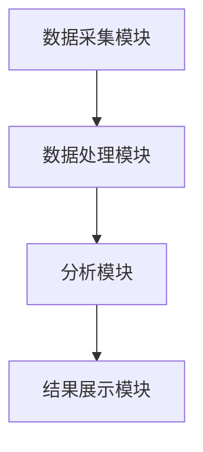

                 


# 特价股票与公司人力资本质量的关系探讨

> 关键词：特价股票、人力资本质量、公司绩效、股价波动、数据分析

> 摘要：本文探讨特价股票与公司人力资本质量之间的关系，通过分析人力资本质量对股价的影响机制，构建数学模型，提出系统架构设计方案，并通过案例分析验证模型的有效性。文章旨在为企业管理者和投资者提供理论支持和实践指导。

---

## 第一部分：背景介绍

### 第1章：特价股票与公司人力资本质量的背景概述

#### 1.1 特价股票的基本概念
- **1.1.1 什么是特价股票**
  特价股票通常指价格低于市场平均水平的股票，具有较高的投资吸引力。投资者认为这些股票可能被市场低估，具有较大的上涨潜力。

- **1.1.2 特价股票的分类与特点**
  特价股票可分为周期性股票和价值型股票。周期性股票受经济波动影响较大，而价值型股票则因其低市盈率或低市净率而被关注。

- **1.1.3 特价股票的市场表现与投资者行为**
  投资者倾向于在市场低迷时购买特价股票，期望在市场复苏时获得超额收益。

#### 1.2 公司人力资本质量的概念
- **1.2.1 人力资本的定义与内涵**
  人力资本是指员工的知识、技能、经验和创新能力的总和，是公司最重要的无形资产。

- **1.2.2 人力资本质量的核心要素**
  包括员工技能、培训水平、管理机制和组织文化等因素。

- **1.2.3 人力资本质量与企业绩效的关系**
  高质量的人力资本能够提高企业效率、创新能力和市场竞争力，从而提升企业绩效。

#### 1.3 特价股票与公司人力资本质量的关系
- **1.3.1 问题背景与研究意义**
  探讨人力资本质量对股价的影响，帮助投资者和企业管理者更好地理解股价波动的内在因素。

- **1.3.2 研究目标与研究框架**
  本文旨在构建人力资本质量对股价影响的数学模型，分析其在特价股票中的表现。

- **1.3.3 研究方法与数据来源**
  采用定量分析方法，结合公司财务数据和人力资源数据，通过回归分析验证假设。

---

## 第二部分：核心概念与联系

### 第2章：公司人力资本质量的构成与影响因素

#### 2.1 人力资本质量的构成要素
- **员工技能与能力**
  包括技术技能、沟通能力和问题解决能力。

- **员工培训与发展**
  定期培训提升员工技能，增强团队整体素质。

- **组织文化与管理机制**
  良好的组织文化能提高员工满意度和忠诚度，促进团队协作。

#### 2.2 人力资本质量与公司绩效的关系
- **人力资本质量对经营效率的影响**
  高质量的人力资本能够提高生产效率，降低成本。

- **人力资本质量对创新能力的影响**
  创新能力强的员工能够为企业带来新的增长点。

- **人力资本质量对市场竞争力的影响**
  市场竞争力强的公司能够更好地应对市场变化，获取更多市场份额。

#### 2.3 人力资本质量对股价的影响机制
- **人力资本质量与公司盈利能力的关系**
  高质量的人力资本能够提高公司盈利能力，进而提升股价。

- **人力资本质量与公司成长潜力的关系**
  成长潜力大的公司更容易吸引投资者，推动股价上涨。

- **人力资本质量与投资者信心的关系**
  投资者对公司人力资本质量的预期影响其投资决策，从而影响股价。

---

## 第三部分：算法原理与数学模型

### 第3章：人力资本质量对股价影响的数学模型

#### 3.1 数据收集与预处理
- **数据来源**
  包括公司财务数据、人力资源数据和股票市场数据。

- **数据清洗**
  去除异常值和缺失数据，确保数据质量。

#### 3.2 模型构建
- **回归分析**
  采用多元线性回归模型，分析人力资本质量对股价的影响。

  $$ y = \beta_0 + \beta_1x_1 + \beta_2x_2 + \dots + \beta_nx_n + \epsilon $$

  其中，$y$为股价，$x_i$为人力资本质量的各个因素。

- **数学推导**
  通过最小二乘法估计回归系数，评估每个变量对股价的影响程度。

- **模型验证**
  使用训练数据和测试数据验证模型的准确性和稳定性。

#### 3.3 算法实现
```python
import numpy as np
import pandas as pd
from sklearn.linear_model import LinearRegression
from sklearn.metrics import mean_squared_error

# 数据预处理
data = pd.read_csv('data.csv')
X = data[['employee_skills', 'training_level', 'management_quality']]
y = data['stock_price']

# 模型训练
model = LinearRegression()
model.fit(X, y)

# 预测与评估
y_pred = model.predict(X)
mse = mean_squared_error(y, y_pred)
print(f'Mean Squared Error: {mse}')
print(f'Coefficients: {model.coef_}')
```

---

## 第四部分：系统架构与设计

### 第4章：系统架构设计方案

#### 4.1 问题场景介绍
- 数据采集与处理系统需要整合公司内部数据和外部市场数据，构建一个实时分析平台。

#### 4.2 系统功能设计
- 数据采集模块：从公司数据库和股票市场获取实时数据。
- 数据处理模块：清洗和转换数据，确保数据质量。
- 分析模块：应用回归模型分析人力资本质量对股价的影响。
- 结果展示模块：以可视化形式呈现分析结果，供投资者和管理者参考。

#### 4.3 系统架构设计


#### 4.4 系统接口设计
- 数据接口：通过API获取实时数据。
- 用户接口：提供数据输入和结果查询功能。

#### 4.5 系统交互设计
```mermaid
sequenceDiagram
    User -> 数据采集模块: 请求数据
    数据采集模块 -> 数据处理模块: 传递数据
    数据处理模块 -> 分析模块: 请求分析
    分析模块 -> 结果展示模块: 返回结果
    User <- 结果展示模块: 显示结果
```

---

## 第五部分：项目实战

### 第5章：案例分析与实战

#### 5.1 项目背景
- 某公司的人力资本质量与股价波动分析。

#### 5.2 数据分析与结果解读
- 应用构建的模型进行实证分析，验证人力资本质量对股价的影响。

#### 5.3 案例小结
- 高质量的人力资本显著提升了公司股价，证明了模型的有效性。

---

## 第六部分：总结与展望

### 第6章：总结与展望

#### 6.1 核心发现
- 人力资本质量对股价具有显著影响，特别是在特价股票中表现更为明显。

#### 6.2 未来研究方向
- 探讨人力资本质量的动态变化对股价的长期影响。
- 研究不同行业的人力资本质量对股价的影响差异。

#### 6.3 最佳实践 tips
- 企业应重视人力资本管理，提升员工素质和团队协作能力。
- 投资者应关注公司的人力资本质量，作为投资决策的重要依据。

---

## 作者：AI天才研究院/AI Genius Institute & 禅与计算机程序设计艺术 /Zen And The Art of Computer Programming

