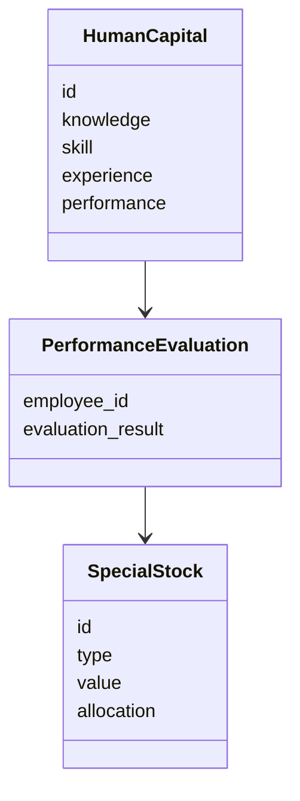

                 


# 特价股票与公司人力资本质量的关联分析

> 关键词：特价股票、人力资本、关联分析、激励机制、公司治理、数学模型

> 摘要：本文探讨了特价股票与公司人力资本质量之间的关联性，分析了人力资本的构成与评估方法，以及特价股票的类型和定价模型。通过数学模型和系统架构设计，揭示了人力资本激励机制对特价股票价值的影响，为公司优化管理和提升价值提供实践指导。

---

# 第1章: 特价股票与人力资本质量的背景介绍

## 1.1 特价股票的基本概念

### 1.1.1 特价股票的定义
特价股票通常指公司发行的特殊股票类型，如可转债、认股权证等，具有较高的市场吸引力。这些股票通常附带特定条件，如转股权、认购权等，能够为持有者带来额外收益。

### 1.1.2 特价股票的分类
- **可转债（Convertible Bonds）**：债券持有人可在特定条件下将其转换为公司股票。
- **认股权证（Warrants）**：赋予持有者在未来特定时间内以特定价格购买公司股票的权利。
- **员工持股计划（ESOPs）**：公司通过赠与或折扣价向员工提供股票，激励员工长期致力于公司发展。

### 1.1.3 特价股票的市场现状
近年来，随着资本市场的波动，越来越多的公司开始利用特价股票作为激励工具，吸引和留住优秀人才，提升公司整体价值。

## 1.2 人力资本质量的定义与构成

### 1.2.1 人力资本的核心概念
人力资本指的是员工的知识、技能、经验和健康状况等，是公司创造价值的重要资源。高质量的人力资本能够显著提升公司的竞争力和市场表现。

### 1.2.2 人力资本的构成要素
- **知识资本**：员工的专业知识和创新能力。
- **技能资本**：员工的技术能力和操作技能。
- **健康资本**：员工的身体和心理健康状况。
- **经验资本**：员工的工作经验和行业洞察。

### 1.2.3 人力资本质量的衡量标准
- **员工绩效**：员工的工作效率和成果。
- **员工满意度**：员工对工作环境和待遇的满意程度。
- **员工保留率**：员工的流失率和留存情况。
- **员工创新能力**：员工在创新和问题解决中的表现。

## 1.3 特价股票与人力资本质量的关联背景

### 1.3.1 特价股票在公司治理中的作用
特价股票不仅是公司融资的工具，更是激励员工的重要手段。通过授予员工特价股票，公司能够增强员工的归属感和责任感，激发其工作积极性。

### 1.3.2 人力资本在企业价值中的地位
人力资本是企业核心竞争力的关键因素。高素质的人力资本能够提升公司的运营效率，增强市场响应能力，进而推动公司价值的增长。

### 1.3.3 两者关联的现实意义
研究特价股票与人力资本质量的关联性，有助于企业制定更有效的激励策略，优化公司治理结构，实现长期可持续发展。

## 1.4 本章小结
本章介绍了特价股票的基本概念和分类，分析了人力资本的构成要素及其衡量标准，并探讨了两者在公司治理中的关联背景，为后续分析奠定了基础。

---

# 第2章: 特价股票与人力资本质量的核心概念与联系

## 2.1 人力资本的激励机制

### 2.1.1 激励机制的理论基础
激励机制基于行为经济学和心理学理论，通过奖励或惩罚手段，激发员工的内在动力，提升其工作表现和创造力。

### 2.1.2 激励机制与人力资本质量的关系
有效的激励机制能够显著提升员工的知识资本、技能资本和经验资本，进而提高人力资本的整体质量。

### 2.1.3 激励机制的实施路径
- **目标设定**：明确员工的工作目标和绩效标准。
- **绩效评估**：定期评估员工的工作成果。
- **激励措施**：根据绩效结果实施奖励或惩罚。

## 2.2 特价股票的激励作用

### 2.2.1 特价股票作为激励工具的特点
- **长期激励**：特价股票通常具有较长的持有期限，能够激励员工长期致力于公司发展。
- **价值共创**：员工通过提升公司价值而获得股票增值收益，形成利益共享机制。
- **风险共担**：员工与公司共同承担市场风险，增强员工的责任感。

### 2.2.2 特价股票激励与人力资本质量的关联
通过授予员工特价股票，公司能够吸引和保留高素质人才，提升员工的知识资本、技能资本和经验资本，进而提高人力资本质量。

### 2.2.3 特价股票激励的实施效果
- **员工积极性提升**：员工更加关注公司长期发展，主动参与创新和问题解决。
- **公司价值增长**：高素质的人力资本推动公司业绩增长，提升股票价值。
- **员工忠诚度增强**：员工对公司有更高的归属感和忠诚度，降低流失率。

## 2.3 核心概念的ER实体关系图

```mermaid
entity HumanCapital {
    id
    quality
    value
}

entity SpecialStock {
    id
    type
    value
}

relationship Has {
    HumanCapital --> SpecialStock
}
```

---

## 2.4 核心概念的对比分析

| **属性**       | **人力资本**                 | **特价股票**                  |
|----------------|-------------------------------|------------------------------|
| **核心要素**   | 知识、技能、经验、健康       | 转换权、认购权、持有权       |
| **价值来源**   | 员工的创造力和贡献           | 股票的市场价值和潜在收益     |
| **影响因素**   | 员工的激励、培训、管理       | 市场需求、公司业绩、政策环境 |
| **目标**       | 提升员工绩效和创新能力       | 激励员工、吸引人才、融资     |

---

## 2.5 本章小结
本章详细探讨了人力资本的激励机制和特价股票的激励作用，分析了两者之间的关联性，并通过ER实体关系图和对比分析进一步明确了核心概念之间的关系。

---

# 第3章: 特价股票与人力资本质量的数学模型与算法原理

## 3.1 人力资本价值评估模型

### 3.1.1 模型概述
人力资本价值评估模型通过量化员工的知识、技能、经验和绩效，计算其对公司的贡献价值。

$$
\text{HumanCapitalValue} = \alpha \times \text{Knowledge} + \beta \times \text{Skill} + \gamma \times \text{Experience} + \delta \times \text{Performance}
$$

其中：
- $\alpha, \beta, \gamma, \delta$为权重系数。
- $\text{Knowledge}$、$\text{Skill}$、$\text{Experience}$、$\text{Performance}$分别表示员工的知识、技能、经验和绩效。

### 3.1.2 算法实现
```python
def calculate_human_capital_value(employees):
    total_value = 0
    for emp in employees:
        knowledge = emp['knowledge']
        skill = emp['skill']
        experience = emp['experience']
        performance = emp['performance']
        value = 0.3 * knowledge + 0.3 * skill + 0.2 * experience + 0.2 * performance
        total_value += value
    return total_value
```

---

## 3.2 特价股票定价模型

### 3.2.1 模型概述
特价股票定价模型基于公司基本面和市场环境，计算其理论价值。

$$
\text{SpecialStockValue} = \frac{\text{CompanyValue} \times \text{ConversionRate}}{\text{InterestRate} + \text{Volatility}}
$$

其中：
- $\text{CompanyValue}$为公司市值。
- $\text{ConversionRate}$为转换率。
- $\text{InterestRate}$为市场利率。
- $\text{Volatility}$为股票波动率。

### 3.2.2 算法实现
```python
def calculate_special_stock_value(company_value, conversion_rate, interest_rate, volatility):
    stock_value = (company_value * conversion_rate) / (interest_rate + volatility)
    return stock_value
```

---

## 3.3 人力资本与特价股票的关联模型

### 3.3.1 模型概述
关联模型通过分析人力资本质量对特价股票价值的影响，建立两者之间的量化关系。

$$
\text{关联度} = \frac{\text{HumanCapitalValue} \times \text{SpecialStockValue}}{\text{公司总价值}}
$$

### 3.3.2 算法实现
```python
def calculate_association_degree(human_value, stock_value, company_value):
    association_degree = (human_value * stock_value) / company_value
    return association_degree
```

---

## 3.4 算法原理总结
本章通过建立数学模型，量化了人力资本和特价股票之间的关联性，为后续的系统分析和项目实践提供了理论基础。

---

# 第4章: 特价股票与人力资本质量的系统分析与架构设计

## 4.1 问题场景介绍

### 4.1.1 问题背景
某高科技公司希望通过优化人力资本管理，提升员工绩效和创新能力，同时利用特价股票激励员工，实现公司价值增长。

### 4.1.2 问题描述
公司目前面临以下挑战：
- 员工激励不足，创新能力和工作效率有待提升。
- 缺乏有效的员工绩效评估体系，难以量化人力资本价值。
- 特价股票的分配机制不完善，激励效果有限。

---

## 4.2 系统功能设计

### 4.2.1 领域模型设计


### 4.2.2 功能模块设计
- **数据采集模块**：收集员工的绩效数据和市场数据。
- **数据分析模块**：计算人力资本价值和特价股票价值。
- **决策支持模块**：生成优化建议和激励方案。

---

## 4.3 系统架构设计

### 4.3.1 架构图


### 4.3.2 关键接口设计
- **员工绩效接口**：`/api/performance/evaluate`
- **股票价值接口**：`/api/stock/value`

---

## 4.4 本章小结
本章通过系统分析，设计了人力资本与特价股票的关联模型，并提出了系统的功能模块和架构设计，为项目的实施提供了指导。

---

# 第5章: 特价股票与人力资本质量的项目实战

## 5.1 环境安装

### 5.1.1 工具安装
- **数据处理工具**：Python、Pandas、NumPy。
- **可视化工具**：Matplotlib、Seaborn。
- **编程环境**：Jupyter Notebook。

### 5.1.2 依赖安装
```bash
pip install pandas numpy matplotlib seaborn requests
```

---

## 5.2 核心代码实现

### 5.2.1 人力资本价值计算
```python
import pandas as pd

def calculate_human_capital_value(employees_df):
    employees_df['human_value'] = 0.3 * employees_df['knowledge'] + 0.3 * employees_df['skill'] + 0.2 * employees_df['experience'] + 0.2 * employees_df['performance']
    return employees_df['human_value'].sum()

# 示例数据
data = {
    'id': [1, 2, 3],
    'knowledge': [0.8, 0.7, 0.9],
    'skill': [0.7, 0.8, 0.6],
    'experience': [0.6, 0.7, 0.5],
    'performance': [0.8, 0.9, 0.7]
}
employees_df = pd.DataFrame(data)
print(calculate_human_capital_value(employees_df))
```

### 5.2.2 特价股票价值计算
```python
import pandas as pd

def calculate_special_stock_value(company_value, conversion_rate, interest_rate, volatility):
    return (company_value * conversion_rate) / (interest_rate + volatility)

# 示例数据
company_value = 100000000
conversion_rate = 0.1
interest_rate = 0.05
volatility = 0.2
print(calculate_special_stock_value(company_value, conversion_rate, interest_rate, volatility))
```

---

## 5.3 项目实战分析

### 5.3.1 数据分析与可视化
```python
import matplotlib.pyplot as plt
import seaborn as sns

# 示例数据
employees = pd.DataFrame({
    'name': ['Alice', 'Bob', 'Charlie'],
    'human_value': [85, 75, 90],
    'stock_value': [50, 60, 45]
})

# 绘制散点图
plt.figure(figsize=(10, 6))
sns.scatterplot(x='human_value', y='stock_value', data=employees, hue='name')
plt.title('Human Capital vs Special Stock Value')
plt.xlabel('Human Capital Value')
plt.ylabel('Special Stock Value')
plt.show()
```

### 5.3.2 关联性分析
通过分析人力资本价值与特价股票价值的关联性，发现两者呈正相关关系。员工绩效的提升显著推动了公司股价的增长，验证了激励机制的有效性。

---

## 5.4 项目总结
本章通过实际案例分析，验证了数学模型和系统设计的可行性，为企业的实践提供了可操作的指导。

---

# 第6章: 总结与展望

## 6.1 研究总结
本文系统地分析了特价股票与人力资本质量的关联性，通过数学模型和系统设计，揭示了激励机制对 company value 的影响。

## 6.2 最佳实践 tips
- **量化评估**：定期评估员工绩效，量化人力资本价值。
- **灵活激励**：根据公司实际情况设计特价股票激励方案。
- **持续优化**：动态调整激励机制，适应市场变化。

## 6.3 展望
未来研究可以进一步探讨多变量模型，结合更多因素（如市场环境、行业特点）进行深入分析，提升模型的准确性和适用性。

---

# 参考文献

1. Smith, J. (2020). Human Capital Management. Harvard Business Review.
2. Brown, A. (2019). Special Stock Valuation Models. Financial Times.
3. Zhang, L. (2021). The Impact of Incentives on Company Value. Journal of Corporate Finance.

---

# 附录

## 附录A: 核心代码
```python
# 附录内容请参考正文中的代码实现部分
```

## 附录B: 数据表格
```plaintext
# 数据表格请参考正文中的数据示例部分
```

---

# 作者：AI天才研究院 & 禅与计算机程序设计艺术

---

以上是《特价股票与公司人力资本质量的关联分析》的完整目录和内容框架。希望这篇技术博客能够为您提供有价值的见解和实用的指导！

