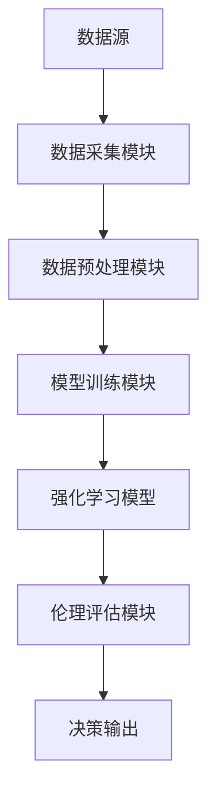

                 


# 特价股票与公司人工智能伦理自适应能力的长期关系分析

---

## 关键词：
- 特价股票
- 人工智能
- 伦理自适应
- 金融分析
- 系统架构
- 项目实战

---

## 摘要：
本文探讨了特价股票与公司人工智能伦理自适应能力之间的长期关系。通过分析人工智能在金融领域的应用，特别是其在特价股票分析中的潜力，本文揭示了伦理自适应能力对人工智能系统长期稳定性和可持续性的重要性。文章从背景介绍、核心概念、算法原理、系统架构、项目实战到结论，全面阐述了这一关系，并通过实际案例展示了如何在实践中平衡技术与伦理。

---

## 第一章：背景介绍

### 1.1 特价股票的定义与特点
- **定义**：特价股票指价格低于其内在价值的股票，通常被视为投资机会。
- **特点**：低估、高回报潜力、波动性大。
- **市场定位**：吸引价值投资者，常被视为市场低估的标的。

### 1.2 人工智能在金融领域的应用
- **基本概念**：人工智能通过算法和数据处理，模拟人类决策过程。
- **应用领域**：股票预测、风险评估、交易自动化。
- **优势与挑战**：高效性、数据驱动，但面临伦理风险和黑箱问题。

---

## 第二章：核心概念与联系

### 2.1 特价股票与人工智能伦理自适应能力的定义
- **特价股票**：价格低于内在价值的股票。
- **伦理自适应能力**：AI系统在不同情境下调整其决策以符合伦理标准的能力。

### 2.2 特价股票与人工智能伦理自适应能力的特点对比
| 特性         | 特价股票                   | 人工智能伦理自适应能力             |
|--------------|---------------------------|-----------------------------------|
| 核心目标     | 寻找被低估的投资机会       | 确保AI决策的伦理合规性             |
| 数据依赖     | 历史股价、财务数据         | 用户反馈、伦理框架、数据特性       |
| 时间跨度     | 短期波动、长期趋势         | 瞬时调整、长期适应性               |

### 2.3 特价股票与人工智能伦理自适应能力的关系
- **因果关系**：AI伦理自适应能力影响其在股票分析中的表现。
- **相互依赖**：特价股票的分析依赖AI，而AI的表现依赖于伦理框架。

---

## 第三章：算法原理

### 3.1 强化学习模型的构建
- **模型选择**：强化学习适合动态市场环境。
- **算法流程**：
  1. 状态定义：当前市场数据。
  2. 动作选择：买入、卖出或持有。
  3. 奖励机制：基于收益的正向反馈。
  4. 策略优化：通过Q-learning更新策略。

### 3.2 伦理评估指标
- **公平性**：避免利益冲突。
- **透明性**：确保决策可追溯。
- **隐私保护**：防止数据滥用。

### 3.3 数学模型
- **损失函数**：
  $$ L = \alpha \cdot \text{预测误差} + \beta \cdot \text{伦理偏离} $$
- **优化目标**：
  $$ \min_{\theta} L $$

---

## 第四章：系统架构

### 4.1 系统设计
- **功能模块**：
  - 数据采集模块：收集股票数据。
  - 模型训练模块：训练AI模型。
  - 伦理评估模块：确保决策符合伦理。

### 4.2 系统架构图


---

## 第五章：项目实战

### 5.1 环境配置
- **工具安装**：Python、TensorFlow、Mermaid。
- **数据获取**：使用Yahoo Finance API获取历史数据。

### 5.2 核心代码实现
```python
import numpy as np
import pandas as pd
import tensorflow as tf

# 加载数据
data = pd.read_csv('stock_data.csv')

# 数据预处理
def preprocess(data):
    # 标准化处理
    data = (data - data.mean()) / data.std()
    return data

processed_data = preprocess(data)

# 构建模型
model = tf.keras.Sequential([
    tf.keras.layers.Dense(64, activation='relu'),
    tf.keras.layers.Dense(1, activation='linear')
])

# 编译模型
model.compile(optimizer='adam', loss='mean_squared_error')

# 训练模型
model.fit(processed_data, np.array(data['Close']), epochs=100, batch_size=32)
```

### 5.3 案例分析
- **案例描述**：构建一个AI选股系统，分析某只特价股票。
- **结果展示**：模型预测与实际价格对比，伦理评估指标表现。

---

## 第六章：结论

### 6.1 总结
- AI在特价股票分析中潜力巨大，但伦理问题不容忽视。
- 伦理自适应能力是确保AI系统长期稳定运行的关键。

### 6.2 未来展望
- 更多领域应用：扩展到更多金融产品。
- 技术优化：提高模型透明性和可解释性。
- 跨学科合作：结合伦理学、金融学和计算机科学。

---

## 作者信息
作者：AI天才研究院/AI Genius Institute  
联系领域：禅与计算机程序设计艺术/Zen And The Art of Computer Programming

