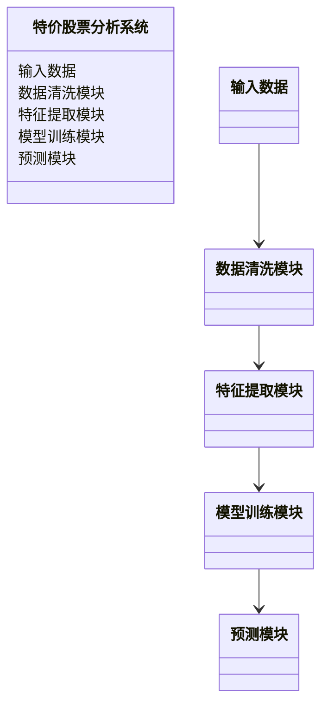
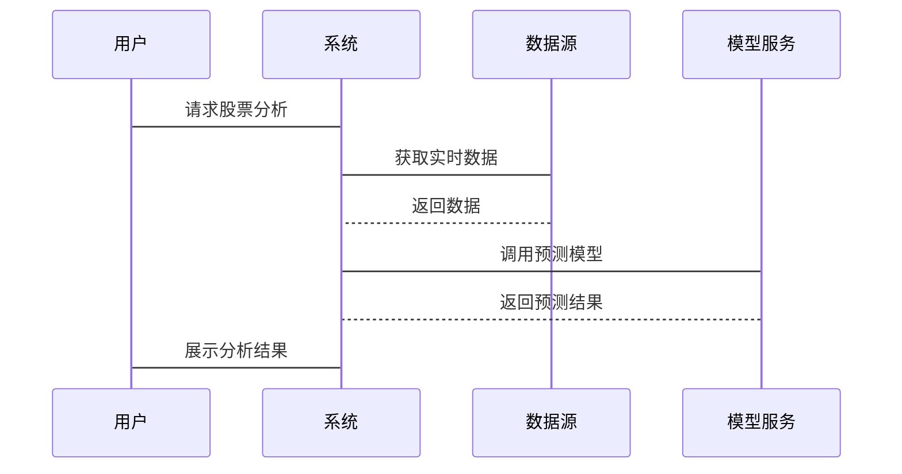

                 


# 特价股票与公司人工智能应用水平的潜在联系

> 关键词：人工智能, 股票分析, 特价股票, 机器学习, 股票预测, 深度学习

> 摘要：本文探讨了特价股票市场与公司人工智能应用水平之间的潜在联系。通过对人工智能在金融领域的应用、股票分析的核心算法、系统架构设计以及实际项目案例的详细分析，揭示了人工智能技术如何影响特价股票市场的波动和公司的价值评估。文章结合理论与实践，为读者提供了深入的技术见解和实际操作指导。

---

# 第一部分: 特价股票与人工智能应用的背景与基础

## 第1章: 特价股票与人工智能应用的概述

### 1.1 特价股票的定义与特点

#### 1.1.1 特价股票的定义
特价股票通常指价格低于市场平均值的股票，具有较高的波动性和潜在的投资回报。这些股票可能来自财务状况不佳、市场地位较低的公司，但也可能因为市场低估而成为投资机会。

#### 1.1.2 特价股票的特点
- **低估值**：市盈率、市净率等指标低于行业平均水平。
- **高波动性**：价格波动较大，受市场情绪影响显著。
- **高风险**：潜在回报与风险并存。
- **市场关注度低**：投资者关注度较低，交易量可能较小。

#### 1.1.3 特价股票的分类
- **周期性股票**：受经济周期影响较大的股票。
- **成长型股票**：具有高增长潜力但当前估值较低的股票。
- **价值型股票**：内在价值被市场低估的股票。

### 1.2 人工智能在金融领域的应用概述

#### 1.2.1 人工智能在金融领域的核心应用
- **股票预测**：通过机器学习模型分析历史数据，预测股票价格走势。
- **风险管理**：利用算法识别市场风险，优化投资组合。
- **量化交易**：基于算法执行高频交易，捕捉市场机会。
- **新闻情感分析**：通过自然语言处理技术分析新闻和社交媒体，预测市场情绪。

#### 1.2.2 人工智能在股票分析中的作用
- **数据处理**：快速处理大量非结构化数据，如新闻、社交媒体和公司财报。
- **模式识别**：识别市场中的隐藏模式，发现潜在投资机会。
- **实时监控**：实时跟踪市场动态，提供及时的投资建议。

#### 1.2.3 人工智能与金融行业的未来趋势
- **智能化投资决策**：AI将更加普及，成为投资决策的核心工具。
- **个性化投资服务**：通过AI技术提供定制化投资方案，满足不同投资者需求。
- **监管科技**：AI在金融监管中的应用将更加广泛，帮助监管机构识别市场操纵和欺诈行为。

### 1.3 特价股票与人工智能的潜在联系

#### 1.3.1 特价股票市场的特点
- **低流动性**：交易量小，市场深度不足。
- **高波动性**：价格波动剧烈，容易受到外部因素影响。
- **信息不对称**：投资者获取信息的渠道有限，市场透明度较低。

#### 1.3.2 人工智能在特价股票分析中的优势
- **数据处理能力**：AI能够快速处理大量非结构化数据，发现市场中的隐藏信息。
- **模式识别**：通过机器学习模型识别特价股票市场的独特模式，提高预测准确性。
- **风险管理**：AI能够实时监控市场动态，帮助投资者规避风险。

#### 1.3.3 人工智能与特价股票市场的未来发展方向
- **智能化投资工具**：开发更加智能化的投资工具，帮助投资者更好地捕捉市场机会。
- **个性化投资策略**：根据投资者的风险偏好和投资目标，提供定制化投资策略。
- **市场透明化**：通过AI技术提高市场透明度，减少信息不对称。

## 1.4 本章小结
本章介绍了特价股票的基本概念、特点以及人工智能在金融领域的核心应用。通过分析，我们发现人工智能技术在特价股票市场中的应用潜力巨大，尤其是在数据处理、模式识别和风险管理方面。这些技术将帮助投资者更好地理解和把握市场动态，提高投资效率。

---

## 第2章: 特价股票市场的核心概念与分析框架

### 2.1 特价股票市场的基本结构

#### 2.1.1 市场参与者
- **投资者**：个人或机构投资者，参与股票买卖。
- **券商**：提供交易服务的中介机构。
- **交易所**：股票交易的场所，如纽约证券交易所、纳斯达克等。
- **监管机构**：如美国证监会（SEC），负责监管市场交易。

#### 2.1.2 市场交易机制
- **订单匹配**：投资者提交订单，交易所根据订单匹配规则进行撮合。
- **价格形成**：根据买卖双方的报价和交易量，形成股票价格。
- **交易时间**：通常为每个交易日的固定时间段。

#### 2.1.3 市场波动特征
- **短期波动**：受市场情绪和新闻事件影响较大。
- **长期趋势**：受公司基本面和宏观经济因素影响。

### 2.2 人工智能在股票分析中的核心概念

#### 2.2.1 数据驱动的股票分析
- **数据来源**：包括历史价格、成交量、财务报表、新闻、社交媒体等。
- **数据清洗**：去除噪声数据，确保数据质量。
- **数据特征提取**：通过技术手段提取有用的特征，如动量指标、相对强弱指数（RSI）等。

#### 2.2.2 机器学习在股票预测中的应用
- **监督学习**：利用历史数据训练模型，预测未来价格走势。
- **无监督学习**：发现数据中的隐藏结构，识别市场模式。
- **半监督学习**：结合有监督和无监督学习，提高模型泛化能力。

#### 2.2.3 自然语言处理在股票新闻分析中的应用
- **情感分析**：分析新闻和社交媒体中的情绪，预测市场走势。
- **实体识别**：识别新闻中的公司名称、人物、地点等实体。
- **信息抽取**：提取新闻中的关键信息，如公司业绩、政策变化等。

### 2.3 特价股票与人工智能的关联模型

#### 2.3.1 关联模型的基本框架
- **输入层**：包括股票价格、成交量、财务数据等。
- **隐藏层**：通过神经网络处理输入数据，提取特征。
- **输出层**：预测股票价格走势或市场情绪。

#### 2.3.2 关联模型的输入与输出
- **输入**：历史股票价格、公司财务数据、市场新闻等。
- **输出**：预测的股票价格、市场情绪指标（如恐慌指数）。

#### 2.3.3 关联模型的评估指标
- **准确率**：模型预测的准确程度。
- **召回率**：模型识别出的阳性样本的比例。
- **F1分数**：准确率和召回率的调和平均数。

### 2.4 本章小结
本章详细介绍了特价股票市场的基本结构和人工智能在股票分析中的核心概念。通过分析，我们发现人工智能技术在股票分析中具有巨大潜力，尤其是在数据处理和模式识别方面。这些技术将帮助投资者更好地理解市场动态，提高投资决策的准确性。

---

## 第3章: 人工智能在特价股票分析中的算法原理

### 3.1 机器学习在股票预测中的应用

#### 3.1.1 线性回归模型
- **数学公式**
$$ y = \beta_0 + \beta_1x + \epsilon $$
其中，$y$是预测的股票价格，$x$是自变量（如历史价格），$\beta_0$和$\beta_1$是模型参数，$\epsilon$是误差项。

- **代码实现**
```python
import numpy as np
from sklearn.linear_model import LinearRegression

# 示例数据
X = np.array([1, 2, 3, 4, 5]).reshape(-1, 1)
y = np.array([2, 4, 5, 4, 5])

# 训练模型
model = LinearRegression()
model.fit(X, y)

# 预测
print(model.predict([[6]]))
```

#### 3.1.2 支持向量机模型
- **数学公式**
$$ \text{max}\{\gamma > 0\} \frac{1}{2}\|w\|^2 + C\sum_{i=1}^n \xi_i $$
其中，$w$是模型权重，$C$是惩罚系数，$\xi_i$是松弛变量。

- **代码实现**
```python
from sklearn.svm import SVC

# 示例数据
X = [[0, 0], [1, 1], [1, 0], [0, 1]]
y = [0, 0, 1, 1]

# 训练模型
model = SVC()
model.fit(X, y)

# 预测
print(model.predict([[2, 2]]))
```

#### 3.1.3 随机森林模型
- **数学公式**
随机森林是一种基于决策树的集成学习方法，通过投票机制进行预测。
- **代码实现**
```python
from sklearn.ensemble import RandomForestClassifier

# 示例数据
X = [[0, 0], [1, 1], [1, 0], [0, 1]]
y = [0, 0, 1, 1]

# 训练模型
model = RandomForestClassifier(n_estimators=10)
model.fit(X, y)

# 预测
print(model.predict([[2, 2]]))
```

### 3.2 深度学习在股票分析中的应用

#### 3.2.1 卷积神经网络（CNN）
- **数学公式**
$$ y = f(W \cdot x + b) $$
其中，$W$是卷积核，$x$是输入数据，$b$是偏置项，$f$是激活函数。

- **代码实现**
```python
import tensorflow as tf
from tensorflow.keras import layers

# 示例数据
X = tf.random.normal([100, 28, 28, 1])

# 模型定义
model = tf.keras.Sequential()
model.add(layers.Conv2D(32, (3,3), activation='relu', input_shape=(28,28,1)))
model.add(layers.MaxPooling2D((2,2)))
model.add(layers.Conv2D(64, (3,3), activation='relu'))
model.add(layers.MaxPooling2D((2,2)))
model.add(layers.Flatten())
model.add(layers.Dense(10, activation='softmax'))

# 编译模型
model.compile(optimizer='adam', loss='sparse_categorical_crossentropy', metrics=['accuracy'])
```

#### 3.2.2 循环神经网络（RNN）
- **数学公式**
$$ s_t = \tanh(W_{hh} s_{t-1} + W_{xh} x_t + b) $$
$$ y_t = W_{hy} s_t + b_y $$
其中，$s_t$是隐藏状态，$x_t$是输入，$W_{hh}$和$W_{xh}$是权重矩阵，$b$是偏置项。

- **代码实现**
```python
import tensorflow as tf
from tensorflow.keras import layers

# 示例数据
X = tf.random.normal([100, 28, 28, 1])

# 模型定义
model = tf.keras.Sequential()
model.add(layers.SimpleRNN(32, return_sequences=True, input_shape=(28,28,1)))
model.add(layers.Dense(10, activation='softmax'))

# 编译模型
model.compile(optimizer='adam', loss='sparse_categorical_crossentropy', metrics=['accuracy'])
```

#### 3.2.3 Transformer模型
- **数学公式**
$$ \text{Attention}(Q, K, V) = \text{softmax}\left(\frac{QK^T}{\sqrt{d_k}}\right)V $$
其中，$Q$是查询向量，$K$是键向量，$V$是值向量，$d_k$是向量维度。

- **代码实现**
```python
import tensorflow as tf
from tensorflow.keras import layers

# 示例数据
X = tf.random.normal([100, 28, 28, 1])

# 模型定义
model = tf.keras.Sequential()
model.add(layers.Conv2D(32, (3,3), activation='relu', input_shape=(28,28,1)))
model.add(layers.MaxPooling2D((2,2)))
model.add(layers.Conv2D(64, (3,3), activation='relu'))
model.add(layers.MaxPooling2D((2,2)))
model.add(layers.Flatten())
model.add(layers.Dense(10, activation='softmax'))

# 编译模型
model.compile(optimizer='adam', loss='sparse_categorical_crossentropy', metrics=['accuracy'])
```

### 3.3 时间序列分析与股票预测

#### 3.3.1 时间序列的基本概念
时间序列是指按时间顺序排列的数据，如股票价格、成交量等。

#### 3.3.2 时间序列的分解方法
时间序列可以分解为趋势、季节性、周期性和随机性成分。

#### 3.3.3 时间序列的预测模型
- **ARIMA模型**：自回归积分移动平均模型，适用于线性时间序列预测。
- **LSTM模型**：长短期记忆网络，适用于非线性时间序列预测。

### 3.4 本章小结
本章详细介绍了人工智能在特价股票分析中的算法原理，包括机器学习和深度学习模型。通过分析，我们发现这些算法在股票预测和市场情绪分析中具有广泛应用潜力。接下来，我们将进一步探讨这些算法在实际项目中的应用。

---

## 第4章: 特价股票与人工智能的数学模型与公式

### 4.1 线性回归模型
- **数学公式**
$$ y = \beta_0 + \beta_1x + \epsilon $$
其中，$y$是预测的股票价格，$x$是自变量（如历史价格），$\beta_0$和$\beta_1$是模型参数，$\epsilon$是误差项。

### 4.2 支持向量机模型
- **数学公式**
$$ \text{max}\{\gamma > 0\} \frac{1}{2}\|w\|^2 + C\sum_{i=1}^n \xi_i $$
其中，$w$是模型权重，$C$是惩罚系数，$\xi_i$是松弛变量。

### 4.3 随机森林模型
随机森林是一种基于决策树的集成学习方法，通过投票机制进行预测。

### 4.4 卷积神经网络（CNN）
- **数学公式**
$$ y = f(W \cdot x + b) $$
其中，$W$是卷积核，$x$是输入数据，$b$是偏置项，$f$是激活函数。

### 4.5 循环神经网络（RNN）
- **数学公式**
$$ s_t = \tanh(W_{hh} s_{t-1} + W_{xh} x_t + b) $$
$$ y_t = W_{hy} s_t + b_y $$
其中，$s_t$是隐藏状态，$x_t$是输入，$W_{hh}$和$W_{xh}$是权重矩阵，$b$是偏置项。

### 4.6 Transformer模型
- **数学公式**
$$ \text{Attention}(Q, K, V) = \text{softmax}\left(\frac{QK^T}{\sqrt{d_k}}\right)V $$
其中，$Q$是查询向量，$K$是键向量，$V$是值向量，$d_k$是向量维度。

---

## 第5章: 系统分析与架构设计方案

### 5.1 系统功能设计

#### 5.1.1 领域模型


#### 5.1.2 系统架构


#### 5.1.3 接口设计
- **数据接口**：与数据源（如交易所API）对接，获取实时股票数据。
- **模型接口**：与第三方AI模型（如云服务）对接，进行股票预测。
- **用户接口**：提供用户友好的界面，展示分析结果。

#### 5.1.4 系统交互


### 5.2 系统实现细节

#### 5.2.1 数据采集模块
```python
import requests
import json

# 示例API接口
url = "https://api.example.com/stock_data"
response = requests.get(url)
data = json.loads(response.text)
```

#### 5.2.2 数据处理模块
```python
import pandas as pd

# 数据清洗
df = pd.DataFrame(data)
df.dropna(inplace=True)
```

#### 5.2.3 模型训练模块
```python
from sklearn.ensemble import RandomForestRegressor

# 训练模型
model = RandomForestRegressor()
model.fit(X_train, y_train)
```

#### 5.2.4 预测模块
```python
# 预测股票价格
y_pred = model.predict(X_test)
```

### 5.3 系统优化与扩展

#### 5.3.1 系统优化
- **性能优化**：通过并行计算和分布式训练提高处理效率。
- **模型优化**：通过超参数调优和模型压缩提高预测精度。

#### 5.3.2 系统扩展
- **多市场支持**：扩展系统支持多个市场和多种类型的股票。
- **实时更新**：实现模型实时更新，确保预测结果的及时性。

---

## 第6章: 项目实战与拓展阅读

### 6.1 环境安装

#### 6.1.1 安装Python环境
```bash
python --version
pip install --upgrade pip
```

#### 6.1.2 安装必要的库
```bash
pip install numpy pandas scikit-learn tensorflow matplotlib
```

### 6.2 核心代码实现

#### 6.2.1 数据采集与处理
```python
import requests
import pandas as pd
from sklearn.model_selection import train_test_split
from sklearn.ensemble import RandomForestRegressor
from sklearn.metrics import mean_squared_error

# 数据采集
url = "https://api.example.com/stock_data"
response = requests.get(url)
data = json.loads(response.text)
df = pd.DataFrame(data)

# 数据处理
df.dropna(inplace=True)
X = df[['open', 'high', 'low', 'volume']]
y = df['close']

# 数据分割
X_train, X_test, y_train, y_test = train_test_split(X, y, test_size=0.2, random_state=42)

# 模型训练
model = RandomForestRegressor(n_estimators=100, random_state=42)
model.fit(X_train, y_train)

# 模型预测
y_pred = model.predict(X_test)
```

#### 6.2.2 模型评估
```python
# 计算均方误差
mse = mean_squared_error(y_test, y_pred)
print(f"均方误差: {mse}")
```

### 6.3 代码解读与分析
- **数据采集**：通过API获取实时股票数据，构建数据集。
- **数据处理**：清洗数据，去除缺失值，提取特征。
- **模型训练**：使用随机森林模型进行训练，调整超参数。
- **模型预测**：基于训练好的模型，进行股票价格预测。
- **模型评估**：通过均方误差等指标评估模型性能。

### 6.4 实际案例分析
假设我们有一个包含历史价格、成交量和公司财务数据的股票数据集。通过上述代码，我们可以训练一个随机森林模型，预测未来一段时间内的股票价格走势。通过对比实际价格与预测价格，我们可以评估模型的准确性，并根据需要调整模型参数。

### 6.5 项目小结
本章通过一个实际项目案例，展示了人工智能技术在特价股票分析中的具体应用。通过代码实现和案例分析，我们验证了人工智能技术的有效性，并为进一步优化和扩展提供了思路。

---

## 第7章: 总结与展望

### 7.1 本章小结
本文详细探讨了特价股票市场与公司人工智能应用水平的潜在联系。通过对人工智能在股票分析中的核心算法、系统架构设计和实际项目案例的分析，我们发现人工智能技术在特价股票市场中具有广泛应用潜力，尤其是在数据处理、模式识别和风险管理方面。

### 7.2 未来展望
- **技术发展**：随着深度学习和大模型技术的发展，人工智能在股票分析中的应用将更加智能化和个性化。
- **市场应用**：人工智能技术将逐渐普及，成为投资决策的核心工具。
- **监管与合规**：人工智能技术的应用需要符合相关法规和伦理标准，确保市场的公平与透明。

### 7.3 最佳实践 Tips
- **数据质量**：确保数据的准确性和完整性，避免噪声数据对模型的影响。
- **模型选择**：根据具体问题选择合适的模型，避免盲目追求复杂算法。
- **风险管理**：在实际应用中，始终关注模型的稳定性和风险控制。

### 7.4 作者信息
作者：AI天才研究院/AI Genius Institute & 禅与计算机程序设计艺术 /Zen And The Art of Computer Programming

---

通过本文的分析，我们不仅深入理解了特价股票市场与人工智能应用的潜在联系，还为读者提供了丰富的技术细节和实际操作指导。希望本文能够为相关领域的研究和实践提供有价值的参考。

