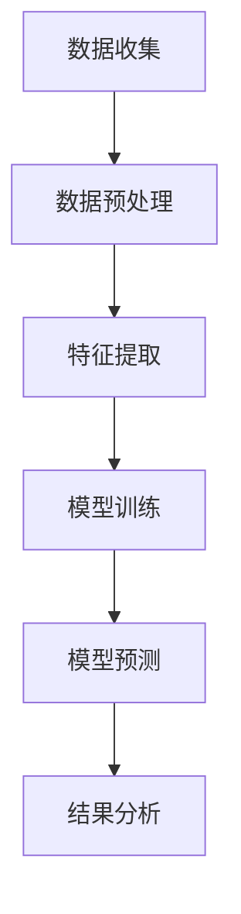
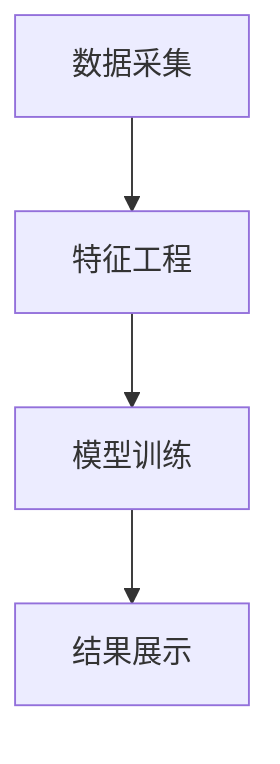

                 


# 特价股票与公司人工智能驱动决策能力的长期关系分析

> 关键词：特价股票、人工智能、公司决策、长期关系、股票分析、算法模型、投资策略

> 摘要：本文分析了特价股票与公司人工智能驱动决策能力之间的长期关系，探讨了人工智能如何影响公司的决策能力，并进一步影响特价股票的价值。文章从背景介绍、核心概念、算法原理、数学模型、系统架构、项目实战等多方面展开，结合实际案例和数学推导，深入剖析了两者之间的互动关系，并提出了相应的解决方案和优化建议。

---

## 第一部分: 特价股票与公司人工智能驱动决策能力的背景介绍

### 第1章: 特价股票与公司人工智能驱动决策能力概述

#### 1.1 特价股票的基本概念
##### 1.1.1 特价股票的定义与特征
特价股票是指市场价格低于其内在价值的股票。其特征包括：
- **低估值**：市场价格低于内在价值。
- **波动性**：价格波动较大，可能存在短期低估。
- **投资机会**：可能成为长期投资的高回报机会。

##### 1.1.2 特价股票的市场表现与投资价值
- **市场表现**：特价股票可能在短期内表现不佳，但长期来看，其价值回归的可能性较大。
- **投资价值**：投资者可以通过识别低估股票，获得超额收益。

##### 1.1.3 特价股票与公司基本面的关系
- **基本面分析**：公司财务状况、盈利能力、成长能力等因素决定了其股票的内在价值。
- **市场情绪**：市场情绪波动可能导致股票价格偏离其基本面价值。

#### 1.2 公司人工智能驱动决策能力的定义
##### 1.2.1 人工智能在公司决策中的应用
- **数据驱动决策**：通过大数据分析和机器学习模型，辅助公司做出更科学的决策。
- **预测与优化**：利用AI技术预测市场趋势，优化资源配置。

##### 1.2.2 人工智能驱动决策能力的核心要素
- **数据质量**：数据的准确性和完整性直接影响决策的准确性。
- **算法能力**：算法的复杂性和效率决定了决策的智能化水平。
- **计算能力**：强大的计算能力是AI驱动决策的基础。

##### 1.2.3 人工智能驱动决策能力的评估指标
- **决策准确率**：算法预测的准确率。
- **决策效率**：决策的响应速度。
- **决策效果**：决策带来的实际收益。

#### 1.3 特价股票与公司人工智能驱动决策能力的关联性
##### 1.3.1 特价股票与公司决策能力的互动关系
- **双向影响**：公司决策能力影响股票价格，股票价格反过来影响公司的决策。

##### 1.3.2 人工智能如何影响公司决策能力
- **数据处理能力**：AI能够快速处理大量数据，提升决策的效率和准确性。
- **预测能力**：AI可以预测市场趋势，帮助公司做出更明智的决策。

##### 1.3.3 公司决策能力如何影响特价股票的价值
- **价值发现**：强大的决策能力可以帮助公司识别低估股票，提升其市场价值。

---

### 第2章: 特价股票与公司人工智能驱动决策能力的背景分析

#### 2.1 特价股票市场的现状与趋势
- **现状**：当前市场中，特价股票仍然存在较多的投资机会。
- **趋势**：随着市场波动加剧，识别特价股票的需求增加。

#### 2.2 人工智能技术在金融领域的应用现状
- **现状**：AI技术已经在金融领域得到广泛应用，特别是在股票预测和交易策略制定方面。
- **趋势**：未来，AI技术将更加智能化，数据处理能力更强。

#### 2.3 特价股票与人工智能驱动决策能力的互动关系
- **互动关系**：AI驱动的决策能力可以帮助投资者识别特价股票，同时，特价股票的投资机会也推动了AI技术的发展。

---

## 第二部分: 特价股票与公司人工智能驱动决策能力的核心概念与联系

### 第3章: 特价股票与公司人工智能驱动决策能力的核心概念

#### 3.1 特价股票的核心属性
- **低估值**：市场价格低于内在价值。
- **波动性**：价格波动较大。
- **投资机会**：潜在的高回报机会。

#### 3.2 公司人工智能驱动决策能力的核心属性
- **数据处理能力**：能够快速处理大量数据。
- **预测能力**：能够准确预测市场趋势。
- **优化能力**：能够优化资源配置，提升效率。

#### 3.3 特价股票与公司人工智能驱动决策能力的属性对比
| 特性          | 特价股票                     | 人工智能驱动决策能力                 |
|---------------|------------------------------|----------------------------------------|
| 核心目标      | 获取超额收益                 | 提高决策的准确性和效率               |
| 数据依赖      | 股票价格、公司基本面数据     | 大数据分析、机器学习模型             |
| 实施难度      | 中等                         | 高                                   |

#### 3.4 特价股票与公司人工智能驱动决策能力的ER实体关系图
```mermaid
er
 entity: 特价股票
 entity: 公司决策能力
 relationship: 双向影响
```

---

## 第三部分: 特价股票与公司人工智能驱动决策能力的算法原理

### 第4章: 特价股票预测的算法原理

#### 4.1 基于机器学习的股票预测算法
##### 4.1.1 算法流程


##### 4.1.2 算法实现
```python
# 数据预处理
import pandas as pd
import numpy as np

data = pd.read_csv('stock_data.csv')
data = data.dropna()

# 特征提取
features = data[['price', 'volume', 'earnings_per_share']]
labels = data['is_discount_stock']

# 模型训练
from sklearn.model import DecisionTreeClassifier

model = DecisionTreeClassifier()
model.fit(features, labels)

# 模型预测
predicted_labels = model.predict(features)
```

##### 4.1.3 算法优化
- **参数调优**：通过网格搜索优化模型参数。
- **特征选择**：使用特征重要性筛选关键特征。

#### 4.2 特价股票预测的数学模型
##### 4.2.1 线性回归模型
$$ y = \beta_0 + \beta_1x + \epsilon $$

##### 4.2.2 随机森林模型
$$ y = \sum_{i=1}^{n} \text{Tree}(x) $$

---

## 第四部分: 特价股票与公司人工智能驱动决策能力的系统分析与架构设计

### 第5章: 特价股票预测系统的架构设计

#### 5.1 系统功能设计
##### 5.1.1 系统功能模块
- **数据采集模块**：采集股票数据。
- **特征工程模块**：提取特征。
- **模型训练模块**：训练预测模型。
- **结果展示模块**：展示预测结果。

##### 5.1.2 系统流程图


#### 5.2 系统架构设计
##### 5.2.1 系统架构图


---

## 第五部分: 特价股票与公司人工智能驱动决策能力的项目实战

### 第6章: 特价股票预测系统的实现

#### 6.1 环境安装
- **Python**：安装Anaconda环境。
- **库安装**：安装Pandas、Scikit-learn、Mermaid等库。

#### 6.2 系统核心代码实现
##### 6.2.1 数据预处理
```python
import pandas as pd
import numpy as np

data = pd.read_csv('stock_data.csv')
data = data.dropna()

# 特征提取
features = data[['price', 'volume', 'earnings_per_share']]
labels = data['is_discount_stock']
```

##### 6.2.2 模型训练
```python
from sklearn.model import DecisionTreeClassifier

model = DecisionTreeClassifier()
model.fit(features, labels)
```

##### 6.2.3 模型预测
```python
predicted_labels = model.predict(features)
```

#### 6.3 实际案例分析
- **案例分析**：分析某段时间内的特价股票。
- **结果解读**：解读模型预测结果，评估模型的准确性和稳定性。

---

## 第六部分: 特价股票与公司人工智能驱动决策能力的总结与展望

### 第7章: 总结与展望

#### 7.1 项目总结
- **项目成果**：成功构建了基于AI的特价股票预测系统。
- **项目经验**：数据质量和模型选择对结果影响重大。

#### 7.2 未来展望
- **技术优化**：进一步优化算法，提升预测准确率。
- **应用场景扩展**：将系统应用于更多金融领域。

---

## 作者：AI天才研究院（AI Genius Institute） & 禅与计算机程序设计艺术（Zen And The Art of Computer Programming）

---

以上是《特价股票与公司人工智能驱动决策能力的长期关系分析》的技术博客文章的完整目录大纲及部分核心内容。如需进一步扩展或补充，请随时告知！

