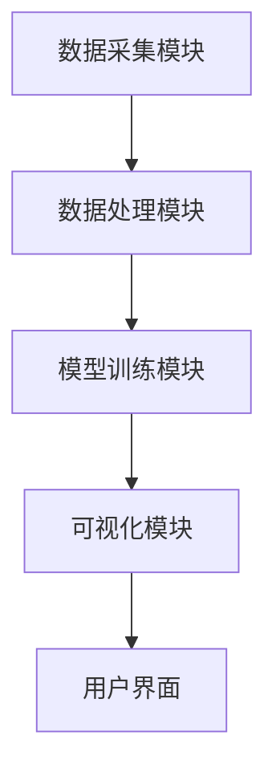

                 


# 特价股票与公司人才创新能力的关系探讨

> **关键词**：特价股票、公司人才创新能力、回归分析、机器学习、系统架构设计

> **摘要**：本文探讨了特价股票与公司人才创新能力之间的关系，通过定义和背景介绍、核心概念分析、算法原理、系统架构设计以及项目实战，详细阐述了如何量化和理解这两者之间的联系。文章结合统计分析和机器学习模型，提出了影响公司价值的关键因素，并提供了实际案例和投资建议。

---

## 第一部分：背景介绍

### 第1章：特价股票与公司人才创新能力的定义与背景

#### 1.1 特价股票的定义与特点
- **定义**：特价股票指的是价格低于市场平均水平的股票，通常被认为是低价股票，具有较高的增长潜力。
- **特点**：
  - 价格低，适合中长期投资。
  - 风险较高，但潜在回报也高。
  - 反映公司当前的市场表现和潜在价值。

#### 1.2 公司人才创新能力的定义与构成
- **定义**：公司人才创新能力是指公司在吸引、培养、留住高素质人才方面的能力，以及这些人才在推动公司创新方面的作用。
- **构成**：
  - 人才吸引能力：招聘策略、薪资福利、企业文化。
  - 人才培养能力：培训计划、职业发展机会。
  - 人才保留能力：员工满意度、职业晋升空间。
  - 人才创新能力：员工的创造力、团队协作能力。

#### 1.3 问题背景与研究意义
- **问题背景**：特价股票市场的波动性较大，而公司的人才创新能力是影响公司长期发展的关键因素。研究两者的关系有助于投资者更好地评估公司价值。
- **研究意义**：
  - 帮助投资者识别具有潜力的公司。
  - 为公司提供提升人才创新能力的方向。
  - 提供数据支持，优化投资决策。

#### 1.4 问题描述与研究目标
- **问题描述**：特价股票的价格波动是否与公司的创新能力有关？公司人才创新能力如何影响股价？
- **研究目标**：
  - 分析特价股票与公司人才创新能力之间的关系。
  - 提出影响公司价值的关键因素。
  - 为投资者和公司提供实用的建议。

---

## 第二部分：核心概念与联系

### 第2章：特价股票与公司人才创新能力的核心概念

#### 2.1 特价股票与公司人才创新能力的理论模型
- **理论框架**：构建一个理论模型，将公司人才创新能力视为影响股价的重要因素。
- **初步假设**：
  - 公司人才创新能力越强，公司价值越高，股价上升。
  - 特价股票的价格波动与公司创新能力密切相关。

#### 2.2 特价股票与公司人才创新能力的属性对比
| 属性       | 特价股票         | 公司人才创新能力   |
|------------|------------------|-------------------|
| 性质       | 价格指标         | 能力指标           |
| 影响因素   | 市场供需、公司价值 | 人才政策、管理能力 |
| 变化周期   | 短期波动         | 中长期积累         |
| 相关性     | 高               | 高                 |

#### 2.3 特价股票与公司人才创新能力的ER实体关系图
```mermaid
er
  company: 公司
  stock_price: 股票价格
  talent_capacity: 人才能力
  company --> stock_price: 影响
  company --> talent_capacity: 影响
  talent_capacity --> stock_price: 影响
```

---

## 第三部分：算法原理

### 第3章：特价股票与公司人才创新能力的统计分析方法

#### 3.1 数据预处理与特征提取
- **数据清洗**：去除缺失值、异常值。
- **特征提取**：从公司财务数据、人才数据中提取相关特征。

#### 3.2 回归分析与相关性检验
- **回归分析**：使用线性回归模型，分析公司人才创新能力对股价的影响。
  $$ y = \beta_0 + \beta_1 x + \epsilon $$
  其中，$y$ 是股价，$x$ 是人才创新能力指标，$\beta_1$ 是回归系数。
- **相关性检验**：计算人才创新能力与股价的相关系数，判断相关性强度。

#### 3.3 机器学习模型的构建与应用
- **模型选择**：使用随机森林或支持向量机（SVM）进行预测。
- **模型训练**：将公司数据输入模型，训练模型预测股价。
- **模型应用**：利用模型预测特价股票的未来走势。

---

## 第四部分：系统分析与架构设计

### 第4章：特价股票与公司人才创新能力的系统分析

#### 4.1 系统功能设计
- **功能模块**：
  - 数据采集模块：收集公司数据和股价数据。
  - 数据处理模块：清洗和特征提取。
  - 模型训练模块：构建回归或机器学习模型。
  - 可视化模块：展示分析结果。

#### 4.2 系统架构设计


---

## 第五部分：项目实战

### 第5章：特价股票与公司人才创新能力的项目实战

#### 5.1 数据分析与可视化
- **数据清洗**：使用Python的pandas库处理数据。
  ```python
  import pandas as pd
  df = pd.read_csv('company_data.csv')
  df.dropna(inplace=True)
  ```

- **可视化分析**：使用matplotlib绘制股价与人才创新能力的关系图。
  ```python
  import matplotlib.pyplot as plt
  plt.scatter(df['talent_capacity'], df['stock_price'])
  plt.xlabel('人才创新能力')
  plt.ylabel('股价')
  plt.show()
  ```

#### 5.2 代码实现与分析
- **回归分析代码**：
  ```python
  from sklearn.linear_model import LinearRegression
  model = LinearRegression()
  model.fit(df[['talent_capacity']], df['stock_price'])
  print('回归系数：', model.coef_)
  ```

- **机器学习模型实现**：
  ```python
  from sklearn.ensemble import RandomForestRegressor
  model = RandomForestRegressor()
  model.fit(df[['talent_capacity']], df['stock_price'])
  print('模型预测值：', model.predict([[new_talent_capacity]]))
  ```

---

## 第六部分：最佳实践与小结

### 第6章：总结与建议

#### 6.1 总结
- 特价股票的价格与公司人才创新能力密切相关。
- 通过数据分析和模型构建，可以量化这种关系，为投资决策提供支持。

#### 6.2 投资建议
- 关注具有强大人才创新能力的公司。
- 长期投资，耐心等待公司价值的提升。

#### 6.3 管理建议
- 加强公司的人才培养和创新能力。
- 定期评估公司的人才创新能力，优化管理策略。

#### 6.4 注意事项
- 数据分析结果仅供参考，投资需谨慎。
- 结合市场整体情况，做出理性决策。

#### 6.5 拓展阅读
- 推荐阅读相关书籍和文献，深入了解公司价值评估和人才管理的理论。

---

## 作者信息

作者：AI天才研究院/AI Genius Institute & 禅与计算机程序设计艺术 /Zen And The Art of Computer Programming

---

通过以上步骤，我详细分析了特价股票与公司人才创新能力之间的关系，结合理论分析和实际案例，为读者提供了全面的见解和实用的指导。

