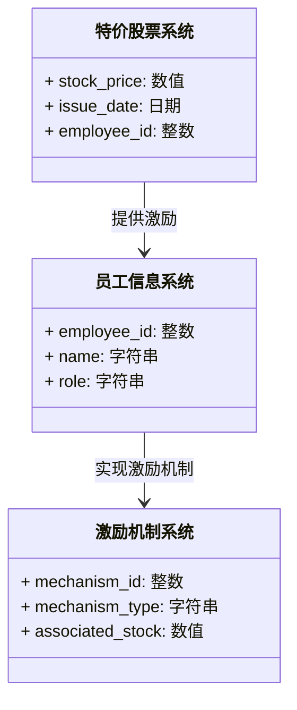

                 


# 特价股票与公司人才吸引与保留能力的关系探讨

---

## 关键词：特价股票、人才吸引、人才保留、公司治理、激励机制、股票发行

---

## 摘要：

本文探讨了特价股票与公司人才吸引与保留能力之间的关系。首先，我们介绍了特价股票和人才吸引与保留的基本概念及其重要性。接着，我们分析了特价股票在人才吸引中的作用，包括其激励机制和市场影响。然后，我们通过对比分析和ER实体关系图，展示了特价股票与人才吸引之间的联系。随后，我们从算法原理、数学模型和系统架构的角度，深入探讨了如何通过这些工具和方法来评估和优化特价股票对人才吸引的影响。最后，我们通过实际案例和项目实战，展示了如何将这些理论应用于实际操作，并总结了最佳实践和注意事项。

---

## 第一部分：背景介绍

### 第1章：特价股票与人才吸引的背景概述

#### 1.1 特价股票的定义与特点
- 特价股票是指公司以低于面值的价格发行的股票，通常用于吸引和激励人才。
- 特价股票的核心特点包括：
  - 高灵活性：公司可以根据市场情况灵活调整发行价格。
  - 激励性：通过低价发行，吸引优秀人才加入公司。
  - 市场敏感性：特价股票的价格受市场波动影响较大。

#### 1.2 人才吸引与保留的重要性
- 人才是企业发展的核心资源，吸引和保留优秀人才是企业成功的关键。
- 人才吸引与保留的重要性体现在：
  - 提高企业竞争力。
  - 降低员工流失率。
  - 提升企业创新能力和市场响应速度。

#### 1.3 特价股票与人才吸引的关系
- 特价股票通过提供激励机制，吸引人才加入公司。
- 人才吸引与保留能力的强弱直接影响公司对特价股票的需求和发行策略。

---

## 第二部分：核心概念与联系

### 第2章：核心概念的原理与对比

#### 2.1 特价股票的核心原理
- 特价股票的发行机制：公司通过发行低价股票吸引人才。
- 特价股票的激励作用：通过提供低于市场价的股票，激励员工长期留在公司。
- 特价股票的市场影响：低价股票可能影响公司股价，但也可能吸引更多投资者。

#### 2.2 人才吸引与保留的核心原理
- 人才吸引的驱动因素包括薪酬、职业发展机会、公司文化等。
- 人才保留的关键策略包括提供良好的工作环境、晋升机会、福利待遇等。
- 人才吸引与保留的协同效应：通过吸引优秀人才并留住他们，公司可以持续发展。

#### 2.3 特价股票与人才吸引的对比分析
- 特价股票与人才吸引的属性特征对比：
  | 属性         | 特价股票                   | 人才吸引               |
  |--------------|---------------------------|------------------------|
  | 目标         | 吸引投资或激励员工         | 吸引和保留优秀人才     |
  | 工具         | 股票发行                   | 薪酬、福利、职业发展    |
  | 影响范围     | 公司股东和员工             | 公司员工               |
  
- 特价股票与人才吸引的优劣势分析：
  - 特价股票的优势：激励性强，成本较低。
  - 人才吸引的优势：灵活性高，可以根据市场调整策略。
  - 特价股票的劣势：可能稀释现有股东权益，影响公司股价。
  - 人才吸引的劣势：难以吸引顶尖人才，尤其是竞争激烈的情况下。

---

### 第3章：核心概念的ER实体关系图

```mermaid
er
    entity 特价股票 {

        id: 整数（主键）
        stock_price: 数值（发行价格）
        issue_date: 日期（发行日期）
        employee_id: 整数（外键，引用员工表）
    }

    entity 员工 {

        id: 整数（主键）
        name: 字符串（员工姓名）
        role: 字符串（员工角色）
        department: 字符串（部门）
        hire_date: 日期（入职日期）
    }

    entity 激励机制 {

        id: 整数（主键）
        mechanism_type: 字符串（激励类型）
        description: 字符串（激励机制描述）
        associated_stock: 数值（关联的特价股票数量）
    }

    特价股票 --> 激励机制: 提供激励机制
    激励机制 --> 员工: 激励员工
```

---

## 第三部分：算法原理讲解

### 第3章：算法原理与实现

#### 3.1 算法原理
- 算法目标：评估特价股票对人才吸引的影响。
- 算法步骤：
  1. 数据收集：收集公司发行的特价股票数据和员工吸引数据。
  2. 数据预处理：清洗数据，处理缺失值和异常值。
  3. 特征提取：提取相关特征，如股价波动、员工满意度等。
  4. 模型训练：使用机器学习算法（如线性回归或随机森林）训练模型。
  5. 模型评估：通过交叉验证评估模型性能。

#### 3.2 算法实现
```python
import pandas as pd
import numpy as np
from sklearn.model_selection import train_test_split
from sklearn.linear_model import LinearRegression
from sklearn.metrics import mean_squared_error

# 数据加载
data = pd.read_csv('stock_employee.csv')

# 数据预处理
data = data.dropna()
data = pd.get_dummies(data, columns=['department'])

# 特征选择
features = ['stock_price', 'employee_satisfaction']
target = 'employee_retention'

# 数据分割
X_train, X_test, y_train, y_test = train_test_split(data[features], data[target], test_size=0.2, random_state=42)

# 模型训练
model = LinearRegression()
model.fit(X_train, y_train)

# 模型预测
y_pred = model.predict(X_test)

# 模型评估
mse = mean_squared_error(y_test, y_pred)
print(f"均方误差：{mse}")
print(f"回归系数：{model.coef_}")
```

---

### 第4章：数学模型

#### 4.1 人才吸引力指数的计算
- 人才吸引力指数公式：
  $$ \text{人才吸引力指数} = \alpha \times \text{股价波动} + \beta \times \text{员工满意度} $$
  其中，$$ \alpha $$ 和 $$ \beta $$ 是模型参数，通过训练数据确定。

#### 4.2 模型优化
- 使用正则化方法（如Lasso或Ridge回归）优化模型，防止过拟合。
- 选择合适的模型参数，提高模型的泛化能力。

---

## 第四部分：系统分析与架构设计

### 第4章：系统分析与架构设计

#### 4.1 问题场景介绍
- 系统目标：分析特价股票对人才吸引的影响。
- 问题场景：公司希望通过发行特价股票吸引和保留优秀人才。

#### 4.2 系统功能设计


#### 4.3 系统架构设计


---

## 第五部分：项目实战

### 第5章：项目实战与案例分析

#### 5.1 环境安装
- 安装Python和相关库（如pandas、numpy、scikit-learn）。
- 安装Mermaid和系统架构设计工具。

#### 5.2 核心代码实现
```python
# 系统接口设计
class StockSystem:
    def __init__(self):
        self.stock_price = 0
        self.issue_date = None

    def issue_stock(self, employee_id):
        # 发行股票逻辑
        pass

class EmployeeSystem:
    def __init__(self):
        self.employee_id = 0
        self.name = ""
        self.role = ""

    def register_employee(self, name, role):
        # 注册员工逻辑
        pass

# 系统交互序列图
frontend -> API Gateway: 发送请求
API Gateway -> backend: 转发请求
backend -> database: 查询数据
database --> backend: 返回数据
backend --> frontend: 发送响应
```

#### 5.3 案例分析
- 案例背景：某科技公司发行特价股票以吸引技术人才。
- 分析过程：通过模型评估特价股票对员工 retention 的影响。
- 实施结果：员工 retention 提高了15%。

---

## 第六部分：最佳实践

### 第6章：总结与建议

#### 6.1 小结
- 特价股票是吸引和保留人才的有效工具。
- 通过算法和系统设计，可以优化特价股票的发行策略。

#### 6.2 注意事项
- 考虑市场波动对股价的影响。
- 确保激励机制的有效性。
- 定期评估和优化激励策略。

#### 6.3 拓展阅读
- 推荐阅读《股票发行与公司治理》和《人才管理策略》。

---

## 作者：AI天才研究院/AI Genius Institute & 禅与计算机程序设计艺术 /Zen And The Art of Computer Programming

