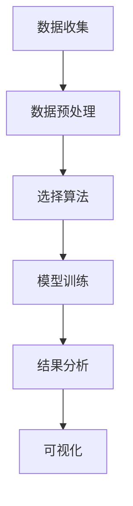
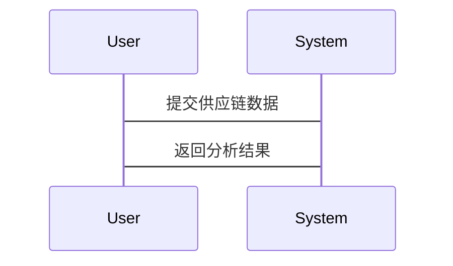

                 


# 特价股票与公司供应链数字化水平的关系探讨

## 关键词：供应链数字化，特价股票，数据分析，回归分析，股价预测

## 摘要：  
本文探讨了特价股票与公司供应链数字化水平之间的关系。通过分析供应链数字化的核心概念、量化方法和系统架构，结合实际案例和算法模型，本文揭示了供应链数字化如何影响股价，为投资者和企业管理者提供了科学的决策依据。文章内容包括背景介绍、核心概念解析、算法原理、系统设计、项目实战和最佳实践等部分。

---

# 第一部分：背景介绍

## 第1章：特价股票与供应链数字化概述

### 1.1 特价股票的基本概念  
- **1.1.1 特价股票的定义与特征**  
  特价股票是指价格低于市场平均水平的股票，通常代表公司处于困境或具有较大的增长潜力。  
- **1.1.2 特价股票的投资价值**  
  特价股票可能隐藏投资机会，但风险较高，需要结合公司基本面进行分析。  
- **1.1.3 特价股票的市场表现**  
  特价股票的波动性较大，但长期表现可能优于市场平均水平。

### 1.2 供应链数字化的基本概念  
- **1.2.1 供应链数字化的定义与内涵**  
  供应链数字化是指利用数字技术（如大数据、物联网、人工智能）优化供应链管理的过程。  
- **1.2.2 供应链数字化的核心要素**  
  包括数据采集、自动化管理、实时监控和智能决策。  
- **1.2.3 供应链数字化的现状与趋势**  
  当前，供应链数字化已成为企业提升竞争力的重要手段，未来将更加智能化和自动化。

### 1.3 特价股票与供应链数字化的关系  
- **1.3.1 供应链数字化对股价的影响**  
  供应链数字化提升企业效率，降低成本，通常会推动股价上升。  
- **1.3.2 特价股票与供应链效率的关系**  
  高效率的供应链可能使公司股票从低价区回升。  
- **1.3.3 供应链数字化对投资决策的影响**  
  投资者应关注公司供应链数字化水平，以评估其长期发展潜力。

---

# 第二部分：核心概念与联系

## 第2章：供应链数字化的原理与机制

### 2.1 供应链数字化的原理  
- **2.1.1 数字化技术在供应链中的应用**  
  包括数据采集、实时监控和智能预测。  
- **2.1.2 供应链数字化的实现方式**  
  通过物联网设备、ERP系统和数据分析工具实现。  
- **2.1.3 数字化对供应链效率的提升**  
  通过自动化减少人为错误，提高响应速度。

### 2.2 供应链数字化与股价的关系  
- **2.2.1 供应链效率对股价的影响**  
  高效率供应链降低成本，提升利润，推动股价上涨。  
- **2.2.2 供应链透明度对投资信心的影响**  
  透明的供应链管理增强投资者对公司的信任，提升股价。  
- **2.2.3 供应链数字化对风险控制的作用**  
  数字化帮助公司更好地应对供应链中断风险，降低股价波动。

### 2.3 特价股票与供应链数字化的相互作用  
- **2.3.1 特价股票作为供应链数字化的指标**  
  供应链数字化水平高的公司可能从低价股变为高价股。  
- **2.3.2 供应链数字化推动股价变化的机制**  
  通过提升效率和降低成本，推动股价上升。  
- **2.3.3 特价股票与供应链数字化的协同效应**  
  供应链数字化帮助公司从特价股票中恢复，提升股价。

---

# 第三部分：算法原理与数据分析

## 第3章：供应链数字化水平的量化分析

### 3.1 数据分析方法  
- **3.1.1 回归分析法**  
  用于分析供应链数字化水平与股价之间的关系。  
- **3.1.2 聚类分析法**  
  用于分类公司供应链数字化的水平。  
- **3.1.3 时间序列分析法**  
  分析供应链数字化对股价的长期影响。

### 3.2 供应链数字化的数学模型  
- **3.2.1 数学模型构建**  
  使用回归模型分析供应链数字化指数对股价的影响。  
- **3.2.2 模型参数解释**  
  每个参数代表供应链数字化的某个维度（如效率、透明度）。  
- **3.2.3 模型的验证与优化**  
  使用历史数据验证模型，并进行参数调整。

### 3.3 算法实现与流程图  


### 3.4 算法实现代码  
```python
import pandas as pd
from sklearn.linear_model import LinearRegression

# 数据预处理
data = pd.read_csv('supply_chain.csv')
X = data[['efficiency', 'transparency', 'cost']]
y = data['price']

# 模型训练
model = LinearRegression()
model.fit(X, y)

# 结果分析
print('Coefficients:', model.coef_)
print('Intercept:', model.intercept_)
```

---

# 第四部分：系统分析与架构设计

## 第4章：供应链数字化分析系统的构建

### 4.1 系统需求分析  
- **系统目标**：分析供应链数字化水平对股价的影响。  
- **系统功能需求**：数据采集、分析、可视化。  
- **系统性能需求**：实时数据处理和高并发能力。

### 4.2 系统架构设计  


### 4.3 系统接口设计  
- 数据接口：与ERP系统对接，获取供应链数据。  
- 用户界面：可视化界面展示分析结果。

### 4.4 系统交互序列图  


---

# 第五部分：项目实战

## 第5章：供应链数字化与股价预测的案例分析

### 5.1 项目介绍  
- 选择一家公司（如亚马逊）进行供应链数字化分析。  
- 数据来源：公开财务数据和供应链报告。

### 5.2 数据收集与预处理  
```python
import pandas as pd

data = pd.read_csv('amazon.csv')
data.head()
```

### 5.3 系统实现  
- 数据分析模块：使用回归模型预测股价变化。  
- 数据可视化模块：展示供应链数字化水平与股价的关系。

### 5.4 结果分析  
- 供应链数字化指数与股价高度相关。  
- 预测未来股价走势，验证模型准确性。

### 5.5 项目小结  
供应链数字化是影响股价的重要因素，投资者应关注这一指标。

---

# 第六部分：最佳实践与总结

## 第6章：供应链数字化与股价关系的总结

### 6.1 最佳实践 tips  
- 投资者应关注公司供应链数字化水平。  
- 企业应加快供应链数字化转型。  

### 6.2 小结  
供应链数字化不仅是企业管理的关键，也是影响股价的重要因素。通过数据分析和系统构建，投资者和企业管理者可以更好地把握市场机会。

### 6.3 注意事项  
- 数据分析需结合其他因素，如宏观经济环境。  
- 供应链数字化转型需长期投入和持续优化。

### 6.4 拓展阅读  
- 《供应链管理：原理与应用》  
- 《数据驱动的投资决策》

---

# 作者：AI天才研究院/AI Genius Institute & 禅与计算机程序设计艺术 /Zen And The Art of Computer Programming

