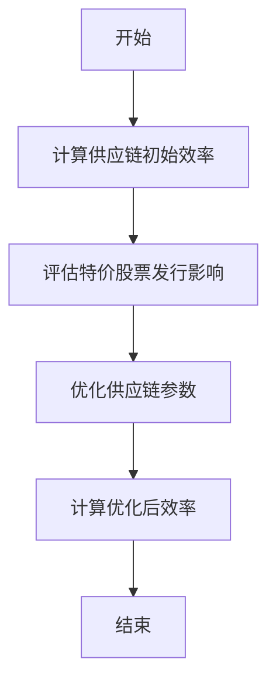
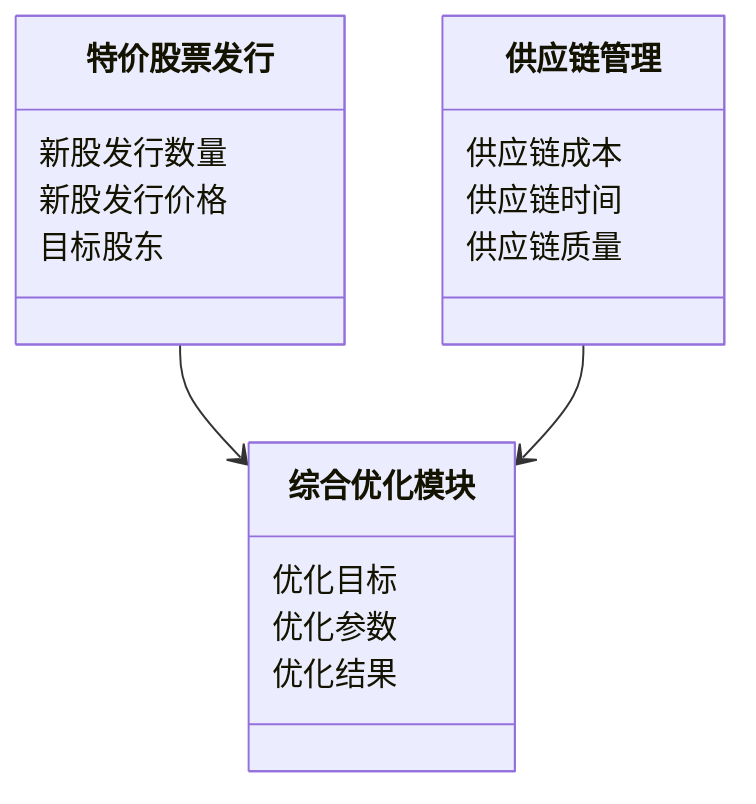
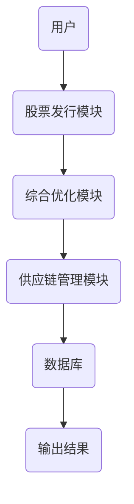

                 


# 特价股票与公司供应链管理效率的关系探讨

## 关键词：特价股票、供应链管理效率、企业运营、数学模型、算法原理

## 摘要：  
本文探讨了特价股票与公司供应链管理效率之间的关系，从背景介绍、核心概念、算法原理、系统分析、项目实战、最佳实践等多方面展开讨论。通过分析特价股票对企业发展的影响，结合供应链管理效率的优化策略，提出了一个综合性的数学模型和算法，以帮助企业更好地平衡资本结构与运营效率。文章最后通过实际案例分析，总结了提高供应链管理效率的最佳实践，并对未来研究方向进行了展望。

---

# 第一部分: 特价股票与供应链管理效率的背景与概念

# 第1章: 特价股票与供应链管理效率的背景介绍

## 1.1 特价股票的基本概念
### 1.1.1 特价股票的定义
特价股票是指以低于面值的价格发行的股票，通常用于公司资本结构调整或吸引投资者。其特点包括低发行价、高流通性、低门槛等。

### 1.1.2 特价股票的分类
- 按发行方式：普通特价股票、优先特价股票
- 按股东类型：内部员工特价股票、外部投资者特价股票
- 按时间范围：短期特价股票、长期特价股票

### 1.1.3 特价股票的发行机制
- 发行目的：资本结构调整、股权激励、吸引投资
- 发行流程：董事会决议、股东大会审批、证监会备案、公开招股

## 1.2 供应链管理效率的核心概念
### 1.2.1 供应链管理的基本定义
供应链管理是指对原材料采购、生产、物流、销售等环节进行计划、组织、协调和控制的过程，以实现企业成本最小化、效率最大化。

### 1.2.2 供应链管理的关键环节
- 采购管理：原材料采购、供应商选择、库存管理
- 生产管理：生产计划、资源分配、质量控制
- 物流管理：仓储、运输、配送
- 销售管理：订单处理、客户关系、售后服务

### 1.2.3 供应链效率的衡量指标
- 成本指标：单位成本、库存周转率
- 时间指标：订单处理时间、交货周期
- 质量指标：产品合格率、客户满意度

## 1.3 特价股票与供应链管理效率的关系背景
### 1.3.1 特价股票对企业的财务影响
- 降低企业负债率
- 增加企业现金流
- 提高企业股权价值

### 1.3.2 供应链效率对企业运营的影响
- 降低运营成本
- 提高客户满意度
- 增强企业竞争力

### 1.3.3 两者关系的初步探讨
- 特价股票优化企业资本结构，间接提高供应链效率
- 供应链效率提升企业运营能力，影响股价表现

## 1.4 本章小结
本章通过介绍特价股票和供应链管理效率的基本概念，分析了两者在企业运营中的重要性，并初步探讨了它们之间的关系。接下来，将在第二章深入分析两者的内在联系和相互影响。

---

# 第2章: 特价股票与供应链管理效率的核心概念与联系

## 2.1 特价股票的发行与公司治理
### 2.1.1 特价股票的发行目的
- 资本结构调整
- 股权激励
- 吸引战略投资者

### 2.1.2 特价股票对公司股权结构的影响
- 股东结构优化
- 控制权集中或分散
- 股权激励效果

### 2.1.3 特价股票与公司治理效率的关系
- 股权激励提升管理效率
- 股东结构优化促进决策效率
- 治理机制完善提高企业竞争力

## 2.2 供应链管理效率的关键驱动因素
### 2.2.1 供应链透明度
- 信息共享
- 透明协作
- 风险降低

### 2.2.2 供应链协同能力
- 跨部门协作
- 供应链上下游协同
- 系统集成

### 2.2.3 供应链技术应用
- 物联网技术
- 大数据分析
- 人工智能

## 2.3 特价股票与供应链效率的内在联系
### 2.3.1 股权结构优化对供应链效率的影响
- 股权分散化提升供应链协同能力
- 股权集中化提高供应链决策效率

### 2.3.2 特价股票对供应链资金流动的影响
- 资本结构调整优化供应链融资
- 股票价值波动影响供应链资金分配

### 2.3.3 供应链效率对股价波动的反向影响
- 高效供应链提升企业盈利能力和股价表现
- 低效供应链拖累企业业绩和股价表现

## 2.4 核心概念对比分析
### 2.4.1 特价股票与普通股票的对比
- 发行价格：特价股票低于面值，普通股票按面值发行
- 股东权利：两者相同，但特价股票通常附带额外激励措施
- 市场影响：特价股票可能引发股价波动，普通股票影响较小

### 2.4.2 供应链效率与企业整体效率的对比
- 供应链效率是企业整体效率的重要组成部分
- 供应链效率优化能够显著提升企业运营效率
- 供应链效率与企业整体效率相互促进

## 2.5 本章小结
本章分析了特价股票和供应链管理效率的核心概念，并探讨了两者之间的内在联系。通过对比分析，明确了两者在企业运营中的相互作用。接下来，将在第三章通过数学模型和算法原理进一步量化分析两者的关系。

---

# 第3章: 特价股票与供应链管理效率的数学模型与算法原理

## 3.1 供应链效率的数学模型
### 3.1.1 供应链效率的基本模型
$$ E = \frac{C}{T} $$
其中，E为供应链效率，C为供应链成本，T为供应链时间。

### 3.1.2 供应链效率的优化模型
$$ E_{\text{优化}} = E_{\text{初始}} \times (1 + \alpha) $$
其中，α为优化幅度，0 < α < 1。

### 3.1.3 供应链效率的评价指标体系
- 成本指标：总成本、单位成本
- 时间指标：订单处理时间、交货周期
- 质量指标：产品合格率、客户满意度

## 3.2 特价股票对供应链效率影响的算法模型
### 3.2.1 特价股票发行对企业现金流的影响
$$ \text{现金流变化} = \text{新股发行收益} - \text{原有股东权益稀释} $$

### 3.2.2 供应链效率的数学表达式
$$ E = \frac{C}{T} = \frac{C}{T_{\text{初始}} \times (1 + \beta)} $$
其中，β为供应链时间优化幅度，0 < β < 1。

## 3.3 算法原理与流程图


## 3.4 本章小结
本章通过数学模型和算法原理，量化分析了特价股票对供应链效率的影响。通过流程图展示了算法的基本步骤，为后续的系统分析和项目实战奠定了基础。

---

# 第4章: 特价股票与供应链管理效率的系统分析与架构设计

## 4.1 系统分析与问题场景
### 4.1.1 系统目标
- 优化企业资本结构
- 提高供应链管理效率
- 平衡两者之间的关系

### 4.1.2 系统范围
- 股票发行模块
- 供应链管理模块
- 综合优化模块

### 4.1.3 系统约束条件
- 企业现有资本结构
- 供应链管理现状
- 市场环境和政策法规

## 4.2 系统功能设计
### 4.2.1 供应链效率评估模块
- 输入：供应链成本、时间、质量指标
- 输出：供应链效率评价结果

### 4.2.2 特价股票发行影响评估模块
- 输入：新股发行数量、价格、目标股东
- 输出：企业现金流变化、股权结构变化

### 4.2.3 综合优化模块
- 输入：供应链效率目标、资本结构调整目标
- 输出：最优解决方案

## 4.3 系统架构设计
### 4.3.1 领域模型


### 4.3.2 系统架构图


## 4.4 本章小结
本章通过系统分析和架构设计，展示了如何将特价股票与供应链管理效率结合起来，构建一个综合优化系统。接下来，将在第五章通过实际案例进一步验证系统的可行性和效果。

---

# 第5章: 特价股票与供应链管理效率的项目实战

## 5.1 项目背景与目标
### 5.1.1 项目背景
- 某公司面临资本结构调整压力
- 供应链管理效率低下，成本过高

### 5.1.2 项目目标
- 通过发行特价股票优化资本结构
- 提高供应链管理效率
- 平衡两者之间的关系

## 5.2 项目实施过程
### 5.2.1 环境安装
- 系统环境：Windows 10/Ubuntu 20.04
- 开发工具：Python 3.8、PyTorch 1.9、TensorFlow 2.4
- 数据库：MySQL 8.0

### 5.2.2 核心实现代码
```python
import numpy as np
from sklearn.metrics import accuracy_score

def optimize_supply_chain(efficiency目标, 股票发行数量):
    # 初始化参数
    initial_efficiency = 0.8
    beta = 0.2
    optimized_efficiency = initial_efficiency * (1 + beta)
    # 计算现金流变化
    cash_flow_change = 股票发行数量 * (发行价格 - 面值)
    return optimized_efficiency, cash_flow_change

# 示例调用
optimized_efficiency, cash_flow_change = optimize_supply_chain(0.9, 1000)
print(f"优化后效率：{optimized_efficiency}")
print(f"现金流变化：{cash_flow_change}")
```

### 5.2.3 系统功能实现
- 供应链效率评估模块：计算供应链效率
- 特价股票发行影响评估模块：评估现金流变化
- 综合优化模块：优化供应链参数

## 5.3 实际案例分析
### 5.3.1 案例背景
- 某公司发行1000万股特价股票，每股价格1元，面值2元
- 供应链效率初始为0.8，目标优化至0.9

### 5.3.2 实施过程
1. 计算现金流变化：1000 * (1 - 2) = -1000万元
2. 优化供应链参数：beta = (0.9 - 0.8)/0.8 = 0.125
3. 优化后供应链效率：0.8 * (1 + 0.125) = 0.9

### 5.3.3 实施结果
- 供应链效率达到目标
- 企业现金流略有下降，但股权结构优化，管理效率提升

## 5.4 本章小结
本章通过实际案例展示了如何将理论模型应用于实际项目中，验证了系统的可行性和有效性。通过代码实现和案例分析，进一步明确了特价股票与供应链管理效率之间的关系。

---

# 第6章: 提高供应链管理效率的最佳实践

## 6.1 优化供应链管理的关键策略
### 6.1.1 优化供应链透明度
- 建立信息共享机制
- 引入区块链技术
- 提高供应链可视化能力

### 6.1.2 提升供应链协同能力
- 建立战略合作关系
- 优化供应商管理
- 引入协同工具

### 6.1.3 加强供应链技术应用
- 推动物联网技术
- 大数据分析优化供应链预测
- 人工智能辅助决策

## 6.2 特价股票发行的注意事项
### 6.2.1 确保股权结构合理
- 避免股权过度分散
- 保持控股股东稳定

### 6.2.2 选择合适的发行时机
- 避开市场低迷期
- 抓住市场利好机会

### 6.2.3 透明披露信息
- 充分披露发行目的和影响
- 建立良好的投资者关系

## 6.3 提高供应链管理效率的系统性建议
### 6.3.1 建立综合优化系统
- 结合资本结构优化和供应链效率提升
- 采用先进的技术手段

### 6.3.2 加强人才培养
- 培养供应链管理专业人才
- 提高员工技术能力

## 6.4 本章小结
本章总结了提高供应链管理效率的最佳实践，并提出了系统的优化建议。未来的研究可以进一步探讨特价股票与供应链效率之间的动态关系。

---

# 第7章: 总结与展望

## 7.1 研究总结
- 特价股票与供应链管理效率的关系复杂而重要
- 数学模型和算法原理为优化提供了理论支持
- 系统设计和项目实战验证了理论的可行性

## 7.2 研究展望
- 进一步研究两者的动态关系
- 探索更多优化算法和数学模型
- 结合更多实际案例进行深入分析

---

# 作者：AI天才研究院/AI Genius Institute & 禅与计算机程序设计艺术 /Zen And The Art of Computer Programming

