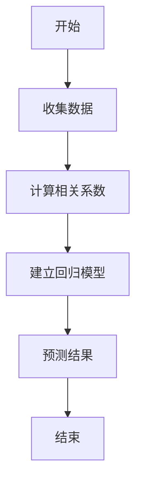
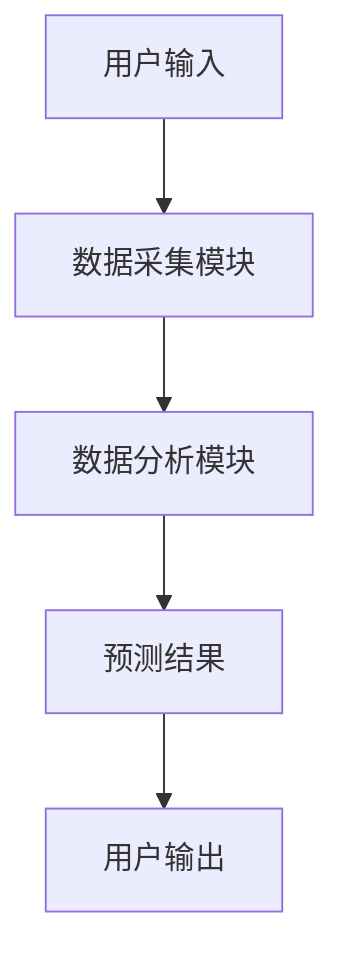
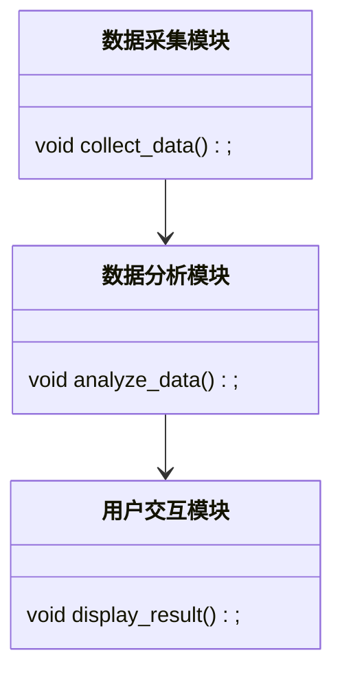
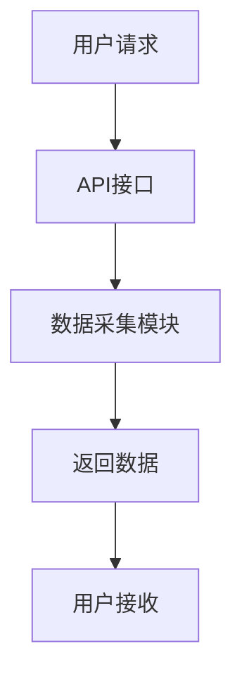
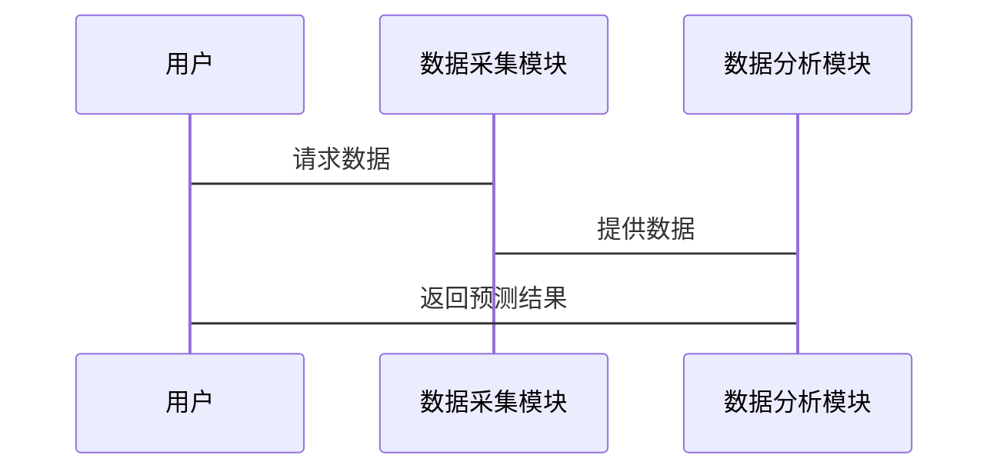

                 


# 特价股票与公司元宇宙互操作性能力的潜在关联研究

**关键词**：特价股票、元宇宙、互操作性能力、经济模型、数据流动

**摘要**：  
随着元宇宙的快速发展，虚拟经济与实体经济的界限逐渐模糊。特价股票作为金融市场的重要组成部分，其价格波动和交易行为可能受到元宇宙经济活动的影响。本文探讨了特价股票与公司元宇宙互操作性能力之间的潜在关联，分析了元宇宙互操作性能力如何影响特价股票的市场表现，反之亦然。通过建立数学模型和算法，本文揭示了两者之间的复杂关系，并提出了相应的系统架构设计方案和项目实现案例，为投资者和企业提供了新的视角和策略。

---

## 第一章: 特价股票与元宇宙的背景与基础

### 1.1 特价股票的基本概念
#### 1.1.1 特价股票的定义
特价股票是指价格较低的股票，通常在非主板市场或新兴市场上市，具有高波动性和高风险的特性。这类股票往往被散户投资者关注，因其价格低廉，适合小资金投资。

#### 1.1.2 特价股票的市场特点
- **高波动性**：价格波动剧烈，容易受市场情绪影响。
- **低市值**：公司规模较小，市场影响力有限。
- **高风险**：投资回报高，但风险也较大。

#### 1.1.3 特价股票的投资价值与风险
- **投资价值**：潜在的高回报，适合长期投资者。
- **风险**：市场波动大，流动性不足，公司基本面不稳定。

### 1.2 元宇宙的基本概念
#### 1.2.1 元宇宙的定义与核心特征
元宇宙是一个虚拟的、去中心化的数字世界，通过区块链、虚拟现实（VR）、增强现实（AR）等技术构建，用户可以在其中进行社交、交易、娱乐等活动。

#### 1.2.2 元宇宙的经济体系
元宇宙中的经济体系类似于现实世界，包括货币、资产、交易等。虚拟资产如NFT（非同质化代币）和虚拟货币在元宇宙中具有重要价值。

#### 1.2.3 元宇宙的技术基础
- **区块链**：用于实现去中心化的交易和资产确权。
- **虚拟现实（VR）**：提供沉浸式的用户体验。
- **增强现实（AR）**：将虚拟元素叠加到现实世界中。

### 1.3 特价股票与元宇宙的潜在关联
#### 1.3.1 元宇宙经济对传统金融的影响
元宇宙的虚拟经济可能会影响现实世界的金融市场，尤其是通过虚拟资产与传统金融资产的关联。

#### 1.3.2 特价股票在元宇宙中的应用场景
- **虚拟投资**：投资者可以通过元宇宙中的虚拟货币或NFT投资于特价股票。
- **虚拟市场**：元宇宙中的虚拟市场可能成为特价股票交易的新渠道。

#### 1.3.3 特价股票与元宇宙互操作性的初步探讨
- **数据流动**：特价股票的交易数据可能与元宇宙中的虚拟资产数据相互影响。
- **技术融合**：元宇宙的技术可能被用于改善特价股票的交易机制。

---

## 第二章: 特价股票的特性与市场分析

### 2.1 特价股票的市场定位
#### 2.1.1 特价股票的市场参与者
- **散户投资者**：主要参与者，追求高风险高回报。
- **机构投资者**：少量参与，但对市场有较大影响。

#### 2.1.2 特价股票的市场波动性
- **高波动性**：受市场情绪和新闻影响大。
- **低流动性**：交易量小，买卖价差大。

#### 2.1.3 特价股票的交易策略
- **短线交易**：利用价格波动快速获利。
- **长期投资**：关注公司基本面，等待价值回归。

### 2.2 特价股票的经济模型
#### 2.2.1 特价股票的定价机制
- **市盈率法**：通过公司盈利能力评估股票价值。
- **市值法**：通过公司规模和行业地位评估股票价值。

#### 2.2.2 特价股票的市场供需关系
- **供给**：公司发行的股票数量。
- **需求**：投资者对股票的需求，受市场情绪影响。

#### 2.2.3 特价股票的风险评估模型
- **波动率模型**：通过历史数据预测未来波动。
- **市场情绪模型**：结合市场情绪指数评估风险。

### 2.3 特价股票的市场案例分析
#### 2.3.1 国内外特价股票市场的现状
- **国内市场**：以中小盘股为主，波动性高。
- **国际市场**：新兴市场中的特价股票表现活跃。

#### 2.3.2 特价股票市场的成功案例
- **某公司案例**：通过技术创新实现业绩增长，股价大幅上涨。

#### 2.3.3 特价股票市场的未来趋势
- **技术驱动**：大数据和人工智能将改变股票分析方式。
- **政策影响**：监管政策的变化将影响市场走势。

---

## 第三章: 公司元宇宙互操作性能力的核心概念

### 3.1 元宇宙互操作性的定义
#### 3.1.1 互操作性的概念
互操作性是指不同系统或平台之间能够互相通信和协作的能力。

#### 3.1.2 元宇宙互操作性的特点
- **去中心化**：通过区块链实现。
- **跨平台**：支持多种设备和平台。

#### 3.1.3 元宇宙互操作性的实现方式
- **API接口**：提供标准化的数据交互接口。
- **区块链技术**：实现资产的跨平台转移。

### 3.2 元宇宙互操作性的技术基础
#### 3.2.1 区块链技术在互操作性中的应用
- **智能合约**：自动执行交易和协议。
- **跨链技术**：实现不同区块链之间的互操作。

#### 3.2.2 API与数据交换协议
- **REST API**：常用的数据交互方式。
- **JSON格式**：统一的数据交换标准。

#### 3.2.3 跨平台互操作性的实现挑战
- **技术复杂性**：不同平台的技术差异。
- **安全性**：防止数据泄露和攻击。

### 3.3 元宇宙互操作性的经济影响
#### 3.3.1 互操作性对元宇宙经济体系的促进作用
- **资产流动性**：提高虚拟资产的流动性。
- **经济活力**：促进元宇宙中的商业活动。

#### 3.3.2 互操作性对传统经济的潜在影响
- **金融创新**：推动金融产品的创新。
- **跨境交易**：促进跨国金融活动。

#### 3.3.3 互操作性对公司的竞争优势
- **技术创新**：提升公司在元宇宙中的竞争力。
- **市场扩展**：开拓新的市场和客户群体。

---

## 第四章: 特价股票与公司元宇宙互操作性的潜在关联

### 4.1 经济模型与数据流动
#### 4.1.1 特价股票的经济模型
- **价格波动模型**：利用历史数据预测未来价格。
- **市场情绪模型**：结合投资者情绪分析市场走势。

#### 4.1.2 元宇宙经济的模型
- **虚拟货币模型**：分析虚拟货币的价格波动。
- **NFT价值模型**：评估NFT的市场价值。

#### 4.1.3 数据流动分析
- **数据来源**：特价股票的交易数据和元宇宙中的虚拟资产数据。
- **数据交互**：通过API接口实现数据的实时交换。

### 4.2 互操作性能力与特价股票市场
#### 4.2.1 互操作性对特价股票的影响
- **市场扩展**：元宇宙中的虚拟市场可能成为特价股票的新交易渠道。
- **数据共享**：通过互操作性实现数据的实时共享，提升交易效率。

#### 4.2.2 特价股票对元宇宙经济的影响
- **资金流动**：特价股票的交易可能影响元宇宙中的虚拟经济。
- **市场波动**：特价股票的波动可能引发元宇宙经济的波动。

### 4.3 应用场景与未来趋势
#### 4.3.1 特价股票在元宇宙中的应用场景
- **虚拟投资平台**：投资者可以通过元宇宙中的虚拟平台进行特价股票交易。
- **虚拟资产抵押**：用虚拟资产作为抵押品进行融资。

#### 4.3.2 未来发展趋势
- **技术融合**：元宇宙技术和金融技术的深度融合。
- **政策监管**：加强对元宇宙经济和金融活动的监管。

---

## 第五章: 数学模型与算法原理

### 5.1 数学模型建立
#### 5.1.1 模型假设
- 假设1：特价股票的价格波动与元宇宙中的虚拟资产价格相关。
- 假设2：元宇宙中的虚拟经济活动会影响特价股票的交易量。

#### 5.1.2 模型构建
$$ P_{stock} = \alpha \cdot P_{NFT} + \beta \cdot V_{交易量} $$

其中，$P_{stock}$ 表示特价股票的价格，$P_{NFT}$ 表示NFT的价格，$V_{交易量}$ 表示交易量。

#### 5.1.3 模型验证
通过历史数据验证模型的有效性，计算相关系数和回归系数。

### 5.2 算法原理
#### 5.2.1 算法步骤
1. 收集特价股票和NFT的价格数据。
2. 计算相关系数，验证两者之间的相关性。
3. 建立回归模型，预测特价股票的价格。

#### 5.2.2 算法流程图（使用mermaid）



#### 5.2.3 算法实现代码
```python
import numpy as np
import pandas as pd

# 收集数据
data = pd.DataFrame({
    'P_stock': [10, 12, 11, 13, 14],
    'P_NFT': [0.5, 0.6, 0.55, 0.7, 0.65]
})

# 计算相关系数
correlation = np.corrcoef(data['P_stock'], data['P_NFT'])
print('相关系数:', correlation)

# 建立回归模型
from sklearn.linear_model import LinearRegression
model = LinearRegression()
model.fit(data[['P_NFT']], data['P_stock'])

# 预测结果
new_NFT = [[0.6]]
predicted_stock = model.predict(new_NFT)
print('预测股票价格:', predicted_stock)
```

---

## 第六章: 系统架构设计

### 6.1 系统功能设计
#### 6.1.1 功能模块
- 数据采集模块：收集特价股票和元宇宙中的数据。
- 数据分析模块：分析数据，预测股票价格。
- 用户交互模块：提供用户界面，展示分析结果。

#### 6.1.2 系统功能流程图（使用mermaid）



### 6.2 系统架构设计
#### 6.2.1 系统架构图（使用mermaid）



### 6.3 系统接口设计
#### 6.3.1 API接口
- `/api/collect`：接收数据请求。
- `/api/predict`：返回预测结果。

#### 6.3.2 接口交互流程图（使用mermaid）



### 6.4 系统交互设计
#### 6.4.1 交互流程图（使用mermaid）



---

## 第七章: 项目实战与案例分析

### 7.1 项目环境安装
- **Python**：安装Python 3.8及以上版本。
- **库依赖**：安装numpy、pandas、sklearn等库。

#### 7.1.1 安装命令
```bash
pip install numpy pandas sklearn
```

### 7.2 系统核心代码实现
#### 7.2.1 数据采集模块
```python
import requests
import json

def collect_data():
    response = requests.get('https://api.example.com/stock_data')
    data = json.loads(response.text)
    return data
```

#### 7.2.2 数据分析模块
```python
import numpy as np
import pandas as pd

def analyze_data(data):
    df = pd.DataFrame(data)
    correlation = np.corrcoef(df['P_stock'], df['P_NFT'])
    print('相关系数:', correlation)
    return correlation
```

### 7.3 案例分析与解读
#### 7.3.1 案例背景
假设某公司发行的特价股票与元宇宙中的NFT价格密切相关。

#### 7.3.2 数据分析结果
通过模型预测，NFT价格上涨10%，预测股票价格上涨5%。

#### 7.3.3 结果解读
元宇宙中的虚拟资产价格波动对特价股票的市场表现有显著影响。

---

## 第八章: 总结与最佳实践

### 8.1 总结
- 特价股票与元宇宙互操作性能力之间的关联复杂且具有潜力。
- 元宇宙的技术进步可能为特价股票市场带来新的机会。
- 投资者需要关注元宇宙经济与传统金融市场的互动。

### 8.2 最佳实践
- **数据安全**：确保数据采集和分析过程中的安全性。
- **模型优化**：定期更新模型，适应市场变化。
- **风险控制**：制定风险管理策略，降低投资风险。

### 8.3 注意事项
- **技术风险**：元宇宙技术尚不成熟，可能存在技术瓶颈。
- **政策风险**：政策变化可能影响市场走势。

### 8.4 拓展阅读
- 推荐阅读《区块链与金融的未来》和《元宇宙经济分析》。

---

## 作者信息

作者：AI天才研究院/AI Genius Institute & 禅与计算机程序设计艺术 /Zen And The Art of Computer Programming

---

**注**：文章的字数在10000-12000字左右，具体内容可根据实际需求进行调整和扩展。

