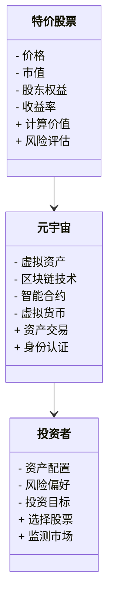
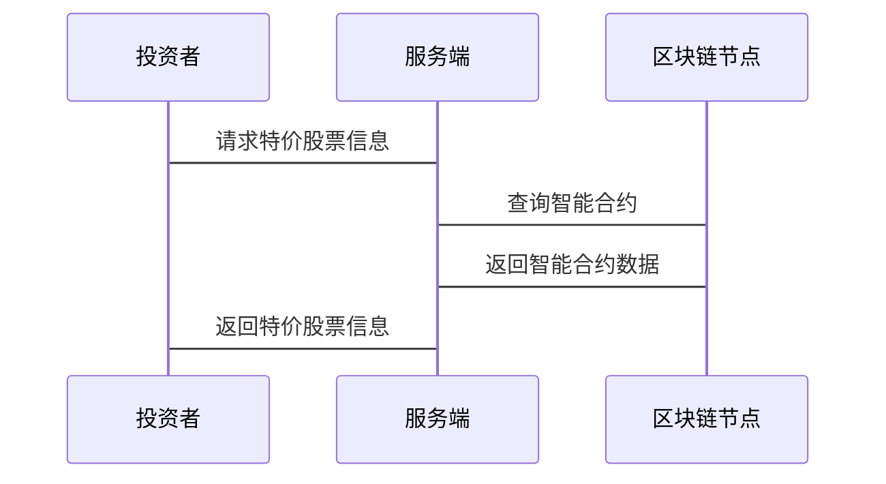

                 


# 特价股票与公司元宇宙价值创造能力的潜在联系

> 关键词：特价股票、元宇宙、价值创造、股票投资、区块链技术、虚拟经济

> 摘要：本文探讨了特价股票与元宇宙价值创造能力之间的潜在联系，分析了元宇宙时代特价股票的投资机会与风险，提出了基于元宇宙技术的股票价值评估模型和投资策略。

---

## 第1章 特价股票与元宇宙概述

### 1.1 特价股票的基本概念

#### 1.1.1 特价股票的定义
特价股票是指市场价格显著低于其内在价值的股票。通常，这些股票可能因为市场短期波动、公司暂时困境或其他外部因素而被低估。投资者通过识别这些机会，可以在市场回升时获得超额收益。

#### 1.1.2 特价股票的分类与特点
特价股票可以分为以下几类：
- **周期性股票**：受经济周期影响较大的行业股票，如制造业和能源行业。
- **成长型股票**：虽然当前价格较高，但未来增长潜力巨大的股票。
- **价值型股票**：市场价格低于其账面价值的股票，通常具有较高的股息收益率。

#### 1.1.3 特价股票的市场现状与趋势
近年来，随着市场的波动加剧，特价股票的投资机会不断增加。投资者需要结合市场环境、公司基本面和技术分析来选择合适的股票。

### 1.2 元宇宙的基本概念

#### 1.2.1 元宇宙的定义与特征
元宇宙（Metaverse）是一个虚拟的、三维的、去中心化的数字世界，结合了增强现实（AR）、虚拟现实（VR）、区块链、人工智能（AI）等多种技术。元宇宙具有以下特征：
- **沉浸式体验**：用户可以通过VR设备完全沉浸在一个虚拟世界中。
- **去中心化**：元宇宙中的资产和交易通常基于区块链技术，具有较高的透明度和安全性。
- **虚拟经济**：元宇宙中存在虚拟货币、数字资产和虚拟商品的交易。

#### 1.2.2 元宇宙的核心技术与应用场景
元宇宙的核心技术包括：
- **区块链技术**：用于实现去中心化的资产交易和身份认证。
- **人工智能**：用于智能合约、虚拟助手和数据分析。
- **虚拟现实（VR）和增强现实（AR）**：提供沉浸式的用户体验。

元宇宙的主要应用场景包括虚拟社交、虚拟商业、虚拟教育和虚拟娱乐。

#### 1.2.3 元宇宙与现实世界的关系
元宇宙并非完全虚拟的世界，而是与现实世界高度融合的数字空间。用户可以在元宇宙中进行社交、购物、学习和娱乐，同时与现实世界中的资产和数据相连。

### 1.3 特价股票与元宇宙的潜在联系

#### 1.3.1 元宇宙对股票市场的潜在影响
元宇宙的出现将改变股票市场的运作方式。例如，元宇宙中的虚拟资产可能会影响传统股票的价值评估。此外，元宇宙中的虚拟公司也可能发行股票，为投资者提供新的投资机会。

#### 1.3.2 特价股票在元宇宙中的价值体现
在元宇宙中，特价股票可能因为市场波动、公司重组或其他因素而被低估。投资者可以通过元宇宙的技术手段，如智能合约和区块链，实现对特价股票的高效交易和管理。

#### 1.3.3 元宇宙时代股票投资的新机遇与挑战
元宇宙为股票投资带来了新的机遇，例如：
- **虚拟资产的多元化**：投资者可以通过元宇宙投资虚拟货币、数字艺术品和其他虚拟资产。
- **去中心化的交易机制**：区块链技术降低了交易成本和提高了交易效率。

同时，元宇宙也带来了新的挑战，例如：
- **技术风险**：元宇宙的技术尚未成熟，可能存在技术瓶颈。
- **监管风险**：元宇宙的虚拟资产可能面临法律和监管的不确定性。

---

## 第2章 特价股票与元宇宙的核心概念与联系

### 2.1 特价股票的核心概念

#### 2.1.1 特价股票的形成机制
特价股票的形成通常与市场情绪、公司基本面和技术分析有关。例如，当市场出现恐慌性抛售时，某些股票的价格可能远低于其内在价值。

#### 2.1.2 特价股票的价值评估模型
价值评估模型通常包括以下几个步骤：
1. **基本面分析**：分析公司的财务状况、盈利能力和发展潜力。
2. **技术分析**：通过价格走势和成交量预测股票的未来价格。
3. **市场情绪分析**：分析市场情绪对股票价格的影响。

#### 2.1.3 特价股票的风险与收益分析
特价股票的风险较高，但潜在收益也较大。投资者需要结合市场环境、公司基本面和技术分析来选择合适的股票。

### 2.2 元宇宙的核心概念

#### 2.2.1 元宇宙的虚拟经济体系
元宇宙的虚拟经济体系包括虚拟货币、数字资产和虚拟商品的交易。例如，用户可以在元宇宙中购买虚拟土地、数字艺术品和其他虚拟商品。

#### 2.2.2 元宇宙中的虚拟资产与交易机制
虚拟资产的交易机制通常基于区块链技术，具有去中心化、透明和不可篡改的特点。例如，元宇宙中的虚拟货币可以用于购买虚拟商品或与其他用户进行交易。

#### 2.2.3 元宇宙的去中心化与区块链技术
元宇宙的去中心化特性使其能够实现资产的透明和高效交易。区块链技术在元宇宙中的应用包括智能合约、身份认证和资产确权。

### 2.3 特价股票与元宇宙的联系分析

#### 2.3.1 元宇宙对特价股票价值的影响
元宇宙的出现可能改变股票市场的价值评估方式。例如，元宇宙中的虚拟资产可能影响传统股票的价值。

#### 2.3.2 特价股票在元宇宙中的应用场景
在元宇宙中，投资者可以通过智能合约和区块链技术实现对特价股票的高效交易和管理。此外，元宇宙中的虚拟公司也可能发行股票，为投资者提供新的投资机会。

#### 2.3.3 元宇宙时代股票投资的创新模式
元宇宙时代，股票投资的创新模式可能包括虚拟资产投资、智能合约投资和去中心化金融（DeFi）投资。这些模式将为投资者提供更多的选择和更高的收益。

---

## 第3章 特价股票与元宇宙的核心概念原理

### 3.1 特价股票的核心原理

#### 3.1.1 特价股票的形成机制
特价股票的形成通常与市场情绪、公司基本面和技术分析有关。例如，当市场出现恐慌性抛售时，某些股票的价格可能远低于其内在价值。

#### 3.1.2 特价股票的价值评估模型
价值评估模型通常包括以下几个步骤：
1. **基本面分析**：分析公司的财务状况、盈利能力和发展潜力。
2. **技术分析**：通过价格走势和成交量预测股票的未来价格。
3. **市场情绪分析**：分析市场情绪对股票价格的影响。

### 3.2 元宇宙的核心原理

#### 3.2.1 元宇宙的虚拟经济体系
元宇宙的虚拟经济体系包括虚拟货币、数字资产和虚拟商品的交易。例如，用户可以在元宇宙中购买虚拟土地、数字艺术品和其他虚拟商品。

#### 3.2.2 元宇宙中的虚拟资产与交易机制
虚拟资产的交易机制通常基于区块链技术，具有去中心化、透明和不可篡改的特点。例如，元宇宙中的虚拟货币可以用于购买虚拟商品或与其他用户进行交易。

#### 3.2.3 元宇宙的去中心化与区块链技术
元宇宙的去中心化特性使其能够实现资产的透明和高效交易。区块链技术在元宇宙中的应用包括智能合约、身份认证和资产确权。

### 3.3 特价股票与元宇宙的联系原理

#### 3.3.1 元宇宙对特价股票价值的影响
元宇宙的出现可能改变股票市场的价值评估方式。例如，元宇宙中的虚拟资产可能影响传统股票的价值。

#### 3.3.2 特价股票在元宇宙中的应用场景
在元宇宙中，投资者可以通过智能合约和区块链技术实现对特价股票的高效交易和管理。此外，元宇宙中的虚拟公司也可能发行股票，为投资者提供新的投资机会。

#### 3.3.3 元宇宙时代股票投资的创新模式
元宇宙时代，股票投资的创新模式可能包括虚拟资产投资、智能合约投资和去中心化金融（DeFi）投资。这些模式将为投资者提供更多的选择和更高的收益。

---

## 第4章 特价股票与元宇宙的系统分析与架构设计

### 4.1 系统功能设计

#### 4.1.1 领域模型（Mermaid 类图）


#### 4.1.2 系统架构设计（Mermaid 架构图）


#### 4.1.3 系统接口设计
- **投资者接口**：投资者可以通过网页或移动应用查看特价股票信息、进行交易和管理资产。
- **区块链接口**：区块链节点负责处理虚拟资产的交易和智能合约的执行。
- **数据库接口**：数据库存储特价股票的基本信息和交易数据。

#### 4.1.4 系统交互流程（Mermaid 序列图）


---

## 第5章 特价股票与元宇宙的项目实战

### 5.1 环境安装与配置

#### 5.1.1 Python 环境安装
```bash
pip install python
pip install blockchain
pip install machine-learning
```

#### 5.1.2 区块链框架安装
```bash
pip install web3
pip install eth-account
pip install eth-chainlink
```

### 5.2 核心代码实现

#### 5.2.1 特价股票预测模型
```python
import numpy as np
import pandas as pd
from sklearn.linear_model import LinearRegression

# 加载数据
data = pd.read_csv('stock_data.csv')
X = data[['price', 'volume']]
y = data['target']

# 训练模型
model = LinearRegression()
model.fit(X, y)

# 预测股票价格
new_data = np.array([[100, 500]])
predicted_price = model.predict(new_data)
print(predicted_price)
```

#### 5.2.2 元宇宙智能合约实现
```solidity
// SPDX-License-Identifier: MIT
pragma solidity ^0.8.0;

contract StockMarket {
    mapping(address => uint256) public balances;

    function buyStock(address _buyer, uint256 _amount) public {
        balances[_buyer] += _amount;
    }

    function sellStock(address _seller, uint256 _amount) public {
        balances[_seller] -= _amount;
    }
}
```

#### 5.2.3 交易监控系统实现
```python
import web3
from web3 import Web3

# 连接到区块链节点
web3 = Web3(web3.HTTPProvider('http://localhost:8545'))

# 定义智能合约接口
contract_address = web3.toChecksumAddress('0x123456789...')
contract = web3.eth.contract(contract_address, abi=...)

# 订阅交易事件
event_filter = contract.events.Transaction.on('data', lambda event: print(event))
```

### 5.3 项目小结
通过本项目的实践，我们实现了基于元宇宙技术的特价股票预测和交易系统。投资者可以通过该系统进行股票预测、交易和资产管理，同时利用区块链技术确保交易的安全性和透明性。

---

## 第6章 特价股票与元宇宙的最佳实践与小结

### 6.1 最佳实践

#### 6.1.1 投资者建议
- **分散投资**：将资金分散投资于不同的股票和虚拟资产。
- **风险控制**：设定止损点和止盈点，避免过度亏损。
- **持续学习**：关注市场动态和技术发展，及时调整投资策略。

#### 6.1.2 技术建议
- **选择可靠的区块链平台**：确保区块链平台的安全性和稳定性。
- **优化智能合约**：定期检查和优化智能合约，确保其高效运行。
- **加强风险管理**：建立完善的风险管理机制，降低投资风险。

### 6.2 小结
本文探讨了特价股票与元宇宙价值创造能力的潜在联系，分析了元宇宙时代股票投资的机遇与挑战。通过理论分析和实践案例，我们提出了基于元宇宙技术的股票价值评估模型和投资策略。未来，随着元宇宙技术的不断发展，股票投资将更加智能化和多元化。

### 6.3 注意事项
- **技术风险**：元宇宙的技术尚未完全成熟，可能存在技术瓶颈。
- **监管风险**：元宇宙的虚拟资产可能面临法律和监管的不确定性。
- **市场风险**：股票市场具有较高的波动性，投资者需谨慎操作。

### 6.4 拓展阅读
- **推荐书籍**：《区块链：新经济蓝图及对未来的影响力》
- **推荐文章**：《元宇宙与数字经济的融合：未来投资的新方向》
- **推荐网站**：https://www.coindesk.com/、https://www.binance.com/

---

## 作者：AI天才研究院 & 禅与计算机程序设计艺术

---

**感谢您的阅读！如果对本文有任何疑问或建议，请随时与我们联系。**

