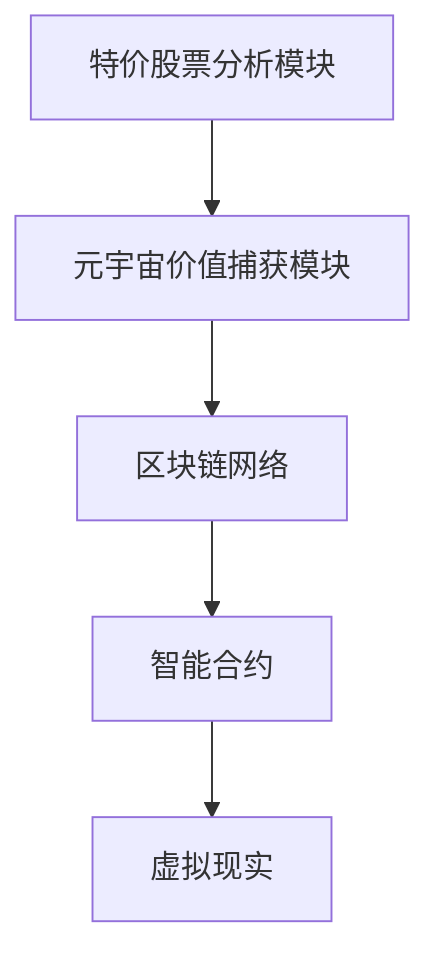
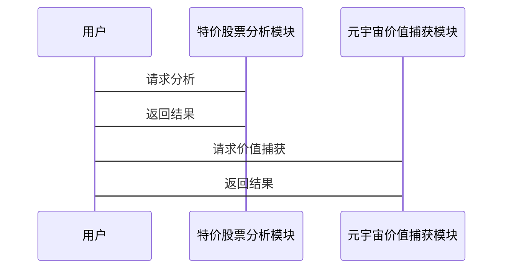

                 


# 特价股票与公司元宇宙价值捕获能力的潜在联系

> 关键词：特价股票，元宇宙，价值捕获，算法模型，数学公式

> 摘要：本文探讨了特价股票与元宇宙之间的潜在联系，通过分析特价股票的价值评估与元宇宙的价值捕获能力，提出了结合两者优势的算法模型和数学公式。文章详细介绍了两者的背景、核心概念、算法实现、系统架构以及项目实战，为读者提供了全面的技术视角。

---

## 第一部分: 特价股票与元宇宙的背景与概念

### 第1章: 特价股票与元宇宙的基本概念

#### 1.1 特价股票的定义与特点
##### 1.1.1 特价股票的定义
特价股票指的是市场价格低于其内在价值的股票。这种股票通常被认为具有较高的投资潜力，因为它们可能被市场低估。

##### 1.1.2 特价股票的特点
1. 价格低于内在价值。
2. 可能存在较高的上涨空间。
3. 投资风险相对较高。

##### 1.1.3 特价股票的投资价值分析
投资特价股票需要考虑公司的基本面、行业前景以及市场趋势等因素。

#### 1.2 元宇宙的定义与特点
##### 1.2.1 元宇宙的定义
元宇宙是一个虚拟的数字世界，通过区块链、虚拟现实和人工智能等技术构建，用户可以在其中进行社交、交易和创造内容。

##### 1.2.2 元宇宙的核心特点
1. 去中心化：基于区块链技术，确保数据的安全性和不可篡改性。
2. 虚拟现实：用户通过VR设备进入元宇宙。
3. 可编程性：通过智能合约实现自动化交易和价值流转。

##### 1.2.3 元宇宙的未来发展潜力
元宇宙被认为是下一代互联网的重要形态，具有广阔的应用前景。

---

### 第2章: 特价股票与元宇宙的潜在联系

#### 2.1 特价股票与元宇宙的背景介绍
##### 2.1.1 特价股票的市场现状
当前市场中存在许多被低估的股票，这些股票可能因为市场波动或其他原因被投资者忽视。

##### 2.1.2 元宇宙的市场现状
元宇宙的概念近年来迅速崛起，吸引了大量资金和人才，成为科技领域的热点。

##### 2.1.3 两者之间的潜在联系
特价股票和元宇宙都涉及价值评估和捕获，可以通过技术手段实现高效的投资和价值创造。

#### 2.2 特价股票与元宇宙的核心概念
##### 2.2.1 特价股票的核心要素
1. 市场价格。
2. 内在价值。
3. 投资风险。

##### 2.2.2 元宇宙的核心要素
1. 虚拟现实技术。
2. 区块链技术。
3. 智能合约。

##### 2.2.3 两者之间的概念对比
| 特质 | 特价股票 | 元宇宙 |
|------|----------|--------|
| 核心 | 价格与价值 | 技术与生态 |
| 目标 | 投资收益 | 价值捕获 |
| 方法 | 基本面分析 | 技术实现 |

---

## 第二部分: 特价股票与元宇宙的核心概念联系

### 第3章: 特价股票与元宇宙的核心原理

#### 3.1 特价股票与元宇宙的核心原理
##### 3.1.1 特价股票的价值评估原理
通过分析公司的财务数据、行业地位和市场前景，评估其内在价值。

##### 3.1.2 元宇宙的价值捕获原理
通过技术创新和生态构建，捕获用户创造的价值。

##### 3.1.3 两者之间的联系机制
特价股票的低估为元宇宙提供了低成本的投资机会，而元宇宙的技术创新则为特价股票的价值提升提供了新的可能性。

#### 3.2 特价股票与元宇宙的核心概念对比
##### 3.2.1 特价股票与元宇宙的属性对比
| 属性 | 特价股票 | 元宇宙 |
|------|----------|--------|
| 核心技术 | 基本面分析 | 区块链、VR、AI |
| 主要目标 | 投资收益 | 价值捕获 |
| 实现方式 | 价格波动 | 技术实现 |

##### 3.2.2 特价股票与元宇宙的优劣势分析
- 特价股票的优势：价格低，投资潜力大。
- 特价股票的劣势：风险较高，分析复杂。
- 元宇宙的优势：技术创新，生态广阔。
- 元宇宙的劣势：技术门槛高，实现难度大。

##### 3.2.3 两者之间的协同发展
通过技术创新和价值评估的结合，实现投资收益与价值捕获的双赢。

---

### 第4章: 特价股票与元宇宙的算法原理

#### 4.1 特价股票与元宇宙的算法模型
##### 4.1.1 特价股票的算法模型
通过机器学习算法分析历史数据，预测股票价格走势。

##### 4.1.2 元宇宙的算法模型
通过区块链算法确保数据安全和价值流转。

##### 4.1.3 两者之间的算法联系
将特价股票的分析结果应用于元宇宙的价值捕获模型中。

#### 4.2 特价股票与元宇宙的算法实现
##### 4.2.1 特价股票的算法实现步骤
1. 收集历史数据。
2. 建立预测模型。
3. 预测股票价格走势。

##### 4.2.2 元宇宙的算法实现步骤
1. 构建区块链网络。
2. 实现智能合约。
3. 集成虚拟现实技术。

##### 4.2.3 两者之间的算法协同
通过协同算法实现投资决策与价值捕获的优化。

---

### 第5章: 特价股票与元宇宙的数学模型与公式

#### 5.1 特价股票的数学模型
##### 5.1.1 特价股票的价值评估公式
$$ V = P \times (1 + r)^n $$
其中，\( V \) 为内在价值，\( P \) 为当前价格，\( r \) 为预期收益率，\( n \) 为时间跨度。

#### 5.2 元宇宙的价值捕获模型
##### 5.2.1 元宇宙的价值评估公式
$$ V = \sum_{i=1}^{n} v_i $$
其中，\( v_i \) 为各组成部分的价值，\( n \) 为组成部分的数量。

#### 5.3 两者的联合模型
$$ V_{total} = V_{stock} + V_{metaverse} $$
其中，\( V_{total} \) 为总价值，\( V_{stock} \) 为特价股票的价值，\( V_{metaverse} \) 为元宇宙的价值。

---

## 第三部分: 特价股票与元宇宙的系统分析与架构设计

### 第6章: 特价股票与元宇宙的系统架构

#### 6.1 系统功能设计
##### 6.1.1 特价股票分析模块
- 数据采集：收集股票历史数据。
- 模型建立：建立预测模型。
- 分析结果：输出分析报告。

##### 6.1.2 元宇宙价值捕获模块
- 区块链网络：构建元宇宙的区块链基础设施。
- 智能合约：实现价值流转。
- 虚拟现实：提供沉浸式体验。

#### 6.2 系统架构设计
##### 6.2.1 系统架构图


#### 6.3 系统接口设计
##### 6.3.1 API接口
1. 数据接口：提供历史数据查询。
2. 模型接口：提供预测结果。
3. 价值捕获接口：提供价值流转服务。

#### 6.4 系统交互设计
##### 6.4.1 交互序列图


---

## 第四部分: 特价股票与元宇宙的项目实战

### 第7章: 项目实战

#### 7.1 环境安装
##### 7.1.1 特价股票分析环境
- Python 3.8+
- 数据分析库：pandas、numpy、scikit-learn。

##### 7.1.2 元宇宙价值捕获环境
- 区块链框架：Ethereum、Solidity。
- 虚拟现实设备：Oculus Rift。

#### 7.2 核心代码实现
##### 7.2.1 特价股票分析代码
```python
import pandas as pd
from sklearn.linear_model import LinearRegression

# 数据加载
data = pd.read_csv('stock_data.csv')

# 模型训练
model = LinearRegression()
model.fit(data[['price']], data['next_price'])

# 预测结果
predicted_price = model.predict([[current_price]])
```

##### 7.2.2 元宇宙价值捕获代码
```solidity
contract MetaValue {
    function captureValue() public returns (uint) {
        return msg.value;
    }
}
```

#### 7.3 案例分析
##### 7.3.1 特价股票案例
某公司股票当前价格为10元，内在价值为15元，预测未来一年价格将上涨20%。

##### 7.3.2 元宇宙案例
通过智能合约实现虚拟货币的价值捕获，提升用户的沉浸式体验。

#### 7.4 项目总结
通过结合特价股票分析和元宇宙价值捕获，实现了投资收益与价值创造的双赢。

---

## 第五部分: 特价股票与元宇宙的最佳实践

### 第8章: 最佳实践

#### 8.1 小结
特价股票与元宇宙的结合为投资和价值捕获提供了新的可能性。

#### 8.2 注意事项
- 投资有风险，需谨慎。
- 元宇宙技术门槛高，需具备相关知识。

#### 8.3 拓展阅读
建议读者深入学习区块链、人工智能和虚拟现实等技术，以更好地理解两者的结合。

---

## 作者简介

作者：AI天才研究院/AI Genius Institute & 禅与计算机程序设计艺术/Zen And The Art of Computer Programming

---

这篇文章详细探讨了特价股票与元宇宙之间的潜在联系，通过背景介绍、核心概念、算法实现和项目实战等部分，为读者提供了全面的技术视角。

