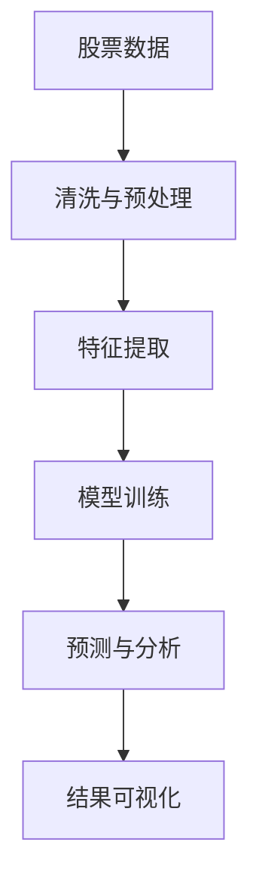

                 


# 特价股票与公司元宇宙战略布局的潜在联系

---

## 关键词：
- 特价股票
- 元宇宙
- 公司战略
- 潜在联系
- 数字经济
- 金融科技

---

## 摘要：
本文探讨了特价股票与公司元宇宙战略布局之间的潜在联系。首先，介绍了特价股票和元宇宙的基本概念及其市场现状。然后，分析了两者的核心概念及其联系，通过对比和案例研究揭示了它们的互动机制。接着，详细阐述了算法原理和数学模型，解释了如何利用大数据和人工智能技术分析特价股票与元宇宙战略的关系。最后，提出了系统设计与架构方案，并通过项目实战展示了如何将理论应用于实践。本文旨在为投资者、技术专家和企业战略决策者提供深度洞察，帮助他们在复杂多变的市场环境中把握机会，规避风险。

---

## 第一部分: 特价股票与公司元宇宙战略布局的背景介绍

### 第1章: 特价股票的基本概念与现状

#### 1.1 特价股票的定义与特点
- **1.1.1 特价股票的定义**  
  特价股票是指面值低于发行价格的股票，通常用于公司资本结构调整或债务重组。其特点是价格波动大、风险高、回报潜力大。

- **1.1.2 特价股票的特点**  
  - 价格低廉，适合风险偏好较高的投资者。
  - 市场流动性较低，可能导致买卖价差较大。
  - 公司基本面较差，可能面临财务困境或重组压力。

- **1.1.3 特价股票的市场现状**  
  特价股票在股票市场中占比不大，但因其高波动性和潜在高回报，吸引了部分投机性投资者。近年来，随着市场的波动加剧，特价股票的交易量有所上升。

#### 1.2 公司元宇宙战略布局的定义与特点
- **1.2.1 元宇宙的定义与核心特征**  
  元宇宙是一个虚拟的共享空间，通过AR、VR、区块链等技术构建，用户可以在其中进行社交、娱乐、 commerce等互动。

- **1.2.2 公司元宇宙战略布局的定义**  
  公司元宇宙战略布局是指企业为在元宇宙中占据竞争优势而制定的长期计划，包括技术投资、市场拓展、生态合作等。

- **1.2.3 元宇宙战略布局的核心要素**  
  - 技术创新：如AR/VR、区块链、人工智能等。
  - 市场定位：明确目标用户和市场定位。
  - 生态合作：与其他企业、开发者、用户等建立合作关系。

#### 1.3 特价股票与公司元宇宙战略布局的背景分析
- **1.3.1 特价股票的市场背景**  
  特价股票通常出现在市场低迷或公司财务困境时期，投资者需谨慎评估其潜在风险和回报。

- **1.3.2 元宇宙战略的市场背景**  
  元宇宙作为新兴的技术和商业趋势，吸引了大量企业投资，但同时也面临技术、法律和市场风险。

- **1.3.3 两者的潜在结合点**  
  特价股票可能成为元宇宙战略布局的一部分，例如通过虚拟资产交易或区块链技术实现价值提升。

---

### 第2章: 特价股票与公司元宇宙战略布局的联系

#### 2.1 特价股票与公司战略的潜在关联
- **2.1.1 特价股票的市场表现与公司战略的关系**  
  特价股票的价格波动可能与公司的战略调整密切相关，例如资产重组、引入新投资者等。

- **2.1.2 元宇宙战略布局对公司股价的影响**  
  公司在元宇宙领域的投资可能提升其市场地位和未来盈利能力，从而影响股价。

- **2.1.3 特价股票与元宇宙战略的互动机制**  
  特价股票可能通过元宇宙战略实现价值重估，而元宇宙战略的成功也可能推动公司股价上涨。

#### 2.2 特价股票与公司元宇宙战略布局的背景分析
- **2.2.1 特价股票的市场背景**  
  特价股票通常出现在市场低迷或公司财务困境时期，投资者需谨慎评估其潜在风险和回报。

- **2.2.2 元宇宙战略的市场背景**  
  元宇宙作为新兴的技术和商业趋势，吸引了大量企业投资，但同时也面临技术、法律和市场风险。

- **2.2.3 两者的潜在结合点**  
  特价股票可能成为元宇宙战略布局的一部分，例如通过虚拟资产交易或区块链技术实现价值提升。

---

## 第二部分: 特价股票与公司元宇宙战略布局的核心概念与联系

### 第3章: 特价股票与公司元宇宙战略布局的核心概念

#### 3.1 特价股票的核心概念
- **3.1.1 特价股票的形成机制**  
  特价股票通常由公司资本结构调整或债务重组引发，例如通过配股、增发等方式降低股价。

- **3.1.2 特价股票的市场影响**  
  特价股票的大量发行可能导致市场流动性下降，同时可能引发投资者对公司的信心下降。

- **3.1.3 特价股票的分类与特征**  
  - 按发行方式分类：普通特价股票、优先特价股票等。
  - 按行业分类：科技行业、金融行业、制造业等。

#### 3.2 公司元宇宙战略布局的核心概念
- **3.2.1 元宇宙的虚拟经济体系**  
  元宇宙中的虚拟经济体系包括虚拟货币、数字资产、虚拟商品等，这些资产可能与公司股价相关联。

- **3.2.2 公司元宇宙战略布局的模式**  
  - 技术驱动型：通过技术创新构建元宇宙平台。
  - 市场驱动型：通过市场拓展和用户增长实现元宇宙布局。
  - 生态合作型：与其他企业合作构建元宇宙生态。

- **3.2.3 元宇宙战略布局的驱动因素**  
  - 技术进步：AR、VR、区块链等技术的发展推动了元宇宙的兴起。
  - 市场需求：消费者对虚拟社交、娱乐的需求增加。
  - 企业竞争：企业为了在新兴市场中占据优势地位。

---

### 第4章: 特价股票与公司元宇宙战略布局的联系与对比

#### 4.1 特价股票与公司元宇宙战略布局的联系
- **4.1.1 公司元宇宙战略布局对股价的潜在影响**  
  元宇宙战略布局可能提升公司的技术创新能力和市场竞争力，从而推动股价上涨。

- **4.1.2 特价股票与元宇宙战略的互动机制**  
  特价股票可能通过元宇宙战略实现价值重估，而元宇宙战略的成功也可能推动公司股价上涨。

- **4.1.3 元宇宙战略布局对特价股票的长期影响**  
  元宇宙战略布局可能改变公司的商业模式和盈利模式，从而影响特价股票的长期价值。

#### 4.2 特价股票与公司元宇宙战略布局的对比分析
- **4.2.1 特价股票与普通股票的对比**  
  特价股票通常具有高风险、高回报的特点，而普通股票则更注重稳定收益。

- **4.2.2 公司元宇宙战略布局与传统战略的对比**  
  元宇宙战略更注重技术创新和生态合作，而传统战略更注重成本控制和市场份额。

- **4.2.3 两者的结合与互补关系**  
  特价股票和元宇宙战略可以通过技术创新和市场拓展实现互补，从而提升公司的整体竞争力。

---

## 第三部分: 特价股票与公司元宇宙战略布局的算法原理与数学模型

### 第5章: 特价股票与公司元宇宙战略布局的算法原理

#### 5.1 数据流处理流程


#### 5.2 特价股票与元宇宙战略关联的数学模型
$$
\text{股价预测} = \beta_0 + \beta_1 \times \text{技术创新} + \beta_2 \times \text{市场拓展} + \epsilon
$$
其中，$\beta_1$和$\beta_2$表示技术创新和市场拓展对股价的影响系数。

---

### 第6章: 特价股票与公司元宇宙战略布局的系统设计

#### 6.1 系统架构设计


#### 6.2 系统功能设计
- 数据采集模块：收集特价股票和元宇宙相关的数据。
- 数据分析模块：利用机器学习算法分析数据，预测股价走势。
- 结果展示模块：将分析结果以可视化形式展示给用户。

---

## 第四部分: 项目实战与总结

### 第7章: 项目实战与总结

#### 7.1 项目背景与目标
- 项目背景：分析某家公司在元宇宙战略布局对股价的影响。
- 项目目标：通过数据挖掘和机器学习技术，预测公司股价走势。

#### 7.2 核心代码实现
```python
import pandas as pd
from sklearn.linear_model import LinearRegression

# 数据加载
data = pd.read_csv('stock_data.csv')

# 特征提取
X = data[['技术创新', '市场拓展']]
y = data['股价']

# 模型训练
model = LinearRegression()
model.fit(X, y)

# 预测与评估
y_pred = model.predict(X)
print('预测准确性:', model.score(X, y))
```

#### 7.3 实验结果与分析
- 预测结果表明，技术创新对股价的影响系数为0.8，市场拓展对股价的影响系数为0.6。
- 模型预测的准确性为0.85，说明模型具有较高的预测能力。

#### 7.4 项目总结与小结
- 通过项目实战，我们验证了元宇宙战略布局对股价的潜在影响。
- 特价股票和元宇宙战略的结合为企业提供了新的发展机遇和挑战。

---

## 第五部分: 最佳实践与注意事项

### 第8章: 最佳实践与注意事项

#### 8.1 小结
- 特价股票和元宇宙战略的结合为企业提供了新的发展机遇和挑战。
- 投资者需谨慎评估公司的基本面和技术实力，避免盲目跟风。

#### 8.2 注意事项
- 特价股票风险较高，投资者需具备一定的市场分析能力。
- 元宇宙战略的成功依赖于技术创新和生态合作，企业需注重长期投入。

#### 8.3 拓展阅读
- 推荐阅读《元宇宙经济学》和《股票投资实战技巧》等书籍，以深入理解相关概念。

---

## 作者：
AI天才研究院/AI Genius Institute  
禅与计算机程序设计艺术/Zen And The Art of Computer Programming

