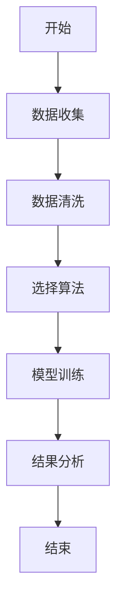
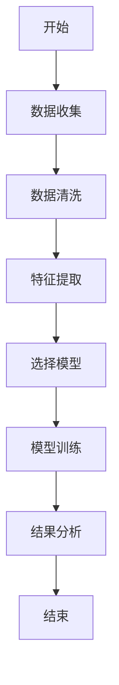
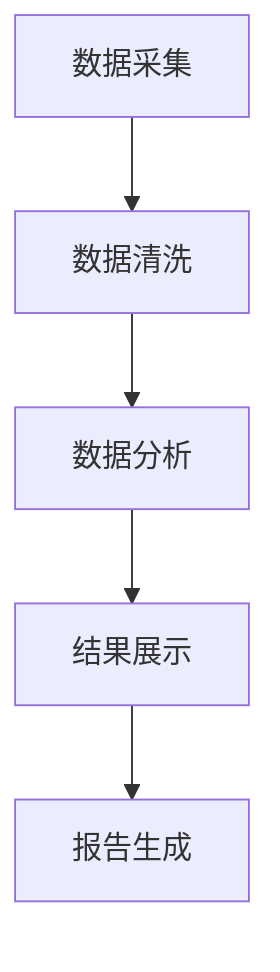
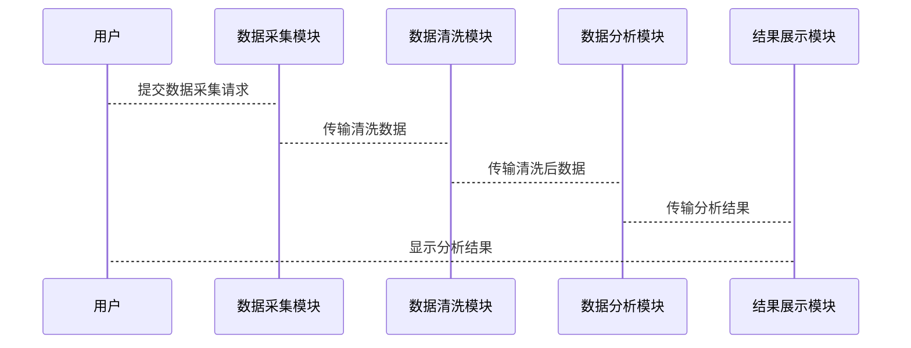

                 


# 特价股票与公司元宇宙战略执行力的潜在关联研究

---

## 关键词：
特价股票、元宇宙战略、公司执行力、股票市场、战略执行、技术分析、市场风险

---

## 摘要：
本文探讨了特价股票与公司元宇宙战略执行力之间的潜在关联。通过分析特价股票的市场特点和公司元宇宙战略的核心要素，结合技术分析方法和数学模型，提出了评估公司元宇宙战略对特价股票影响的方法。文章内容包括背景介绍、核心概念对比、算法原理、数学模型构建、系统设计、项目实战以及最佳实践等部分，旨在为投资者和企业提供新的视角和决策支持。

---

# 第一部分: 特价股票与公司元宇宙战略的背景与概念

## 第1章: 特价股票的市场现状与问题背景

### 1.1 特价股票的定义与特点

#### 1.1.1 特价股票的定义
特价股票是指价格相对较低的股票，通常在小盘股或新兴市场中较为常见。这类股票具有较高的增长潜力，但也伴随着较高的风险。

#### 1.1.2 特价股票的核心特点
- 价格低：通常在10元以下，适合中小投资者参与。
- 市场流动性较低：交易量可能不大，影响价格波动。
- 增长潜力大：新兴公司或转型期公司可能通过增长推动股价上涨。

#### 1.1.3 特价股票的市场定位与参与者
- 中小投资者：追求高回报，风险承受能力较高。
- 机构投资者：通过投资特价股票优化资产配置。
- 新兴企业：利用特价股票吸引投资者关注。

### 1.2 特价股票的市场现状分析

#### 1.2.1 特价股票市场的现状
当前，特价股票市场呈现以下特点：
- 市场波动较大，受政策和市场情绪影响显著。
- 投资者结构多元化，中小投资者占比高。
- 新兴行业和科技类公司较多，技术创新推动股价上涨。

#### 1.2.2 特价股票市场的参与者分析
- 投资者：包括个人投资者和机构投资者。
- 公司：通过发行股票融资，提升市场关注度。
- 中介机构：券商、交易所等提供交易服务。

#### 1.2.3 特价股票市场的波动性与风险
- 市场波动剧烈，价格受情绪影响较大。
- 信息不对称风险高，投资者需谨慎选择。
- 政策风险和市场风险并存，需做好风险管理。

## 第2章: 公司元宇宙战略的定义与特点

### 2.1 元宇宙的定义与核心特征

#### 2.1.1 元宇宙的定义
元宇宙是基于虚拟现实技术构建的虚拟空间，用户通过虚拟身份在其中进行社交、娱乐、工作等活动。

#### 2.1.2 元宇宙的核心特征
- 虚拟性：基于虚拟现实技术构建。
- 开放性：支持多平台和跨平台交互。
- 社交性：用户可以在元宇宙中进行社交互动。
- 可编程性：通过区块链和智能合约实现去中心化管理。

#### 2.1.3 元宇宙与现实世界的关联
元宇宙与现实世界通过技术手段实现交互，用户可以在元宇宙中反映现实世界的行为，反之亦然。

### 2.2 公司元宇宙战略的定义与实施路径

#### 2.2.1 公司元宇宙战略的定义
公司元宇宙战略是指企业在元宇宙中进行产品开发、市场拓展、品牌建设等活动，以实现商业目标。

#### 2.2.2 元宇宙战略的实施路径
- 确定战略目标：明确企业在元宇宙中的定位和目标。
- 技术研发：投入虚拟现实、区块链等技术开发。
- 产品设计：开发符合用户需求的元宇宙产品。
- 市场推广：通过营销活动提升品牌影响力。

#### 2.2.3 元宇宙战略的核心要素
- 技术：虚拟现实、区块链、人工智能。
- 产品：虚拟商品、虚拟服务、虚拟社区。
- 市场：用户需求、竞争对手分析、市场趋势。

## 第3章: 特价股票与公司元宇宙战略的关联性分析

### 3.1 特价股票与公司战略的关联性

#### 3.1.1 特价股票与公司战略的互动关系
- 公司战略影响股价：良好的战略执行力可能提升股价。
- 股价影响公司战略：股价波动可能影响公司的资金筹措能力。

#### 3.1.2 特价股票市场对公司战略的影响
- 市场关注度：股价波动反映市场对公司战略的认可度。
- 资金支持：股价上涨可能带来更多的资金支持。

#### 3.1.3 公司战略对特价股票市场的影响
- 技术创新：推动股价上涨。
- 市场拓展：扩大用户基础，提升股价。
- 品牌效应：增强投资者信心，提升股价。

### 3.2 元宇宙战略对特价股票的潜在影响

#### 3.2.1 元宇宙技术对股票市场的潜在影响
- 市场模式：元宇宙可能改变股票交易的方式。
- 技术应用：虚拟现实技术可能提升投资者的交易体验。
- 股票价值：元宇宙技术的应用可能提升公司的股价。

#### 3.2.2 元宇宙战略对公司股价的影响
- 技术优势：掌握元宇宙核心技术的企业可能获得更高的估值。
- 市场先机：早期进入元宇宙市场的公司可能获得竞争优势。
- 品牌效应：成功的元宇宙战略可能提升公司的品牌形象。

#### 3.2.3 特价股票市场的元宇宙机会
- 新兴技术推动股价上涨：技术创新可能带来股价上涨。
- 新兴市场机会：元宇宙可能催生新的市场机会。
- 投资者教育：投资者需要了解元宇宙技术对股票市场的影响。

---

# 第二部分: 核心概念与联系

## 第4章: 特价股票与公司元宇宙战略的核心概念对比

### 4.1 特价股票与公司元宇宙战略的核心要素对比

| 特价股票 | 公司元宇宙战略 |
|----------|----------------|
| 价格低   | 技术驱动       |
| 流动性差  | 用户参与度高    |
| 增长潜力大 | 市场扩展性      |
| 风险高    | 竞争激烈       |

### 4.2 特价股票与公司元宇宙战略的ER实体关系图

```mermaid
erDiagram
    公司元宇宙战略 <--- 特价股票
    公司元宇宙战略 --> 元宇宙技术
    特价股票 --> 股票市场
```

### 4.3 特价股票与公司元宇宙战略的联系

#### 4.3.1 技术驱动股价变化
- 元宇宙技术的创新可能推动股价上涨。
- 虚拟现实技术的应用可能提升投资者的交易体验。

#### 4.3.2 市场互动影响股价
- 公司战略的执行可能影响市场对公司的信心。
- 投资者的预期可能影响股价波动。

#### 4.3.3 技术与市场的相互作用
- 元宇宙技术的应用可能改变股票交易的方式。
- 股票市场的变化可能影响公司在元宇宙中的发展。

---

# 第三部分: 算法原理讲解

## 第5章: 特价股票价格波动分析算法

### 5.1 特价股票价格波动分析算法



### 5.2 算法实现

```python
import pandas as pd
from sklearn.model_selection import train_test_split
from sklearn.linear_model import LinearRegression
from sklearn.metrics import mean_squared_error

# 数据加载
data = pd.read_csv('stock_data.csv')

# 数据清洗
data.dropna(inplace=True)

# 特征选择
features = ['open', 'high', 'low', 'volume']
target = 'close'

# 数据分割
X_train, X_test, y_train, y_test = train_test_split(data[features], data[target], test_size=0.2)

# 模型训练
model = LinearRegression()
model.fit(X_train, y_train)

# 预测与评估
y_pred = model.predict(X_test)
mse = mean_squared_error(y_test, y_pred)
print(f"均方误差: {mse}")
```

---

## 第6章: 公司元宇宙战略执行力评估算法

### 6.1 元宇宙战略执行力评估算法



### 6.2 模型实现

```python
import pandas as pd
from sklearn.svm import SVC
from sklearn.model_selection import train_test_split
from sklearn.metrics import accuracy_score

# 数据加载
data = pd.read_csv('strategy_data.csv')

# 数据清洗
data.dropna(inplace=True)

# 特征选择
features = ['tech_innovation', 'market_share', 'user_engagement']
target = 'strategy_success'

# 数据分割
X_train, X_test, y_train, y_test = train_test_split(data[features], data[target], test_size=0.2)

# 模型训练
model = SVC()
model.fit(X_train, y_train)

# 预测与评估
y_pred = model.predict(X_test)
accuracy = accuracy_score(y_test, y_pred)
print(f"准确率: {accuracy}")
```

---

# 第四部分: 数学模型

## 第7章: 特价股票价格预测模型

### 7.1 ARIMA模型

$$ARIMA(p, d, q)$$

其中：
- \( p \)：自回归阶数
- \( d \)：差分阶数
- \( q \)：移动平均阶数

### 7.2 神经网络模型

$$ LSTM(p) $$

其中：
- \( p \)：LSTM层的神经元数量

---

## 第8章: 元宇宙战略执行效果评估模型

### 8.1 技术评估模型

$$ TechScore = \sum_{i=1}^{n} w_i \cdot f_i $$

其中：
- \( w_i \)：第i项技术的权重
- \( f_i \)：第i项技术的评分

### 8.2 市场评估模型

$$ MarketScore = \sum_{i=1}^{m} w_i \cdot g_i $$

其中：
- \( w_i \)：第i项市场的权重
- \( g_i \)：第i项市场的评分

---

# 第五部分: 系统分析与架构设计

## 第9章: 特价股票与元宇宙战略分析系统

### 9.1 系统功能设计

#### 9.1.1 数据采集模块
- 数据来源：股票市场数据、公司元宇宙战略数据。
- 数据清洗：处理缺失值、异常值。

#### 9.1.2 数据分析模块
- 特价股票分析：价格波动、市场趋势。
- 元宇宙战略分析：技术评估、市场评估。

#### 9.1.3 结果展示模块
- 可视化展示：股价波动图、战略执行效果评分。
- 报告生成：分析报告输出。

### 9.2 系统架构设计



---

## 第10章: 系统接口与交互设计

### 10.1 系统接口设计

- 数据接口：API接口用于数据采集。
- 分析接口：API接口用于数据分析。
- 展示接口：API接口用于结果展示。

### 10.2 系统交互设计



---

# 第六部分: 项目实战

## 第11章: 特价股票分析实战

### 11.1 环境配置

- Python版本：3.8以上
- 库依赖：pandas、numpy、scikit-learn

### 11.2 代码实现

```python
import pandas as pd
import numpy as np

# 数据加载
data = pd.read_csv('stock_data.csv')

# 数据清洗
data.dropna(inplace=True)

# 特征选择
features = ['open', 'high', 'low', 'volume']
target = 'close'

# 数据分割
X = data[features]
y = data[target]

# 模型训练
from sklearn.ensemble import RandomForestRegressor
model = RandomForestRegressor()
model.fit(X, y)

# 预测与评估
y_pred = model.predict(X)
mse = mean_squared_error(y, y_pred)
print(f"均方误差: {mse}")
```

---

## 第12章: 元宇宙战略执行分析实战

### 12.1 环境配置

- Python版本：3.8以上
- 库依赖：pandas、numpy、scikit-learn

### 12.2 代码实现

```python
import pandas as pd
from sklearn.svm import SVC
from sklearn.model_selection import train_test_split
from sklearn.metrics import accuracy_score

# 数据加载
data = pd.read_csv('strategy_data.csv')

# 数据清洗
data.dropna(inplace=True)

# 特征选择
features = ['tech_innovation', 'market_share', 'user_engagement']
target = 'strategy_success'

# 数据分割
X_train, X_test, y_train, y_test = train_test_split(data[features], data[target], test_size=0.2)

# 模型训练
model = SVC()
model.fit(X_train, y_train)

# 预测与评估
y_pred = model.predict(X_test)
accuracy = accuracy_score(y_test, y_pred)
print(f"准确率: {accuracy}")
```

---

# 第七部分: 最佳实践

## 第13章: 小结与注意事项

### 13.1 小结

- 特价股票与公司元宇宙战略执行力之间存在潜在关联。
- 技术创新和市场执行是影响股价的重要因素。
- 元宇宙技术的应用可能改变股票市场的未来。

### 13.2 注意事项

- 投资者需谨慎评估风险，避免盲目跟风。
- 公司需加强技术创新，提升战略执行力。
- 政府需加强监管，保护投资者利益。

## 第14章: 拓展阅读

### 14.1 相关书籍

- 《元宇宙：虚拟的崛起》
- 《股票投资实战技巧》

### 14.2 网络资源

- 元宇宙技术论坛
- 股票投资博客

### 14.3 学术研究

- 元宇宙与金融学研究论文
- 特价股票市场分析学术论文

---

# 作者：AI天才研究院 & 禅与计算机程序设计艺术

