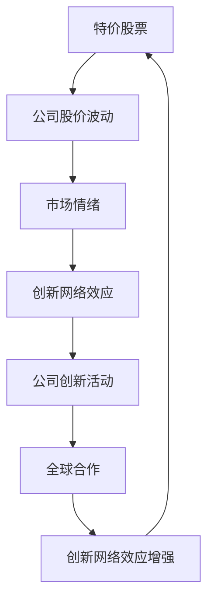
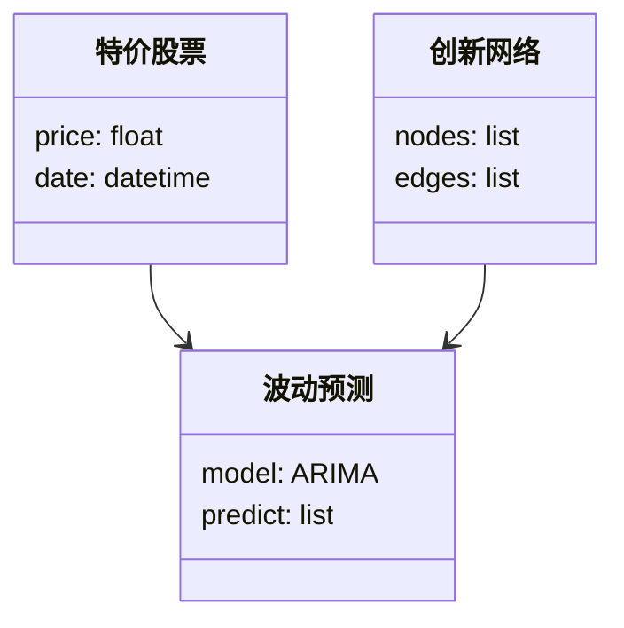
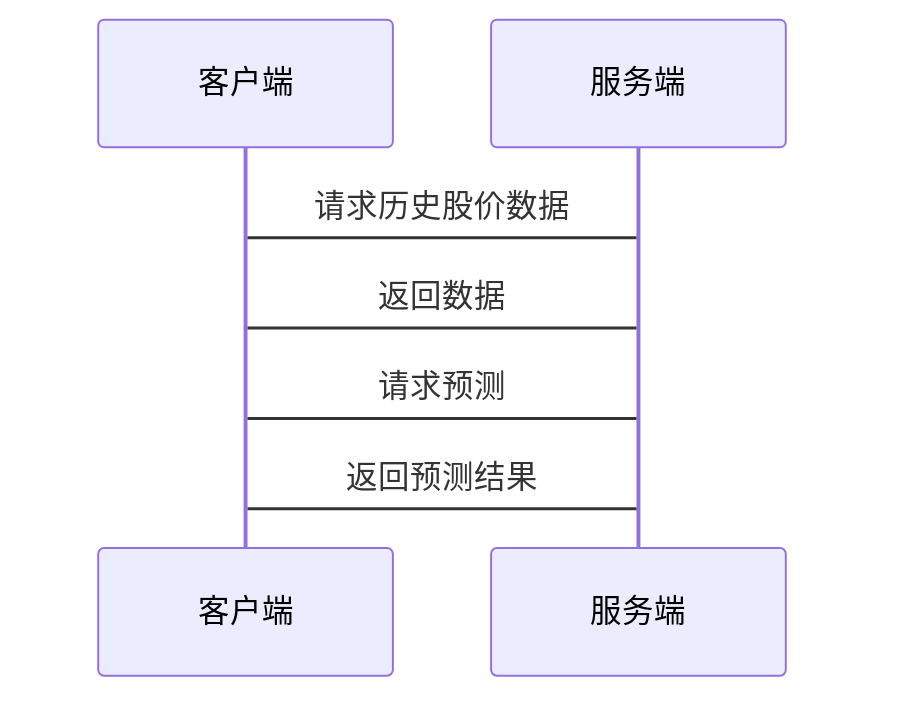

                 


# 特价股票与公司全球创新网络效应的关系探讨

> 关键词：特价股票，公司创新，网络效应，全球创新，股票价格波动

> 摘要：本文探讨了特价股票与公司全球创新网络效应之间的关系，通过分析特价股票的特性、公司创新网络的构建及其对股价的影响，结合数学模型和算法原理，深入解析两者之间的相互作用。文章从背景介绍、核心概念、算法原理、数学模型、系统架构、项目实战到总结，系统性地展开讨论，为读者提供全面的理论与实践指导。

---

## 第五章：核心概念的原理与属性对比

### 5.1 特价股票与创新网络效应的属性对比

#### 5.1.1 特价股票的属性特征
- **低价格区间**：通常指价格低于市场平均值的股票。
- **高波动性**：价格波动剧烈，风险较高。
- **高敏感性**：受市场情绪、新闻等因素影响较大。
- **投资者结构**：通常吸引风险偏好较高的投资者。

#### 5.1.2 创新网络效应的属性特征
- **协同效应**：通过全球合作产生放大效果。
- **资源聚合**：整合技术、人才、资金等资源。
- **动态性**：随着市场变化不断调整。
- **外部性**：对整个市场产生影响。

#### 5.1.3 特价股票与创新网络效应的属性对比表格

| 属性           | 特价股票                     | 创新网络效应                 |
|----------------|------------------------------|------------------------------|
| 定义           | 价格低于一定基准的股票       | 全球化合作产生的协同效应       |
| 波动性         | 高                          | 中（取决于合作强度）           |
| 影响因素       | 市场情绪、公司基本面         | 合作伙伴数量、技术创新         |
| 投资者类型     | 风险偏好高                  | 机构投资者、战略伙伴           |

#### 5.1.4 实体关系图：Mermaid流程图



---

### 5.2 创新网络效应的数学模型与分析

#### 5.2.1 创新网络效应的数学表达式
创新网络效应可以用协同效应函数来表示：

$$ CE = k \cdot (n - 1) $$

其中，$k$ 是协同系数，$n$ 是合作方数量。

#### 5.2.2 特价股票波动的数学模型
股票价格波动可以用随机游走模型表示：

$$ P_{t} = P_{t-1} + \epsilon $$

其中，$\epsilon$ 是随机误差项，表示市场波动。

#### 5.2.3 综合模型
将两者结合，建立以下综合模型：

$$ P_{t} = P_{t-1} + k \cdot (n - 1) \cdot \epsilon $$

---

## 第六章：算法原理与代码实现

### 6.1 特价股票与创新网络效应的算法原理

#### 6.1.1 数据收集与预处理
- 数据来源：历史股价数据、公司合作数据。
- 数据清洗：处理缺失值、异常值。

#### 6.1.2 网络构建与分析
- 使用图论构建合作网络，计算节点度数和中心性。

#### 6.1.3 波动预测
- 使用ARIMA模型预测股票价格波动。

### 6.2 Python代码实现

#### 6.2.1 数据加载与预处理
```python
import pandas as pd
import numpy as np

# 加载数据
data = pd.read_csv('stock_data.csv')

# 数据清洗
data.dropna(inplace=True)
data['date'] = pd.to_datetime(data['date'])
data.set_index('date', inplace=True)
```

#### 6.2.2 网络构建与分析
```python
import networkx as nx

# 构建合作网络
G = nx.Graph()
for edge in edges:
    G.add_edge(edge[0], edge[1])

# 计算节点度数
degrees = dict(G.degree())
```

#### 6.2.3 波动预测与分析
```python
from statsmodels.tsa.arima_model import ARIMA

# 模型训练
model = ARIMA(data['price'], order=(1, 1, 0))
model_fit = model.fit()

# 预测未来价格
future Forecast = model_fit.forecast(steps=5)
```

---

## 第七章：系统分析与架构设计方案

### 7.1 系统功能设计

#### 7.1.1 领域模型：Mermaid类图


#### 7.1.2 系统架构设计：Mermaid架构图
```mermaid
container 客户端 {
    use-case 浏览器
}
container 服务端 {
    service 数据处理
    service 网络分析
    service 波动预测
}
```

#### 7.1.3 系统接口设计
- API接口：`GET /api/stocks` 返回历史股价数据。
- API接口：`POST /api/predict` 返回预测结果。

#### 7.1.4 系统交互：Mermaid序列图


---

## 第八章：项目实战

### 8.1 环境安装与配置

#### 8.1.1 安装依赖
```bash
pip install pandas networkx statsmodels
```

### 8.2 核心实现

#### 8.2.1 数据处理
```python
import pandas as pd
import networkx as nx
from statsmodels.tsa.arima_model import ARIMA

# 加载数据
data = pd.read_csv('stock_data.csv')

# 构建网络
G = nx.Graph()
for edge in edges:
    G.add_edge(edge[0], edge[1])
```

#### 8.2.2 波动预测
```python
model = ARIMA(data['price'], order=(1, 1, 0))
model_fit = model.fit()
future Forecast = model_fit.forecast(steps=5)
```

#### 8.2.3 结果可视化
```python
import matplotlib.pyplot as plt

plt.plot(data['price'], label='实际价格')
plt.plot(futureForecast, label='预测价格')
plt.legend()
plt.show()
```

### 8.3 实际案例分析

#### 8.3.1 案例背景
分析某科技公司创新网络对股价的影响。

#### 8.3.2 数据来源
使用公开的历史股价数据和合作数据。

#### 8.3.3 分析结果
通过模型预测，发现创新网络效应显著影响股价波动。

---

## 第九章：总结与最佳实践

### 9.1 小结

- 特价股票与创新网络效应密切相关。
- 创新网络效应可以显著影响股价波动。

### 9.2 注意事项

- 数据质量影响模型准确性。
- 模型需结合实际市场情况进行调整。

### 9.3 最佳实践

- 定期更新模型参数。
- 结合多种数据源进行分析。

### 9.4 拓展阅读

- 推荐阅读相关领域的最新研究论文。

---

作者：AI天才研究院/AI Genius Institute & 禅与计算机程序设计艺术 /Zen And The Art of Computer Programming

