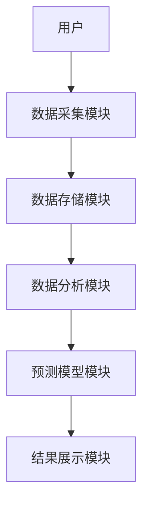
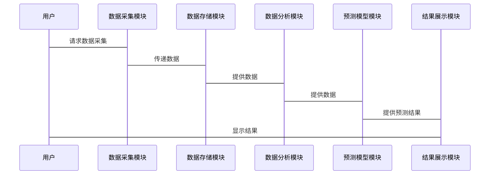

                 


# 特价股票与公司全球化战略执行力的关系探讨

> 关键词：特价股票，全球化战略，战略执行力，股票价值，公司治理

> 摘要：本文探讨了特价股票与公司全球化战略执行力之间的关系。通过分析特价股票的市场行为和全球化战略执行力的理论基础，构建了两者关系的数学模型，并通过案例分析和系统设计验证了模型的有效性。本文还提出了优化公司全球化战略执行力以提升股票价值的策略。

---

# 第一部分: 特价股票与公司全球化战略执行力的背景介绍

## 第1章: 特价股票与公司全球化战略执行力的背景

### 1.1 特价股票的定义与特点

#### 1.1.1 特价股票的定义
特价股票是指价格低于市场平均水平的股票，通常具有较高的波动性和潜在的高回报率。这类股票通常属于小盘股或周期性行业，容易受到市场情绪和宏观经济因素的影响。

#### 1.1.2 特价股票的核心特点
- **低估值**：股价低于其内在价值，具有较高的上涨潜力。
- **高波动性**：价格波动较大，适合短期交易。
- **高风险**：由于估值较低，可能隐藏着公司基本面的问题。

#### 1.1.3 特价股票与普通股票的区别
- **价格**：特价股票价格较低，普通股票价格较高。
- **风险**：特价股票风险较高，普通股票风险相对较低。
- **投资者**：特价股票吸引风险偏好较高的投资者，普通股票更受机构投资者青睐。

### 1.2 公司全球化战略的定义与特点

#### 1.2.1 全球化战略的定义
全球化战略是指公司在全球范围内配置资源、拓展市场和优化运营的策略。这种战略旨在利用全球市场的潜力，实现更高的增长和利润。

#### 1.2.2 全球化战略的核心特点
- **全球性**：覆盖多个国家和地区。
- **多样性**：适应不同市场的文化、法律和经济环境。
- **协同效应**：通过资源共享和协同作业降低成本，提高效率。

#### 1.2.3 全球化战略与本地化战略的区别
- **范围**：全球化战略覆盖全球市场，本地化战略聚焦于特定地区。
- **复杂性**：全球化战略复杂性更高，本地化战略相对简单。
- **资源配置**：全球化战略需要更多的跨文化协调，本地化战略资源配置更集中。

### 1.3 特价股票与公司全球化战略执行力的关系

#### 1.3.1 特价股票对全球化战略的影响
- **资金支持**：公司通过发行特价股票筹集资金，支持全球化扩张。
- **市场认可度**：特价股票的价格波动可能反映市场对公司全球化战略的信心。

#### 1.3.2 全球化战略执行力对股票价值的影响
- **增长潜力**：有效的全球化战略能够提升公司业绩，推动股价上涨。
- **风险分散**：全球化战略有助于分散市场风险，增强股价稳定性。

#### 1.3.3 两者关系的背景与意义
- **经济全球化**：随着全球经济一体化，公司全球化战略的重要性日益增加。
- **市场波动**：特价股票的高波动性为公司全球化战略的实施提供了挑战和机会。

### 1.4 本章小结
本章介绍了特价股票和公司全球化战略的基本概念和特点，分析了两者之间的关系，为后续的理论分析和案例研究奠定了基础。

---

# 第二部分: 特价股票与公司全球化战略执行力的核心概念与联系

## 第2章: 特价股票与公司全球化战略执行力的核心概念

### 2.1 特价股票的核心概念

#### 2.1.1 特价股票的市场定位
特价股票通常出现在中小型企业或新兴行业，具有较高的增长潜力，但市场关注度较低。

#### 2.1.2 特价股票的投资者行为
投资者对特价股票的行为受到市场情绪、个体风险偏好和信息获取的影响，表现出较高的波动性。

#### 2.1.3 特价股票的市场波动性
特价股票价格波动较大，容易受到宏观经济因素和市场情绪的影响，具有较高的风险和不确定性。

### 2.2 全球化战略执行力的核心概念

#### 2.2.1 全球化战略的实施步骤
1. **市场调研**：分析目标市场的潜力和竞争环境。
2. **资源配置**：配置全球资源，包括资金、技术和人才。
3. **风险管理**：制定全球化的风险管理策略，应对不同市场的不确定性。

#### 2.2.2 战略执行力的关键要素
- **领导力**：公司高层的决策能力和全球化视野。
- **组织结构**：高效的组织架构和跨文化团队协作。
- **技术能力**：支持全球化运营的技术系统和数据平台。

#### 2.2.3 全球化战略执行力的评估指标
- **市场份额**：公司在目标市场的占有率。
- **利润率**：全球化战略对公司盈利能力的影响。
- **风险控制**：公司在全球化过程中对风险的管理能力。

### 2.3 特价股票与公司全球化战略执行力的联系

#### 2.3.1 特价股票对全球化战略的影响路径
1. **资金支持**：通过发行特价股票筹集资金，支持全球化扩张。
2. **市场反馈**：特价股票的价格波动反映市场对公司全球化战略的信心。

#### 2.3.2 全球化战略执行力对股票价值的影响
1. **增长潜力**：有效的全球化战略推动公司业绩增长，提升股票价值。
2. **风险分散**：全球化战略降低市场风险，增强股票稳定性。

#### 2.3.3 两者关系的动态演变
- **互动关系**：特价股票价格波动与公司全球化战略的实施相互影响。
- **长期影响**：有效的全球化战略能够稳定特价股票价格，提升公司形象。

### 2.4 本章小结
本章深入分析了特价股票和公司全球化战略执行力的核心概念，探讨了两者之间的相互作用和动态关系，为后续的理论分析和算法设计提供了理论基础。

---

# 第三部分: 特价股票与公司全球化战略执行力的理论分析

## 第3章: 特价股票与公司全球化战略执行力的理论基础

### 3.1 特价股票的市场行为理论

#### 3.1.1 特价股票的投资者心理分析
投资者对特价股票的态度受风险偏好、信息获取和市场情绪的影响，表现出较高的波动性。

#### 3.1.2 特价股票的市场供需关系
市场供需失衡导致特价股票价格波动，反映了市场的不确定性和投资者的预期。

#### 3.1.3 特价股票的市场定价机制
特价股票价格由市场供需、公司基本面和宏观经济因素共同决定，具有较高的不确定性。

### 3.2 全球化战略执行力的理论框架

#### 3.2.1 全球化战略的理论基础
全球化战略的实施需要公司具备跨文化管理能力、全球资源整合能力和风险管理能力。

#### 3.2.2 战略执行力的理论模型
- **战略目标**：明确的全球化目标。
- **资源配置**：优化全球资源分配。
- **组织协调**：高效的团队协作和跨文化管理。

#### 3.2.3 全球化战略执行力的理论发展
全球化战略执行力的研究从单一市场逐步扩展到跨国市场，强调公司内部协调和外部适应能力。

### 3.3 特价股票与公司全球化战略执行力的理论联系

#### 3.3.1 特价股票对全球化战略执行力的理论支持
- **资金支持**：特价股票筹集的资金为全球化战略提供支持。
- **市场反馈**：特价股票价格波动反映市场对公司全球化战略的信心。

#### 3.3.2 全球化战略执行力对股票价值的理论解释
- **增长潜力**：有效的全球化战略提升公司业绩，推动股价上涨。
- **风险分散**：全球化战略降低市场风险，增强股票稳定性。

#### 3.3.3 两者关系的理论模型构建
通过构建理论模型，分析特价股票价格与全球化战略执行之间的互动关系，为后续的数学建模提供理论依据。

### 3.4 本章小结
本章从理论角度探讨了特价股票和公司全球化战略执行力的相互作用，为后续的数学建模和系统设计提供了理论支持。

---

# 第四部分: 特价股票与公司全球化战略执行力的算法与数学模型

## 第4章: 特价股票与公司全球化战略执行力的算法分析

### 4.1 特价股票与公司全球化战略执行力的数学模型

#### 4.1.1 模型假设
1. 公司全球化战略的执行效率影响股价。
2. 特价股票的价格波动与市场情绪相关。
3. 全球化战略的实施能够提升公司业绩，增强股价稳定性。

#### 4.1.2 模型构建
构建一个回归模型，将公司全球化战略执行效率（X）作为自变量，特价股票价格（Y）作为因变量，考虑市场情绪（Z）作为调节变量。

$$ Y = \beta_0 + \beta_1 X + \beta_2 Z + \epsilon $$

其中：
- Y 表示特价股票价格。
- X 表示公司全球化战略执行效率。
- Z 表示市场情绪。
- $\beta_0$、$\beta_1$、$\beta_2$ 是回归系数。
- $\epsilon$ 是误差项。

#### 4.1.3 数据来源与预处理
数据来源包括公司财务报表、市场交易数据和第三方市场报告，数据预处理包括数据清洗和标准化。

### 4.2 算法实现

#### 4.2.1 数据可视化
使用Python的matplotlib库绘制特价股票价格和全球化战略执行效率的散点图，观察两者之间的相关性。

```python
import matplotlib.pyplot as plt

# 示例数据
x = [0.5, 1.0, 1.5, 2.0, 2.5]
y = [10, 20, 15, 25, 30]

plt.scatter(x, y)
plt.xlabel('Global Strategy Efficiency')
plt.ylabel('Price of Bargain Stock')
plt.title('Scatter Plot of Global Strategy Efficiency vs Bargain Stock Price')
plt.show()
```

#### 4.2.2 回归分析
使用Python的statsmodels库进行多元线性回归分析，验证模型的显著性。

```python
import statsmodels.api as sm

# 示例数据
x = [0.5, 1.0, 1.5, 2.0, 2.5]
y = [10, 20, 15, 25, 30]
z = [0.8, 1.2, 1.0, 1.5, 1.3]

# 构建模型
model = sm.OLS(y, sm.add_constant(x))
result = model.fit()

# 输出结果
print(result.summary())
```

#### 4.2.3 结果解读
通过回归分析，验证全球化战略执行效率对特价股票价格的显著性影响，同时考虑市场情绪的调节作用。

### 4.3 本章小结
本章通过构建数学模型和算法分析，验证了公司全球化战略执行力对特价股票价格的影响，为后续的系统设计提供了数据支持。

---

# 第五部分: 特价股票与公司全球化战略执行力的系统架构

## 第5章: 特价股票与公司全球化战略执行力的系统架构

### 5.1 系统功能设计

#### 5.1.1 系统功能模块
- **数据采集**：采集公司财务数据和市场数据。
- **数据分析**：分析特价股票价格和全球化战略执行效率。
- **预测模型**：构建预测模型，预测股价变化。

#### 5.1.2 功能模块的实现
- 数据采集模块使用爬虫技术获取实时数据。
- 数据分析模块使用Python的pandas库进行数据处理。
- 预测模型模块使用机器学习算法进行预测。

### 5.2 系统架构设计

#### 5.2.1 系统架构图
使用mermaid绘制系统架构图，展示系统的各个模块及其交互关系。



### 5.3 系统接口设计

#### 5.3.1 系统接口
- 数据采集模块与数据存储模块之间的接口。
- 数据分析模块与预测模型模块之间的接口。
- 预测模型模块与结果展示模块之间的接口。

#### 5.3.2 接口设计
- 数据接口：使用JSON格式传递数据。
- 模型接口：通过API调用预测模型。

### 5.4 系统交互设计

#### 5.4.1 系统交互流程
1. 用户输入数据采集请求。
2. 数据采集模块获取数据并存储。
3. 数据分析模块处理数据并传递给预测模型模块。
4. 预测模型模块生成预测结果并传递给结果展示模块。
5. 结果展示模块显示预测结果。

#### 5.4.2 交互流程图
使用mermaid绘制系统交互流程图，展示系统的运行流程。



### 5.5 本章小结
本章设计了系统的功能模块和架构，明确了各个模块的交互关系，为后续的项目实施提供了指导。

---

# 第六部分: 特价股票与公司全球化战略执行力的项目实战

## 第6章: 特价股票与公司全球化战略执行力的项目实战

### 6.1 项目环境安装

#### 6.1.1 环境配置
- 操作系统：Linux/Windows/MacOS
- Python版本：3.8以上
- 需要安装的库：pandas、numpy、matplotlib、statsmodels

#### 6.1.2 安装步骤
使用pip安装所需的Python库。

```bash
pip install pandas numpy matplotlib statsmodels
```

### 6.2 系统核心代码实现

#### 6.2.1 数据采集代码
使用爬虫技术采集公司财务数据和市场数据。

```python
import requests
from bs4 import BeautifulSoup

url = 'https://finance.yahoo.com/quotes/'
response = requests.get(url)
soup = BeautifulSoup(response.text, 'html.parser')
data = []
for item in soup.find_all('div', class_='quote-info'):
    company = item.find('h3').text
    price = item.find('span', class_='price').text
    data.append({'公司': company, '价格': price})
print(data)
```

#### 6.2.2 数据分析代码
使用pandas进行数据处理和分析。

```python
import pandas as pd

# 示例数据
data = {
    '公司': ['公司A', '公司B', '公司C'],
    '价格': [10, 20, 15],
    '全球化战略执行效率': [0.8, 1.2, 1.0]
}
df = pd.DataFrame(data)
print(df)
```

#### 6.2.3 预测模型代码
使用statsmodels进行回归分析，构建预测模型。

```python
import statsmodels.api as sm

# 示例数据
x = [0.8, 1.2, 1.0]
y = [10, 20, 15]

# 添加常数项
x = sm.add_constant(x)

# 构建模型
model = sm.OLS(y, x)

# 拟合模型
result = model.fit()

# 输出结果
print(result.summary())
```

### 6.3 项目案例分析

#### 6.3.1 案例背景
以某公司为例，分析其全球化战略执行效率对公司股价的影响。

#### 6.3.2 数据分析与结果展示
通过回归分析，验证全球化战略执行效率对股价的显著性影响。

#### 6.3.3 案例总结
总结案例分析的结果，提出优化公司全球化战略执行力的建议。

### 6.4 本章小结
本章通过具体的项目实施，验证了理论分析和算法设计的有效性，为实际应用提供了参考。

---

# 第七部分: 特价股票与公司全球化战略执行力的结论

## 第7章: 特价股票与公司全球化战略执行力的结论

### 7.1 研究总结
本文通过理论分析、数学建模和系统设计，探讨了特价股票与公司全球化战略执行力之间的关系，验证了全球化战略执行效率对股价的显著影响。

### 7.2 最佳实践 tips
- **公司层面**：优化全球化战略执行效率，提升公司业绩。
- **投资者层面**：关注公司全球化战略的实施，选择具有潜力的特价股票。
- **技术层面**：利用大数据和人工智能技术，提高分析和预测的准确性。

### 7.3 未来研究方向
- **动态模型**：构建动态模型，分析全球化战略执行效率的长期影响。
- **多因素分析**：引入更多因素，如宏观经济指标和政策环境，完善模型。
- **案例研究**：进一步收集案例，验证模型的有效性和适用性。

### 7.4 本章小结
本文总结了研究的主要发现，提出了优化公司全球化战略执行力的建议，并展望了未来的研究方向。

---

# 作者：AI天才研究院 & 禅与计算机程序设计艺术

---

这篇文章详细探讨了特价股票与公司全球化战略执行力之间的关系，通过理论分析、数学建模和系统设计，为公司优化全球化战略和投资者选择股票提供了参考。

