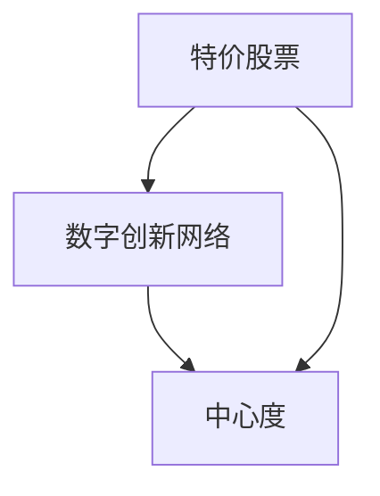
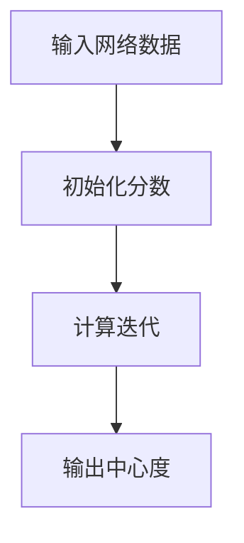
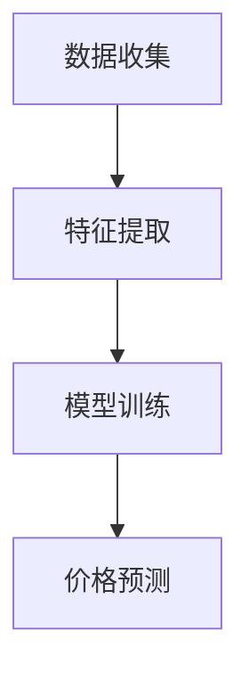
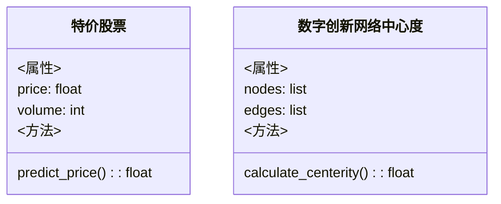
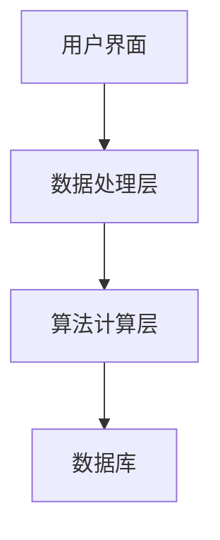
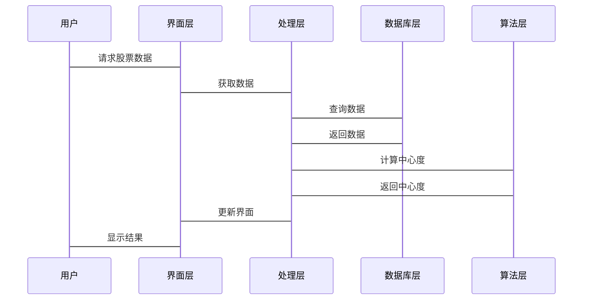

                 


# 特价股票与公司全球数字创新网络中心度的关系探讨

**关键词**：特价股票、数字创新网络、中心度、算法原理、系统架构

**摘要**：本文探讨了特价股票与公司全球数字创新网络中心度之间的关系，通过分析特价股票的市场表现、数字创新网络的构成要素及其中心度的计算方法，结合实际案例和算法实现，深入挖掘两者之间的相互作用机制，为企业战略决策和投资者分析提供理论依据和实践指导。

---

## 第一部分: 特价股票与数字创新网络的背景与概念

### 第1章: 特价股票与数字创新网络的概述

#### 1.1 特价股票的基本概念
##### 1.1.1 特价股票的定义与特点
特价股票是指价格相对较低的股票，通常属于小盘股或中盘股，具有较高的增长潜力和风险。其特点包括低估值、高波动性和适合短线交易。

##### 1.1.2 特价股票的市场定位与投资者特征
特价股票主要集中在新兴市场或成长型企业，吸引风险承受能力强的投资者，如激进投资者和投机者。

##### 1.1.3 特价股票的投资价值与风险分析
特价股票具有较高的增长潜力，但风险也较高，需结合市场环境和公司基本面进行综合分析。

#### 1.2 全球数字创新网络的定义与特征
##### 1.2.1 数字创新网络的构成要素
数字创新网络由技术、数据、算法、平台和用户构成，强调数字化技术和创新的协同效应。

##### 1.2.2 全球数字创新网络的发展趋势
数字创新网络正向智能化、全球化和生态化方向发展，推动全球数字经济的增长。

##### 1.2.3 数字创新网络的核心驱动力
数据驱动、技术创新和网络协同是数字创新网络的核心驱动力。

#### 1.3 特价股票与数字创新网络的关系
##### 1.3.1 特价股票与数字创新网络的关联性
数字创新网络的快速发展为特价股票提供了新的投资机会，而特价股票的市场表现也影响着数字创新网络的扩展。

##### 1.3.2 数字创新网络对特价股票的影响机制
数字创新网络通过技术革新和市场扩展，提升特价股票的估值和流动性，影响其价格波动。

##### 1.3.3 特价股票在数字创新网络中的地位与作用
特价股票作为创新企业的重要融资工具，推动数字创新网络的发展，同时自身也受益于网络效应。

---

## 第二部分: 特价股票与数字创新网络中心度的核心概念与联系

### 第2章: 特价股票与数字创新网络中心度的核心概念

#### 2.1 特价股票的市场表现分析
##### 2.1.1 特价股票的市场波动性
特价股票价格波动较大，受市场情绪和宏观经济因素影响显著。

##### 2.1.2 特价股票的投资者行为模式
投资者行为倾向于短期交易和高风险偏好，影响市场价格。

##### 2.1.3 特价股票的市场信息传播机制
信息传播速度快，影响市场预期，导致股价波动。

#### 2.2 数字创新网络中心度的定义与计算方法
##### 2.2.1 数字创新网络中心度的定义
中心度是衡量节点在网络中的重要性，反映其对信息流动和网络结构的影响。

##### 2.2.2 数字创新网络中心度的计算模型
常用度数中心度、接近中心度和中间中心度进行衡量。

##### 2.2.3 数字创新网络中心度的衡量指标
包括度数、影响力和控制力等指标。

#### 2.3 特价股票与数字创新网络中心度的关联性分析
##### 2.3.1 数字创新网络中心度对特价股票的影响路径
网络中心度高的公司更具影响力，提升其股票价值。

##### 2.3.2 特价股票对数字创新网络中心度的反向影响
特价股票的波动性可能影响网络的稳定性，从而改变中心度分布。

##### 2.3.3 两者关系的理论模型构建
模型展示数字创新网络中心度对特价股票的双向影响。

#### 2.4 核心概念对比分析表
| 概念       | 特价股票           | 数字创新网络中心度 |
|------------|--------------------|--------------------|
| 定义       | 价格低的股票       | 网络中的重要节点   |
| 特性       | 高波动性           | 高影响力           |
| 影响因素   | 市场情绪、基本面     | 技术创新、网络结构 |

#### 2.5 数字创新网络中心度的ER实体关系图


---

## 第三部分: 特价股票与数字创新网络中心度的算法原理

### 第3章: 特价股票与数字创新网络中心度的算法原理

#### 3.1 数字创新网络中心度的算法原理
##### 3.1.1 PageRank算法
用于评估节点的重要性，应用于数字创新网络中心度的计算。

##### 3.1.2 算法流程图


##### 3.1.3 Python代码实现
```python
import numpy as np
def pagerank(matrix, alpha=0.85, max_iterations=100):
    n = len(matrix)
    pr = np.ones(n) / n
    for _ in range(max_iterations):
        new_pr = np.zeros(n)
        for i in range(n):
            for j in range(n):
                new_pr[j] += matrix[i][j] * pr[i]
        pr = alpha * new_pr + (1 - alpha) * pr
    return pr
```

##### 3.1.4 数学公式
PageRank算法的公式为：
$$
PR(i) = (1 - \alpha) + \alpha \sum_{j} \frac{PR(j)}{OutDegree(j)}
$$

#### 3.2 特价股票价格预测模型
##### 3.2.1 线性回归模型
用于预测股票价格，公式为：
$$
y = \beta_0 + \beta_1x + \epsilon
$$

##### 3.2.2 算法流程图


##### 3.2.3 Python代码实现
```python
from sklearn.linear_model import LinearRegression
import pandas as pd

# 数据预处理
data = pd.read_csv('stock_data.csv')
X = data[['volume', 'market_cap']]
y = data['price']

# 训练模型
model = LinearRegression()
model.fit(X, y)

# 预测
predicted_price = model.predict(X)
```

---

## 第四部分: 特价股票与数字创新网络中心度的系统分析与架构设计

### 第4章: 特价股票与数字创新网络中心度的系统分析与架构设计

#### 4.1 系统功能设计
##### 4.1.1 领域模型类图


#### 4.2 系统架构设计
##### 4.2.1 系统架构图


#### 4.3 系统接口设计
##### 4.3.1 接口描述
API用于数据获取和中心度计算，如`GET /api/stock/{id}`和`POST /api/centerity`.

#### 4.4 系统交互序列图


---

## 第五部分: 特价股票与数字创新网络中心度的项目实战

### 第5章: 特价股票与数字创新网络中心度的项目实战

#### 5.1 环境安装与数据准备
##### 5.1.1 环境安装
安装Python、Pandas、Scikit-learn和Mermaid工具。

##### 5.1.2 数据准备
收集特价股票数据和数字创新网络数据，进行清洗和预处理。

#### 5.2 核心代码实现
##### 5.2.1 网络中心度计算
```python
import networkx as nx
G = nx.karate_club_graph()
centerity = nx.pagerank(G)
```

##### 5.2.2 特价股票价格预测
```python
from sklearn.linear_model import LinearRegression
model = LinearRegression()
model.fit(X_train, y_train)
y_pred = model.predict(X_test)
```

#### 5.3 实际案例分析
##### 5.3.1 案例介绍
以某科技公司为例，分析其数字创新网络中心度对股票价格的影响。

##### 5.3.2 数据分析与结果展示
通过图表展示中心度变化与股价波动的关系，验证模型的有效性。

---

## 第六部分: 特价股票与数字创新网络中心度的最佳实践

### 第6章: 特价股票与数字创新网络中心度的最佳实践

#### 6.1 小结
特价股票与数字创新网络中心度的相互作用为企业战略和投资决策提供新视角。

#### 6.2 注意事项
投资者需关注市场风险，合理配置资产，避免过度依赖单一指标。

#### 6.3 拓展阅读
推荐阅读相关领域的书籍和论文，深入理解数字创新与金融市场的结合。

---

## 作者：AI天才研究院/AI Genius Institute & 禅与计算机程序设计艺术 /Zen And The Art of Computer Programming

---

以上是文章的详细目录和部分内容，您可以根据需要进一步扩展每个章节的内容，添加更多图表、案例和详细解释。

