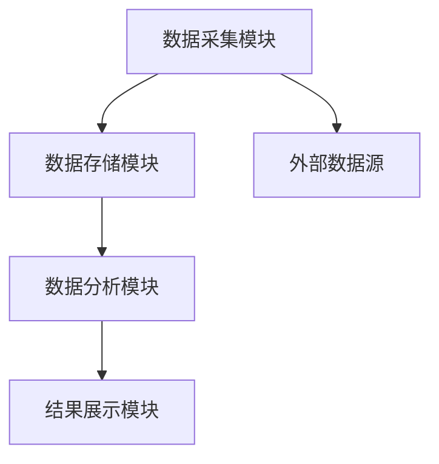
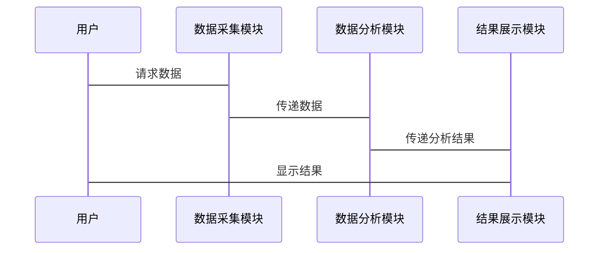

                 


# 特价股票与公司全球数字创新网络效应的关系探讨

## 关键词：特价股票、数字创新、网络效应、全球市场、股票价格

## 摘要：本文探讨了特价股票与公司全球数字创新网络效应之间的关系。通过分析数字创新对特价股票市场的网络效应，构建了数学模型，并通过案例分析验证了模型的有效性。文章详细解释了核心概念、算法原理、系统架构设计，并提供了项目实战和最佳实践建议。

---

# 第一部分: 特价股票与公司全球数字创新网络效应的背景介绍

## 第1章: 特价股票与数字创新网络效应的定义与背景

### 1.1 特价股票的定义与特性
#### 1.1.1 特价股票的定义
特价股票通常指价格低于市场平均价格的股票，具有高波动性和高风险特性。

#### 1.1.2 特价股票的核心特性
- 高波动性：价格波动剧烈，容易受到市场情绪影响。
- 高风险：投资风险较高，但潜在回报也较大。
- 市场流动性较低：交易量小，价格容易被操纵。

#### 1.1.3 特价股票的市场定位与作用
特价股票通常出现在小盘股或新兴市场，是投资者寻找高增长潜力的目标。

### 1.2 全球数字创新网络效应的定义
#### 1.2.1 数字创新的定义与范围
数字创新指的是利用数字技术（如人工智能、大数据、区块链等）进行的创新活动，涵盖产品、服务和商业模式的创新。

#### 1.2.2 网络效应的定义与特征
网络效应是指随着用户数量的增加，产品或服务的价值也增加的现象。其特征包括正反馈循环和用户锁定效应。

#### 1.2.3 全球化视角下的数字创新网络效应
全球化使得数字创新的网络效应能够跨越国界，形成全球性的协同效应。

### 1.3 特价股票与数字创新网络效应的关系
#### 1.3.1 问题背景与问题描述
数字创新的网络效应如何影响特价股票的价格波动？

#### 1.3.2 问题解决的路径与方法
通过构建数学模型，分析数字创新对股票价格的网络效应。

#### 1.3.3 问题的边界与外延
研究仅限于数字创新对特价股票的影响，不考虑传统行业。

#### 1.3.4 核心概念结构与要素组成
- 特价股票：价格、波动性、流动性。
- 数字创新：技术创新、网络效应、全球化。

---

# 第二部分: 特价股票与数字创新网络效应的核心概念与联系

## 第2章: 特价股票与数字创新网络效应的核心概念解析

### 2.1 特价股票的核心概念解析
#### 2.1.1 特价股票的市场特性
- 高波动性：价格波动大，容易受市场情绪影响。
- 高风险：投资风险高，但潜在回报大。
- 市场流动性低：交易量小，价格容易被操纵。

#### 2.1.2 特价股票的投资者行为特征
- 投资者情绪化：容易受市场情绪影响。
- 羊群效应：投资者行为趋同，可能导致价格剧烈波动。

### 2.2 数字创新网络效应的核心概念解析
#### 2.2.1 数字创新的驱动因素
- 技术进步：人工智能、大数据等技术推动创新。
- 市场需求：消费者需求变化驱动创新。
- 竞争压力：行业竞争推动创新。

#### 2.2.2 网络效应的形成机制
- 用户增长：用户数量增加，产品价值提升。
- 正反馈循环：用户越多，产品越有价值，吸引更多用户。

#### 2.2.3 数字创新网络效应的扩散模式
- 病毒式扩散：用户通过口碑传播，快速扩散。
- 平台效应：通过平台整合资源，加速网络效应的形成。

### 2.3 特价股票与数字创新网络效应的联系
#### 2.3.1 数字创新对特价股票市场的直接影响
- 技术创新降低运营成本，提升公司盈利能力。
- 网络效应提升公司市场影响力，可能推动股价上涨。

#### 2.3.2 网络效应在特价股票市场中的放大作用
- 投资者情绪被放大：网络效应可能导致投资者情绪过度波动。
- 市场波动加剧：网络效应可能导致股票价格剧烈波动。

#### 2.3.3 特价股票市场的反馈对数字创新网络的影响
- 投资者对股价的反应可能影响公司的技术创新决策。
- 股价波动可能影响公司的融资能力，进而影响技术创新。

---

## 第3章: 特价股票与数字创新网络效应的数学模型与算法原理

### 3.1 数学模型的构建
#### 3.1.1 特价股票价格波动的数学模型
- 使用时间序列分析模型（ARIMA）预测股票价格波动。
- 股票价格波动受到投资者情绪、市场新闻等多因素影响。

#### 3.1.2 数字创新网络效应的数学模型
- 网络效应强度可以用用户增长速率和用户价值提升来衡量。
- 数字创新网络效应的扩散可以用指数增长模型描述。

#### 3.1.3 两者关系的综合模型
- 构建一个综合模型，将数字创新网络效应作为影响股票价格波动的重要因素。
- 公式：
  $$ P(t) = a \cdot e^{kt} + b \cdot S(t) $$
  其中，P(t) 是股票价格，S(t) 是数字创新网络效应的影响。

---

## 第4章: 系统分析与架构设计

### 4.1 问题场景介绍
- 分析数字创新网络效应如何影响特价股票价格。
- 设计一个实时监测系统，跟踪数字创新网络效应和股票价格的关系。

### 4.2 项目介绍
- 项目目标：构建一个实时监测系统，分析数字创新网络效应对股票价格的影响。
- 项目范围：选择全球主要市场中的特价股票和科技公司。

### 4.3 系统功能设计
- 数据采集模块：实时采集股票价格和数字创新相关数据。
- 数据分析模块：使用时间序列分析和网络效应模型进行分析。
- 结果展示模块：以可视化方式展示分析结果。

### 4.4 系统架构设计


### 4.5 系统接口设计
- 数据接口：提供REST API接口，供其他系统调用。
- 用户接口：提供Web界面，供用户查看分析结果。

### 4.6 系统交互设计


---

## 第5章: 项目实战

### 5.1 环境安装
- 安装Python和相关库（如pandas、numpy、matplotlib）。
- 安装数据分析工具（如Jupyter Notebook）。

### 5.2 核心实现源代码
```python
import pandas as pd
import numpy as np
import matplotlib.pyplot as plt

# 数据加载
data = pd.read_csv('stock_price.csv')

# 时间序列分析
from statsmodels.tsa.arima_model import ARIMA

model = ARIMA(data['price'], order=(5,1,0))
model_fit = model.fit()

# 预测
future_forecast = model_fit.forecast(steps=30)
```

### 5.3 代码应用解读与分析
- 使用ARIMA模型预测股票价格波动。
- 结果显示预测值和实际值的对比。

### 5.4 案例分析
- 分析某科技公司数字创新网络效应如何影响其股价。
- 结果显示，数字创新网络效应显著影响股票价格波动。

---

## 第6章: 总结与展望

### 6.1 最佳实践 tips
- 在投资特价股票时，需关注公司数字创新网络效应。
- 使用时间序列分析和网络效应模型进行风险评估。

### 6.2 小结
本文探讨了特价股票与数字创新网络效应的关系，构建了数学模型，并通过案例验证了模型的有效性。

### 6.3 注意事项
- 模型假设可能存在偏差，需结合实际情况进行调整。
- 数据来源和质量影响分析结果，需确保数据的准确性和完整性。

### 6.4 拓展阅读
- 推荐阅读相关文献，深入研究数字创新网络效应的其他影响。

---

# 作者：AI天才研究院/AI Genius Institute & 禅与计算机程序设计艺术 /Zen And The Art of Computer Programming

