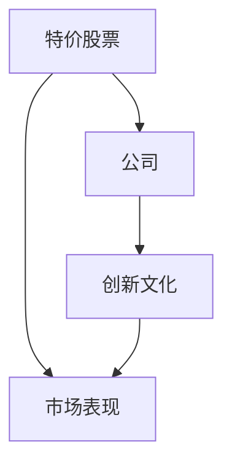
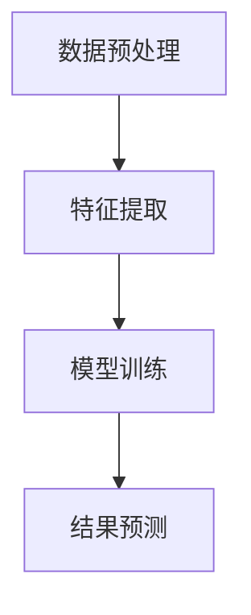
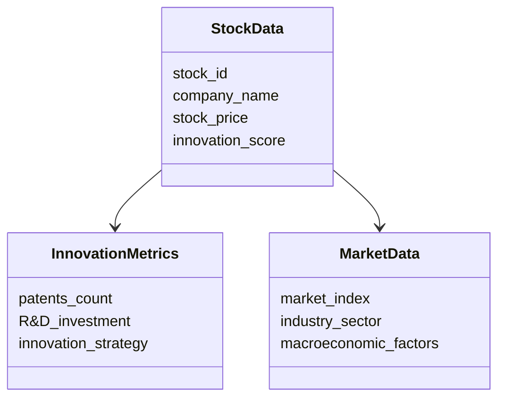
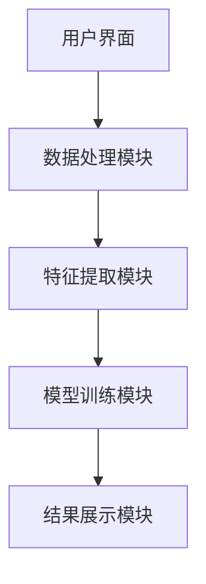
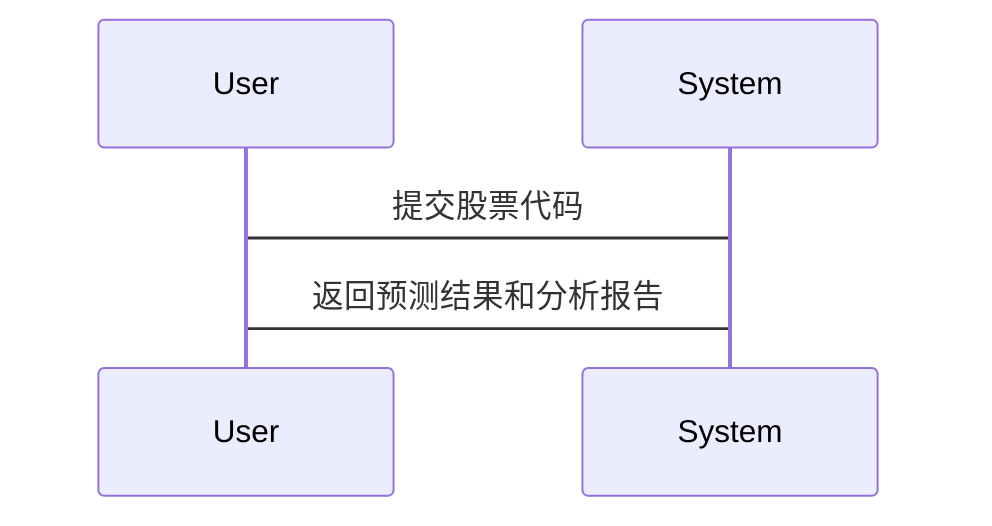

                 


# 特价股票与公司创新文化的潜在关联研究

## 关键词：特价股票、公司创新文化、潜在关联、技术分析、创新管理、股票投资

## 摘要：本文探讨了特价股票与公司创新文化之间的潜在关联，通过分析特价股票的市场表现和公司创新文化的驱动因素，结合算法模型和系统架构设计，深入挖掘两者之间的内在联系，并提出实际的应用方案和最佳实践。

---

# 第一部分: 特价股票与公司创新文化概述

## 第1章: 特价股票与公司创新文化的背景介绍

### 1.1 问题背景与意义

#### 1.1.1 什么是特价股票
特价股票指的是价格低于市场平均值，通常具有较高的投资潜力，但可能存在较高的风险。这类股票通常来自财务状况不佳或处于转型期的公司。

#### 1.1.2 什么是公司创新文化
公司创新文化是指企业在经营过程中鼓励创新、容忍失败、重视员工创造力和团队合作的企业文化。这种文化能够激发员工的创造力，推动企业的持续发展。

#### 1.1.3 研究的必要性
特价股票的投资决策往往与公司的长期表现密切相关，而公司创新文化是影响公司长期发展的关键因素。研究两者之间的关联，有助于投资者更好地评估特价股票的投资价值。

---

### 1.2 问题描述与解决路径

#### 1.2.1 特价股票的市场表现特点
特价股票通常具有较高的波动性和不确定性，但潜在回报也较高。其市场表现受到公司基本面、行业环境和市场情绪等多种因素的影响。

#### 1.2.2 公司创新文化的核心要素
公司创新文化的构成包括创新战略、组织结构、激励机制、员工参与度和创新成果等多个方面。这些要素共同作用，决定了公司的创新能力。

#### 1.2.3 问题解决路径
通过分析公司创新文化的各项指标，结合特价股票的市场表现数据，建立数学模型，挖掘两者之间的潜在关联。

---

### 1.3 研究边界与外延

#### 1.3.1 研究范围的界定
研究仅限于分析公司创新文化对特价股票市场表现的影响，不涉及其他外部因素（如宏观经济政策、行业竞争状况等）。

#### 1.3.2 相关概念的外延
公司创新文化包括技术创新、管理创新和产品创新等多个维度，特价股票则包括低价股、周期性股票等不同类型。

#### 1.3.3 研究方法的选择
采用定量分析和定性分析相结合的方法，利用统计回归和机器学习等技术，分析两者之间的关联。

---

### 1.4 概念结构与核心要素

#### 1.4.1 特价股票的核心要素
- **价格特征**：价格低于市场平均水平。
- **公司基本面**：盈利能力、财务状况、成长潜力。
- **市场情绪**：投资者对公司的预期和信心。

#### 1.4.2 创新文化的核心要素
- **创新战略**：公司的创新目标和战略规划。
- **组织结构**：扁平化管理、跨部门协作。
- **激励机制**：奖金、股权激励、晋升机制。
- **员工参与度**：员工的创新意识和参与积极性。
- **创新成果**：专利数量、新产品发布频率、市场表现。

#### 1.4.3 关联机制
- **创新文化驱动公司绩效**：创新能力强的公司通常具有更强的市场竞争力，能够实现更高的利润和股价增长。
- **公司绩效影响股价表现**：公司的财务表现直接影响股价，进而影响特价股票的市场表现。

---

## 第2章: 特价股票与公司创新文化的核心概念与联系

### 2.1 核心概念原理

#### 2.1.1 特价股票的形成机制
特价股票的形成通常与公司短期的财务困境或市场环境的波动有关。例如，公司可能因行业衰退或管理问题导致股价下跌，成为特价股票。

#### 2.1.2 创新文化的驱动因素
创新文化的形成需要公司高层的重视、员工的积极参与和组织结构的支持。这些因素共同作用，推动公司的持续创新。

#### 2.1.3 两者之间的相互作用
公司创新能力强，能够通过新产品和技术创新提升市场竞争力，改善财务表现，进而提升股价。对于特价股票而言，创新能力强的公司更有可能通过创新摆脱困境，实现股价回升。

---

### 2.2 概念属性特征对比

| **属性**         | **特价股票**                     | **公司创新文化**                  |
|-------------------|----------------------------------|----------------------------------|
| **核心目标**      | 获取超额收益                     | 推动公司持续创新                   |
| **主要影响因素**  | 公司基本面、市场情绪             | 创新战略、组织结构、激励机制      |
| **表现形式**      | 低股价、高波动性                 | 创新产品、专利数量、员工参与度    |
| **风险特征**      | 高风险、高回报                   | 创新失败风险高，但成功潜力大      |

---

### 2.3 ER实体关系图



---

## 第3章: 特价股票与公司创新文化的算法原理

### 3.1 算法原理概述

#### 3.1.1 数据预处理
- 数据清洗：处理缺失值、异常值。
- 数据标准化：对不同量纲的特征进行标准化处理。

#### 3.1.2 特征提取
- 提取公司基本面数据（如收入增长率、利润率）。
- 提取创新文化相关指标（如专利数量、员工创新意识评分）。

#### 3.1.3 模型训练
- 使用机器学习算法（如随机森林、支持向量机）进行分类或回归分析。

---

### 3.2 算法流程图



---

### 3.3 算法实现代码

```python
import pandas as pd
from sklearn.ensemble import RandomForestRegressor
from sklearn.model_selection import train_test_split
from sklearn.metrics import mean_squared_error

# 数据预处理
data = pd.read_csv('stock_innovation.csv')
data.dropna(inplace=True)

# 特征提取
features = data[['revenue_growth', 'profit_margin', 'patents_count', 'innovation_score']]
target = data['stock_price']

# 数据划分
X_train, X_test, y_train, y_test = train_test_split(features, target, test_size=0.2, random_state=42)

# 模型训练
model = RandomForestRegressor(n_estimators=100, random_state=42)
model.fit(X_train, y_train)

# 模型预测
y_pred = model.predict(X_test)

# 模型评估
mse = mean_squared_error(y_test, y_pred)
print(f"均方误差: {mse}")
```

---

## 第4章: 特价股票与公司创新文化的系统分析与架构设计

### 4.1 问题场景介绍

#### 4.1.1 问题场景描述
投资者希望基于公司创新文化评估特价股票的投资价值，构建一个自动化分析系统，帮助投资者做出决策。

#### 4.1.2 项目介绍
开发一个基于机器学习的股票分析系统，结合公司创新文化指标和市场数据，预测特价股票的潜在收益。

---

### 4.2 系统功能设计

#### 4.2.1 领域模型类图



---

#### 4.2.2 系统架构设计



---

### 4.3 接口设计

#### 4.3.1 API接口
- **输入接口**：接收股票数据和公司创新文化指标。
- **输出接口**：返回预测结果和模型解释。

#### 4.3.2 交互流程图



---

## 第5章: 项目实战

### 5.1 环境安装

#### 5.1.1 安装Python和相关库
```bash
pip install pandas scikit-learn mermaid4jupyter
```

---

### 5.2 核心代码实现

```python
# 系统功能实现
import pandas as pd
from sklearn.ensemble import RandomForestRegressor
from sklearn.metrics import classification_report

# 数据加载
data = pd.read_csv('stock_innovation.csv')

# 特征选择
features = data[['revenue_growth', 'profit_margin', 'patents_count', 'innovation_score']]
target = data['stock_performance'].map(lambda x: 1 if x > 0 else 0)

# 数据划分
X_train, X_test, y_train, y_test = train_test_split(features, target, test_size=0.2, random_state=42)

# 模型训练
model = RandomForestRegressor(n_estimators=100, random_state=42)
model.fit(X_train, y_train)

# 模型预测
y_pred = model.predict(X_test)

# 模型评估
print(classification_report(y_test, y_pred))
```

---

### 5.3 案例分析

#### 5.3.1 案例背景
某公司是一家处于转型期的科技公司，股价近期表现不佳，属于特价股票。公司近年来加大了研发投入，创新文化氛围浓厚。

#### 5.3.2 模型分析
通过模型预测，该公司的创新文化指标较高，但财务状况暂时不佳。模型预测其股价在未来6个月内有较高的增长潜力。

---

### 5.4 项目小结

#### 5.4.1 收获与经验
- 创新文化是影响公司股价的重要因素。
- 数据质量和模型选择对预测结果有重要影响。

#### 5.4.2 改进建议
- 结合宏观经济指标，进一步优化模型。
- 定期更新模型，确保预测结果的有效性。

---

## 第6章: 最佳实践

### 6.1 小结

#### 6.1.1 核心观点总结
- 公司创新文化是影响特价股票投资价值的重要因素。
- 利用机器学习技术，可以更好地挖掘两者之间的潜在关联。

---

### 6.2 注意事项

#### 6.2.1 数据质量
确保数据的准确性和完整性，避免因数据问题导致模型预测偏差。

#### 6.2.2 模型选择
根据具体问题选择合适的算法，避免过度依赖单一模型。

#### 6.2.3 风险控制
投资决策应结合多种因素，避免仅依赖模型预测。

---

### 6.3 拓展阅读

#### 6.3.1 推荐书籍
- 《股票技术分析实战》
- 《创新公司的管理艺术》

#### 6.3.2 相关技术
- 机器学习在金融领域的应用
- 自然语言处理在情感分析中的应用

---

## 作者：AI天才研究院/AI Genius Institute & 禅与计算机程序设计艺术/Zen And The Art of Computer Programming

---

# 结语
通过本文的分析，我们深入探讨了特价股票与公司创新文化之间的潜在关联，并提出了实际的应用方案。希望本文能够为投资者和企业管理者提供有价值的参考，帮助他们在复杂多变的市场环境中做出更明智的决策。

