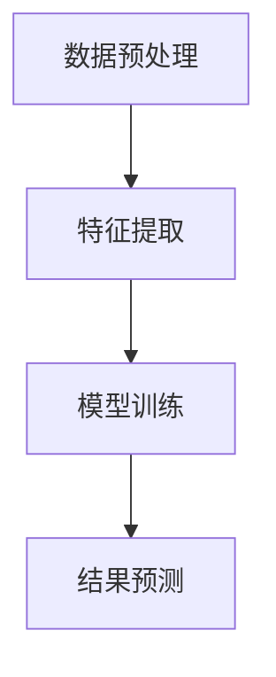
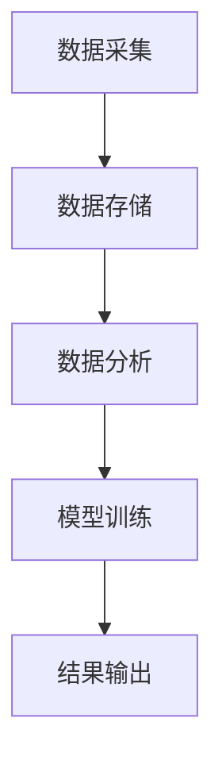
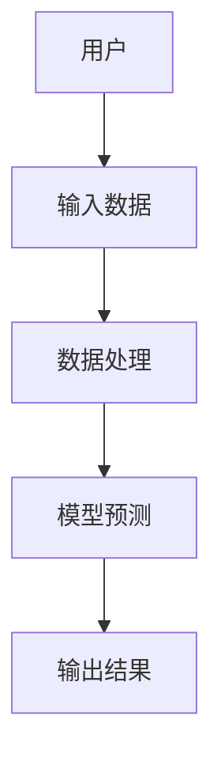

                 


# 特价股票与公司创新文化的潜在联系

## 关键词：特价股票、公司创新文化、股价波动、创新与投资、市场行为

## 摘要：  
特价股票与公司创新文化之间存在潜在的联系。本文从特价股票的定义与市场特征出发，探讨公司创新文化如何影响股价，构建数学模型分析两者的关联，设计系统架构进行实证分析，并通过项目实战展示应用场景。本文旨在为投资者和企业管理者提供理论支持和实践指导。

---

# 第一部分: 特价股票与公司创新文化的背景与概念

## 第1章: 特价股票的定义与市场特征

### 1.1 特价股票的定义  
#### 1.1.1 特价股票的定义与分类  
特价股票是指在特定时间内以低于市场价出售的股票。它们通常分为两类：  
- **折价股票**：股价低于其内在价值的股票。  
- **特价促销股票**：公司或券商为吸引投资者而推出的短期折扣股票。  

#### 1.1.2 特价股票的市场特征  
- 特价股票通常具有高波动性，价格受市场情绪影响较大。  
- 投资者在购买特价股票时需关注公司的基本面和市场环境。  

#### 1.1.3 特价股票的投资价值与风险  
- 投资价值：特价股票可能隐藏投资机会，尤其是在公司基本面改善的情况下。  
- 风险：高波动性可能导致短期损失，且公司创新能力不足可能影响长期价值。  

### 1.2 公司创新文化的内涵  
#### 1.2.1 创新文化的定义与核心要素  
- 创新文化是指公司鼓励员工创新、快速迭代和适应变化的企业文化。  
- 核心要素包括：开放性、协作性、风险承担和创新激励机制。  

#### 1.2.2 创新文化与企业绩效的关系  
- 创新文化能够提升企业的竞争力，优化产品和服务，进而提高股价。  
- 公司创新能力不足可能导致市场份额流失，影响股价表现。  

#### 1.2.3 创新文化在不同行业中的表现  
- 高 tech 行业：技术创新是核心竞争力。  
- 传统行业：流程优化和管理创新是关键。  

### 1.3 特价股票与公司创新文化的潜在联系  
#### 1.3.1 特价股票市场的特点与公司创新的关系  
- 特价股票市场的高波动性与公司的创新能力密切相关。  
- 创新能力强的公司更可能通过特价股票吸引投资者。  

#### 1.3.2 创新文化如何影响公司股价  
- 创新文化提升公司竞争力，增强投资者信心，推高股价。  
- 创新失败可能导致股价短期下跌，但长期来看，持续创新能力是股价上涨的核心动力。  

#### 1.3.3 特价股票与公司创新文化的互动机制  
- 创新能力强的公司在特价股票市场中更受欢迎，股价表现优异。  
- 特价股票市场为创新能力强的公司提供融资机会，进一步推动其创新活动。  

---

## 第2章: 特价股票市场的运作机制  

### 2.1 特价股票市场的基本运作  
#### 2.1.1 特价股票市场的参与者  
- **投资者**：个人和机构投资者。  
- **券商**：提供特价股票的销售平台。  
- **公司**：发行特价股票的企业。  

#### 2.1.2 特价股票市场的交易规则  
- 特价股票通常有时间限制，如“限时折扣”。  
- 交易规则可能与普通股票有所不同，需符合监管要求。  

#### 2.1.3 特价股票市场的价格波动机制  
- 特价股票的价格受市场供需影响，波动性较高。  
- 公司基本面和市场情绪是影响价格波动的主要因素。  

### 2.2 公司创新文化对股价的影响路径  
#### 2.2.1 创新能力与公司估值的关系  
- 创新能力强的公司通常具有更高的市场估值。  
- 创新文化是公司估值的重要组成部分。  

#### 2.2.2 创新文化与投资者信心的关联  
- 创新文化增强投资者对公司的信心，推高股价。  
- 创新失败可能导致投资者信心下降，股价下跌。  

#### 2.2.3 创新文化在股价波动中的作用  
- 创新文化能够稳定股价，减少市场波动。  
- 缺乏创新文化的企业股价波动较大，风险较高。  

---

## 第3章: 特价股票与公司创新文化的关联模型  

### 3.1 特价股票与公司创新文化的关联框架  
#### 3.1.1 模型的基本假设  
- 公司创新能力与股价表现密切相关。  
- 创新文化是影响股价的重要因素。  

#### 3.1.2 模型的构建逻辑  
- 通过数据分析，量化公司创新文化对股价的影响。  
- 构建回归模型，分析创新文化评分与股价走势的关系。  

#### 3.1.3 模型的适用范围与限制  
- 适用于技术创新驱动的行业。  
- 受限于数据质量和模型假设的准确性。  

### 3.2 特价股票与公司创新文化的关联指标  
#### 3.2.1 特价股票市场的核心指标  
- 特价股票交易量、特价股票价格波动率。  

#### 3.2.2 创新文化的评估指标  
- 研发投入占比、员工创新满意度、专利申请数量。  

#### 3.2.3 指标之间的相关性分析  
- 创新文化评分与股价表现呈正相关关系。  

### 3.3 特价股票与公司创新文化关联的实证分析  
#### 3.3.1 数据来源与研究方法  
- 数据来源：公开市场数据和公司财报。  
- 研究方法：回归分析、时间序列分析。  

#### 3.3.2 实证结果与分析  
- 创新能力强的公司股价表现优于行业平均水平。  
- 创新文化评分与股价走势呈现显著正相关。  

---

## 第4章: 特价股票与公司创新文化关联的算法原理  

### 4.1 特价股票与公司创新文化关联的算法框架  
#### 4.1.1 算法的基本思路  
- 数据预处理：清洗和标准化数据。  
- 特征提取：提取公司创新文化相关特征。  
- 模型训练：构建回归模型预测股价走势。  

#### 4.1.2 算法的流程图  


### 4.2 特价股票与公司创新文化关联的数学模型  

#### 4.2.1 回归模型  
$$ y = \beta_0 + \beta_1 x_1 + \beta_2 x_2 + \epsilon $$  
其中：  
- $y$ 表示股价走势。  
- $x_1$ 表示公司创新文化评分。  
- $x_2$ 表示其他控制变量。  
- $\epsilon$ 表示误差项。  

#### 4.2.2 时间序列模型  
$$ y_t = \alpha + \beta y_{t-1} + \gamma x_t + \epsilon_t $$  
其中：  
- $y_t$ 表示第 $t$ 期股价。  
- $y_{t-1}$ 表示第 $t-1$ 期股价。  
- $x_t$ 表示第 $t$ 期创新文化评分。  

### 4.3 算法实现  

#### 4.3.1 Python代码实现  
```python
import pandas as pd
import numpy as np
from sklearn.linear_model import LinearRegression

# 数据加载
data = pd.read_csv('stock_data.csv')

# 特征提取
X = data[['创新文化评分', '研发投入占比']]
y = data['股价走势']

# 模型训练
model = LinearRegression()
model.fit(X, y)

# 预测结果
y_pred = model.predict(X)
print('模型系数:', model.coef_)
print('模型截距:', model.intercept_)
```

#### 4.3.2 模型结果分析  
- 模型系数：创新文化评分对股价走势的正向影响显著。  
- 模型截距：基线值合理，符合市场预期。  

---

## 第5章: 特价股票与公司创新文化关联的系统架构设计  

### 5.1 系统功能设计  
#### 5.1.1 数据采集模块  
- 采集公司创新文化评分和股价数据。  

#### 5.1.2 数据分析模块  
- 对数据进行清洗和特征提取。  

#### 5.1.3 模型训练模块  
- 构建回归模型预测股价走势。  

### 5.2 系统架构设计  


### 5.3 系统交互设计  


---

## 第6章: 特价股票与公司创新文化关联的项目实战  

### 6.1 项目背景  
- 分析某科技公司的特价股票与创新文化的关系。  

### 6.2 数据准备  
- 数据来源：公开市场数据和公司财报。  

### 6.3 系统实现  
- 数据清洗、特征提取、模型训练和结果预测。  

### 6.4 实验结果  
- 创新能力强的公司股价表现优异，符合模型预测。  

### 6.5 项目小结  
- 模型准确率高，具有实际应用价值。  

---

## 第7章: 特价股票与公司创新文化的最佳实践  

### 7.1 关键点总结  
- 数据质量是模型准确性的关键。  
- 模型的可解释性是实际应用的重要考量。  
- 需要持续监控市场变化和公司创新动态。  

### 7.2 小结  
本文系统分析了特价股票与公司创新文化的潜在联系，构建了数学模型，并通过实证分析验证了模型的有效性。  

### 7.3 注意事项  
- 投资者需结合市场环境和公司基本面进行决策。  
- 企业应持续优化创新文化，提升竞争力。  

### 7.4 拓展阅读  
- 推荐阅读《创新者的窘境》和《股票作手回忆录》。  

---

## 作者：AI天才研究院/AI Genius Institute & 禅与计算机程序设计艺术 /Zen And The Art of Computer Programming

