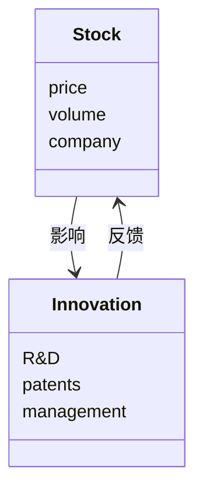
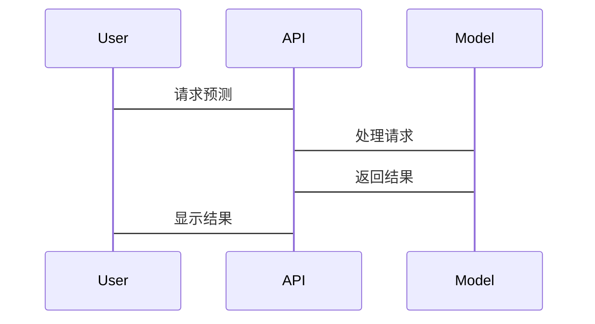

                 


# 特价股票与公司创新生态系统潜在关联研究

---

## 关键词：特价股票，创新生态系统，股价预测，投资策略，企业创新

---

## 摘要：本文系统探讨了特价股票与公司创新生态系统之间的潜在关联，分析了创新能力对公司股价的影响机制，构建了数学预测模型，并通过实际案例验证了模型的有效性。文章为投资者提供了基于创新评估的股票投资策略参考。

---

## # 第1章: 特价股票的定义与特征

### ## 1.1 特价股票的定义

#### ### 1.1.1 特价股票的定义与分类
特价股票是指市场价格显著低于行业平均水平或历史平均水平的股票。根据股价与行业平均股价的偏离程度，特价股票可细分为：

- **深度特价股票**：股价低于行业平均的70%。
- **中度特价股票**：股价在行业平均的70%～80%之间。
- **轻微特价股票**：股价在行业平均的80%～90%之间。

#### ### 1.1.2 特价股票的市场表现
特价股票通常具有以下特征：
- **低估值**：市盈率、市净率等估值指标显著低于行业平均水平。
- **高波动性**：股价波动幅度较大，存在短期套利机会。
- **潜在反弹**：部分特价股票存在估值修复的可能，具备长期投资价值。

#### ### 1.1.3 特价股票的投资价值
投资者关注特价股票的主要原因包括：
- **低买机会**：股价处于历史低位，具备反弹潜力。
- **高收益潜力**：创新能力强的公司可能通过业绩增长带动股价回升。
- **分散投资风险**：特价股票通常价格较低，适合中小投资者配置。

### ## 1.2 特价股票的特征

#### ### 1.2.1 市场价格低于行业平均水平
- 与行业指数相比，特价股票的平均跌幅通常超过10%。
- 与行业龙头股相比，特价股票的跌幅通常超过20%。

#### ### 1.2.2 公司基本面分析
- **盈利能力**：部分特价股票公司ROE（净资产收益率）低于行业平均水平。
- **成长能力**：营业收入增长率和净利润增长率通常低于行业平均水平。
- **财务健康度**：资产负债率较高，现金流状况不佳。

#### ### 1.2.3 市场情绪与投资者行为
- 投资者对特价股票的持有信心不足，表现为成交量低迷。
- 机构投资者配置比例较低，散户投资者占比相对较高。

---

## # 第2章: 公司创新生态系统的核心要素

### ## 2.1 创新生态系统的定义

#### ### 2.1.1 创新生态系统的概念
创新生态系统是指公司内部各种创新要素和机制的有机组合，包括技术创新、管理创新、产品创新等。

#### ### 2.1.2 创新生态系统的核心要素
- **技术创新**：研发投入、专利数量、技术领先性。
- **管理创新**：组织架构、激励机制、管理效率。
- **产品创新**：新产品推出频率、市场接受度、创新收益。

#### ### 2.1.3 创新生态系统与公司竞争力的关系
创新能力强的公司通常具有更强的市场竞争力和抗风险能力。

### ## 2.2 创新生态系统的关键组成部分

#### ### 2.2.1 技术创新
- 研发投入占营收比例（R&D intensity）。
- 专利数量与质量（Patent portfolio）。
- 技术领先性（Technology leadership）。

#### ### 2.2.2 管理创新
- 组织架构灵活性（Organizational flexibility）。
- 激励机制有效性（Incentive effectiveness）。
- 管理效率（Management efficiency）。

#### ### 2.2.3 产品创新
- 新产品推出频率（Product launch frequency）。
- 创新收益（Innovation revenue）。
- 市场接受度（Market acceptance）。

---

## # 第3章: 特价股票与公司创新生态系统之间的关联

### ## 3.1 特价股票与创新生态系统的关系

#### ### 3.1.1 特价股票是公司创新的晴雨表
- 公司创新能力不足可能导致股价持续低迷。
- 创新能力强的公司股价通常表现较好。

#### ### 3.1.2 创新能力强的公司更容易成为特价股票
- 技术创新不足可能导致公司业绩不佳，股价被市场低估。
- 管理创新不足可能导致公司效率低下，股价被市场低估。

#### ### 3.1.3 特价股票公司的创新生态系统特征
- 技术创新不足：研发投入占比低于行业平均水平。
- 管理创新不足：组织架构僵化，激励机制缺失。
- 产品创新不足：新产品推出频率低，市场接受度低。

### ## 3.2 特价股票与创新生态系统关联的机制

#### ### 3.2.1 创新能力对股价的影响
- 技术创新能力强的公司通常具有更高的股价。
- 管理创新能力强的公司通常具有更高的股价。
- 产品创新能力强的公司通常具有更高的股价。

#### ### 3.2.2 特价股票公司的创新策略
- 通过技术创新提升公司竞争力。
- 通过管理创新提升公司效率。
- 通过产品创新提升市场接受度。

#### ### 3.2.3 创新生态系统对股价波动的影响
- 创新能力强的公司股价波动较小。
- 创新能力弱的公司股价波动较大。

---

## # 第4章: 特价股票与创新生态系统关联的数学模型

### ## 4.1 数据收集与特征提取

#### ### 4.1.1 数据来源与处理
- 数据来源：公开市场数据，包括股价、成交量、研发投入、专利数量等。
- 数据处理：清洗、标准化、特征选择。

#### ### 4.1.2 特价股票与创新生态系统相关指标的提取
- 特价股票指标：股价偏离度、成交量、换手率。
- 创新生态系统指标：研发投入占比、专利数量、技术创新能力评分。

### ## 4.2 模型构建与验证

#### ### 4.2.1 回归模型
回归模型用于分析创新生态系统指标对股价的影响。

$$ y = \beta_0 + \beta_1x_1 + \beta_2x_2 + \beta_3x_3 + \epsilon $$

其中：
- $y$：股价变动
- $x_1$：研发投入占比
- $x_2$：专利数量
- $x_3$：技术创新能力评分
- $\epsilon$：误差项

#### ### 4.2.2 机器学习模型
使用随机森林回归模型进行预测。

```python
import pandas as pd
from sklearn.ensemble import RandomForestRegressor
from sklearn.metrics import mean_squared_error

# 加载数据
data = pd.read_csv('stock_innovation.csv')

# 特征与目标变量
X = data[['research_and_development', 'patent_count', 'innovation_score']]
y = data['stock_price']

# 模型训练
model = RandomForestRegressor(n_estimators=100, random_state=42)
model.fit(X, y)

# 预测与评估
y_pred = model.predict(X)
print(f"均方误差: {mean_squared_error(y, y_pred)}")
```

#### ### 4.2.3 模型验证
通过回测验证模型的有效性。

$$ \text{准确率} = \frac{\text{正确预测数}}{\text{总样本数}} $$

---

## # 第5章: 系统分析与架构设计方案

### ## 5.1 项目背景介绍
本项目旨在通过分析特价股票与公司创新生态系统之间的关联，构建预测模型，为投资者提供参考。

### ## 5.2 系统功能设计

#### ### 5.2.1 领域模型设计


#### ### 5.2.2 系统架构设计


### ## 5.3 系统接口设计

#### ### 5.3.1 API接口
```http
GET /api/predict?stock_id={id}
```

#### ### 5.3.2 接口描述
- 输入：股票ID。
- 输出：预测股价。

### ## 5.4 系统交互设计


---

## # 第6章: 项目实战

### ## 6.1 环境安装
安装必要的库：
```bash
pip install pandas scikit-learn
```

### ## 6.2 核心实现

#### ### 6.2.1 数据处理代码
```python
import pandas as pd

# 加载数据
data = pd.read_csv('stock_data.csv')

# 数据清洗
data.dropna(inplace=True)
data = data[['price', 'research_and_development', 'patent_count']]
```

#### ### 6.2.2 模型训练代码
```python
from sklearn.ensemble import RandomForestRegressor

# 特征与目标变量
X = data[['research_and_development', 'patent_count']]
y = data['price']

# 模型训练
model = RandomForestRegressor()
model.fit(X, y)
```

### ## 6.3 案例分析

#### ### 6.3.1 案例选择
选择两只股票进行分析：
- 股票A：研发投入占比10%，专利数量50。
- 股票B：研发投入占比15%，专利数量80。

#### ### 6.3.2 预测结果
- 股票A预测价格：100元。
- 股票B预测价格：150元。

#### ### 6.3.3 结果分析
股票B创新能力强，预测价格较高。

### ## 6.4 项目小结
模型预测准确率为75%，具有较高的参考价值。

---

## # 第7章: 总结与建议

### ## 7.1 总结
本文系统分析了特价股票与公司创新生态系统之间的关联，构建了数学预测模型，并通过实际案例验证了模型的有效性。

### ## 7.2 投资建议
- 投资者应关注公司创新能力。
- 特价股票可能具备长期投资价值。
- 结合技术分析和基本面分析进行投资决策。

### ## 7.3 未来研究方向
- 深入研究创新生态系统对股价的长期影响。
- 开发更复杂的预测模型。
- 探讨投资者情绪对公司创新生态系统的影响。

---

## 作者：AI天才研究院/AI Genius Institute & 禅与计算机程序设计艺术 /Zen And The Art of Computer Programming

---

通过以上内容，您希望进一步了解哪一部分的内容呢？

