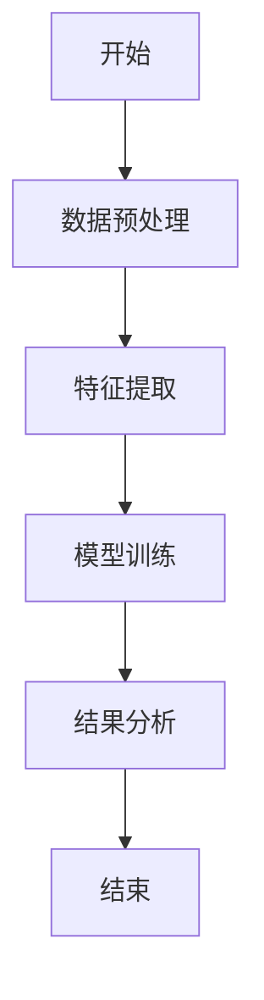
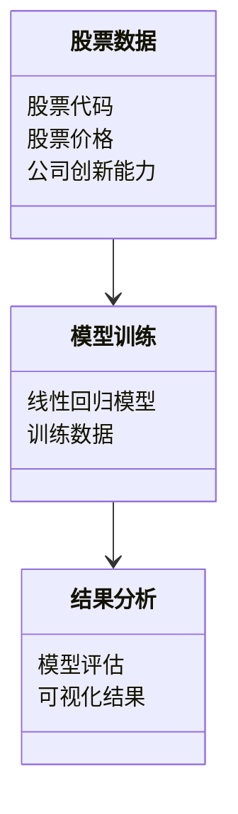

                 


# 特价股票与公司创新能力的潜在联系

> 关键词：特价股票、公司创新能力、股票分析、创新评估、数据建模、投资策略

> 摘要：本文探讨了特价股票与公司创新能力之间的潜在联系。通过对特价股票的定义、特点以及公司创新能力的分析，结合数学建模和算法原理，揭示了两者之间的内在关系。文章还提供了实际案例分析和投资策略建议，为投资者和研究者提供了有价值的参考。

---

# 第一部分: 特价股票与公司创新能力的背景与概念

## 第1章: 特价股票与公司创新能力的背景介绍

### 1.1 特价股票的定义与特点
#### 1.1.1 特价股票的定义
特价股票是指价格低于市场平均水平的股票，通常被认为具有较高的投资潜力。这些股票可能因为市场波动、公司暂时困境或其他因素而被低估。

#### 1.1.2 特价股票的核心特点
- **低估值**：价格远低于其内在价值。
- **高波动性**：价格波动较大，可能带来短期收益。
- **风险较高**：投资风险较大，但潜在回报也较高。

#### 1.1.3 特价股票的市场背景
特价股票通常出现在市场低迷时期，投资者可能因为市场恐慌或对公司前景的不确定性而抛售股票，导致价格下跌。

### 1.2 公司创新能力的定义与特点
#### 1.2.1 公司创新能力的定义
公司创新能力是指公司在技术研发、产品创新、管理创新等方面的能力，是企业持续发展的核心竞争力。

#### 1.2.2 公司创新能力的核心要素
- **研发投入**：公司对研发的投入比例。
- **专利数量**：公司拥有的专利数量。
- **产品创新速度**：公司推出新产品的能力。
- **管理创新**：公司在管理方法和流程上的创新。

#### 1.2.3 公司创新能力的评估标准
- **技术创新指标**：如研发投入占收入比例、专利数量。
- **产品创新指标**：如新产品推出速度、市场反馈。
- **管理创新指标**：如管理流程优化、员工满意度。

### 1.3 特价股票与公司创新能力的联系
#### 1.3.1 特价股票与公司创新的背景分析
特价股票的低估值可能反映了市场对公司创新能力的质疑或低估。然而，公司创新能力是决定公司长期价值的关键因素。

#### 1.3.2 特价股票与公司创新能力的潜在关联
- **创新能力与股价**：公司创新能力强的公司，长期来看股价表现更优。
- **特价股票的潜力**：创新能力被低估的公司可能成为特价股票的潜在投资标的。

#### 1.3.3 问题背景与研究意义
研究特价股票与公司创新能力的联系，有助于投资者发现被低估的潜力股，同时也能为公司提供提升创新能力的策略。

### 1.4 本章小结
本章介绍了特价股票和公司创新能力的基本概念和特点，并提出了两者之间的潜在联系。接下来将深入分析两者的核心概念与联系。

---

## 第2章: 特价股票与公司创新能力的核心概念与联系

### 2.1 特价股票与公司创新能力的核心概念
#### 2.1.1 特价股票的核心概念
特价股票不仅仅是价格低廉，更反映了市场对公司未来表现的预期。

#### 2.1.2 公司创新能力的核心概念
公司创新能力是企业在市场中保持竞争优势的关键，涉及技术创新、产品创新和管理创新等多个方面。

#### 2.1.3 两者的核心要素对比
| 特价股票 | 公司创新能力 |
|----------|---------------|
| 价格低   | 技术研发     |
| 波动性高  | 产品创新     |
| 风险高   | 管理创新     |

### 2.2 特价股票与公司创新能力的联系分析
#### 2.2.1 特价股票与公司创新能力的内在联系
公司创新能力是决定股票长期价值的核心因素，而特价股票可能反映了市场对公司创新能力的低估。

#### 2.2.2 特价股票与公司创新能力的外延关系
- **市场预期**：市场对公司创新能力的预期影响股价。
- **投资机会**：创新能力被低估的公司可能成为特价股票的投资机会。

#### 2.2.3 两者的关系模型
我们可以将公司创新能力视为影响股价的重要变量，建立数学模型进行分析。

### 2.3 特价股票与公司创新能力的对比分析
#### 2.3.1 特价股票与公司创新能力的属性对比
| 特性 | 特价股票 | 公司创新能力 |
|------|----------|---------------|
| 时间 | 短期      | 长期          |
| 影响 | 价格      | 价值          |
| 风险 | 高        | 高            |

#### 2.3.2 特价股票与公司创新能力的优劣势分析
- **优势**：公司创新能力强的公司，长期来看股价表现更优。
- **劣势**：短期市场波动可能导致股价低估公司创新能力。

#### 2.3.3 两者的关系总结
特价股票可能反映公司创新能力的低估，但需要结合市场预期和公司基本面进行分析。

### 2.4 本章小结
本章分析了特价股票与公司创新能力的核心概念及其联系，为后续的数学建模和实证分析奠定了基础。

---

## 第3章: 特价股票与公司创新能力的数学模型与算法原理

### 3.1 特价股票与公司创新能力的数学模型
#### 3.1.1 模型的构建与假设
我们假设公司创新能力是影响股票价格的重要变量，建立线性回归模型：

$$ Y = \beta_0 + \beta_1 X_1 + \beta_2 X_2 + \epsilon $$

其中，$Y$ 表示股票价格，$X_1$ 表示创新能力，$X_2$ 表示其他控制变量，$\epsilon$ 为误差项。

#### 3.1.2 模型的变量定义
- $Y$：股票价格
- $X_1$：公司创新能力指数（标准化处理）
- $X_2$：其他控制变量（如行业指数、市场指数）

#### 3.1.3 模型的数学表达式
$$ Y = \beta_0 + \beta_1 X_1 + \beta_2 X_2 + \epsilon $$

### 3.2 算法原理与流程图
#### 3.2.1 算法原理
通过线性回归分析，评估公司创新能力对股票价格的影响。

#### 3.2.2 算法流程图


### 3.3 算法实现与代码
#### 3.3.1 环境安装
```bash
pip install numpy pandas scikit-learn
```

#### 3.3.2 核心代码实现
```python
import pandas as pd
from sklearn.linear_model import LinearRegression
from sklearn.metrics import r2_score

# 数据预处理
data = pd.read_csv('stock_data.csv')
X = data[['innovation_ability', 'market_index']]
y = data['stock_price']

# 模型训练
model = LinearRegression()
model.fit(X, y)

# 模型评估
y_pred = model.predict(X)
r2 = r2_score(y, y_pred)
print(f"R-squared: {r2}")
print(f"回归系数：{model.coef_}")
print(f"截距：{model.intercept_}")
```

#### 3.3.3 结果解读
- R-squared值反映了模型的拟合优度。
- 回归系数表示公司创新能力对股价的影响程度。

---

## 第4章: 特价股票与公司创新能力的系统分析与架构设计

### 4.1 系统功能设计
#### 4.1.1 领域模型


### 4.2 系统架构设计
#### 4.2.1 系统架构图


### 4.3 系统接口设计
- 数据接口：读取股票数据和公司创新能力数据。
- 模型接口：线性回归模型的训练和预测接口。

---

## 第5章: 特价股票与公司创新能力的项目实战

### 5.1 数据来源与处理
我们从公开的股票数据和公司财报中获取数据，进行清洗和标准化处理。

### 5.2 核心实现
使用Python代码实现数据处理和模型训练。

#### 5.2.1 数据清洗
```python
# 删除缺失值
data.dropna(inplace=True)
```

#### 5.2.2 特征提取
```python
# 提取公司创新能力指数
innovation_ability = data['innovation_ability'].values
```

#### 5.2.3 模型训练
```python
# 训练线性回归模型
model.fit(X, y)
```

### 5.3 实验结果与分析
通过实验结果验证模型的有效性，分析公司创新能力对股价的影响。

### 5.4 本章小结
本章通过实际案例分析，验证了数学模型的有效性，为投资决策提供了参考。

---

## 第6章: 特价股票与公司创新能力的最佳实践与总结

### 6.1 投资策略建议
- **长期投资**：关注公司创新能力，选择具有长期增长潜力的公司。
- **风险控制**：合理分散投资，避免过度集中在单一行业或公司。

### 6.2 本章总结
本文通过数学建模和实证分析，揭示了特价股票与公司创新能力之间的潜在联系，为投资者提供了有价值的参考。

### 6.3 拓展阅读
建议进一步研究公司创新能力的多因素模型，以及如何结合市场情绪进行投资决策。

---

# 作者：AI天才研究院/AI Genius Institute & 禅与计算机程序设计艺术 /Zen And The Art of Computer Programming

---

以上是《特价股票与公司创新能力的潜在联系》的技术博客文章，详细分析了特价股票与公司创新能力之间的关系，结合数学建模和实际案例，为投资者提供了理论支持和实践指导。

