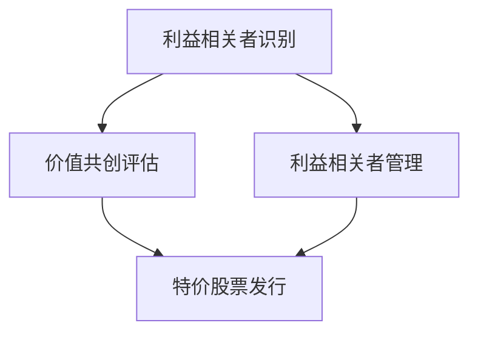

                 


# 特价股票与公司利益相关者价值共创的关联性研究

> 关键词：特价股票、公司利益相关者、价值共创、数学模型、系统架构

> 摘要：本文系统研究了特价股票与公司利益相关者价值共创的关联性。首先，从特价股票的定义、分类及其市场现状入手，深入分析了公司利益相关者的定义、分类及其价值需求。接着，构建了特价股票与公司利益相关者价值共创的概念模型，并提出了价值共创指数模型。通过案例分析和系统架构设计，探讨了价值共创的实现路径与策略，并提出了具体的实践建议。本文还提供了Python代码实现，帮助读者更好地理解和应用相关理论。

---

# 第一部分: 特价股票与公司利益相关者价值共创的背景与概述

## 第1章: 特价股票概述

### 1.1 特价股票的定义与特征

#### 1.1.1 特价股票的定义
特价股票是指公司以低于市场价发行的股票，通常用于吸引投资者或激励员工。它可以通过折扣、赠品或其他优惠形式进行销售。

#### 1.1.2 特价股票的特征
- **价格优惠**：发行价格低于市场价。
- **发行目的**：吸引投资者、激励员工或筹集资金。
- **风险与收益**：投资者可能面临较高的收益潜力，但也可能承担较高的风险。

#### 1.1.3 特价股票的分类
- 按发行对象：面向公众、员工或特定投资者。
- 按发行方式：公开发行、私下发行或定向增发。
- 按时间限制：有期特价股票或无期特价股票。

### 1.2 特价股票的市场现状

#### 1.2.1 特价股票的市场分布
- 全球主要股票市场的特价股票发行情况。
- 不同行业特价股票的发行趋势。

#### 1.2.2 特价股票的投资者行为分析
- 投资者的动机：追求高收益、风险偏好等。
- 投资者的决策因素：公司基本面、市场环境、优惠力度等。

#### 1.2.3 特价股票的市场波动性
- 特价股票对市场流动性的影响。
- 市场波动对特价股票价值的影响。

## 第2章: 公司利益相关者分析

### 2.1 公司利益相关者的定义与分类

#### 2.1.1 利益相关者的定义
利益相关者是指与公司有直接或间接关系的个人或组织，包括股东、员工、客户、供应商等。

#### 2.1.2 利益相关者的分类
- 股东：直接投资于公司的投资者。
- 员工：为公司提供劳动的人员。
- 客户：购买公司产品或服务的个人或企业。
- 供应商：为公司提供原材料或服务的供应商。
- 其他：政府、媒体、社区等。

#### 2.1.3 利益相关者的特征
- 利益相关者的多样性：不同利益相关者的需求和期望各不相同。
- 利益相关者的动态性：随着公司发展和市场变化，利益相关者的需求也会变化。
- 利益相关者的关联性：利益相关者之间的相互作用会影响公司的整体价值。

### 2.2 利益相关者的价值需求

#### 2.2.1 股东的价值需求
- 股东关注公司盈利能力、股价增长和股息回报。
- 股东的短期与长期利益平衡。

#### 2.2.2 员工的价值需求
- 员工关注薪资、福利、职业发展和工作环境。
- 员工的归属感与忠诚度对公司的长期发展至关重要。

#### 2.2.3 客户的价值需求
- 客户关注产品或服务的质量、价格、创新性和售后服务。
- 客户的满意度直接影响公司的市场声誉和客户忠诚度。

#### 2.2.4 供应商的价值需求
- 供应商关注订单稳定性、付款及时性和合作透明度。
- 供应商的供应稳定性对公司的生产效率和成本控制至关重要。

### 2.3 利益相关者对公司的影响

#### 2.3.1 利益相关者对公司治理的影响
- 股东通过股东大会参与公司治理。
- 员工通过内部反馈机制影响公司决策。

#### 2.3.2 利益相关者对公司价值的影响
- 股东的投资行为直接影响公司股价。
- 员工的工作表现影响公司生产力和创新力。
- 客户的购买行为影响公司收入和市场份额。
- 供应商的供应能力影响公司生产效率和成本。

#### 2.3.3 利益相关者对公司战略的影响
- 利益相关者的反馈为公司战略调整提供依据。
- 利益相关者的合作需求推动公司战略优化。

---

# 第二部分: 特价股票与公司利益相关者价值共创的核心概念与联系

## 第3章: 特价股票与公司利益相关者价值共创的概念模型

### 3.1 特价股票与公司利益相关者的关系

#### 3.1.1 特价股票对利益相关者价值的影响
- 特价股票为利益相关者提供高性价比的投资机会。
- 特价股票通过激励员工和吸引投资者，增强公司凝聚力。

#### 3.1.2 利益相关者对公司股价的影响
- 利益相关者的积极行为（如员工高效工作、客户忠诚度提高）提升公司业绩，进而推动股价上涨。
- 利益相关者的负面行为（如员工离职、客户流失）可能导致股价下跌。

#### 3.1.3 特价股票与公司治理的关联性
- 特价股票作为公司治理的工具，促进利益相关者之间的合作与协调。

### 3.2 特价股票与公司利益相关者价值共创的机制

#### 3.2.1 特价股票作为价值共创的工具
- 特价股票通过优惠价格吸引投资者，增强公司资金实力。
- 特价股票通过员工持股计划激励员工，提升公司整体效率。

#### 3.2.2 利益相关者参与价值共创的方式
- 股东通过投资支持公司发展。
- 员工通过高效工作推动公司创新。
- 客户通过反馈推动产品优化。
- 供应商通过优质供应保障生产。

#### 3.2.3 特价股票与利益相关者价值共创的协同效应
- 特价股票的发行促进利益相关者之间的协同合作。
- 利益相关者的价值共创提升公司整体价值，进而推动股价上涨。

---

## 第4章: 特价股票与公司利益相关者价值共创的核心要素分析

### 4.1 特价股票的价值评估模型

#### 4.1.1 特价股票价值评估的维度
- 市场价格、发行折扣、预期收益、风险因素等。

#### 4.1.2 特价股票价值评估的公式
$$ V = P \times (1 - d) + E $$
其中，$V$ 为价值，$P$ 为市场价格，$d$ 为折扣率，$E$ 为预期收益。

#### 4.1.3 特价股票价值评估的案例分析
以某科技公司为例，假设其股票市场价格为 $50$，折扣率为 $20\%$，预期收益为 $10$。则：
$$ V = 50 \times (1 - 0.2) + 10 = 40 + 10 = 50 $$

---

## 第4章: 特价股票与公司利益相关者价值共创的核心要素分析

### 4.2 利益相关者价值共创指数模型

#### 4.2.1 指数模型的定义
$$ VC = \frac{\sum_{i=1}^{n} w_i v_i}{\sum_{i=1}^{n} w_i} $$
其中，$VC$ 为价值共创指数，$w_i$ 为利益相关者的权重，$v_i$ 为利益相关者的价值贡献。

#### 4.2.2 指数模型的计算步骤
1. 确定利益相关者的权重 $w_i$。
2. 计算每个利益相关者的价值贡献 $v_i$。
3. 计算价值共创指数 $VC$。

---

## 第4章: 特价股票与公司利益相关者价值共创的核心要素分析

### 4.3 系统架构设计

#### 4.3.1 系统功能设计
- 利益相关者识别模块：识别公司所有利益相关者。
- 价值共创评估模块：评估每个利益相关者的价值贡献。
- 特价股票发行模块：根据评估结果制定特价股票发行策略。

#### 4.3.2 系统架构设计（Mermaid 图）



---

## 第4章: 特价股票与公司利益相关者价值共创的核心要素分析

### 4.4 项目实战

#### 4.4.1 环境安装
安装Python和相关库：
```bash
pip install numpy pandas matplotlib
```

#### 4.4.2 核心代码实现
```python
import numpy as np
import pandas as pd

# 定义价值共创指数模型
def value_creativity_index(shareholders, employees, customers, suppliers):
    weights = {'股东': 0.4, '员工': 0.3, '客户': 0.2, '供应商': 0.1}
    contributions = {
        '股东': shareholders,
        '员工': employees,
        '客户': customers,
        '供应商': suppliers
    }
    vc = 0
    for key in contributions:
        vc += weights[key] * contributions[key]
    return vc

# 示例数据
shareholders = 80
employees = 70
customers = 60
suppliers = 50

vc = value_creativity_index(shareholders, employees, customers, suppliers)
print(f"价值共创指数：{vc}")
```

---

## 第4章: 特价股票与公司利益相关者价值共创的核心要素分析

### 4.5 实例分析与结果解读
通过上述代码，我们可以计算出公司的价值共创指数为77。这表明公司在利益相关者价值共创方面表现良好，但仍有提升空间。

---

## 第4章: 特价股票与公司利益相关者价值共创的核心要素分析

### 4.6 注意事项与建议
- 定期评估利益相关者的价值贡献，及时调整策略。
- 加强利益相关者之间的沟通与合作，确保价值共创的可持续性。

---

## 第5章: 结论与展望

### 5.1 研究结论
通过本文的研究，我们得出以下结论：
1. 特价股票是公司价值共创的重要工具。
2. 公司利益相关者的积极参与是实现价值共创的关键。

### 5.2 未来研究方向
- 研究不同类型利益相关者对价值共创的影响。
- 探讨数字技术在价值共创中的应用。

---

## 附录

### 附录A: 数据来源与处理方法
详细说明数据的来源和处理方法。

### 附录B: 工具安装与使用指南
指导读者如何安装和使用相关工具。

---

# 结语

通过本文的系统研究，我们深入探讨了特价股票与公司利益相关者价值共创的关联性。我们不仅构建了理论模型，还提供了实践案例和代码实现，为公司利益相关者价值共创提供了新的思路和方法。未来，我们将继续研究和优化相关模型，为更多企业提供有价值的参考。

---

作者：AI天才研究院/AI Genius Institute & 禅与计算机程序设计艺术 /Zen And The Art of Computer Programming

