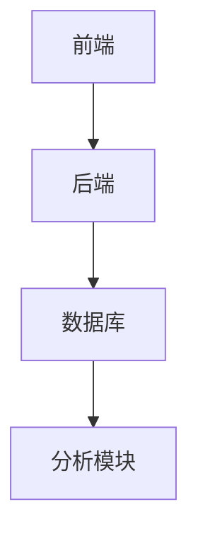
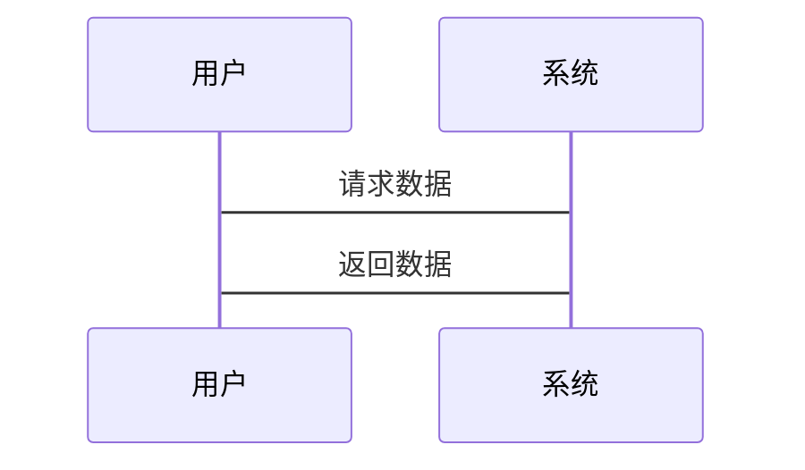

                 


# 特价股票与公司利益相关者管理的关联性研究

> 关键词：特价股票、公司利益相关者管理、关联性分析、算法原理、数学模型、系统设计、项目实战

> 摘要：本文通过分析特价股票与公司利益相关者管理之间的关联性，探讨了如何利用技术手段优化公司管理策略。从背景介绍、核心概念、算法原理、数学模型、系统设计到项目实战，本文详细阐述了两者之间的关系，并提出了可行的解决方案。

## 第1章: 特价股票与公司利益相关者管理的背景介绍

### 1.1 特价股票的定义与特点

#### 1.1.1 特价股票的定义
特价股票是指价格低于某个特定阈值的股票，通常被视为低价股。这些股票通常具有较高的波动性和潜在的高回报率。

#### 1.1.2 特价股票的核心特点
- 价格低廉：通常低于某个固定值，如2元。
- 波动性高：价格波动较大，风险较高。
- 市场流动性：部分特价股票流动性较差，可能导致买卖价差较大。

#### 1.1.3 特价股票的分类与边界
- 按行业分类：如金融、科技、制造业等。
- 按市值分类：如小盘股、中盘股、大盘股。
- 边界：如价格低于2元的股票，或市值低于10亿元的股票。

### 1.2 公司利益相关者管理的定义与特点

#### 1.2.1 利益相关者的定义
利益相关者是指与公司有直接或间接关系的个人或组织，包括股东、债权人、员工、客户、供应商等。

#### 1.2.2 利益相关者的分类
- 内部利益相关者：股东、员工。
- 外部利益相关者：债权人、客户、供应商。

#### 1.2.3 利益相关者管理的核心要素
- 沟通：及时传递公司信息。
- 透明度：公开公司运营状况。
- 利益平衡：在不同利益相关者之间寻求平衡。

### 1.3 特价股票与公司利益相关者管理的关联性

#### 1.3.1 问题背景与问题描述
- 特价股票的波动性可能影响公司股东的利益。
- 公司管理策略可能影响股价波动，进而影响利益相关者的行为。

#### 1.3.2 问题解决的路径与方法
- 通过分析股价波动与利益相关者行为之间的关系，优化公司管理策略。

#### 1.3.3 关联性的边界与外延
- 边界：仅考虑直接影响，如股东和债权人。
- 外延：扩展至客户和供应商的间接影响。

## 第2章: 特价股票与公司利益相关者管理的核心概念与联系

### 2.1 特价股票的市场特征分析

#### 2.1.1 特价股票的市场表现
- 价格波动大：容易受到市场情绪影响。
- 交易量低：流动性差，买卖价差大。

#### 2.1.2 特价股票与公司基本面的关系
- 公司基本面差：如盈利能力低，可能导致股价低。
- 公司基本面好：市场可能忽视其低价，导致股价被低估。

### 2.2 公司利益相关者管理的理论框架

#### 2.2.1 利益相关者管理的理论基础
- 利益相关者理论：认为公司应关注所有利益相关者的利益。
- 代理理论：强调股东利益最大化。

#### 2.2.2 利益相关者管理的实践模型
- 沟通模型：定期发布财务报告，召开股东大会。
- 平衡模型：在股东和债权人之间寻求平衡。

### 2.3 特价股票与公司利益相关者管理的关联性分析

#### 2.3.1 关联性的核心要素
- 股价波动：直接影响股东利益。
- 管理策略：影响债权人、员工等其他利益相关者的行为。

#### 2.3.2 关联性的影响因素
- 市场环境：宏观经济因素影响股价。
- 公司治理：影响利益相关者管理的效果。

#### 2.3.3 关联性分析的数学模型
$$ S = \beta \cdot M + \epsilon $$
其中：
- \( S \)：股价波动。
- \( \beta \)：市场敏感度系数。
- \( M \)：市场环境变量。
- \( \epsilon \)：随机误差项。

## 第3章: 特价股票与公司利益相关者管理的算法原理

### 3.1 特价股票预测算法

#### 3.1.1 回归分析
$$ y = \beta_0 + \beta_1 x_1 + \beta_2 x_2 + \epsilon $$
其中：
- \( y \)：股价。
- \( x_1 \)：公司基本面指标。
- \( x_2 \)：市场环境指标。

#### 3.1.2 机器学习模型
- 使用随机森林或神经网络预测股价波动。

### 3.2 利益相关者行为预测算法

#### 3.2.1 时间序列分析
$$ ARIMA(p, d, q) $$
其中：
- \( p \)：自回归阶数。
- \( d \)：差分阶数。
- \( q \)：移动平均阶数。

#### 3.2.2 聚类分析
- 将利益相关者分为不同类别，预测其行为。

## 第4章: 特价股票与公司利益相关者管理的数学模型

### 4.1 特价股票波动模型

$$ \sigma = \sqrt{\sum_{i=1}^{n} (x_i - \mu)^2 / N} $$
其中：
- \( \sigma \)：波动率。
- \( x_i \)：股价数据。
- \( \mu \)：平均股价。
- \( N \)：数据点数。

### 4.2 利益相关者影响模型

$$ I = \sum_{j=1}^{m} w_j \cdot s_j $$
其中：
- \( I \)：综合影响指数。
- \( w_j \)：利益相关者权重。
- \( s_j \)：利益相关者影响值。

## 第5章: 特价股票与公司利益相关者管理的系统设计

### 5.1 系统功能设计

#### 5.1.1 领域模型


#### 5.1.2 系统架构


### 5.2 接口设计与交互

#### 5.2.1 接口设计
- API接口：提供股价数据和利益相关者信息。
- 数据格式：JSON格式。

#### 5.2.2 交互流程


## 第6章: 特价股票与公司利益相关者管理的项目实战

### 6.1 环境安装

#### 6.1.1 工具安装
- 安装Python和相关库：numpy、pandas、scikit-learn。

### 6.2 核心实现

#### 6.2.1 核心代码
```python
import numpy as np
import pandas as pd
from sklearn import linear_model

# 数据加载
data = pd.read_csv('stock.csv')

# 特征提取
X = data[['eps', 'revenue']]
y = data['price']

# 模型训练
model = linear_model.LinearRegression()
model.fit(X, y)

# 预测
 predictions = model.predict(X)
```

#### 6.2.2 代码解读
- 数据加载：读取股票数据。
- 特征提取：选择每股收益和收入作为特征。
- 模型训练：使用线性回归模型。
- 预测：输出股价预测结果。

### 6.3 案例分析

#### 6.3.1 案例介绍
- 公司A：股价低于2元，基本面良好。

#### 6.3.2 分析结果
- 预测股价上涨，建议优化利益相关者管理。

## 第7章: 总结与展望

### 7.1 最佳实践 tips
- 定期监控股价波动。
- 优化利益相关者沟通策略。

### 7.2 小结
本文通过分析特价股票与公司利益相关者管理的关联性，提出了优化公司管理策略的方法。

### 7.3 注意事项
- 数据质量：确保数据准确。
- 模型选择：根据实际情况选择合适的模型。

### 7.4 拓展阅读
- 推荐书籍：《股票技术分析》、《公司治理》。

## 作者信息

作者：AI天才研究院 & 禅与计算机程序设计艺术

