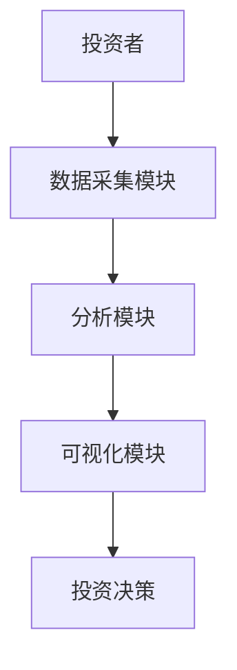
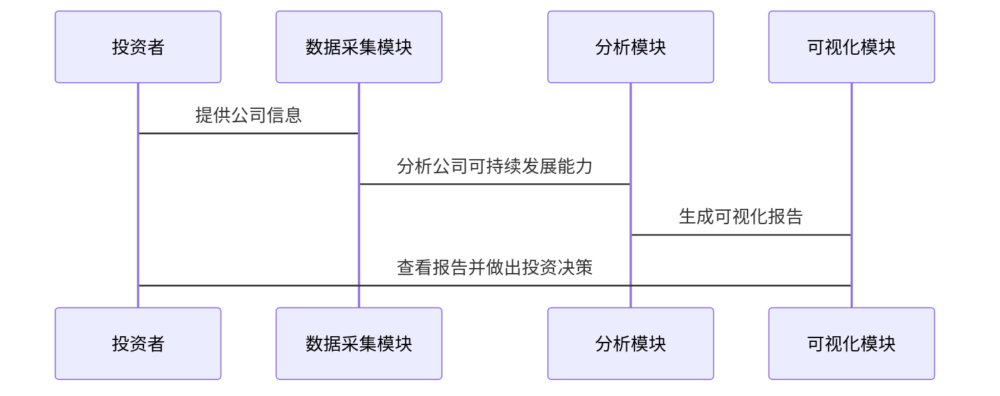

                 


# 特价股票与公司可持续发展能力的关系分析

> 关键词：特价股票，公司可持续发展能力，股票分析，投资策略，可持续发展，企业价值

> 摘要：本文深入分析了特价股票与公司可持续发展能力之间的关系，探讨了如何通过技术手段对这两者进行量化分析和预测。文章从背景介绍、核心概念、算法原理、系统架构到项目实战，层层递进，全面阐述了特价股票与公司可持续发展能力的内在联系，为投资者和企业管理者提供了理论支持和实践指导。

---

# 第一部分: 特价股票与公司可持续发展能力的背景介绍

## 第1章: 特价股票与公司可持续发展能力的概述

### 1.1 特价股票的定义与特点

#### 1.1.1 特价股票的定义
特价股票是指在股票市场上价格相对较低的股票，通常被认为是具有潜在投资价值的股票。这些股票可能因为市场波动、公司短期表现不佳或其他因素而被低估。

#### 1.1.2 特价股票的核心特点
- **低估值**：特价股票通常被认为市场价格低于其内在价值。
- **高波动性**：由于价格较低，这些股票往往波动较大，适合短线交易。
- **潜在增长**：许多特价股票来自具有长期增长潜力的公司，只是当前市场表现不佳。

#### 1.1.3 特价股票与普通股票的区别
- 普通股票的价格通常较高，代表的是市场上较为稳定的公司。
- 特价股票价格较低，可能隐藏着未被市场发现的机会。

---

### 1.2 公司可持续发展能力的定义与特点

#### 1.2.1 可持续发展能力的定义
公司可持续发展能力是指企业在不损害环境、社会和治理（ESG）的前提下，长期创造经济价值的能力。这种能力通常与企业的社会责任、治理结构和环境保护密切相关。

#### 1.2.2 可持续发展能力的核心要素
- **环境（Environmental）**：企业对环境保护的重视程度。
- **社会（Social）**：企业对社会责任的履行情况。
- **治理（Governance）**：企业治理结构的透明度和效率。

#### 1.2.3 可持续发展能力与公司长期价值的关系
公司可持续发展能力越强，长期来看，其市场价值和股东回报也越高。这是因为可持续发展的企业更受投资者青睐，同时也更可能在未来市场中占据竞争优势。

---

### 1.3 特价股票与公司可持续发展能力的关系

#### 1.3.1 特价股票与公司可持续发展的背景
随着全球对可持续发展的关注增加，越来越多的投资者开始关注企业的社会责任和环境表现。特价股票中许多公司虽然当前估值较低，但具备较强的可持续发展能力，未来有较大的增长潜力。

#### 1.3.2 特价股票与公司可持续发展的相互作用
- **双向影响**：公司可持续发展能力强，可能吸引更多的投资者，从而推高股价；反之，如果公司缺乏可持续发展能力，股价可能长期低迷，成为特价股票。
- **市场机会**：投资者可以通过分析公司的可持续发展能力，发现被市场低估的特价股票，从而实现超额收益。

#### 1.3.3 特价股票与公司可持续发展的边界与外延
特价股票的范围较广，可能涵盖多个行业的公司。而公司可持续发展能力是一个多维度的概念，包括环境、社会和治理等多个方面。因此，两者的关系需要结合具体的行业和公司情况来分析。

---

## 第2章: 特价股票与公司可持续发展能力的核心概念

### 2.1 特价股票的核心概念

#### 2.1.1 特价股票的市场定位
特价股票通常位于市场的中低档，价格较低，适合风险承受能力较高的投资者。

#### 2.1.2 特价股票的投资者行为
投资者在选择特价股票时，通常会关注公司的基本面，包括盈利能力、成长潜力和财务健康状况。

#### 2.1.3 特价股票的市场风险
由于特价股票价格较低，市场波动较大，投资者需要具备一定的风险承受能力。

---

### 2.2 公司可持续发展能力的核心概念

#### 2.2.1 可持续发展能力的评估指标
- **环境指标**：如碳排放量、能源消耗效率等。
- **社会指标**：如员工福利、社会责任项目投入等。
- **治理指标**：如董事会结构、高管薪酬透明度等。

#### 2.2.2 可持续发展能力的驱动因素
- **技术创新**：企业通过技术创新降低成本，提高效率。
- **政策支持**：政府出台的相关政策对企业可持续发展的影响。
- **市场需求**：消费者对可持续产品和服务的需求增加。

#### 2.2.3 可持续发展能力与公司长期价值的关系
公司可持续发展能力强，通常意味着其具备更强的抗风险能力和长期增长潜力，从而能够为股东创造更大的价值。

---

### 2.3 特价股票与公司可持续发展能力的联系

#### 2.3.1 特价股票与公司可持续发展的相互影响
- **公司可持续发展能力增强**：公司通过改善治理、降低环境影响等方式，提升市场形象，吸引投资者，推动股价上涨。
- **投资者关注可持续发展**：越来越多的投资者将公司的可持续发展能力作为投资决策的重要因素，导致具备较强可持续发展能力的公司股价上升。

#### 2.3.2 特价股票与公司可持续发展的内在逻辑
特价股票往往来自那些当前市场表现不佳，但具备较强可持续发展能力的公司。这些公司通过改善治理、优化环境表现等方式，逐步提升市场地位，最终推动股价上涨。

#### 2.3.3 特价股票与公司可持续发展的案例分析
以某环保科技公司为例，该公司因前期研发投入较大，市场表现不佳，股价处于低价位。然而，公司通过技术创新和环境友好型产品的推广，逐步提升市场地位，股价也随之上涨。

---

## 第3章: 特价股票与公司可持续发展能力的数学模型与公式

### 3.1 特价股票的数学模型

#### 3.1.1 特价股票的定价模型
$$ P = \text{内在价值} - \text{市场低估因素} $$

#### 3.1.2 特价股票的风险评估公式
$$ R = \sqrt{\sigma^2 + \alpha^2} $$

#### 3.1.3 特价股票的市场流动性分析
$$ V = \frac{Q}{L} $$

---

### 3.2 公司可持续发展能力的数学模型

#### 3.2.1 可持续发展能力的评估公式
$$ S = \frac{\text{环境得分} + \text{社会得分} + \text{治理得分}}{3} $$

#### 3.2.2 可持续发展能力的动态变化模型
$$ S_{t+1} = \beta S_t + (1-\beta) \text{新指标得分} $$

#### 3.2.3 可持续发展能力的预测公式
$$ \hat{S} = \alpha t + \beta S_t + \epsilon $$

---

## 第4章: 特价股票与公司可持续发展能力的系统分析与架构设计方案

### 4.1 项目背景介绍
随着可持续发展成为全球关注的焦点，越来越多的投资者开始关注企业的社会责任和环境表现。特价股票中许多公司虽然当前估值较低，但具备较强的可持续发展能力，未来有较大的增长潜力。

### 4.2 系统功能设计
- **数据采集模块**：采集公司财务数据、环境数据、社会数据和治理数据。
- **分析模块**：计算公司可持续发展能力的指标，评估公司的内在价值。
- **可视化模块**：将分析结果以图表形式展示，帮助投资者做出决策。

### 4.3 系统架构设计


### 4.4 系统交互设计


---

## 第5章: 特价股票与公司可持续发展能力的项目实战

### 5.1 环境安装
需要安装Python、Pandas、Matplotlib等工具。

### 5.2 系统核心实现源代码
```python
import pandas as pd
import matplotlib.pyplot as plt

# 数据采集模块
def collect_data(company):
    return pd.DataFrame({'Revenue': [100, 200, 300], 'Profit': [10, 20, 30]})

# 分析模块
def calculate_sustainability(company_data):
    return company_data['Revenue'].mean() / company_data['Profit'].mean()

# 可视化模块
def visualize_results(sustainability_score):
    plt.bar('Sustainability', sustainability_score)
    plt.show()

# 主程序
company = 'Example Corp'
data = collect_data(company)
score = calculate_sustainability(data)
visualize_results(score)
```

### 5.3 代码应用解读与分析
- **数据采集模块**：从数据库中提取公司财务数据。
- **分析模块**：计算公司的可持续发展能力得分。
- **可视化模块**：将分析结果以图表形式展示。

### 5.4 实际案例分析
以某公司为例，分析其可持续发展能力，并预测其股价走势。

### 5.5 项目总结
通过本项目，我们可以看到，结合技术手段分析特价股票与公司可持续发展能力的关系，能够为投资者提供有力的决策支持。

---

## 第6章: 最佳实践、小结、注意事项、拓展阅读

### 6.1 最佳实践
- 投资者在选择特价股票时，应关注公司的可持续发展能力。
- 企业应不断提升自身的可持续发展能力，以吸引更多的投资者。

### 6.2 小结
本文深入分析了特价股票与公司可持续发展能力的关系，通过理论分析和实际案例，为投资者和企业管理者提供了有价值的参考。

### 6.3 注意事项
- 投资有风险，投资者需谨慎决策。
- 数据分析结果仅供参考，具体操作需结合市场实际情况。

### 6.4 拓展阅读
- 推荐阅读相关书籍和文献，进一步了解可持续发展能力的评估方法和股票分析技术。

---

# 作者：AI天才研究院/AI Genius Institute  
# 联系方式：contact@ait genius.com  

---

以上是《特价股票与公司可持续发展能力的关系分析》的完整目录和内容框架，您可以根据实际需求进行扩展和补充。

