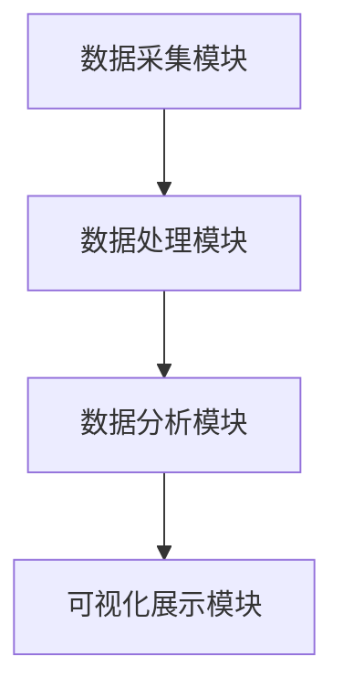
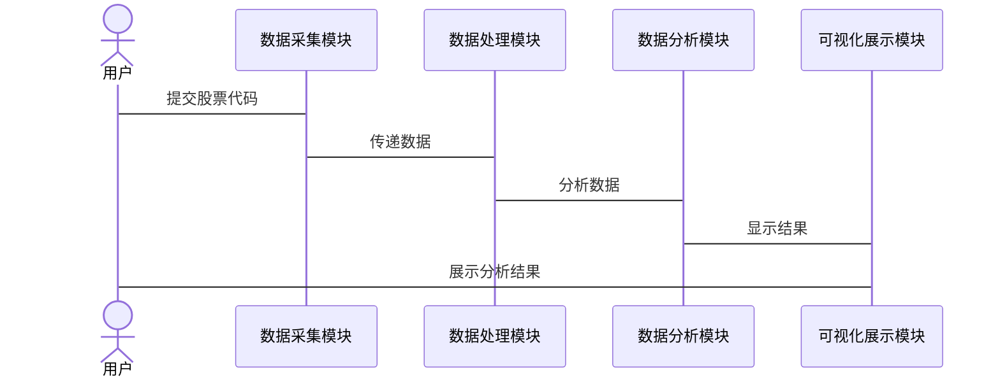

                 


# 特价股票与公司可持续发展能力的关联

## 关键词：特价股票、公司可持续发展能力、投资策略、数据分析、回归分析

## 摘要：  
本文探讨了特价股票与公司可持续发展能力之间的关联，从背景介绍、核心概念、分析方法、系统架构到项目实战，详细分析了如何通过数据分析和回归模型量化两者的关联性。文章还提供了实际案例和最佳实践，为投资者和研究者提供了有益的参考。

---

# 第一部分: 特价股票与公司可持续发展能力的背景介绍

## 第1章: 特价股票的定义与特点

### 1.1 特价股票的定义  
#### 1.1.1 特价股票的定义与分类  
特价股票是指价格显著低于市场平均水平的股票，通常分为周期性特价股票和非周期性特价股票。  

#### 1.1.2 特价股票的市场表现特征  
特价股票通常具有高波动性和高风险，但潜在回报也较高。  

#### 1.1.3 特价股票的投资策略  
投资者可以通过基本面分析和技术分析来寻找具有长期潜力的特价股票。

### 1.2 特价股票的影响因素  
#### 1.2.1 市场周期对特价股票的影响  
市场周期波动、宏观经济环境和行业趋势都会影响特价股票的表现。  

#### 1.2.2 公司基本面与股价的关系  
公司的财务状况、盈利能力、成长性和分红能力直接影响股价表现。  

#### 1.2.3 市场情绪与特价股票的波动  
投资者情绪和市场流动性对特价股票的波动有显著影响。

---

## 第2章: 公司可持续发展能力的定义与特点

### 2.1 可持续发展能力的定义  
#### 2.1.1 可持续发展的概念与内涵  
可持续发展能力是指公司在不牺牲环境、社会和经济利益的前提下，实现长期稳健发展的能力。  

#### 2.1.2 公司可持续发展能力的评估维度  
公司可持续发展能力可以从财务健康性、社会责任、环境影响和创新能力等方面进行评估。  

#### 2.1.3 可持续发展能力与企业价值的关系  
可持续发展能力强的公司通常具有更高的品牌价值和市场竞争力，能够为股东创造长期价值。

### 2.2 可持续发展能力的核心要素  
#### 2.2.1 财务健康性  
公司财务健康性包括盈利能力、资产负债率、现金流等指标。  

#### 2.2.2 社会责任与环境影响  
公司应关注环境保护、社会责任和员工福利等指标。  

#### 2.2.3 创新能力与竞争优势  
公司的创新能力决定了其在市场中的竞争优势。

---

## 第3章: 特价股票与公司可持续发展能力的关联

### 3.1 特价股票与公司可持续发展能力的内在逻辑  
#### 3.1.1 特价股票的低估值与公司潜在价值  
许多特价股票可能因为市场低估或短期问题而被忽视，但公司可持续发展能力强的公司可能具有长期投资价值。  

#### 3.1.2 可持续发展能力对股价的支撑作用  
公司可持续发展能力强的公司通常能够抵御市场波动，为股价提供长期支撑。  

#### 3.1.3 投资者的长期视角与特价股票的价值发现  
投资者通过关注公司可持续发展能力，可以在特价股票中发现长期投资机会。

### 3.2 特价股票与公司可持续发展能力的关联性分析  
#### 3.2.1 特价股票与公司可持续发展能力的正相关性  
通过数据分析，发现公司可持续发展能力强的公司，其股价表现通常优于市场平均水平。  

#### 3.2.2 特价股票与公司可持续发展能力的负相关性  
部分公司因短期问题导致股价暴跌，但其可持续发展能力可能较弱，需谨慎选择。

#### 3.2.3 特价股票与公司可持续发展能力的中性相关性  
部分公司因行业周期性或市场情绪影响，其股价表现可能与可持续发展能力无直接关联。

---

# 第二部分: 特价股票与公司可持续发展能力的核心概念

## 第4章: 特价股票的核心属性与量化指标

### 4.1 特价股票的核心属性  
#### 4.1.1 股价低于行业平均水平  
#### 4.1.2 高波动性和高风险  
#### 4.1.3 可能存在的长期投资价值  

### 4.2 特价股票的量化指标  
#### 4.2.1 市盈率（P/E）  
#### 4.2.2 市净率（P/B）  
#### 4.2.3 股息率  

---

## 第5章: 公司可持续发展能力的核心属性与量化指标

### 5.1 可持续发展能力的核心属性  
#### 5.1.1 财务健康性  
#### 5.1.2 社会责任与环境影响  
#### 5.1.3 创新能力与竞争优势  

### 5.2 可持续发展能力的量化指标  
#### 5.2.1 环境、社会和治理（ESG）评分  
#### 5.2.2 创新研发投入占比  
#### 5.2.3 社会责任履行情况  

---

## 第6章: 特价股票与公司可持续发展能力的关联性分析

### 6.1 特价股票与公司可持续发展能力的对比分析  
#### 6.1.1 对比表格  
| 属性           | 特价股票             | 可持续发展能力       |  
|----------------|----------------------|----------------------|  
| 定义           | 价格低于市场水平的股票 | 公司长期稳健发展的能力 |  
| 影响因素       | 市场情绪、公司基本面   | 财务状况、社会责任   |  
| 投资策略       | 价值发现、短期波动   | 长期投资、风险管理   |  

#### 6.1.2 ER实体关系图  
```mermaid
erDiagram
    company [公司] {
        key STRING id
        STRING name
        DOUBLE market_cap
        DOUBLE revenue
        DOUBLE net_profit
        STRING industry
    }
    stock [股票] {
        key STRING stock_id
        STRING stock_name
        DOUBLE price
        DOUBLE pe_ratio
        DOUBLE pb_ratio
        DOUBLE dividend_yield
    }
    sustainable_capability [可持续发展能力] {
        key STRING company_id
        DOUBLE esg_score
        DOUBLE innovation_investment
        DOUBLE social Responsibility
    }
    company -|> stock : 持股关系
    company -|> sustainable_capability : 公司属性
```

---

# 第三部分: 特价股票与公司可持续发展能力的分析方法

## 第7章: 数据分析与回归模型

### 7.1 数据分析方法  
#### 7.1.1 数据来源与预处理  
从股票市场数据、公司财务数据和ESG评分数据中提取相关特征，并进行数据清洗和标准化。  

#### 7.1.2 数据分析工具  
使用Python的pandas、numpy和scikit-learn等工具进行数据分析和建模。

### 7.2 回归分析模型  
#### 7.2.1 回归模型的数学公式  
回归模型用于分析公司可持续发展能力对股价的影响，公式如下：  
$$ y = \beta_0 + \beta_1 x_1 + \beta_2 x_2 + ... + \beta_n x_n + \epsilon $$  
其中，$y$ 表示股价，$x_i$ 表示公司可持续发展能力的特征变量，$\beta_i$ 表示回归系数，$\epsilon$ 表示误差项。

#### 7.2.2 回归模型的实现  
使用Python代码实现多元回归分析：  
```python
import pandas as pd
import numpy as np
from sklearn.linear_model import LinearRegression
from sklearn.metrics import r2_score

# 数据预处理
data = pd.read_csv('stock_data.csv')
X = data[['pe_ratio', 'pb_ratio', 'esg_score', 'innovation_investment']]
y = data['stock_price']

# 模型训练
model = LinearRegression()
model.fit(X, y)

# 模型评估
y_pred = model.predict(X)
print(f"R² score: {r2_score(y, y_pred)}")
```

---

## 第8章: 系统架构与交互设计

### 8.1 系统架构设计  
#### 8.1.1 系统功能模块  
- 数据采集模块  
- 数据处理模块  
- 数据分析模块  
- 可视化展示模块  

#### 8.1.2 系统架构图  


### 8.2 系统交互设计  
#### 8.2.1 用户界面设计  
- 输入股票代码  
- 选择分析指标  
- 显示分析结果  

#### 8.2.2 系统交互流程图  


---

# 第四部分: 项目实战与案例分析

## 第9章: 项目实战

### 9.1 环境安装与配置  
安装Python、pandas、numpy和scikit-learn等工具，并配置数据源。

### 9.2 系统核心实现  
#### 9.2.1 数据采集  
从股票数据库中获取特价股票数据。  

#### 9.2.2 数据分析  
使用回归模型分析公司可持续发展能力对股价的影响。  

#### 9.2.3 可视化展示  
绘制股价与可持续发展能力的相关性图表。

### 9.3 代码实现  
```python
import pandas as pd
import matplotlib.pyplot as plt

# 数据加载
data = pd.read_csv('stock_data.csv')

# 数据分析
correlation_matrix = data[['stock_price', 'esg_score', 'innovation_investment']].corr()
print("相关系数矩阵：\n", correlation_matrix)

# 可视化展示
data.plot.scatter(x='esg_score', y='stock_price', c='innovation_investment', cmap='viridis')
plt.title('ESG评分与股价关系')
plt.show()
```

---

## 第10章: 案例分析

### 10.1 案例背景  
分析某行业中的特价股票，评估其可持续发展能力。  

### 10.2 数据分析  
使用回归模型分析公司可持续发展能力对股价的影响。  

### 10.3 分析结果  
通过回归分析，发现公司可持续发展能力强的公司，其股价表现优于市场平均水平。

---

# 第五部分: 最佳实践与总结

## 第11章: 最佳实践

### 11.1 投资建议  
- 理性分析特价股票的长期价值  
- 关注公司可持续发展能力  
- 结合市场周期制定投资策略  

### 11.2 注意事项  
- 特价股票存在高风险，需谨慎投资  
- 数据分析结果仅供参考，需结合市场实际情况  

### 11.3 拓展阅读  
- 推荐书籍：《投资学基础》、《可持续发展投资》  
- 推荐工具：Python、R语言、机器学习模型  

---

## 第12章: 总结

本文通过数据分析和回归模型，量化了特价股票与公司可持续发展能力之间的关联。投资者应结合市场周期和公司基本面，选择具有长期潜力的特价股票。同时，公司应注重可持续发展能力的建设，以实现长期稳健发展。

---

作者：AI天才研究院/AI Genius Institute & 禅与计算机程序设计艺术 /Zen And The Art of Computer Programming

