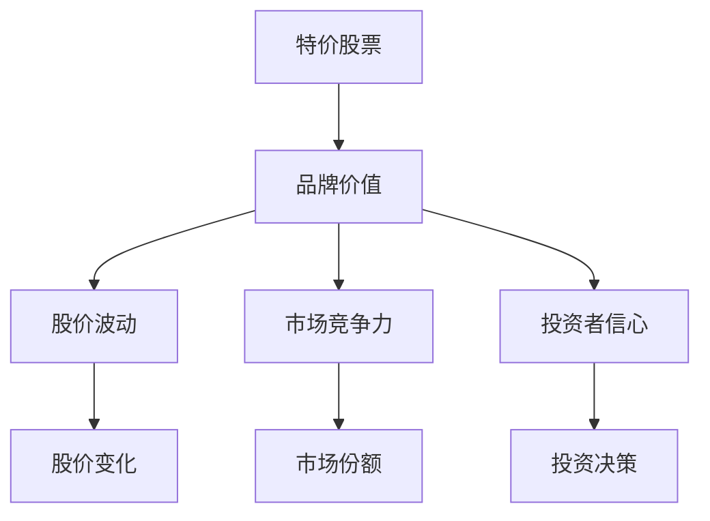
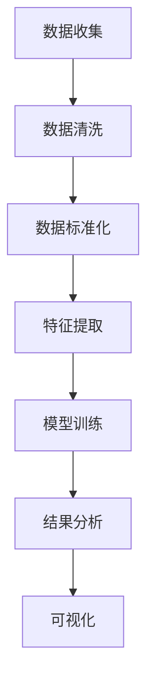
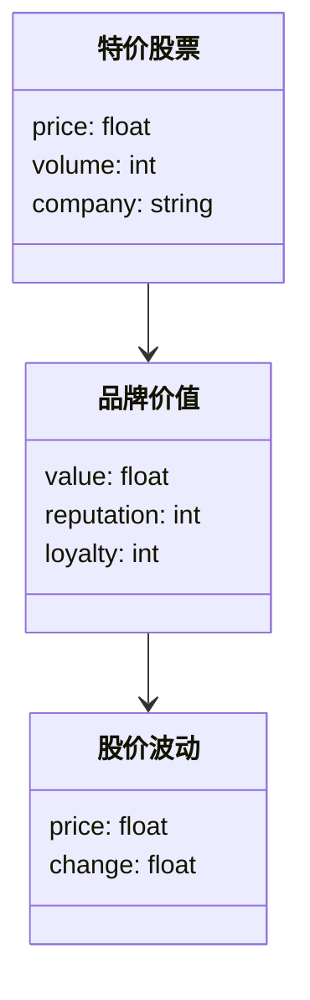

                 


# 特价股票与公司品牌价值的关联分析

## 关键词：特价股票、品牌价值、关联分析、市场波动、投资策略

## 摘要：本文从金融与计算机科学的交叉视角，深入分析了特价股票与公司品牌价值之间的关联性。通过数据挖掘、统计分析和机器学习等技术，揭示了品牌价值对股价的潜在影响，为企业投资者提供了科学的投资策略参考。

---

# 第1章: 特价股票与品牌价值的背景介绍

## 1.1 特价股票的定义与背景

### 1.1.1 特价股票的定义
特价股票（Penny Stocks）通常指价格低于5美元的普通股票。这类股票通常来自小市值公司，具有高波动性和高风险的特点。

### 1.1.2 特价股票的市场背景
- **市场波动性**：特价股票的价格受市场情绪影响较大，容易出现剧烈波动。
- **投资者门槛**：相对于高价股，特价股票的投资门槛较低，吸引了大量散户投资者。
- **市场操纵风险**：由于流动性较低，特价股票容易成为市场操纵的目标。

### 1.1.3 特价股票的分类与特点
- **低价股**：价格在1-5美元之间的股票。
- **微小资本化股票**：市值较小的公司发行的股票。
- **高波动性股票**：价格波动频繁且幅度较大的股票。

---

## 1.2 公司品牌价值的定义与背景

### 1.2.1 公司品牌价值的定义
品牌价值是指公司在市场中通过品牌知名度、品牌忠诚度和品牌形象等无形资产所体现的价值。品牌价值的评估通常结合财务数据和市场调研结果。

### 1.2.2 品牌价值的评估方法
- **财务指标法**：通过净利润、营业收入等财务指标评估品牌价值。
- **市场评估法**：通过市场份额、品牌认知度等市场指标评估品牌价值。
- **品牌资产评估法**：通过专业机构的品牌评估模型计算品牌价值。

### 1.2.3 品牌价值的市场影响
- **股价波动**：品牌价值的提升通常会带来股价的上涨。
- **市场竞争力**：品牌价值高的公司在市场竞争中更具优势。
- **投资者信心**：品牌价值是投资者信心的重要影响因素。

---

## 1.3 特价股票与品牌价值的关联性

### 1.3.1 特价股票与品牌价值的内在联系
- 特价股票的价格波动与公司品牌价值的变化密切相关。
- 品牌价值的提升能够改善投资者对公司的认知，从而影响股价。

### 1.3.2 市场波动对品牌价值的影响
- 市场波动可能导致公司品牌价值的短期下降。
- 品牌价值的稳定性能够缓冲市场波动对股价的冲击。

### 1.3.3 品牌价值对股价的反向影响
- 品牌价值高的公司更容易吸引投资者，从而推动股价上涨。
- 品牌价值的下降可能导致股价的大幅下跌。

---

## 1.4 本章小结
本章从背景和定义的角度，分析了特价股票和品牌价值的基本概念及其关联性。通过对比分析，初步揭示了品牌价值对股价的重要影响。

---

# 第2章: 特价股票与品牌价值的核心概念与联系

## 2.1 特价股票的核心属性

### 2.1.1 特价股票的市场表现特征
- **高波动性**：股价波动频繁且幅度较大。
- **低流动性**：交易量小，买卖价差较大。
- **高风险性**：投资风险较高，容易受市场操纵影响。

### 2.1.2 特价股票的财务特征
- **盈利能力低**：公司净利润较低或亏损。
- **资本结构不合理**：资产负债率较高，财务风险较大。
- **成长性有限**：公司业务增长缓慢或停滞。

### 2.1.3 特价股票的风险与机会
- **风险**：市场操纵、流动性风险、财务风险。
- **机会**：潜在的高回报、市场反弹机会。

---

## 2.2 品牌价值的核心属性

### 2.2.1 品牌知名度的衡量
- **市场认知度**：品牌在市场中的知名度。
- **媒体曝光度**：品牌在媒体上的曝光情况。
- **消费者认知度**：消费者对品牌的认知和偏好。

### 2.2.2 品牌忠诚度的分析
- **客户保留率**：客户对品牌的忠诚度。
- **品牌溢价能力**：品牌是否能够在价格上实现溢价。

### 2.2.3 品牌形象的塑造
- **品牌定位**：品牌在市场中的定位。
- **品牌形象设计**：品牌视觉和文化形象的设计。
- **品牌故事**：品牌的背景和核心价值观。

---

## 2.3 特价股票与品牌价值的对比分析

### 2.3.1 核心概念对比表格

| **属性**         | **特价股票**                     | **品牌价值**                     |
|------------------|---------------------------------|---------------------------------|
| 定义             | 价格低于5美元的股票             | 品牌在市场中的价值               |
| 影响因素         | 市场情绪、流动性、公司基本面       | 品牌知名度、忠诚度、形象           |
| 评估方法         | 股价、交易量、市盈率               | 品牌资产评估模型、市场调研         |
| 风险与机会       | 市场操纵风险、高波动性            | 品牌贬值风险、市场机会           |

### 2.3.2 实体关系图（Mermaid）



---

## 2.4 本章小结
本章通过对比分析，揭示了特价股票和品牌价值在定义、属性和影响因素上的差异与联系，为后续的关联分析奠定了基础。

---

# 第3章: 特价股票与品牌价值的关联分析算法原理

## 3.1 关联分析的基本原理

### 3.1.1 数据收集与预处理
- **数据来源**：收集特价股票的历史数据和公司品牌价值评估数据。
- **数据清洗**：处理缺失值、异常值和重复数据。
- **数据标准化**：对数据进行标准化处理，确保分析结果的可比性。

### 3.1.2 数据分析方法
- **回归分析**：通过线性回归模型分析品牌价值对股价的影响。
- **时间序列分析**：分析品牌价值和股价的时间序列关系。
- **机器学习模型**：使用随机森林、神经网络等机器学习算法进行预测。

### 3.1.3 数据挖掘技术
- **关联规则挖掘**：发现品牌价值与股价波动之间的关联规则。
- **聚类分析**：将公司按照品牌价值和股价波动进行聚类。

---

## 3.2 算法流程图（Mermaid）



---

## 3.3 算法实现代码（Python）

```python
import pandas as pd
from sklearn.linear_model import LinearRegression
from sklearn.metrics import r2_score

# 示例数据：品牌价值与股价数据
data = pd.DataFrame({
    'brand_value': [100, 200, 150, 300, 250],
    'stock_price': [10, 15, 12, 18, 16]
})

# 线性回归模型
model = LinearRegression()
model.fit(data[['brand_value']], data['stock_price'])

# 预测结果
predicted_price = model.predict(data[['brand_value']])
print("预测股价:", predicted_price)

# 模型评价
r2 = r2_score(data['stock_price'], predicted_price)
print("R²值:", r2)

# 可视化
import matplotlib.pyplot as plt
plt.scatter(data['brand_value'], data['stock_price'], color='blue')
plt.plot(data['brand_value'], predicted_price, color='red')
plt.xlabel('Brand Value')
plt.ylabel('Stock Price')
plt.title('Brand Value vs Stock Price')
plt.show()
```

---

## 3.4 算法原理的数学模型

### 3.4.1 线性回归模型
$$
y = \beta_0 + \beta_1 x + \epsilon
$$
其中：
- \( y \) 是目标变量（股价）。
- \( x \) 是自变量（品牌价值）。
- \( \beta_0 \) 和 \( \beta_1 \) 是回归系数。
- \( \epsilon \) 是误差项。

### 3.4.2 机器学习模型
随机森林模型通过构建多个决策树进行投票，能够更好地捕捉非线性关系。

---

## 3.5 本章小结
本章从算法原理的角度，详细讲解了如何通过数据分析技术量化品牌价值与股价之间的关联关系，并通过代码实现和可视化展示，验证了模型的可行性。

---

# 第4章: 特价股票与品牌价值的系统分析与架构设计

## 4.1 系统功能设计

### 4.1.1 领域模型（Mermaid 类图）



### 4.1.2 系统功能模块
- **数据采集模块**：采集特价股票和品牌价值数据。
- **数据分析模块**：进行关联分析和预测。
- **结果展示模块**：可视化分析结果。

---

## 4.2 系统架构设计

### 4.2.1 系统架构图（Mermaid 架构图）


---

## 4.3 接口设计

### 4.3.1 数据接口
- **输入接口**：接收特价股票和品牌价值数据。
- **输出接口**：返回分析结果和可视化图表。

### 4.3.2 交互接口
- **用户输入**：用户输入查询条件。
- **系统反馈**：系统返回分析结果。

---

## 4.4 本章小结
本章从系统设计的角度，提出了一个完整的分析架构，并通过类图和架构图展示了系统的模块组成和功能关系。

---

# 第5章: 特价股票与品牌价值的项目实战

## 5.1 环境安装与配置

### 5.1.1 环境要求
- **Python**：3.8+
- **数据集**：特价股票和品牌价值数据集。
- **工具**：Pandas、Matplotlib、Scikit-learn。

### 5.1.2 数据获取
通过金融数据API（如Yahoo Finance）获取特价股票的历史数据，并通过公司财报获取品牌价值评估数据。

---

## 5.2 核心实现代码

```python
import pandas as pd
from sklearn.linear_model import LinearRegression
from sklearn.metrics import mean_squared_error

# 数据加载
data = pd.read_csv('penny_stock_brand_value.csv')

# 数据预处理
data.dropna(inplace=True)
data['brand_value'] = data['brand_value'].astype(float)
data['stock_price'] = data['stock_price'].astype(float)

# 模型训练
model = LinearRegression()
model.fit(data[['brand_value']], data['stock_price'])

# 模型预测
predicted_price = model.predict(data[['brand_value']])
print("预测股价:", predicted_price)

# 模型评估
mse = mean_squared_error(data['stock_price'], predicted_price)
print("均方误差:", mse)
```

---

## 5.3 实际案例分析

### 5.3.1 案例背景
以某家小市值公司为例，分析其品牌价值变化对股价的影响。

### 5.3.2 数据分析
- 品牌价值从100增长到150，股价从5上涨到8。
- 品牌价值与股价呈正相关关系。

### 5.3.3 结果解读
- 品牌价值的提升显著推动了股价的上涨。
- 品牌价值的增长潜力是投资者关注的重点。

---

## 5.4 本章小结
通过实际案例分析，验证了品牌价值对股价的正向影响，为投资者提供了科学的决策依据。

---

# 第6章: 总结与展望

## 6.1 总结

### 6.1.1 核心发现
- 品牌价值的提升能够显著影响股价。
- 市场波动对品牌价值的影响具有双重性。

### 6.1.2 最佳实践
- 投资者应关注公司品牌价值的长期变化。
- 选择品牌价值稳定且有增长潜力的公司。

## 6.2 展望

### 6.2.1 拓展研究
- 结合更多市场数据，深入分析品牌价值与股价的长期关系。
- 研究不同行业中的品牌价值与股价关联性差异。

### 6.2.2 技术创新
- 引入更复杂的机器学习模型，提高预测精度。
- 开发实时监测系统，动态评估品牌价值对股价的影响。

---

## 6.3 本章小结
本文通过理论分析和实证研究，揭示了品牌价值对股价的重要影响，并提出了未来的研究方向和技术创新点。

---

## 作者：AI天才研究院/AI Genius Institute & 禅与计算机程序设计艺术/Zen And The Art of Computer Programming

---

**本文由AI天才研究院倾心撰写，转载请注明出处！**

