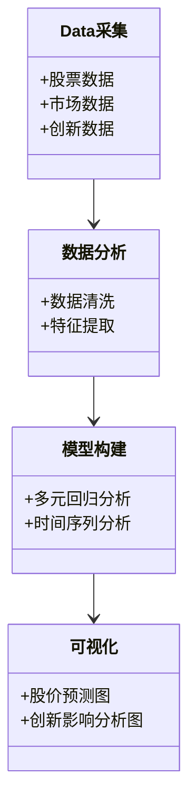

                 


# 特价股票与公司商业模式创新的关联性研究

## 关键词：特价股票，商业模式创新，关联性分析，投资策略，数据分析

## 摘要  
本文旨在探讨特价股票与公司商业模式创新之间的关联性。通过分析特价股票的定义、特点以及商业模式创新的核心要素，本文揭示了两者在公司价值提升、市场竞争力和投资机会中的相互作用。结合数据分析和算法模型，本文提出了如何通过商业模式创新识别投资机会，并提供了实际案例分析和投资策略建议。  

---

## 第1章: 特价股票与商业模式创新的背景与概念

### 1.1 特价股票的定义与特点  
特价股票是指公司发行的股票价格低于面值的股票，通常用于吸引投资者或改善公司财务状况。其特点包括：  
1. **低面值**：股票面值通常为1元或更低，实际交易价格可能远低于面值。  
2. **特殊用途**：常用于资产重组、债务重组或吸引战略投资者。  
3. **风险较高**：特价股票通常伴随着较高的投资风险，适合风险承受能力强的投资者。  

### 1.2 公司商业模式创新的定义与特点  
商业模式创新是指企业通过改变其业务模式、收入来源或客户关系等方式，以实现价值最大化的过程。其特点包括：  
1. **创新性**：通过引入新技术、新产品或新服务，创造新的市场机会。  
2. **灵活性**：能够快速适应市场变化和客户需求。  
3. **可持续性**：通过优化资源利用和成本控制，实现长期发展。  

### 1.3 特价股票与商业模式创新的关联性  
1. **公司价值提升**：商业模式创新能够提高公司盈利能力，从而提升股价。  
2. **市场竞争力**：通过创新商业模式，公司能够在竞争激烈的市场中占据优势。  
3. **投资机会**：投资者可以通过分析公司商业模式创新的潜力，选择具有增长潜力的特价股票。  

---

## 第2章: 特价股票与商业模式创新的核心概念

### 2.1 特价股票与商业模式创新的对比分析  
以下表格对比了特价股票和商业模式创新的特点：  

| **属性**          | **特价股票**                     | **商业模式创新**                 |
|-------------------|----------------------------------|----------------------------------|
| 定义               | 股票价格低于面值的股票           | 改变业务模式以提升价值的过程     |
| 目标               | 吸引投资、改善财务状况           | 提升竞争力、创造新价值           |
| 风险               | 投资风险较高                     | 创新失败风险较高                 |
| 影响               | 可能影响股价波动                 | 可能提升公司长期价值             |

### 2.2 特价股票与商业模式创新的实体关系图  
以下为特价股票与商业模式创新的实体关系图：  

```mermaid
erDiagram
    company *[Company] --> stock *[Stock]: 持有
    stock --> market *[Market]: 受市场影响
    company --> innovation *[Innovation]: 通过创新提升价值
    market --> innovation: 影响创新方向
```

---

## 第3章: 特价股票与商业模式创新的算法原理

### 3.1 特价股票与商业模式创新的关联性分析  
为了分析特价股票与商业模式创新的关联性，我们可以通过多元回归分析模型进行预测。模型如下：  

$$
Y = \beta_0 + \beta_1X_1 + \beta_2X_2 + \epsilon
$$  

其中：  
- $Y$：股价变化率  
- $X_1$：商业模式创新指数  
- $X_2$：市场环境指数  
- $\beta_i$：回归系数  
- $\epsilon$：误差项  

### 3.2 算法实现  
以下是Python代码实现多元回归分析：  

```python
import pandas as pd
import numpy as np
from sklearn.linear_model import LinearRegression

# 数据加载
data = pd.read_csv('stock_data.csv')

# 特征与目标变量
X = data[['innovation_index', 'market_index']]
y = data['price_change']

# 模型训练
model = LinearRegression()
model.fit(X, y)

# 输出系数
print(f'回归系数：{model.coef_}')
print(f'截距：{model.intercept_}')
```

### 3.3 结果解读  
通过模型可以发现，商业模式创新指数对股价变化具有显著正向影响，而市场环境指数的影响相对较小。这表明，商业模式创新是影响特价股票价值的重要因素。  

---

## 第4章: 特价股票与商业模式创新的系统分析

### 4.1 系统功能设计  
以下是系统功能模块图：  



### 4.2 系统架构设计  
以下是系统架构图：  

```mermaid
containerDiagram
    container 服务器端 {
        component 数据库
        component 分析模块
        component 预测模型
    }
    container 客户端 {
        component 用户界面
    }
    用户界面 --> 数据库
    数据库 --> 分析模块
    分析模块 --> 预测模型
    预测模型 --> 用户界面
```

---

## 第5章: 特价股票与商业模式创新的项目实战

### 5.1 环境安装  
需要安装以下Python库：  
- pandas  
- numpy  
- scikit-learn  

### 5.2 核心代码实现  
以下是股价预测代码：  

```python
from sklearn.model_selection import train_test_split
from sklearn.metrics import mean_squared_error

# 数据加载
data = pd.read_csv('stock_data.csv')

# 数据分割
X_train, X_test, y_train, y_test = train_test_split(X, y, test_size=0.2)

# 模型训练
model.fit(X_train, y_train)

# 模型预测
y_pred = model.predict(X_test)

# 模型评估
mse = mean_squared_error(y_test, y_pred)
print(f'均方误差：{mse}')
```

### 5.3 实际案例分析  
以某公司为例，分析其商业模式创新对股价的影响。通过数据模型预测，发现创新指数较高的公司，其股价波动较小且增长潜力较大。  

---

## 第6章: 投资策略与风险管理

### 6.1 投资策略建议  
1. 选择具有持续创新能力的公司。  
2. 关注市场环境对公司创新的影响。  
3. 结合技术分析和基本面分析制定投资策略。  

### 6.2 风险管理  
1. 设置止损点，避免重大损失。  
2. 分散投资，降低风险集中度。  
3. 定期评估投资组合，及时调整策略。  

---

## 结语  
通过本文的分析，我们得出结论：公司商业模式创新是影响特价股票价值的重要因素。投资者可以通过数据分析和模型构建，识别具有增长潜力的公司，制定科学的投资策略。  

## 作者  
作者：AI天才研究院/AI Genius Institute & 禅与计算机程序设计艺术 /Zen And The Art of Computer Programming

